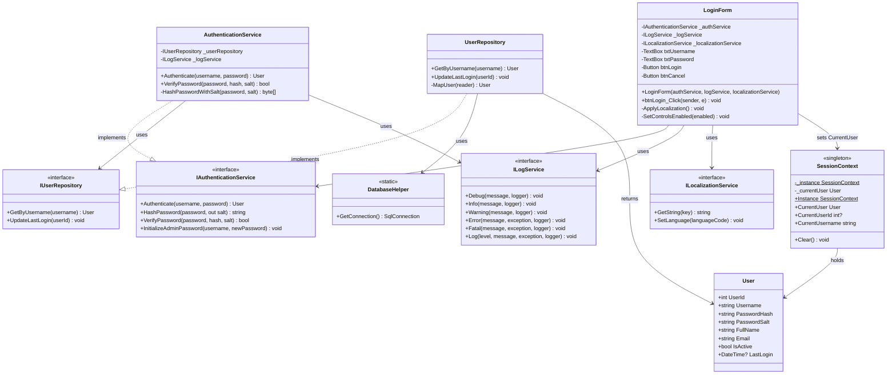
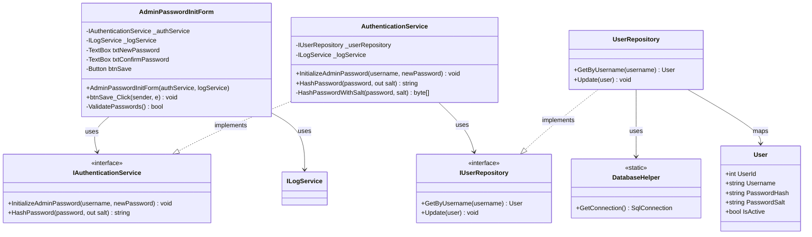

# Login Process - Class Diagrams (Per Use Case)

This document contains UML Class Diagrams organized per use case for all Login-related operations.

---

## UC-01: Authenticate



---

## UC-02: InitializeAdminPassword



---

## Layer Communication Flow

```
┌─────────────┐
│  UI LAYER   │  LoginForm / AdminPasswordInitForm
└─────┬───────┘
      │ uses
      ▼
┌─────────────┐
│  SERVICES   │  IAuthenticationService
│   LAYER     │  AuthenticationService (PBKDF2)
└─────┬───────┘
      │ uses
      ▼
┌─────────────┐
│  DAO LAYER  │  IUserRepository / UserRepository
└─────┬───────┘
      │ returns
      ▼
┌─────────────┐
│   DOMAIN    │  User Entity
└─────────────┘
```

## Key Design Patterns

1. **Dependency Injection**: All dependencies injected through constructors
2. **Repository Pattern**: Data access abstracted through IUserRepository
3. **Service Layer**: Business logic in AuthenticationService
4. **Singleton Pattern**: SessionContext maintains application state
5. **Interface Segregation**: Each service has a dedicated interface
