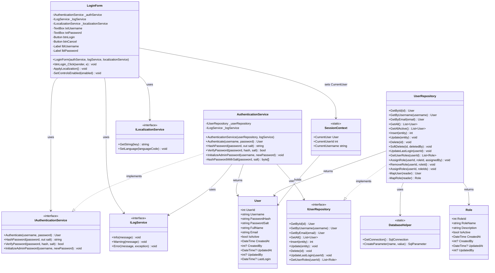

# Login Process - Class Diagram

## UML Class Diagram (Mermaid Format)



## Layer Communication Flow

```
┌─────────────┐
│  UI LAYER   │  LoginForm
└─────┬───────┘
      │ uses
      ▼
┌─────────────┐
│  SERVICES   │  IAuthenticationService
│   LAYER     │  ILogService
└─────┬───────┘  ILocalizationService
      │ calls
      ▼
┌─────────────┐
│ SERVICES    │  AuthenticationService
│    IMPL     │  
└─────┬───────┘
      │ uses
      ▼
┌─────────────┐
│  DAO LAYER  │  IUserRepository
└─────┬───────┘
      │ implements
      ▼
┌─────────────┐
│     DAO     │  UserRepository
│    IMPL     │  DatabaseHelper
└─────┬───────┘
      │ returns
      ▼
┌─────────────┐
│   DOMAIN    │  User Entity
│   LAYER     │  
└─────────────┘
```

## Key Design Patterns

1. **Dependency Injection**: All dependencies are injected through constructors
2. **Repository Pattern**: Data access is abstracted through IUserRepository
3. **Service Layer**: Business logic is encapsulated in AuthenticationService
4. **Singleton Pattern**: SessionContext maintains application state
5. **Interface Segregation**: Each service has a dedicated interface
