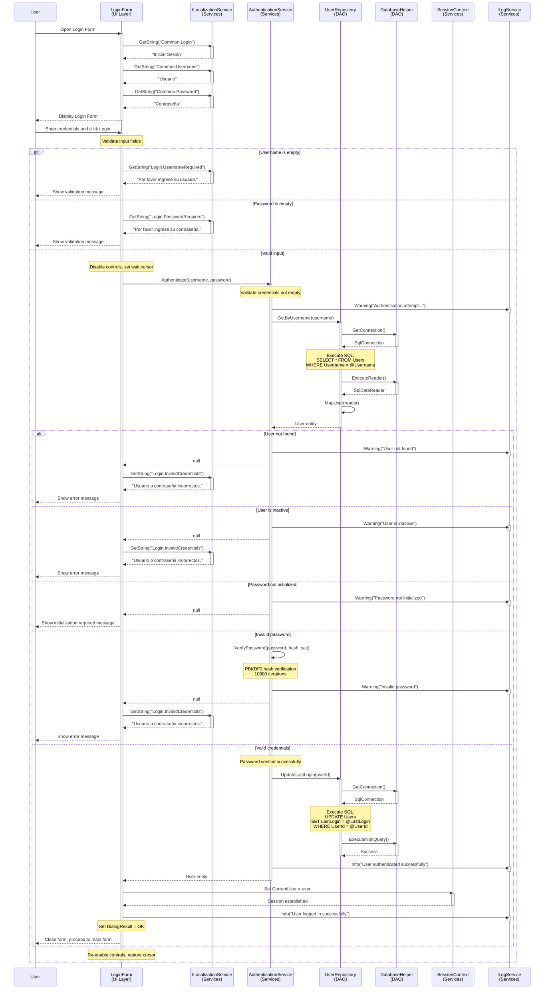

# Login Process - Sequence Diagram

## UML Sequence Diagram (Mermaid Format)

## Sequence Flow Description

### Phase 1: Form Initialization
1. User opens the Login Form
2. LoginForm requests localized strings from ILocalizationService
3. Form displays with translated labels and buttons

### Phase 2: User Input Validation
4. User enters username and password
5. LoginForm validates input fields
6. If validation fails, display localized error message

### Phase 3: Authentication Process
7. LoginForm calls AuthenticationService.Authenticate()
8. AuthenticationService logs the authentication attempt
9. AuthenticationService calls UserRepository.GetByUsername()
10. UserRepository executes SQL query to retrieve user from database
11. UserRepository maps SQL result to User entity

### Phase 4: Credential Verification
12. AuthenticationService checks:
    - User exists
    - User is active
    - Password is initialized
    - Password matches (PBKDF2 hash verification)

### Phase 5: Success Flow
13. If valid: Update user's last login timestamp
14. Log successful authentication
15. Set SessionContext.CurrentUser
16. Close login form with DialogResult.OK
17. Application proceeds to main form

### Phase 6: Failure Flow
13. If invalid: Log warning with reason
14. Return null to LoginForm
15. Display localized error message
16. Clear password field and refocus

## Security Considerations

1. **Password Hashing**: PBKDF2 with 10,000 iterations
2. **Salt Storage**: Unique salt per user stored separately
3. **Login Attempts**: All attempts are logged (including failures)
4. **No Information Leakage**: Generic error message for all failures
5. **Session Management**: Centralized through SessionContext
6. **Audit Trail**: UpdateLastLogin tracks user activity
