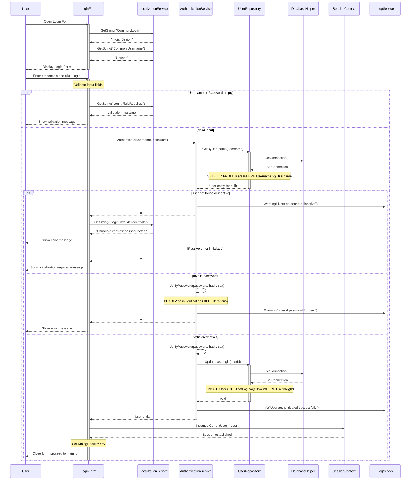
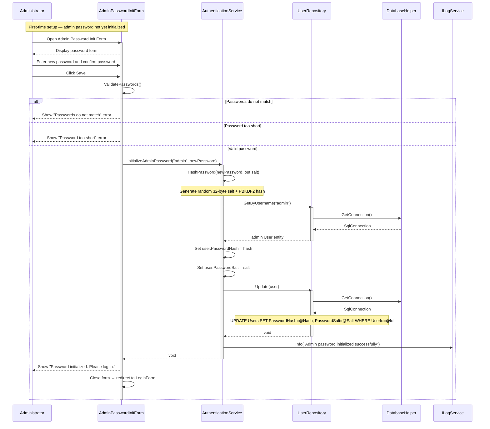

# Login Process - Sequence Diagrams (Per Use Case)

This document contains UML Sequence Diagrams organized per use case for all Login-related operations.

---

## UC-01: Authenticate

---

## UC-02: InitializeAdminPassword

---

## Sequence Flow Summary

### UC-01: Authenticate
1. User opens the Login Form; localized labels are applied
2. User enters credentials and clicks Login
3. Form validates input fields (non-empty check)
4. `AuthenticationService.Authenticate()` is called
5. `UserRepository.GetByUsername()` fetches the user record
6. Service verifies: user exists, is active, password is initialized, hash matches
7. On success: `UpdateLastLogin()` is called, `SessionContext` is set, form closes
8. On failure: localized error message is shown; no information leak about specific cause

### UC-02: InitializeAdminPassword
1. Administrator opens the password initialization form (first-time setup)
2. Enters and confirms new password
3. Form validates matching and minimum length
4. `AuthenticationService.InitializeAdminPassword()` generates a PBKDF2 hash + salt
5. `UserRepository.Update()` persists the new credentials
6. Administrator is redirected to the Login Form

## Security Features

1. **Password Hashing**: PBKDF2 with 10,000 iterations and 32-byte random salt
2. **Generic Error Messages**: All authentication failures return the same message
3. **Audit Logging**: All authentication attempts are logged
4. **Session Management**: Centralized through `SessionContext`
5. **Last Login Tracking**: `UpdateLastLogin` records successful logins
