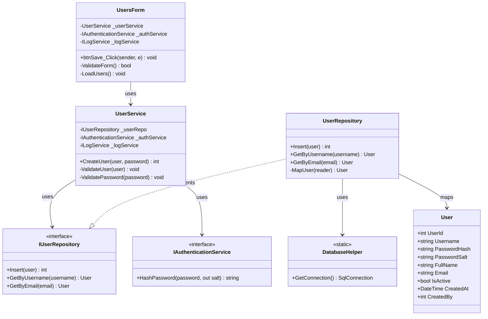
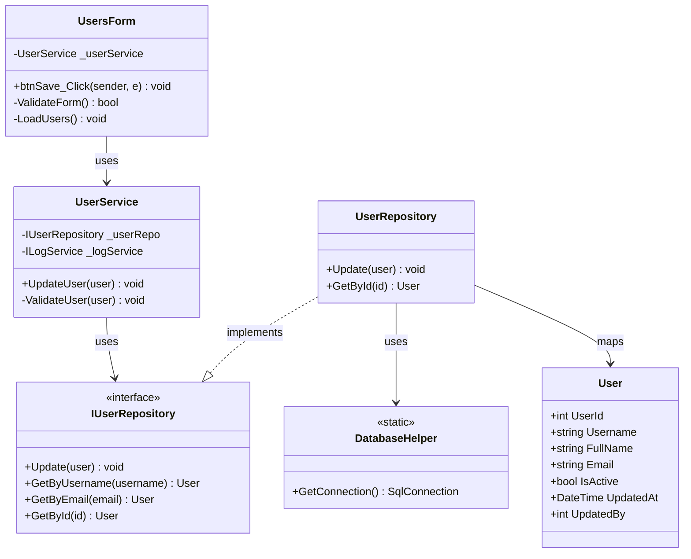
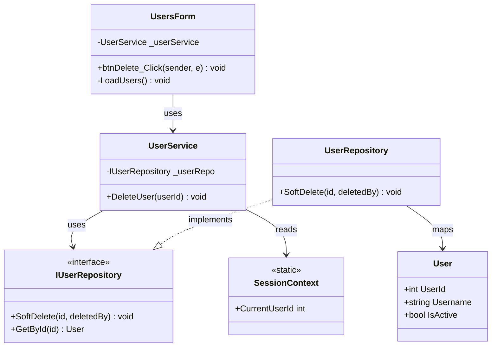
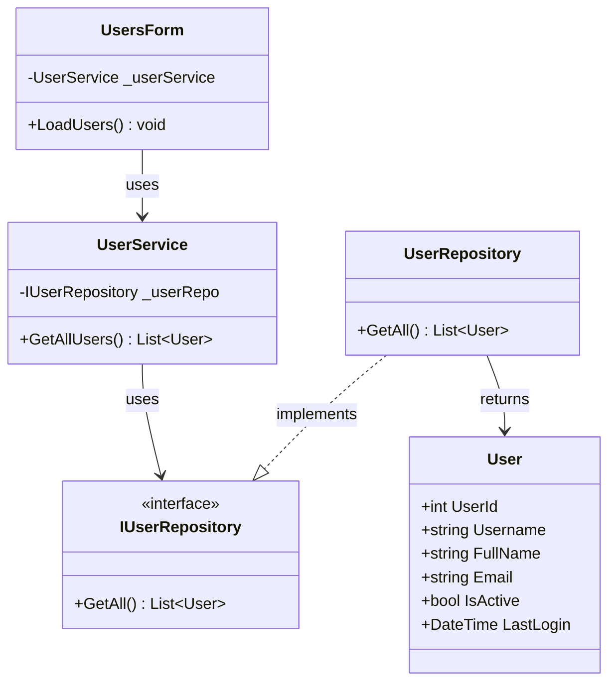
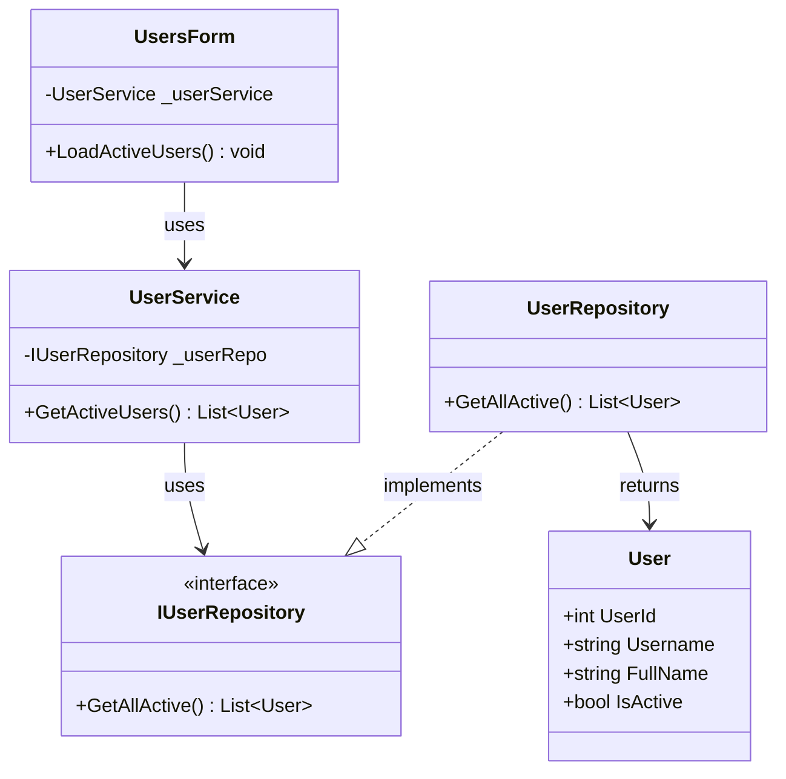
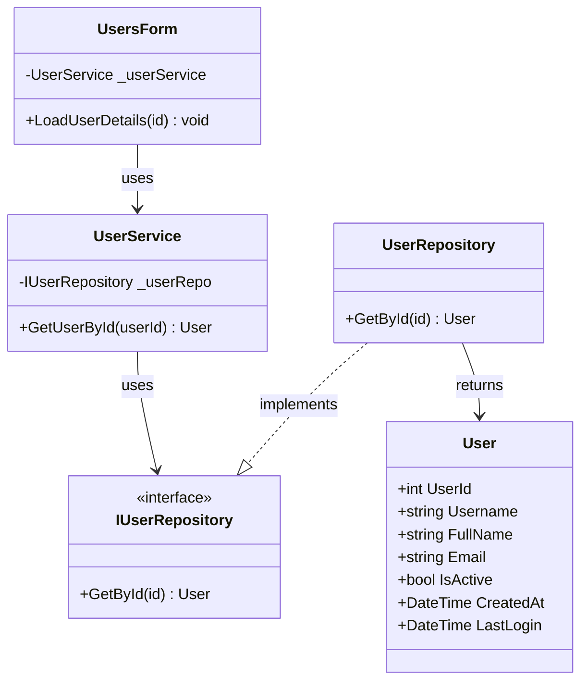
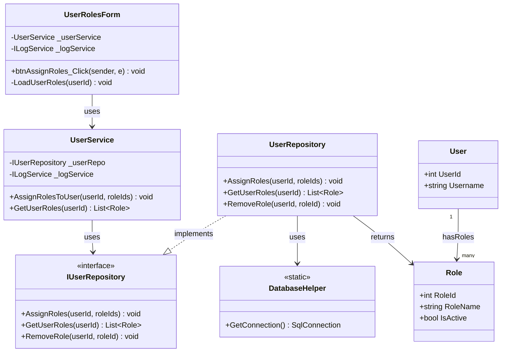
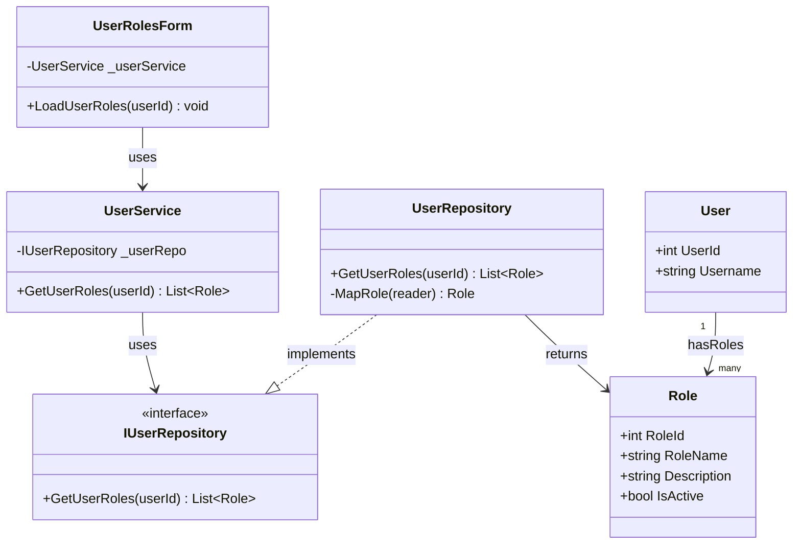
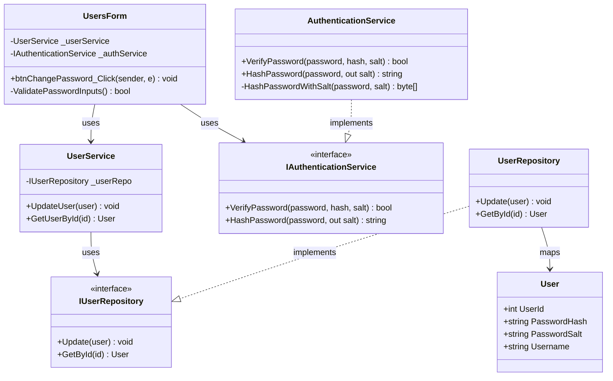

# User Management Process - Class Diagrams (Per Use Case)

This document contains UML Class Diagrams organized per use case for all User Management operations.

---

## UC-01: CreateUser



---

## UC-02: UpdateUser



---

## UC-03: DeleteUser



---

## UC-04: GetAllUsers



---

## UC-05: GetActiveUsers



---

## UC-06: GetUserById



---

## UC-07: AssignRolesToUser



---

## UC-08: GetUserRoles



---

## UC-09: ChangePassword



---

## Layer Communication Flow

```
┌──────────────┐
│   UI LAYER   │  UsersForm / UserRolesForm
└──────┬───────┘
       │ uses
       ▼
┌──────────────┐
│  BLL LAYER   │  UserService
└──────┬───────┘
       │ calls
       ├──────────────┐
       ▼              ▼
┌──────────────┐  ┌──────────────┐
│  DAO LAYER   │  │   SERVICES   │
│ UserRepo     │  │ AuthService  │
│ AuditRepo    │  │ LogService   │
└──────┬───────┘  └──────────────┘
       │ returns
       ▼
┌──────────────┐
│   DOMAIN     │  User, Role
└──────────────┘
```
        -UserService _userService
        -IAuthorizationService _authService
        -IErrorHandlerService _errorHandler
        -ILocalizationService _localizationService
        -ILogService _logService
        -DataGridView dgvUsers
        -TextBox txtUsername
        -TextBox txtFullName
        -TextBox txtEmail
        -CheckBox chkIsActive
        -Button btnNew
        -Button btnSave
        -Button btnDelete
        -Button btnRefresh
        +UsersForm(services...)
        +LoadUsers() void
        +btnNew_Click(sender, e) void
        +btnSave_Click(sender, e) void
        +btnDelete_Click(sender, e) void
        +btnRefresh_Click(sender, e) void
        -ClearForm() void
        -ValidateForm() bool
        -PopulateForm(user) void
    }

    %% BLL Layer
    class UserService {
        -IUserRepository _userRepo
        -IAuditLogRepository _auditRepo
        -ILogService _logService
        -IAuthenticationService _authService
        +UserService(repos, services...)
        +GetAllUsers() List~User~
        +GetActiveUsers() List~User~
        +GetUserById(userId) User
        +CreateUser(user, password) int
        +UpdateUser(user) void
        +DeleteUser(userId) void
        +ChangePassword(userId, oldPassword, newPassword) void
        +AssignRolesToUser(userId, roleIds) void
        +GetUserRoles(userId) List~Role~
        -ValidateUser(user) void
        -ValidatePassword(password) void
    }

    %% Services Layer
    class IAuthenticationService {
        <<interface>>
        +Authenticate(username, password) User
        +HashPassword(password, out salt) string
        +VerifyPassword(password, hash, salt) bool
    }

    class IAuthorizationService {
        <<interface>>
        +HasPermission(userId, permission) bool
        +HasAnyPermission(userId, permissions) bool
        +GetUserPermissions(userId) List~Permission~
    }

    class ILogService {
        <<interface>>
        +Info(message) void
        +Warning(message) void
        +Error(message, exception) void
    }

    class IErrorHandlerService {
        <<interface>>
        +HandleError(exception, context) void
        +ShowError(message) void
    }

    class SessionContext {
        <<static>>
        +CurrentUser User
        +CurrentUserId int
        +CurrentUsername string
    }

    %% DAO Layer
    class UserRepository {
        +GetById(id) User
        +GetByUsername(username) User
        +GetByEmail(email) User
        +GetAll() List~User~
        +GetAllActive() List~User~
        +Search(searchTerm) List~User~
        +Insert(entity) int
        +Update(entity) void
        +Delete(id) void
        +SoftDelete(id, deletedBy) void
        +UpdateLastLogin(userId) void
        +GetUserRoles(userId) List~Role~
        +AssignRole(userId, roleId, assignedBy) void
        +RemoveRole(userId, roleId) void
        +AssignRoles(userId, roleIds) void
        -MapUser(reader) User
        -MapRole(reader) Role
    }

    class IUserRepository {
        <<interface>>
        +GetById(id) User
        +GetByUsername(username) User
        +GetByEmail(email) User
        +GetAll() List~User~
        +Insert(entity) int
        +Update(entity) void
        +Delete(id) void
        +GetUserRoles(userId) List~Role~
        +AssignRoles(userId, roleIds) void
    }

    class AuditLogRepository {
        +LogChange(tableName, recordId, action, oldValue, newValue, description, userId) void
        +GetAuditLogs(tableName, recordId) List~AuditLog~
        +GetUserAuditLogs(userId) List~AuditLog~
    }

    class IAuditLogRepository {
        <<interface>>
        +LogChange(tableName, recordId, action, oldValue, newValue, description, userId) void
    }

    %% Domain Layer
    class User {
        +int UserId
        +string Username
        +string PasswordHash
        +string PasswordSalt
        +string FullName
        +string Email
        +bool IsActive
        +DateTime CreatedAt
        +int? CreatedBy
        +DateTime? UpdatedAt
        +int? UpdatedBy
        +DateTime? LastLogin
    }

    class Role {
        +int RoleId
        +string RoleName
        +string Description
        +bool IsActive
        +DateTime CreatedAt
        +int? CreatedBy
        +DateTime? UpdatedAt
        +int? UpdatedBy
    }

    class AuditLog {
        +int AuditLogId
        +string TableName
        +int RecordId
        +string Action
        +string OldValue
        +string NewValue
        +string Description
        +DateTime ChangeDate
        +int ChangedBy
    }

    class AuditAction {
        <<enumeration>>
        Insert
        Update
        Delete
    }

    %% Relationships
    UsersForm --> UserService : uses
    UsersForm --> IAuthorizationService : uses
    UsersForm --> IErrorHandlerService : uses
    UsersForm --> ILocalizationService : uses
    UsersForm --> ILogService : uses
    
    UserService --> IUserRepository : uses
    UserService --> IAuditLogRepository : uses
    UserService --> IAuthenticationService : uses
    UserService --> ILogService : uses
    UserService --> SessionContext : uses
    UserService --> User : manages
    UserService --> Role : retrieves
    
    UserRepository ..|> IUserRepository : implements
    UserRepository --> User : returns
    UserRepository --> Role : returns
    
    AuditLogRepository ..|> IAuditLogRepository : implements
    AuditLogRepository --> AuditLog : creates
    AuditLogRepository --> AuditAction : uses
    
    User "1" --> "*" Role : has roles
```

## Layer Communication Flow

```
┌──────────────┐
│   UI LAYER   │  UsersForm
└──────┬───────┘
       │ uses
       ▼
┌──────────────┐
│  BLL LAYER   │  UserService
└──────┬───────┘
       │ calls
       ├──────────────┐
       ▼              ▼
┌──────────────┐  ┌──────────────┐
│  DAO LAYER   │  │   SERVICES   │
│              │  │    LAYER     │
│ UserRepo     │  │ AuthService  │
│ AuditRepo    │  │ LogService   │
└──────┬───────┘  └──────────────┘
       │ returns
       ▼
┌──────────────┐
│   DOMAIN     │  User, Role
│   LAYER      │  AuditLog
└──────────────┘
```

## Key Operations

### Create User Flow
1. UI validates form inputs
2. UI calls UserService.CreateUser(user, password)
3. UserService validates business rules:
   - Username uniqueness
   - Email uniqueness
   - Password strength
4. UserService calls AuthenticationService.HashPassword()
5. UserService calls UserRepository.Insert()
6. UserService calls AuditLogRepository.LogChange()
7. Success confirmation returned to UI

### Update User Flow
1. UI loads user data into form
2. User modifies data
3. UI calls UserService.UpdateUser(user)
4. UserService validates business rules
5. UserService retrieves old values for audit
6. UserService calls UserRepository.Update()
7. UserService logs changes to AuditLog
8. UI refreshes data grid

### Delete User Flow
1. UI confirms deletion with user
2. UI calls UserService.DeleteUser(userId)
3. UserService performs soft delete (sets IsActive = false)
4. UserService logs deletion to AuditLog
5. UI refreshes data grid

### Assign Roles Flow
1. UI displays role selection dialog
2. User selects roles
3. UI calls UserService.AssignRolesToUser(userId, roleIds)
4. UserService calls UserRepository.AssignRoles()
5. UserRepository wraps operations in transaction
6. Roles are assigned atomically
7. UI displays success message
