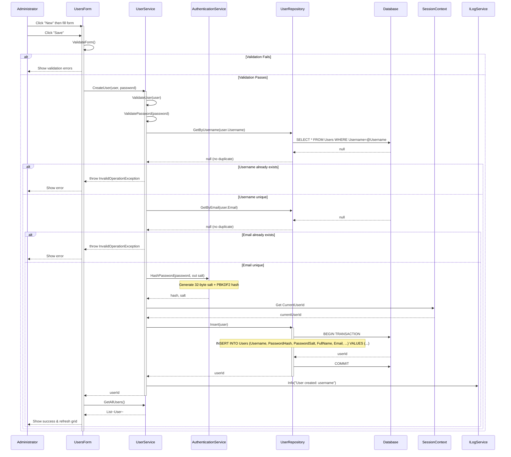
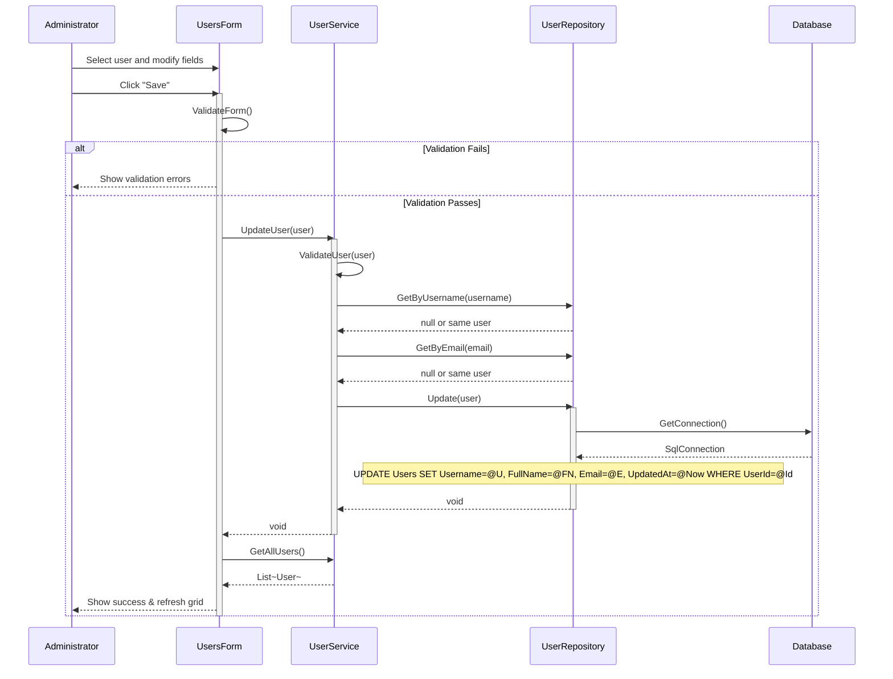
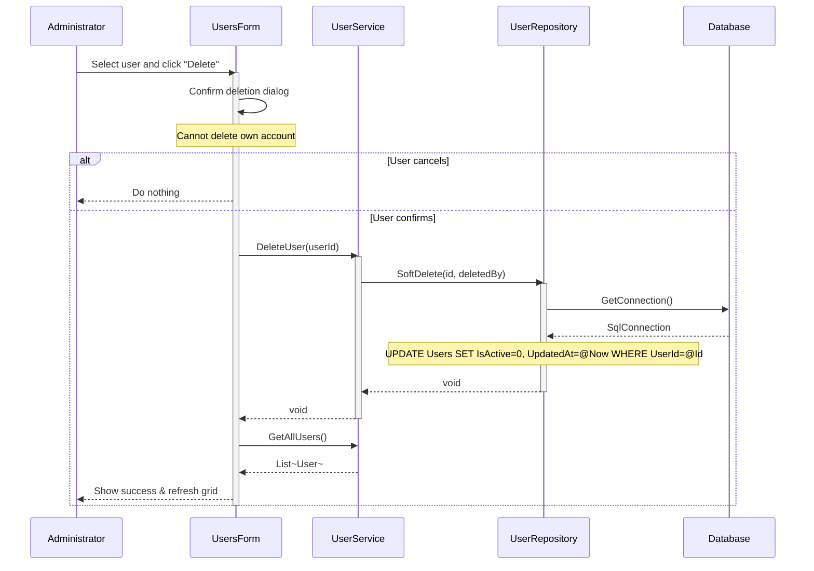
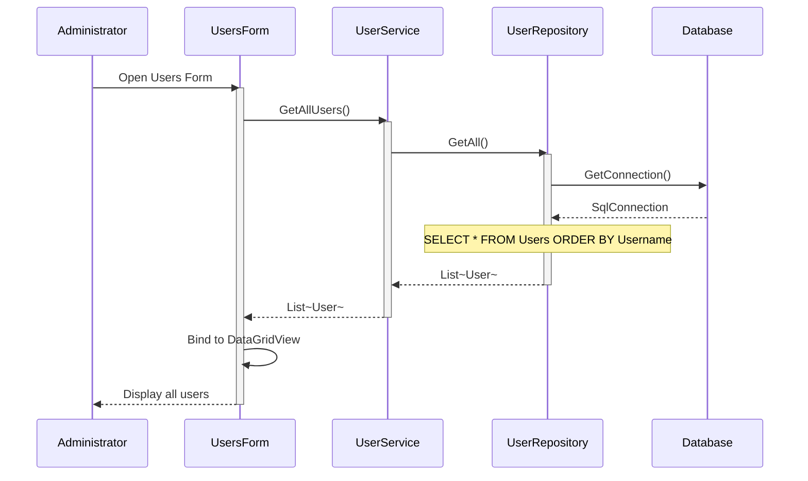
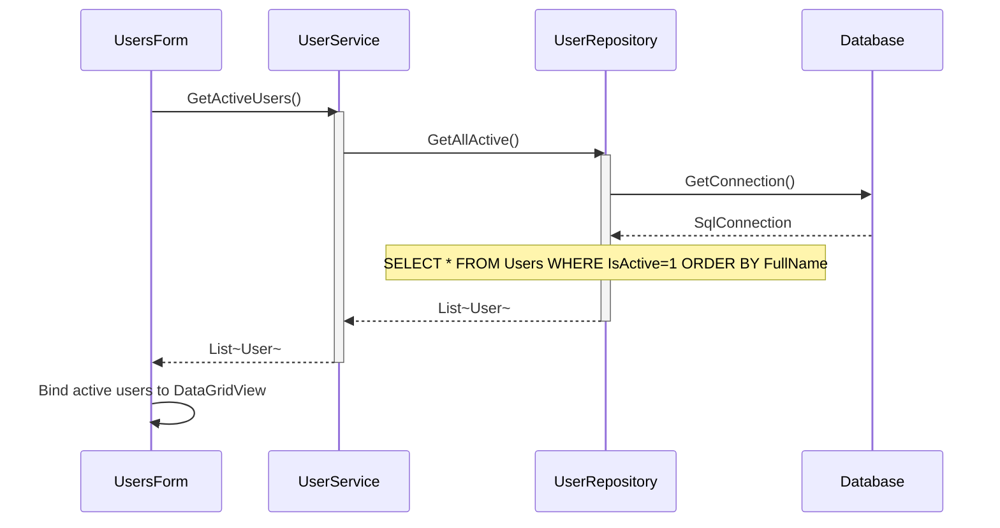
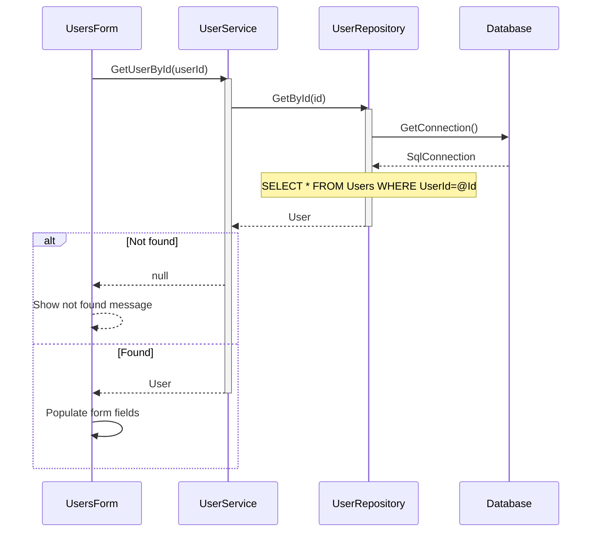
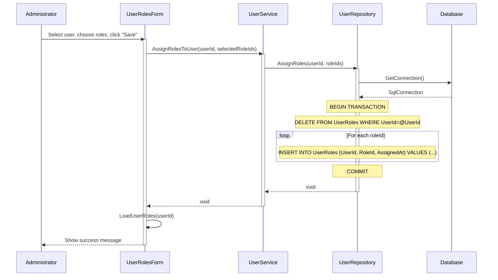
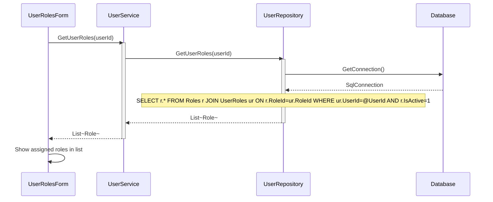
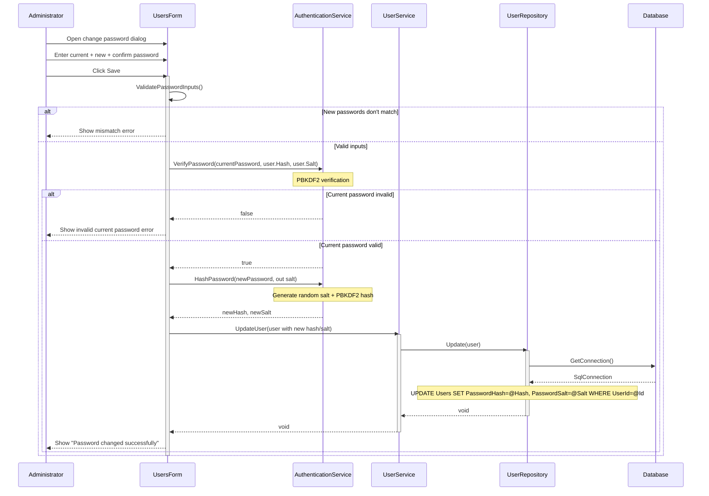
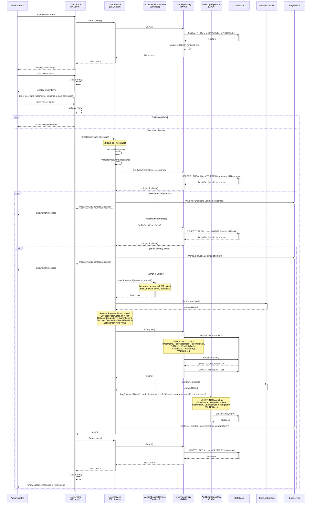

# User Management Process - Sequence Diagrams (Per Use Case)

This document contains UML Sequence Diagrams organized per use case for all User Management operations.

---

## UC-01: CreateUser

---

## UC-02: UpdateUser

---

## UC-03: DeleteUser

---

## UC-04: GetAllUsers

---

## UC-05: GetActiveUsers

---

## UC-06: GetUserById

---

## UC-07: AssignRolesToUser

---

## UC-08: GetUserRoles

---

## UC-09: ChangePassword

---

## Business Rules Summary

| Use Case | Key Validations |
|----------|----------------|
| CreateUser | Username unique, email unique, password strength |
| UpdateUser | Username unique (excluding self), email unique (excluding self) |
| DeleteUser | Cannot delete own account; soft-delete (IsActive=0) |
| ChangePassword | Current password verified before update |
| AssignRolesToUser | Atomic: delete all existing roles, then insert selected ones |

## Sequence Flow Description

### Phase 1: Form Load & Display Users
1. Administrator opens Users Form
2. UsersForm calls UserService.GetAllUsers()
3. UserService retrieves all users from UserRepository
4. UserRepository executes SQL query and maps results
5. Users are displayed in data grid

### Phase 2: Prepare New User
6. User clicks "New" button
7. Form clears all input fields
8. Ready to enter new user data

### Phase 3: Input & Validation
9. Administrator enters user information
10. Clicks "Save" button
11. UsersForm validates form inputs (client-side)

### Phase 4: Business Validation
12. UserService validates business rules:
    - ValidateUser: checks required fields, format
    - ValidatePassword: checks strength requirements
13. Check username uniqueness via UserRepository
14. Check email uniqueness via UserRepository

### Phase 5: Password Hashing
15. UserService calls AuthenticationService.HashPassword()
16. Generate cryptographically secure random salt (32 bytes)
17. Hash password using PBKDF2 with 10,000 iterations
18. Returns hash and salt to UserService

### Phase 6: Set Audit Fields
19. UserService retrieves current user ID from SessionContext
20. Sets audit fields:
    - PasswordHash, PasswordSalt
    - CreatedBy, CreatedAt
    - IsActive = true

### Phase 7: Database Insert
21. UserService calls UserRepository.Insert()
22. UserRepository begins database transaction
23. Executes INSERT statement with parameterized query
24. Retrieves new userId via SCOPE_IDENTITY()
25. Commits transaction
26. Returns userId

### Phase 8: Audit Logging
27. UserService logs change to AuditLogRepository
28. Creates audit record with action "Insert"
29. Stores who created the user and when

### Phase 9: Completion
30. UserService logs info message
31. Returns userId to UsersForm
32. UsersForm refreshes the data grid
33. Displays success message to administrator
34. Clears form for next operation

## Validation Rules

### Client-Side (UI)
- Username: Required, non-empty
- Full Name: Required, non-empty
- Email: Valid format (if provided)
- Password: Required, minimum length

### Business Logic (BLL)
- Username: Unique across system
- Email: Unique across system (if provided)
- Password: Minimum 8 characters, complexity requirements
- All fields: SQL injection prevention via parameterized queries

## Security Features

1. **Password Security**: PBKDF2 hashing with 32-byte salt and 10,000 iterations
2. **Parameterized Queries**: All database operations use parameters
3. **Transaction Support**: Database operations wrapped in transactions
4. **Audit Trail**: All changes logged with user context
5. **Session Tracking**: Current user tracked via SessionContext
6. **Soft Delete**: Users deactivated rather than deleted (preserves history)
