# Sales Management Process - Class Diagrams (Per Use Case)

This document contains UML Class Diagrams organized per use case for all Sales Management operations.

---

## UC-01: CreateSale

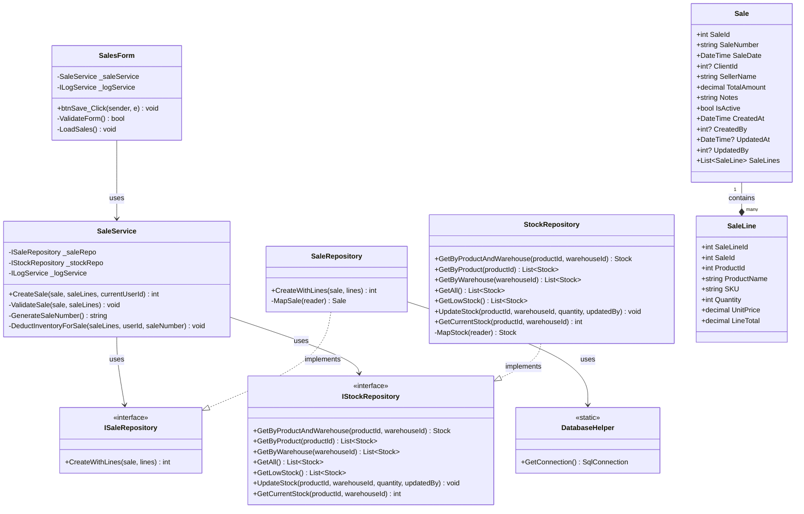

---

## UC-02: DeleteSale

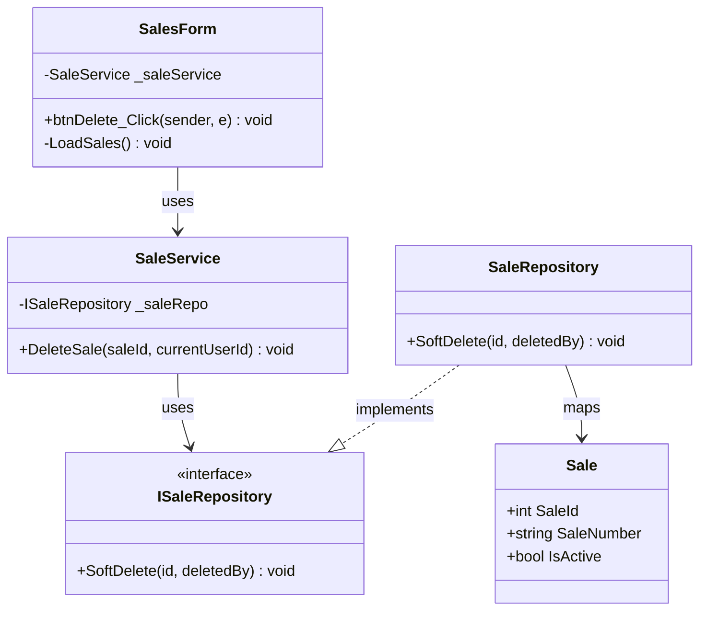

---

## UC-03: GetAllSales

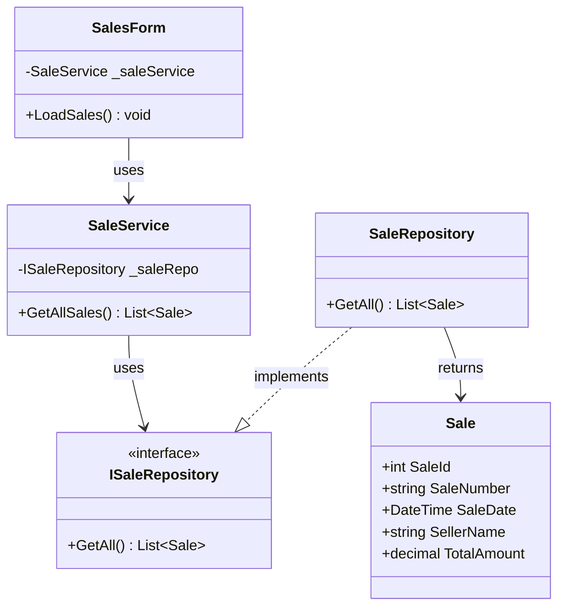

---

## UC-04: GetAllSalesWithDetails

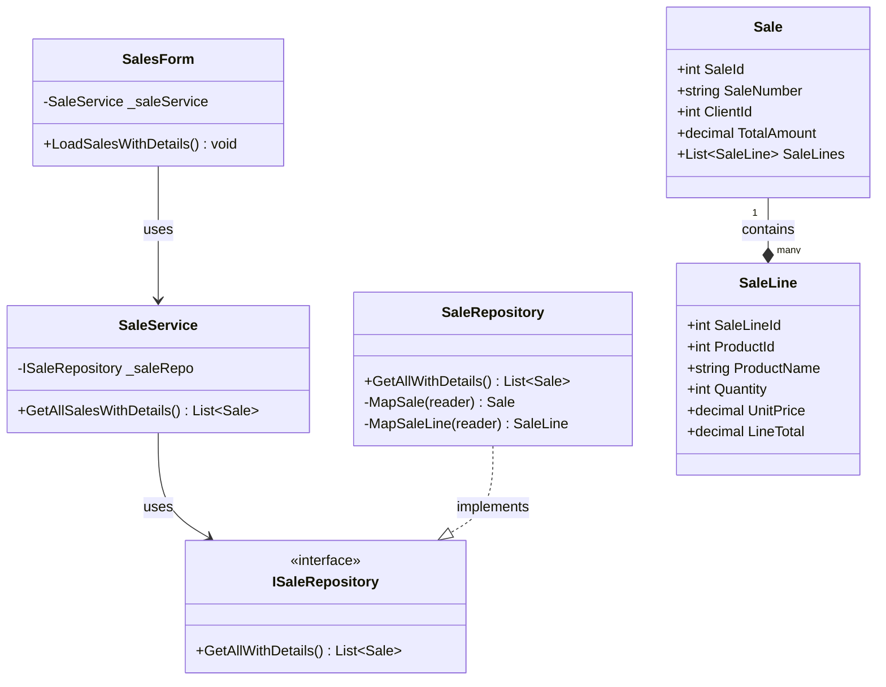

---

## UC-05: GetAvailabelStockByWarehouse

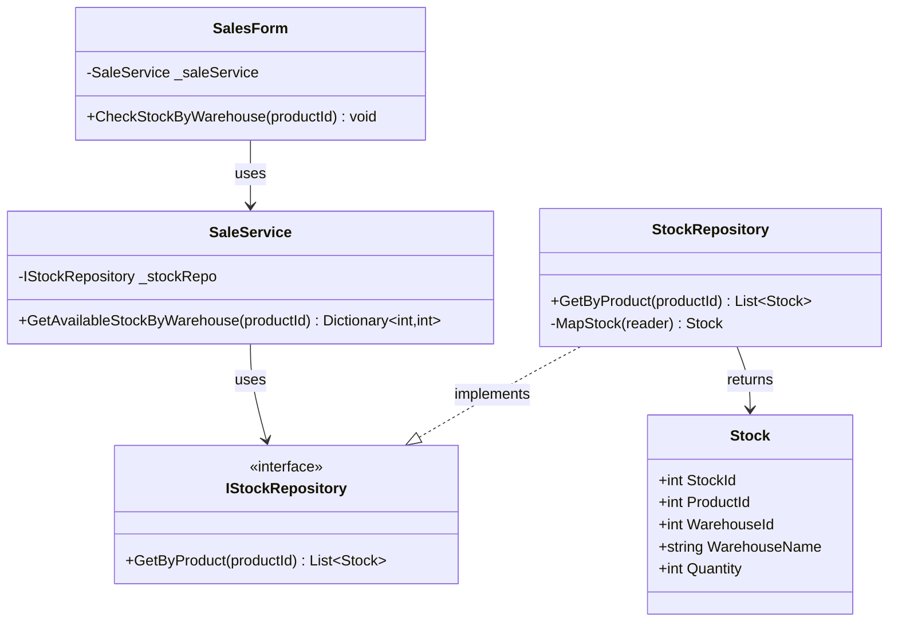

---

## UC-06: GetSaleById

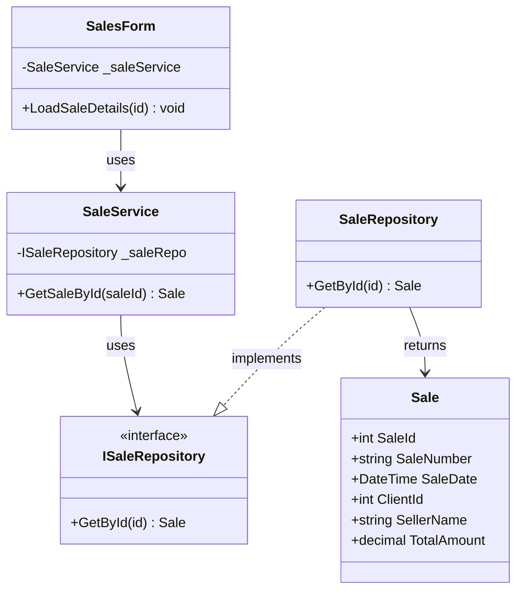

---

## UC-07: GetSaleByIdWithLines

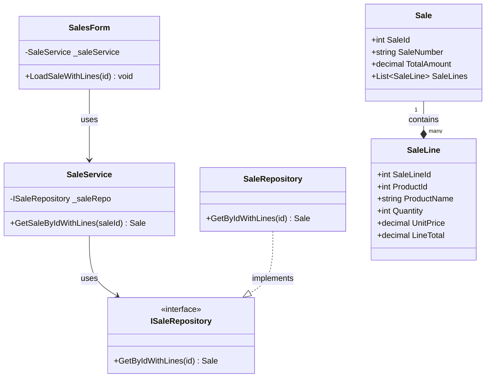

---

## UC-08: GetSaleByClient

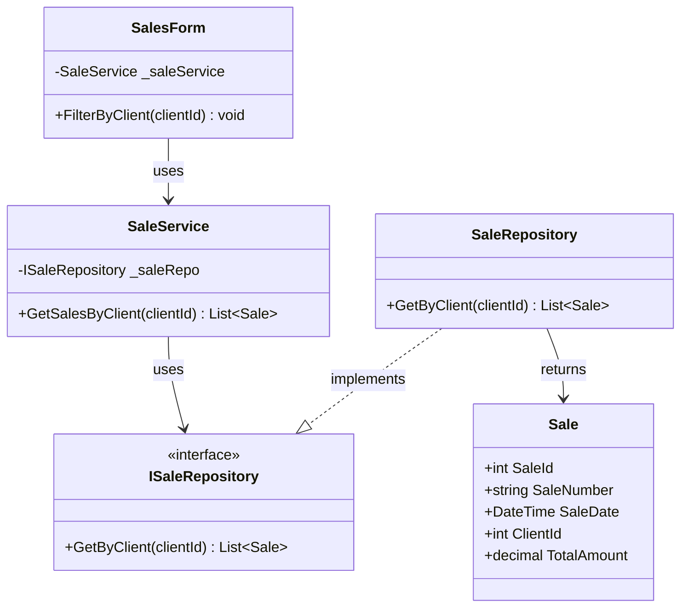

---

## UC-09: GetSaleByDateRange

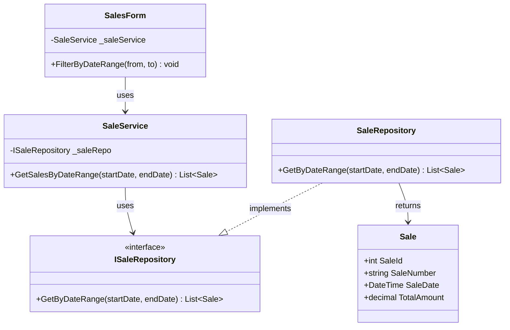

---

## UC-10: GetSaleBySeller

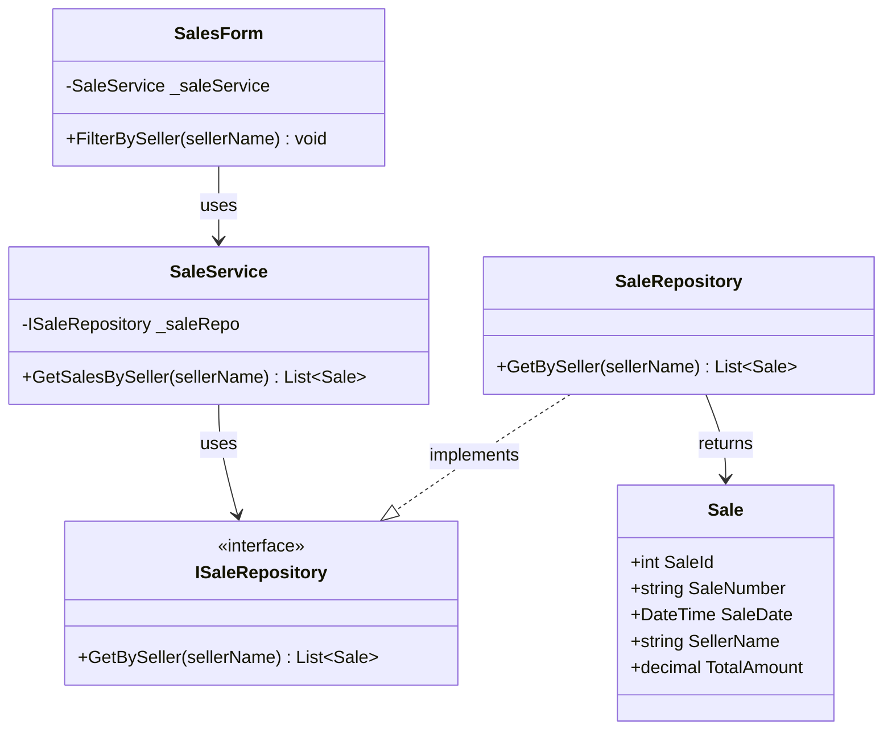

---

## UC-11: GetTotalAvailableStock

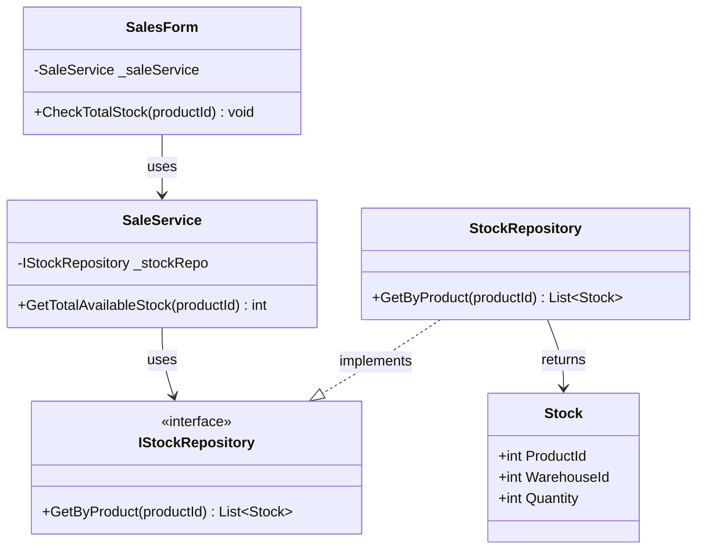

---

## UC-12: UpdateSale

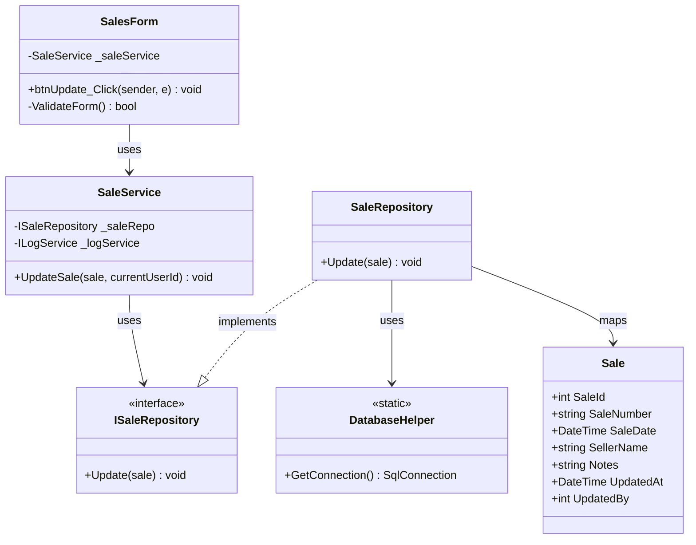

---

## Layer Communication Flow

```
┌──────────────────┐
│    UI LAYER      │  SalesForm
└────────┬─────────┘
         │ uses
         ▼
┌──────────────────┐
│   BLL LAYER      │  SaleService
└────────┬─────────┘
         │ calls
         ├──────────────┐
         ▼              ▼
┌──────────────────┐  ┌──────────────────┐
│   DAO LAYER      │  │    SERVICES      │
│ SaleRepository   │  │ LogService       │
│ StockRepository  │  └──────────────────┘
└────────┬─────────┘
         │ returns
         ▼
┌──────────────────┐
│  DOMAIN LAYER    │  Sale, SaleLine, Stock
└──────────────────┘
```
        -SaleService _saleService
        -ClientService _clientService
        -ProductService _productService
        -IAuthorizationService _authService
        -ILocalizationService _localizationService
        -ILogService _logService
        -DataGridView dgvSales
        -DataGridView dgvSaleLines
        -ComboBox cboClient
        -TextBox txtSellerName
        -TextBox txtSaleNumber
        -DateTimePicker dtpSaleDate
        -Button btnNew
        -Button btnSave
        -Button btnDelete
        -Button btnAddLine
        -Button btnRemoveLine
        +SalesForm(services...)
        +LoadSales() void
        +LoadClients() void
        +LoadProducts() void
        +btnNew_Click(sender, e) void
        +btnSave_Click(sender, e) void
        +btnDelete_Click(sender, e) void
        +btnAddLine_Click(sender, e) void
        +btnRemoveLine_Click(sender, e) void
        -CalculateTotals() void
        -ValidateForm() bool
        -CheckStock(productId, quantity) bool
    }

    %% BLL Layer
    class SaleService {
        -ISaleRepository _saleRepo
        -IClientRepository _clientRepo
        -IProductRepository _productRepo
        -IStockRepository _stockRepo
        -IAuditLogRepository _auditRepo
        -ILogService _logService
        +SaleService(repos, services...)
        +GetAllSales() List~Sale~
        +GetAllSalesWithDetails() List~Sale~
        +GetSaleById(saleId) Sale
        +GetSaleByIdWithLines(saleId) Sale
        +GetSalesBySeller(sellerName) List~Sale~
        +GetSalesByClient(clientId) List~Sale~
        +GetSalesByDateRange(startDate, endDate) List~Sale~
        +CreateSale(sale, saleLines, currentUserId) int
        +UpdateSale(sale, currentUserId) void
        +DeleteSale(saleId, currentUserId) void
        +GetAvailableStockByWarehouse(productId) Dictionary~int,int~
        +GetTotalAvailableStock(productId) int
        -ValidateSale(sale, saleLines) void
        -GenerateSaleNumber() string
        -DeductInventoryForSale(saleLines, userId, saleNumber) void
    }

    class ClientService {
        -IClientRepository _clientRepo
        -IAuditLogRepository _auditRepo
        -ILogService _logService
        +GetAllClients() List~Client~
        +GetActiveClients() List~Client~
        +GetClientById(clientId) Client
        +CreateClient(client) int
        +UpdateClient(client) void
        +DeleteClient(clientId) void
    }

    class ProductService {
        -IProductRepository _productRepo
        -IAuditLogRepository _auditRepo
        -ILogService _logService
        +GetAllProducts() List~Product~
        +GetActiveProducts() List~Product~
        +GetProductById(productId) Product
        +CreateProduct(product) int
        +UpdateProduct(product) void
        +DeleteProduct(productId) void
    }

    %% DAO Layer
    class SaleRepository {
        +GetAll() List~Sale~
        +GetAllWithDetails() List~Sale~
        +GetById(id) Sale
        +GetByIdWithLines(id) Sale
        +GetBySeller(sellerName) List~Sale~
        +GetByClient(clientId) List~Sale~
        +GetByDateRange(startDate, endDate) List~Sale~
        +Insert(entity) int
        +Update(entity) void
        +Delete(id) void
        +CreateWithLines(sale, lines) int
        -MapSale(reader) Sale
        -MapSaleLine(reader) SaleLine
    }

    class ISaleRepository {
        <<interface>>
        +GetAll() List~Sale~
        +GetById(id) Sale
        +Insert(entity) int
        +Update(entity) void
        +Delete(id) void
        +CreateWithLines(sale, lines) int
    }

    class ClientRepository {
        +GetAll() List~Client~
        +GetById(id) Client
        +Search(searchTerm) List~Client~
        +Insert(entity) int
        +Update(entity) void
        +Delete(id) void
        -MapClient(reader) Client
    }

    class IClientRepository {
        <<interface>>
        +GetAll() List~Client~
        +GetById(id) Client
        +Insert(entity) int
        +Update(entity) void
    }

    class ProductRepository {
        +GetAll() List~Product~
        +GetById(id) Product
        +GetBySKU(sku) Product
        +Search(searchTerm) List~Product~
        +Insert(entity) int
        +Update(entity) void
        +Delete(id) void
        -MapProduct(reader) Product
    }

    class IProductRepository {
        <<interface>>
        +GetAll() List~Product~
        +GetById(id) Product
        +Insert(entity) int
        +Update(entity) void
    }

    class StockRepository {
        +GetByProductAndWarehouse(productId, warehouseId) Stock
        +GetByProduct(productId) List~Stock~
        +GetByWarehouse(warehouseId) List~Stock~
        +GetAll() List~Stock~
        +GetLowStock() List~Stock~
        +UpdateStock(productId, warehouseId, quantity, updatedBy) void
        +GetCurrentStock(productId, warehouseId) int
        -MapStock(reader) Stock
    }

    class IStockRepository {
        <<interface>>
        +GetByProductAndWarehouse(productId, warehouseId) Stock
        +GetByProduct(productId) List~Stock~
        +GetByWarehouse(warehouseId) List~Stock~
        +GetAll() List~Stock~
        +GetLowStock() List~Stock~
        +UpdateStock(productId, warehouseId, quantity, updatedBy) void
        +GetCurrentStock(productId, warehouseId) int
    }

    %% Domain Layer
    class Sale {
        +int SaleId
        +string SaleNumber
        +DateTime SaleDate
        +int? ClientId
        +string SellerName
        +decimal TotalAmount
        +string Notes
        +bool IsActive
        +DateTime CreatedAt
        +int? CreatedBy
        +DateTime? UpdatedAt
        +int? UpdatedBy
        +List~SaleLine~ SaleLines
    }

    class SaleLine {
        +int SaleLineId
        +int SaleId
        +int ProductId
        +string ProductName
        +string SKU
        +int Quantity
        +decimal UnitPrice
        +decimal LineTotal
    }

    class Client {
        +int ClientId
        +string Nombre
        +string Apellido
        +string DNI
        +string Correo
        +string Telefono
        +string Direccion
        +bool IsActive
        +DateTime CreatedAt
        +int? CreatedBy
        +DateTime? UpdatedAt
        +int? UpdatedBy
    }

    class Product {
        +int ProductId
        +string SKU
        +string Name
        +string Category
        +decimal UnitPrice
        +int MinStockLevel
        +bool IsActive
        +DateTime CreatedAt
        +int? CreatedBy
    }

    class Stock {
        +int StockId
        +int ProductId
        +int WarehouseId
        +int Quantity
        +DateTime LastUpdated
        +int? UpdatedBy
        +string ProductName
        +string ProductSKU
        +string WarehouseName
    }

    %% Relationships
    SalesForm --> SaleService : uses
    SalesForm --> ClientService : uses
    SalesForm --> ProductService : uses
    SalesForm --> IAuthorizationService : uses
    
    SaleService --> ISaleRepository : uses
    SaleService --> IClientRepository : uses
    SaleService --> IProductRepository : uses
    SaleService --> IStockRepository : uses
    SaleService --> IAuditLogRepository : uses
    SaleService --> ILogService : uses
    
    ClientService --> IClientRepository : uses
    ProductService --> IProductRepository : uses
    
    SaleRepository ..|> ISaleRepository : implements
    ClientRepository ..|> IClientRepository : implements
    ProductRepository ..|> IProductRepository : implements
    StockRepository ..|> IStockRepository : implements
    
    SaleRepository --> Sale : returns
    SaleRepository --> SaleLine : returns
    ClientRepository --> Client : returns
    ProductRepository --> Product : returns
    StockRepository --> Stock : returns
    
    Sale "1" --> "*" SaleLine : contains
    Sale --> Client : references
    SaleLine --> Product : references
    Stock --> Product : tracks
```

## Layer Communication Flow

```
┌──────────────────┐
│    UI LAYER      │  SalesForm
└────────┬─────────┘
         │ uses
         ▼
┌──────────────────┐
│   BLL LAYER      │  SaleService
│                  │  ClientService
│                  │  ProductService
└────────┬─────────┘
         │ calls
         ├─────────────────┐
         ▼                 ▼
┌──────────────────┐  ┌──────────────────┐
│   DAO LAYER      │  │    SERVICES      │
│                  │  │     LAYER        │
│ SaleRepository   │  │ AuthService      │
│ ClientRepository │  │ LogService       │
│ ProductRepository│  │ AuditService     │
│ StockRepository  │  └──────────────────┘
└────────┬─────────┘
         │ returns
         ▼
┌──────────────────┐
│  DOMAIN LAYER    │  Sale, SaleLine
│                  │  Client, Product
│                  │  Stock
└──────────────────┘
```

## Key Business Rules

1. **Sale Number Generation**: Automatic, unique, sequential
2. **Inventory Validation**: Check available stock before sale
3. **Stock Deduction**: Automatically deduct from warehouse inventory
4. **Transaction Integrity**: Sale and lines created atomically
5. **Audit Trail**: All operations logged with user context
6. **Total Calculation**: Automatically sum line totals
7. **Client Association**: Every sale must be associated with a client
