# Sales Management Process - Sequence Diagram (Create Sale)

## UML Sequence Diagram (Mermaid Format)

```mermaid
sequenceDiagram
    participant User as Sales User
    participant UI as SalesForm<br/>(UI Layer)
    participant SaleSvc as SaleService<br/>(BLL)
    participant ClientSvc as ClientService<br/>(BLL)
    participant ProdSvc as ProductService<br/>(BLL)
    participant SaleRepo as SaleRepository<br/>(DAO)
    participant StockRepo as StockRepository<br/>(DAO)
    participant AuditRepo as AuditLogRepository<br/>(DAO)
    participant DB as Database
    participant Log as ILogService

    %% Load Form
    User->>UI: Open Sales Form
    activate UI
    
    UI->>SaleSvc: GetAllSalesWithDetails()
    activate SaleSvc
    SaleSvc->>SaleRepo: GetAllWithDetails()
    activate SaleRepo
    SaleRepo->>DB: SELECT s.*, sl.*, c.*, p.* FROM Sales s<br/>LEFT JOIN SaleLines sl ON...<br/>LEFT JOIN Clients c ON...<br/>LEFT JOIN Products p ON...
    activate DB
    DB-->>SaleRepo: ResultSet
    deactivate DB
    SaleRepo->>SaleRepo: MapSale(reader) + MapSaleLines(reader)
    SaleRepo-->>SaleSvc: List<Sale> with SaleLines
    deactivate SaleRepo
    SaleSvc-->>UI: List<Sale>
    deactivate SaleSvc
    
    UI->>ClientSvc: GetActiveClients()
    activate ClientSvc
    ClientSvc-->>UI: List<Client>
    deactivate ClientSvc
    
    UI->>ProdSvc: GetActiveProducts()
    activate ProdSvc
    ProdSvc-->>UI: List<Product>
    deactivate ProdSvc
    
    UI-->>User: Display sales list, populate dropdowns
    deactivate UI

    %% Create New Sale
    User->>UI: Click "New Sale" button
    activate UI
    UI->>UI: ClearForm()
    UI->>UI: Initialize empty SaleLines collection
    UI-->>User: Display empty sale form
    deactivate UI

    User->>UI: Select Client from dropdown
    User->>UI: Enter Seller Name
    User->>UI: Select Sale Date

    %% Add Sale Lines
    loop For each product
        User->>UI: Click "Add Line" button
        activate UI
        UI-->>User: Show product selection dialog
        deactivate UI
        
        User->>UI: Select Product and enter Quantity
        activate UI
        
        %% Check available stock
        UI->>SaleSvc: GetAvailableStockByWarehouse(productId)
        activate SaleSvc
        SaleSvc->>StockRepo: GetByProduct(productId)
        activate StockRepo
        StockRepo->>DB: SELECT * FROM Stock<br/>WHERE ProductId = @ProductId
        activate DB
        DB-->>StockRepo: ResultSet
        deactivate DB
        StockRepo-->>SaleSvc: List<Stock>
        deactivate StockRepo
        SaleSvc->>SaleSvc: Build warehouse stock dictionary
        SaleSvc-->>UI: Dictionary<warehouseId, quantity>
        deactivate SaleSvc
        
        alt Insufficient Stock
            UI-->>User: Show "Insufficient stock" error
        else Stock Available
            UI->>UI: Add line to dgvSaleLines
            UI->>UI: CalculateTotals()
            UI-->>User: Display updated sale lines and total
        end
        deactivate UI
    end

    %% Save Sale
    User->>UI: Click "Save" button
    activate UI
    UI->>UI: ValidateForm()
    
    alt Validation Fails
        UI-->>User: Show validation errors
    else Validation Passes
        
        UI->>SaleSvc: CreateSale(sale, saleLines, currentUserId)
        activate SaleSvc
        
        %% Validate business rules
        SaleSvc->>SaleSvc: ValidateSale(sale, saleLines)
        Note over SaleSvc: Check:<br/>- Client exists<br/>- Seller name not empty<br/>- Sale lines count > 0<br/>- All quantities > 0
        
        %% Generate sale number
        SaleSvc->>SaleSvc: GenerateSaleNumber()
        Note over SaleSvc: Format: SALE-{yyyy}{MM}{dd}-{seq}
        
        %% Calculate total
        SaleSvc->>SaleSvc: Calculate TotalAmount = Sum(LineTotal)
        
        %% Set audit fields
        Note over SaleSvc: Set CreatedBy = currentUserId<br/>Set CreatedAt = DateTime.Now
        
        %% Create sale with lines (Transaction)
        SaleSvc->>SaleRepo: CreateWithLines(sale, saleLines)
        activate SaleRepo
        SaleRepo->>DB: BEGIN TRANSACTION
        activate DB
        
        Note over SaleRepo: INSERT INTO Sales<br/>(SaleNumber, SaleDate, ClientId,<br/>SellerName, TotalAmount,<br/>CreatedAt, CreatedBy)<br/>VALUES (...)
        SaleRepo->>DB: ExecuteScalar()
        DB-->>SaleRepo: saleId
        
        loop For each sale line
            Note over SaleRepo: INSERT INTO SaleLines<br/>(SaleId, ProductId, Quantity,<br/>UnitPrice, LineTotal)<br/>VALUES (...)
            SaleRepo->>DB: ExecuteNonQuery()
            DB-->>SaleRepo: Success
        end
        
        SaleRepo->>DB: COMMIT TRANSACTION
        deactivate DB
        SaleRepo-->>SaleSvc: saleId
        deactivate SaleRepo
        
        %% Deduct inventory from warehouses
        SaleSvc->>SaleSvc: DeductInventoryForSale(saleLines, userId, saleNumber)
        activate SaleSvc
        
        loop For each sale line
            SaleSvc->>StockRepo: DeductStock(productId, warehouseId, quantity)
            activate StockRepo
            StockRepo->>DB: BEGIN TRANSACTION
            activate DB
            
            Note over StockRepo: UPDATE Stock<br/>SET Quantity = Quantity - @Quantity,<br/>LastUpdated = @LastUpdated<br/>WHERE ProductId = @ProductId<br/>AND WarehouseId = @WarehouseId
            StockRepo->>DB: ExecuteNonQuery()
            
            alt Stock becomes negative
                StockRepo->>DB: ROLLBACK
                DB-->>StockRepo: Transaction rolled back
                StockRepo-->>SaleSvc: throw Exception
                SaleSvc-->>UI: throw Exception
                UI-->>User: Show "Insufficient stock" error
            else Stock valid
                StockRepo->>DB: COMMIT
                DB-->>StockRepo: Success
                deactivate DB
                StockRepo-->>SaleSvc: Success
            end
            deactivate StockRepo
        end
        deactivate SaleSvc
        
        %% Log audit
        SaleSvc->>AuditRepo: LogChange("Sales", saleId, Insert, null, null, description, userId)
        activate AuditRepo
        AuditRepo->>DB: INSERT INTO AuditLog<br/>(TableName, RecordId, Action,<br/>Description, ChangeDate, ChangedBy)<br/>VALUES (...)
        activate DB
        DB-->>AuditRepo: Success
        deactivate DB
        deactivate AuditRepo
        
        %% Log info
        SaleSvc->>Log: Info($"Sale {saleNumber} created successfully")
        activate Log
        deactivate Log
        
        SaleSvc-->>UI: saleId
        deactivate SaleSvc
        
        %% Refresh display
        UI->>SaleSvc: GetAllSalesWithDetails()
        activate SaleSvc
        SaleSvc->>SaleRepo: GetAllWithDetails()
        activate SaleRepo
        SaleRepo->>DB: SELECT...
        activate DB
        DB-->>SaleRepo: ResultSet
        deactivate DB
        SaleRepo-->>SaleSvc: List<Sale>
        deactivate SaleRepo
        SaleSvc-->>UI: List<Sale>
        deactivate SaleSvc
        
        UI->>UI: ClearForm()
        UI-->>User: Show success message & refresh grid
    end
    deactivate UI
```

## Sequence Flow Description

### Phase 1: Form Initialization
1. Sales user opens the Sales Form
2. Form loads existing sales with details (joins Sales, SaleLines, Clients, Products)
3. Form populates client dropdown with active clients
4. Form populates product dropdown with active products
5. Display sales in main grid

### Phase 2: Create New Sale
6. User clicks "New Sale" button
7. Form clears all fields and initializes empty sale lines collection
8. User selects client, enters seller name, and sets sale date

### Phase 3: Add Sale Lines
9. For each product to sell:
   - User clicks "Add Line"
   - Selects product and enters quantity
   - System checks available stock across warehouses
   - If stock insufficient, show error
   - If stock available, add line to grid
   - Recalculate sale total

### Phase 4: Form Validation
10. User clicks "Save"
11. Form validates all inputs (client selected, seller name entered, lines added)

### Phase 5: Business Validation
12. SaleService validates business rules:
    - Client exists
    - Seller name not empty
    - Sale has at least one line
    - All quantities are positive
    - All prices are valid

### Phase 6: Sale Number Generation
13. Generate unique sale number with format: SALE-YYYYMMDD-###

### Phase 7: Calculate Total
14. Sum all line totals to get sale total amount

### Phase 8: Database Transaction - Create Sale
15. Begin database transaction
16. Insert sale header into Sales table
17. Retrieve new saleId via SCOPE_IDENTITY()
18. Insert each sale line into SaleLines table
19. Commit transaction (atomic operation)

### Phase 9: Inventory Deduction
20. For each sale line:
    - Begin transaction
    - Deduct quantity from warehouse stock
    - Validate stock doesn't go negative
    - Commit or rollback based on validation
    - Update LastUpdated timestamp

### Phase 10: Audit & Logging
21. Log change to AuditLog table with full sale details
22. Write info log message with sale number

### Phase 11: Completion
23. Return saleId to form
24. Refresh sales grid
25. Clear form for next sale
26. Display success message

## Business Rules Enforced

1. **Stock Validation**: Must have sufficient stock before creating sale
2. **Atomic Operations**: Sale and lines created in single transaction
3. **Inventory Consistency**: Stock deducted immediately upon sale creation
4. **Unique Sale Numbers**: Auto-generated sequential numbers by date
5. **Client Association**: Every sale must have a valid client
6. **Audit Trail**: All operations logged with user and timestamp
7. **Negative Stock Prevention**: Transaction rollback if stock goes negative

## Error Handling

1. **Insufficient Stock**: Rollback transaction, display error to user
2. **Database Errors**: Rollback all changes, log error, display message
3. **Validation Errors**: Prevent save, highlight invalid fields
4. **Concurrency**: Database transaction isolation handles concurrent updates
