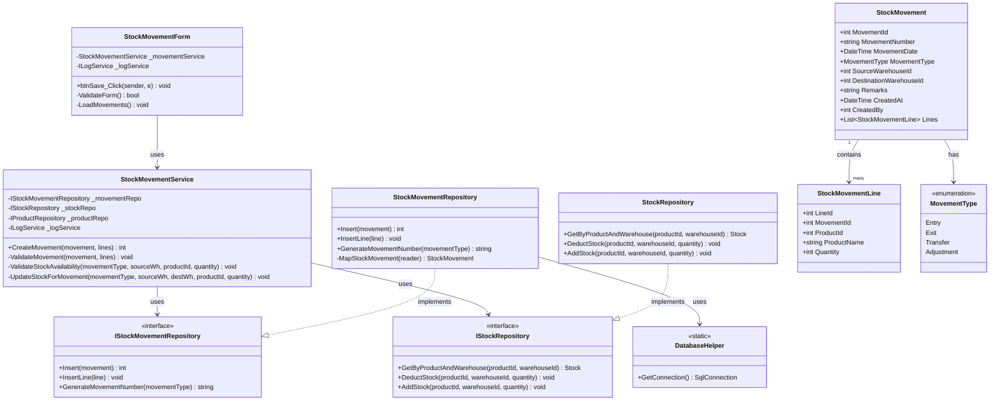
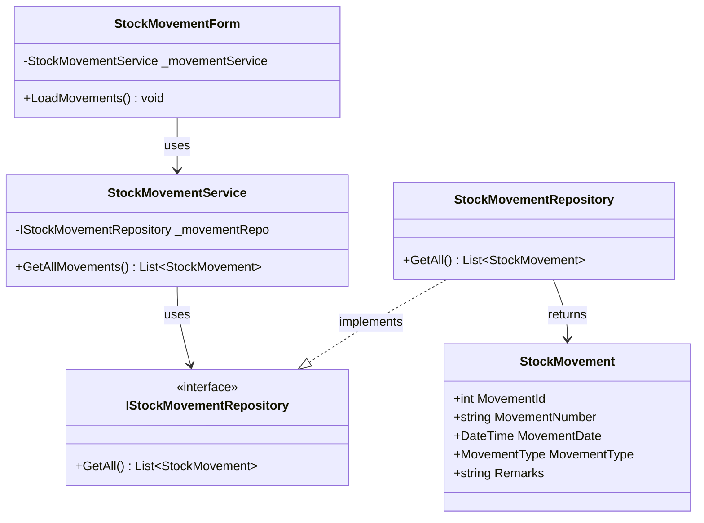
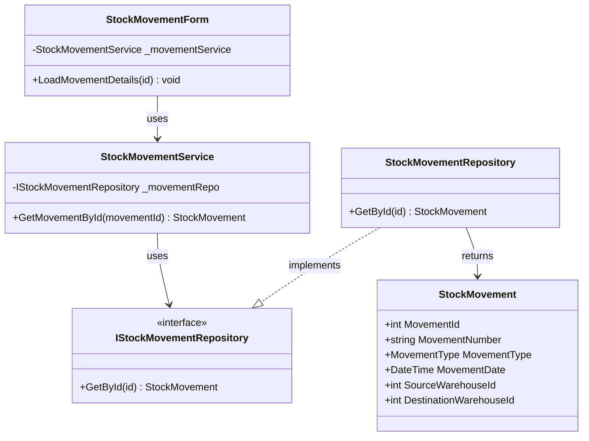
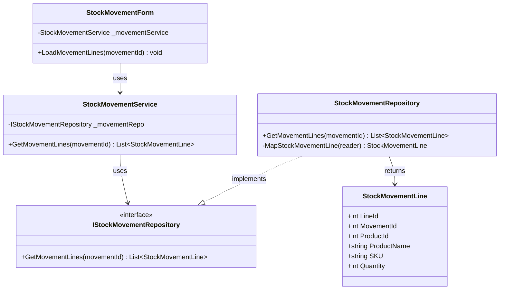
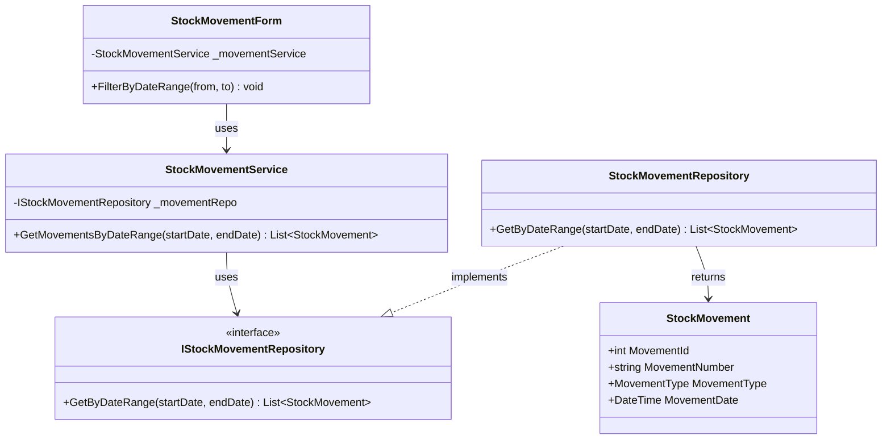
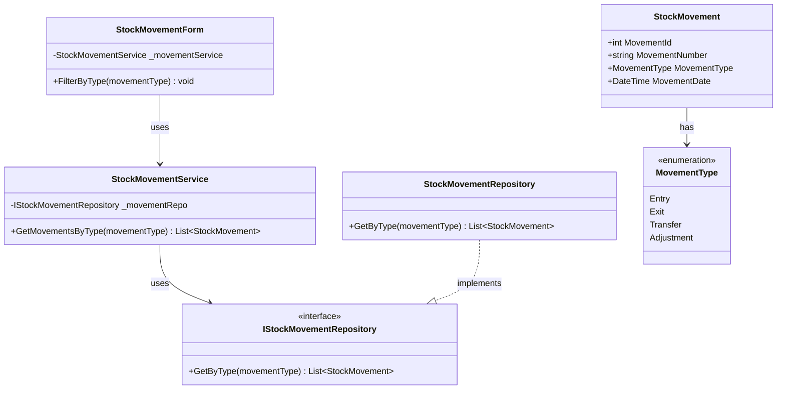
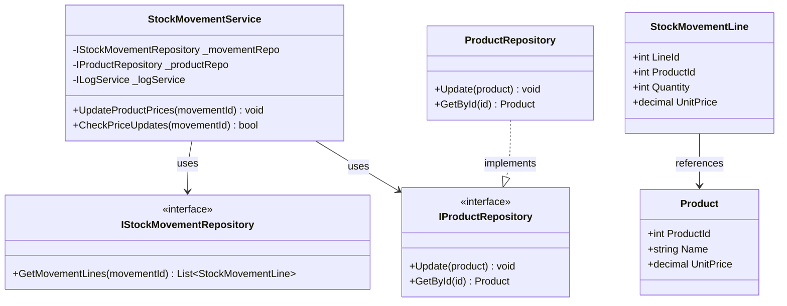
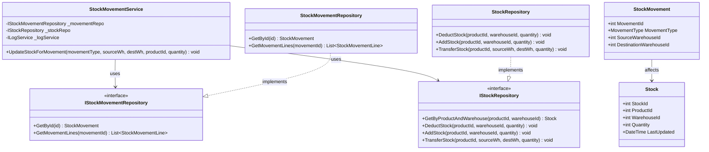

# Stock Movement Process - Class Diagrams (Per Use Case)

This document contains UML Class Diagrams organized per use case for all Stock Movement operations.

---

## UC-01: CreateMovement



---

## UC-02: GetAllMovements



---

## UC-03: GetAllMovementsById



---

## UC-04: GetMovementLines



---

## UC-05: GetMovementsByDateRange



---

## UC-06: GetMovementsByType



---

## UC-07: UpdateProductPrices



---

## UC-08: UpdateStockForMovement



---

## Movement Types & Stock Operations

| MovementType | SourceWarehouse | DestinationWarehouse | Stock Operation |
|--------------|-----------------|----------------------|-----------------|
| Entry | Not required | Required | Add to destination |
| Exit | Required | Not required | Deduct from source |
| Transfer | Required | Required | Deduct source + Add destination |
| Adjustment | Required | Not required | Set absolute quantity |
        -StockMovementService _movementService
        -ProductService _productService
        -WarehouseService _warehouseService
        -ILocalizationService _localizationService
        -ILogService _logService
        -DataGridView dgvMovements
        -DataGridView dgvMovementLines
        -ComboBox cboMovementType
        -ComboBox cboSourceWarehouse
        -ComboBox cboDestinationWarehouse
        -DateTimePicker dtpMovementDate
        -TextBox txtMovementNumber
        -TextBox txtRemarks
        -Button btnNew
        -Button btnSave
        -Button btnCancel
        -Button btnAddLine
        -Button btnRemoveLine
        +StockMovementForm(services...)
        +LoadMovements() void
        +LoadProducts() void
        +LoadWarehouses() void
        +btnNew_Click(sender, e) void
        +btnSave_Click(sender, e) void
        +btnAddLine_Click(sender, e) void
        +btnRemoveLine_Click(sender, e) void
        +cboMovementType_SelectedIndexChanged(sender, e) void
        -ValidateForm() bool
        -UpdateWarehouseVisibility() void
    }

    %% BLL Layer
    class StockMovementService {
        -IStockMovementRepository _movementRepo
        -IStockRepository _stockRepo
        -IProductRepository _productRepo
        -IWarehouseRepository _warehouseRepo
        -IAuditLogRepository _auditRepo
        -ILogService _logService
        +StockMovementService(repos, services...)
        +GetAllMovements() List~StockMovement~
        +GetMovementById(movementId) StockMovement
        +GetMovementsByType(movementType) List~StockMovement~
        +GetMovementsByDateRange(startDate, endDate) List~StockMovement~
        +GetMovementLines(movementId) List~StockMovementLine~
        +CreateMovement(movement, lines) int
        +GetCurrentStock(productId, warehouseId) int
        -ValidateMovement(movement, lines) void
        -UpdateStockForMovement(movementType, sourceWh, destWh, productId, quantity) void
        -ValidateStockAvailability(movementType, sourceWh, productId, quantity) void
    }

    class ProductService {
        -IProductRepository _productRepo
        -IAuditLogRepository _auditRepo
        -ILogService _logService
        +GetAllProducts() List~Product~
        +GetActiveProducts() List~Product~
        +GetProductById(productId) Product
    }

    class WarehouseService {
        -IWarehouseRepository _warehouseRepo
        -IAuditLogRepository _auditRepo
        -ILogService _logService
        +GetAllWarehouses() List~Warehouse~
        +GetActiveWarehouses() List~Warehouse~
        +GetWarehouseById(warehouseId) Warehouse
    }

    %% DAO Layer
    class StockMovementRepository {
        +GetAll() List~StockMovement~
        +GetById(id) StockMovement
        +GetByType(movementType) List~StockMovement~
        +GetByDateRange(startDate, endDate) List~StockMovement~
        +GetMovementLines(movementId) List~StockMovementLine~
        +Insert(entity) int
        +InsertLine(line) void
        +GenerateMovementNumber(movementType) string
        -MapStockMovement(reader) StockMovement
        -MapStockMovementLine(reader) StockMovementLine
    }

    class IStockMovementRepository {
        <<interface>>
        +GetAll() List~StockMovement~
        +GetById(id) StockMovement
        +GetByType(movementType) List~StockMovement~
        +Insert(entity) int
        +InsertLine(line) void
        +GenerateMovementNumber(movementType) string
    }

    class StockRepository {
        +GetByProduct(productId) List~Stock~
        +GetByWarehouse(warehouseId) List~Stock~
        +GetByProductAndWarehouse(productId, warehouseId) Stock
        +UpdateQuantity(productId, warehouseId, quantity) void
        +DeductStock(productId, warehouseId, quantity) void
        +AddStock(productId, warehouseId, quantity) void
        +TransferStock(productId, sourceWh, destWh, quantity) void
        -MapStock(reader) Stock
    }

    class IStockRepository {
        <<interface>>
        +GetByProductAndWarehouse(productId, warehouseId) Stock
        +UpdateQuantity(productId, warehouseId, quantity) void
        +DeductStock(productId, warehouseId, quantity) void
        +AddStock(productId, warehouseId, quantity) void
    }

    class ProductRepository {
        +GetAll() List~Product~
        +GetById(id) Product
        +GetBySKU(sku) Product
        -MapProduct(reader) Product
    }

    class IProductRepository {
        <<interface>>
        +GetAll() List~Product~
        +GetById(id) Product
    }

    class WarehouseRepository {
        +GetAll() List~Warehouse~
        +GetById(id) Warehouse
        +Insert(entity) int
        +Update(entity) void
        -MapWarehouse(reader) Warehouse
    }

    class IWarehouseRepository {
        <<interface>>
        +GetAll() List~Warehouse~
        +GetById(id) Warehouse
    }

    %% Domain Layer
    class StockMovement {
        +int MovementId
        +string MovementNumber
        +DateTime MovementDate
        +MovementType MovementType
        +int? SourceWarehouseId
        +int? DestinationWarehouseId
        +string Remarks
        +DateTime CreatedAt
        +int CreatedBy
        +List~StockMovementLine~ Lines
    }

    class StockMovementLine {
        +int LineId
        +int MovementId
        +int ProductId
        +string ProductName
        +int Quantity
    }

    class MovementType {
        <<enumeration>>
        Entry
        Exit
        Transfer
        Adjustment
    }

    class Stock {
        +int StockId
        +int ProductId
        +int WarehouseId
        +int Quantity
        +DateTime LastUpdated
    }

    class Product {
        +int ProductId
        +string SKU
        +string Name
        +string Category
        +decimal UnitPrice
        +int MinStockLevel
        +bool IsActive
    }

    class Warehouse {
        +int WarehouseId
        +string Code
        +string Name
        +string Location
        +bool IsActive
        +DateTime CreatedAt
        +int? CreatedBy
    }

    %% Relationships
    StockMovementForm --> StockMovementService : uses
    StockMovementForm --> ProductService : uses
    StockMovementForm --> WarehouseService : uses
    
    StockMovementService --> IStockMovementRepository : uses
    StockMovementService --> IStockRepository : uses
    StockMovementService --> IProductRepository : uses
    StockMovementService --> IWarehouseRepository : uses
    StockMovementService --> IAuditLogRepository : uses
    
    StockMovementRepository ..|> IStockMovementRepository : implements
    StockRepository ..|> IStockRepository : implements
    ProductRepository ..|> IProductRepository : implements
    WarehouseRepository ..|> IWarehouseRepository : implements
    
    StockMovementRepository --> StockMovement : returns
    StockMovementRepository --> StockMovementLine : returns
    StockRepository --> Stock : manages
    ProductRepository --> Product : returns
    WarehouseRepository --> Warehouse : returns
    
    StockMovement "1" --> "*" StockMovementLine : contains
    StockMovement --> MovementType : has
    StockMovement --> Warehouse : source/destination
    StockMovementLine --> Product : references
    Stock --> Product : tracks
    Stock --> Warehouse : located in
```

## Layer Communication Flow

```
┌──────────────────────┐
│     UI LAYER         │  StockMovementForm
└──────────┬───────────┘
           │ uses
           ▼
┌──────────────────────┐
│    BLL LAYER         │  StockMovementService
│                      │  ProductService
│                      │  WarehouseService
└──────────┬───────────┘
           │ calls
           ├─────────────────────┐
           ▼                     ▼
┌──────────────────────┐  ┌──────────────────┐
│    DAO LAYER         │  │    SERVICES      │
│                      │  │     LAYER        │
│ StockMovementRepo    │  │ LogService       │
│ StockRepository      │  │ AuditService     │
│ ProductRepository    │  └──────────────────┘
│ WarehouseRepository  │
└──────────┬───────────┘
           │ returns
           ▼
┌──────────────────────┐
│   DOMAIN LAYER       │  StockMovement
│                      │  StockMovementLine
│                      │  Stock, Product
│                      │  Warehouse
│                      │  MovementType (enum)
└──────────────────────┘
```

## Movement Types & Stock Operations

### Entry (Incoming Stock)
- **Source Warehouse**: Not required
- **Destination Warehouse**: Required
- **Stock Operation**: Add to destination warehouse
- **Use Cases**: Purchase orders, returns, initial inventory

### Exit (Outgoing Stock)
- **Source Warehouse**: Required
- **Destination Warehouse**: Not required
- **Stock Operation**: Deduct from source warehouse
- **Use Cases**: Sales (handled separately), wastage, donations

### Transfer (Between Warehouses)
- **Source Warehouse**: Required
- **Destination Warehouse**: Required
- **Stock Operation**: Deduct from source, add to destination
- **Use Cases**: Rebalancing inventory, relocations

### Adjustment (Inventory Correction)
- **Source Warehouse**: Required
- **Destination Warehouse**: Not required
- **Stock Operation**: Set quantity (can be positive or negative)
- **Use Cases**: Physical count corrections, damaged goods

## Key Business Rules

1. **Movement Number**: Auto-generated based on type and date
2. **Stock Validation**: Check available stock for Exit and Transfer
3. **Atomic Operations**: Movement and stock updates in single transaction
4. **Audit Trail**: All movements logged with user context
5. **Warehouse Validation**: Required warehouses based on movement type
6. **Negative Stock Prevention**: Exit/Transfer cannot reduce stock below zero
7. **Product Validation**: All products must be active
