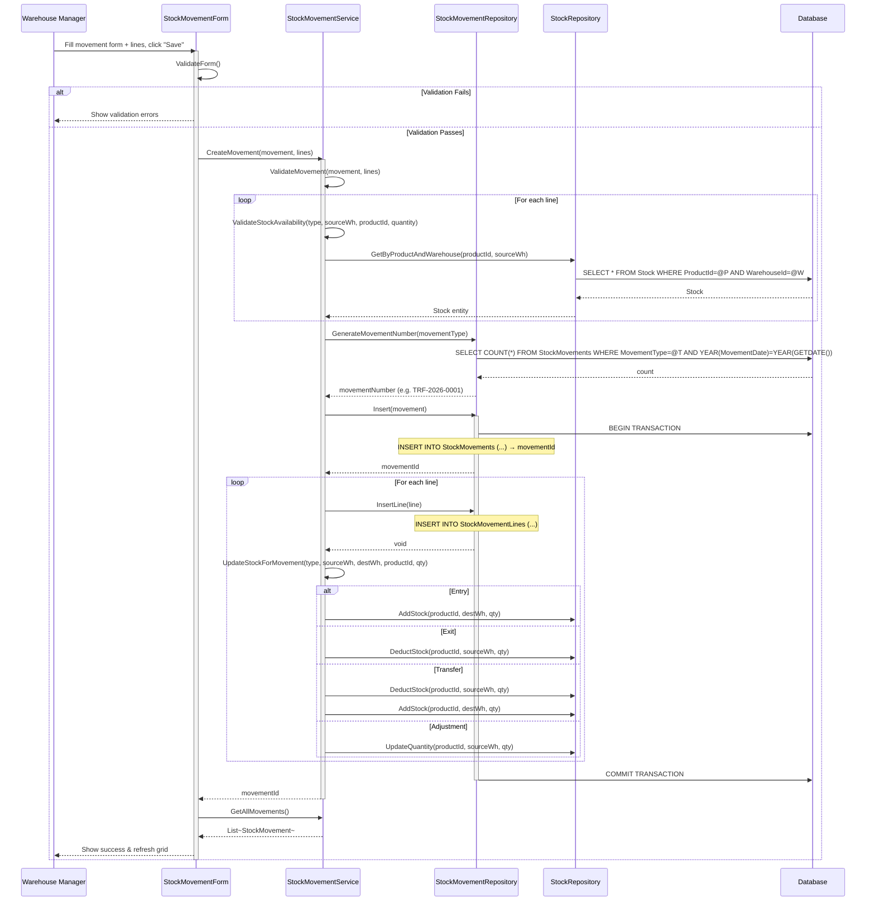
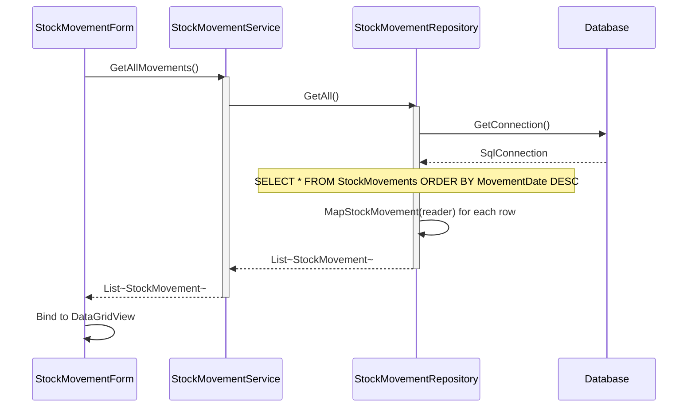
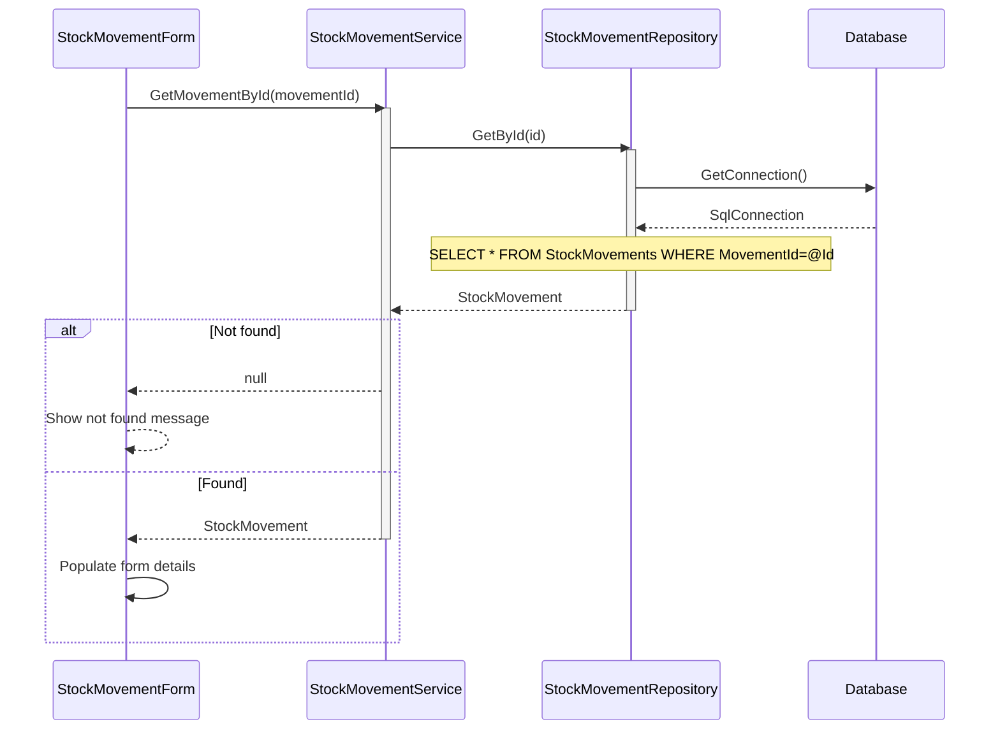
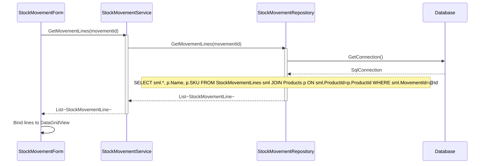
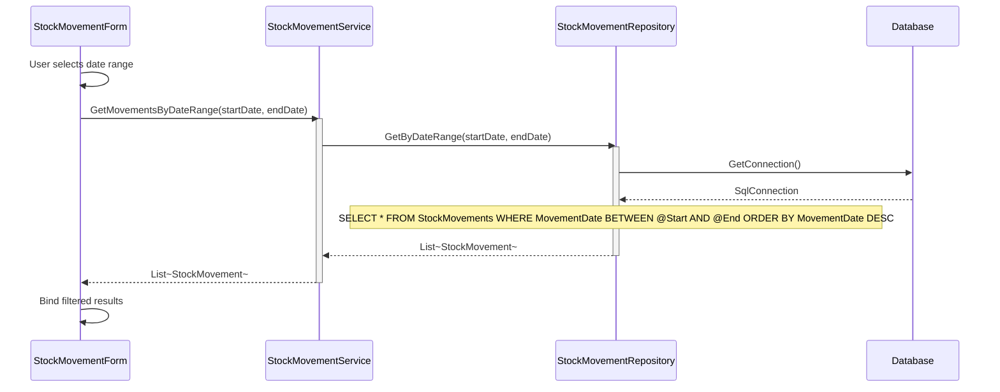
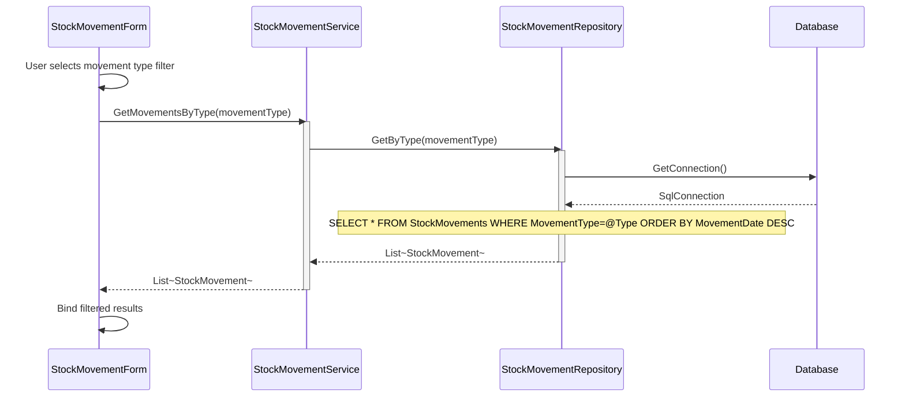
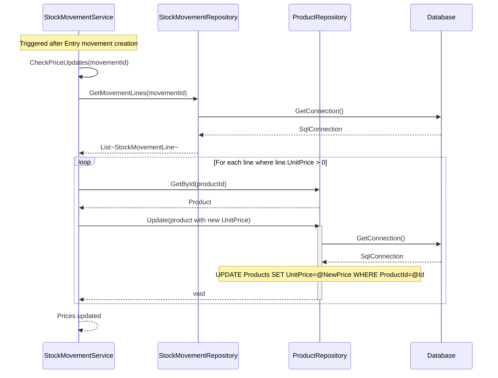
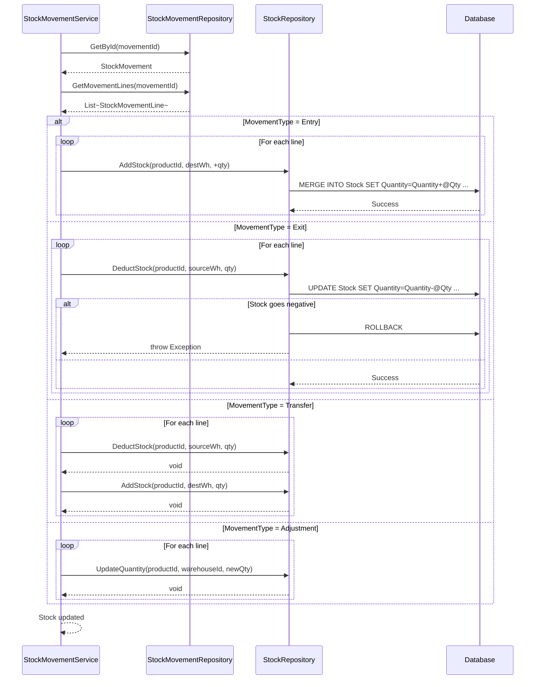

# Stock Movement Process - Sequence Diagrams (Per Use Case)

This document contains UML Sequence Diagrams organized per use case for all Stock Movement operations.

---

## UC-01: CreateMovement

---

## UC-02: GetAllMovements

---

## UC-03: GetAllMovementsById

---

## UC-04: GetMovementLines

---

## UC-05: GetMovementsByDateRange

---

## UC-06: GetMovementsByType

---

## UC-07: UpdateProductPrices

---

## UC-08: UpdateStockForMovement

---

## Business Rules Summary

| Use Case | Key Business Rules |
|----------|-------------------|
| CreateMovement | Movement number auto-generated per type+year; stock validated; atomic transaction |
| UpdateStockForMovement | Entry/Exit/Transfer/Adjustment have different stock operations |
| UpdateProductPrices | Only triggered for Entry movements with unit price specified |
| GetMovementsByType | Supports: Entry, Exit, Transfer, Adjustment |

## Sequence Flow Description

### Phase 1: Form Initialization
1. Warehouse manager opens Stock Movement Form
2. Form loads existing movements ordered by date
3. Form populates product dropdown with active products
4. Form populates warehouse dropdown with active warehouses
5. Display movements in main grid

### Phase 2: Select Movement Type
6. User clicks "New Movement"
7. Form clears all fields
8. User selects "Transfer" as movement type
9. Form shows both source and destination warehouse fields

### Phase 3: Select Warehouses
10. User selects source warehouse (where stock will be taken from)
11. User selects destination warehouse (where stock will go to)
12. Form validates source ≠ destination
13. User enters movement date and remarks

### Phase 4: Add Movement Lines
14. For each product to transfer:
    - User clicks "Add Line"
    - Selects product and quantity
    - System checks available stock in source warehouse
    - If insufficient, show error
    - If available, add line to grid

### Phase 5: Form Validation
15. User clicks "Save"
16. Form validates:
    - Movement type selected
    - Source and destination warehouses selected
    - At least one line added
    - Source ≠ Destination

### Phase 6: Business Validation
17. StockMovementService validates business rules
18. For each line, verify sufficient stock in source warehouse
19. If any line has insufficient stock, abort with error

### Phase 7: Generate Movement Number
20. Generate unique movement number: TRF-YYYY-####
21. Set audit fields (CreatedAt, CreatedBy)

### Phase 8: Database Transaction - Create Movement
22. Begin database transaction
23. Insert movement header into StockMovements table
24. Retrieve new movementId

### Phase 9: Process Each Line
25. For each movement line:
    - Insert line into StockMovementLines table
    - Deduct quantity from source warehouse stock
    - Add quantity to destination warehouse stock
    - Update LastUpdated timestamp
    - Validate stock doesn't go negative

### Phase 10: Transaction Commit
26. All operations successful → Commit transaction
27. Any operation fails → Rollback entire transaction

### Phase 11: Audit & Logging
28. Log change to AuditLog table
29. Write info log message with movement details

### Phase 12: Completion
30. Return movementId to form
31. Refresh movements grid
32. Clear form for next movement
33. Display success message

## Business Rules Enforced

1. **Stock Availability**: Must have sufficient stock in source warehouse
2. **Warehouse Validation**: Source and destination must be different
3. **Atomic Operations**: All stock updates in single transaction
4. **Movement Number**: Auto-generated, unique, sequential by type and year
5. **Stock Consistency**: Deduct from source = Add to destination
6. **Negative Stock Prevention**: Transaction rollback if stock would go negative
7. **Audit Trail**: All operations logged with user and timestamp

## Movement Types Summary

### Entry (IN-YYYY-####)
- **Stock Operation**: Add to destination warehouse only
- **Warehouses**: Destination required, source not applicable

### Exit (OUT-YYYY-####)
- **Stock Operation**: Deduct from source warehouse only
- **Warehouses**: Source required, destination not applicable

### Transfer (TRF-YYYY-####)
- **Stock Operation**: Deduct from source, add to destination
- **Warehouses**: Both source and destination required

### Adjustment (ADJ-YYYY-####)
- **Stock Operation**: Set absolute quantity (can increase or decrease)
- **Warehouses**: Source required, destination not applicable

## Error Handling

1. **Insufficient Stock**: Rollback transaction, display error
2. **Warehouse Validation**: Prevent save if source = destination
3. **Database Errors**: Rollback all changes, log error
4. **Concurrency**: Transaction isolation handles concurrent updates
5. **Stock Consistency**: Verify quantities match between source and destination
