# Reports Management Process - Class Diagram

## UML Class Diagram (Mermaid Format)

```mermaid
classDiagram
    %% UI Layer
    class ReportsForm {
        -ReportService _reportService
        -IAuthorizationService _authService
        -ILocalizationService _localizationService
        -ILogService _logService
        -ComboBox cboReportType
        -DateTimePicker dtpStartDate
        -DateTimePicker dtpEndDate
        -ComboBox cboCategory
        -ComboBox cboClient
        -ComboBox cboSeller
        -DataGridView dgvReport
        -Button btnGenerate
        -Button btnExport
        -Button btnPrint
        +ReportsForm(services...)
        +LoadReportTypes() void
        +btnGenerate_Click(sender, e) void
        +btnExport_Click(sender, e) void
        +btnPrint_Click(sender, e) void
        +cboReportType_SelectedIndexChanged(sender, e) void
        -ShowReportFilters() void
        -GenerateReport() void
        -ExportToExcel() void
        -PrintReport() void
    }

    %% BLL Layer
    class ReportService {
        -IReportRepository _reportRepo
        -ILogService _logService
        +ReportService(reportRepo, logService)
        +GetTopProductsReport(startDate, endDate, category, topN, orderBy) List~TopProductsReportDTO~
        +GetClientPurchasesReport(startDate, endDate, clientId, topN) List~ClientPurchasesReportDTO~
        +GetPriceVariationReport(startDate, endDate, productId, category) List~PriceVariationReportDTO~
        +GetSellerPerformanceReport(startDate, endDate, sellerName, category) List~SellerPerformanceReportDTO~
        +GetCategorySalesReport(startDate, endDate, orderBy) List~CategorySalesReportDTO~
        +GetLowStockReport(warehouseId, threshold) List~LowStockReportDTO~
        +GetStockMovementsReport(startDate, endDate, warehouseId, movementType) List~StockMovementsReportDTO~
    }

    %% Services Layer
    class IAuthorizationService {
        <<interface>>
        +HasPermission(userId, permission) bool
        +HasAnyPermission(userId, permissions) bool
        +GetUserPermissions(userId) List~Permission~
    }

    class ILogService {
        <<interface>>
        +Info(message) void
        +Warning(message) void
        +Error(message, exception) void
    }

    %% DAO Layer
    class ReportRepository {
        +GetTopProductsReport(startDate, endDate, category, topN, orderBy) List~TopProductsReportDTO~
        +GetClientPurchasesReport(startDate, endDate, clientId, topN) List~ClientPurchasesReportDTO~
        +GetPriceVariationReport(startDate, endDate, productId, category) List~PriceVariationReportDTO~
        +GetSellerPerformanceReport(startDate, endDate, sellerName, category) List~SellerPerformanceReportDTO~
        +GetCategorySalesReport(startDate, endDate, orderBy) List~CategorySalesReportDTO~
        +GetLowStockReport(warehouseId, threshold) List~LowStockReportDTO~
        +GetStockMovementsReport(startDate, endDate, warehouseId, movementType) List~StockMovementsReportDTO~
        -MapTopProductsReport(reader) TopProductsReportDTO
        -MapClientPurchasesReport(reader) ClientPurchasesReportDTO
        -MapPriceVariationReport(reader) PriceVariationReportDTO
        -MapSellerPerformanceReport(reader) SellerPerformanceReportDTO
        -MapCategorySalesReport(reader) CategorySalesReportDTO
        -MapLowStockReport(reader) LowStockReportDTO
        -MapStockMovementsReport(reader) StockMovementsReportDTO
    }

    class IReportRepository {
        <<interface>>
        +GetTopProductsReport(startDate, endDate, category, topN, orderBy) List~TopProductsReportDTO~
        +GetClientPurchasesReport(startDate, endDate, clientId, topN) List~ClientPurchasesReportDTO~
        +GetPriceVariationReport(startDate, endDate, productId, category) List~PriceVariationReportDTO~
        +GetSellerPerformanceReport(startDate, endDate, sellerName, category) List~SellerPerformanceReportDTO~
        +GetCategorySalesReport(startDate, endDate, orderBy) List~CategorySalesReportDTO~
        +GetLowStockReport(warehouseId, threshold) List~LowStockReportDTO~
    }

    class DatabaseHelper {
        <<static>>
        +GetConnection() SqlConnection
        +CreateParameter(name, value) SqlParameter
    }

    %% Domain Layer - Report DTOs
    class TopProductsReportDTO {
        +string ProductName
        +string SKU
        +string Category
        +int UnitsSold
        +decimal Revenue
        +int TransactionCount
    }

    class ClientPurchasesReportDTO {
        +string ClientName
        +string ClientDNI
        +int TotalPurchases
        +decimal TotalSpent
        +DateTime? LastPurchaseDate
        +decimal AverageTicket
    }

    class PriceVariationReportDTO {
        +string ProductName
        +string SKU
        +string Category
        +DateTime SaleDate
        +decimal UnitPrice
        +decimal PriceVariation
        +decimal PercentageChange
    }

    class SellerPerformanceReportDTO {
        +string SellerName
        +int SalesCount
        +int TotalUnits
        +decimal TotalRevenue
        +decimal AverageTicket
        +decimal MinSale
        +decimal MaxSale
    }

    class CategorySalesReportDTO {
        +string Category
        +int TotalUnits
        +decimal TotalRevenue
        +int TransactionCount
        +decimal AveragePrice
        +decimal RevenuePercentage
    }

    class LowStockReportDTO {
        +string ProductName
        +string SKU
        +string Category
        +string WarehouseName
        +int CurrentStock
        +int MinStockLevel
        +int Deficit
    }

    class StockMovementsReportDTO {
        +string MovementNumber
        +DateTime MovementDate
        +string MovementType
        +string ProductName
        +string SourceWarehouse
        +string DestinationWarehouse
        +int Quantity
        +string CreatedByUser
    }

    %% Relationships
    ReportsForm --> ReportService : uses
    ReportsForm --> IAuthorizationService : uses
    ReportsForm --> ILocalizationService : uses
    ReportsForm --> ILogService : uses
    
    ReportService --> IReportRepository : uses
    ReportService --> ILogService : uses
    
    ReportRepository ..|> IReportRepository : implements
    ReportRepository --> DatabaseHelper : uses
    ReportRepository --> TopProductsReportDTO : returns
    ReportRepository --> ClientPurchasesReportDTO : returns
    ReportRepository --> PriceVariationReportDTO : returns
    ReportRepository --> SellerPerformanceReportDTO : returns
    ReportRepository --> CategorySalesReportDTO : returns
    ReportRepository --> LowStockReportDTO : returns
    ReportRepository --> StockMovementsReportDTO : returns
```



## Layer Communication Flow

```
┌────────────────────┐
│    UI LAYER        │  ReportsForm
└─────────┬──────────┘
          │ uses
          ▼
┌────────────────────┐
│   BLL LAYER        │  ReportService
└─────────┬──────────┘
          │ calls
          ├───────────────────┐
          ▼                   ▼
┌────────────────────┐  ┌────────────────────┐
│   DAO LAYER        │  │    SERVICES        │
│                    │  │     LAYER          │
│ ReportRepository   │  │ AuthService        │
│ DatabaseHelper     │  │ LogService         │
└─────────┬──────────┘  └────────────────────┘
          │ returns
          ▼
┌────────────────────┐
│  DOMAIN LAYER      │  Report DTOs:
│                    │  - TopProductsReportDTO
│                    │  - ClientPurchasesReportDTO
│                    │  - PriceVariationReportDTO
│                    │  - SellerPerformanceReportDTO
│                    │  - CategorySalesReportDTO
│                    │  - LowStockReportDTO
│                    │  - StockMovementsReportDTO
└────────────────────┘
```

## Available Reports

### 1. Top Products Report
**Purpose**: Identify best-selling products by units or revenue  
**Filters**:
- Date range (start/end)
- Category (optional)
- Top N products (optional)
- Order by: units sold or revenue

**SQL Complexity**: Complex aggregate query with GROUP BY and ORDER BY

### 2. Client Purchases Report
**Purpose**: Analyze customer purchasing behavior  
**Filters**:
- Date range (start/end)
- Specific client (optional)
- Top N clients (optional)

**Metrics**: Total purchases, total spent, last purchase date, average ticket

### 3. Price Variation Report
**Purpose**: Track product price changes over time  
**Filters**:
- Date range (start/end)
- Specific product (optional)
- Category (optional)

**Metrics**: Price at each sale, variation from previous sale, percentage change

### 4. Seller Performance Report
**Purpose**: Evaluate sales team performance  
**Filters**:
- Date range (start/end)
- Specific seller (optional)
- Category (optional)

**Metrics**: Sales count, total units, revenue, average/min/max sale amounts

### 5. Category Sales Report
**Purpose**: Compare performance across product categories  
**Filters**:
- Date range (start/end)
- Order by: revenue or units

**Metrics**: Total units, revenue, transaction count, average price, revenue percentage

### 6. Low Stock Report
**Purpose**: Identify products below minimum stock levels  
**Filters**:
- Warehouse (optional)
- Custom threshold (optional)

**Metrics**: Current stock, minimum stock level, deficit quantity

### 7. Stock Movements Report
**Purpose**: Track inventory movements and transfers  
**Filters**:
- Date range (start/end)
- Warehouse (optional)
- Movement type (Entry/Exit/Transfer/Adjustment)

**Metrics**: Movement details, quantities, source/destination, user who created

## Permission-Based Access

Reports are protected by role-based permissions:
- **VIEW_REPORTS_GENERAL**: Basic sales reports (Top Products, Category Sales)
- **VIEW_REPORTS_CLIENTS**: Client-related reports (Client Purchases)
- **VIEW_REPORTS_ADVANCED**: Advanced reports (Price Variation, Seller Performance)
- **VIEW_REPORTS_INVENTORY**: Inventory reports (Low Stock, Stock Movements)

## Key Features

1. **Dynamic Filtering**: Each report supports multiple filter combinations
2. **Date Range Support**: All reports support date range filtering
3. **Export Capabilities**: Reports can be exported to Excel, PDF
4. **Permission Control**: Access controlled via authorization service
5. **Logging**: All report generation logged for audit
6. **Performance**: Optimized SQL queries with proper indexing
