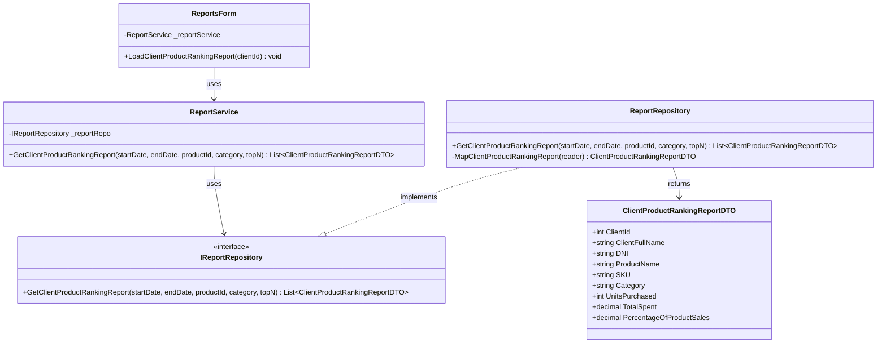

# Reports Management Process - Class Diagrams (Per Use Case)

This document contains UML Class Diagrams organized per use case for all Report operations.

---

## UC-01: GetCategorySalesReport


---

## UC-02: GetClientProductRankingReport



---

## UC-03: GetClientPurchasesReport


---

## UC-04: GetPriceVariationReport


---

## UC-05: GetRevenueByDateReport


---

## UC-06: GetSellerPerformanceReport


---

## UC-07: GetTopProductsReport


---

## Layer Communication Flow

```
┌────────────────────┐
│    UI LAYER        │  ReportsForm
└─────────┬──────────┘
          │ uses
          ▼
┌────────────────────┐
│   BLL LAYER        │  ReportService
└─────────┬──────────┘
          │ calls
          ▼
┌────────────────────┐
│   DAO LAYER        │  ReportRepository
│                    │  DatabaseHelper
└─────────┬──────────┘
          │ returns
          ▼
┌────────────────────┐
│  DOMAIN LAYER      │  Report DTOs (CategorySalesReportDTO,
│                    │  ClientPurchasesReportDTO, etc.)
└────────────────────┘
```

## Available Reports Summary

| Use Case | Filters | Key Metrics |
|----------|---------|-------------|
| GetCategorySalesReport | Date range, category | UnitsSold, TotalRevenue, PercentageOfTotal |
| GetClientProductRankingReport | Date range, productId, category, topN | UnitsPurchased, TotalSpent, PercentageOfProductSales |
| GetClientPurchasesReport | Date range, clientId, topN | PurchaseCount, TotalSpent, TotalUnits, AverageTicket |
| GetPriceVariationReport | Date range, productId, category | ListPrice, MinSalePrice, MaxSalePrice, AverageSalePrice, variation |
| GetRevenueByDateReport | Date range, movementType, warehouseId | SalesRevenue, StockInMovements/Units, StockOutMovements/Units |
| GetSellerPerformanceReport | Date range, sellerName, category | TotalSales, TotalRevenue, AverageTicket, TopProduct |
| GetTopProductsReport | Date range, category, topN, orderBy | UnitsSold, Revenue, ListPrice, AverageSalePrice, Ranking |
        -ReportService _reportService
        -IAuthorizationService _authService
        -ILocalizationService _localizationService
        -ILogService _logService
        -ComboBox cboReportType
        -DateTimePicker dtpStartDate
        -DateTimePicker dtpEndDate
        -ComboBox cboCategory
        -ComboBox cboClient
        -ComboBox cboSeller
        -DataGridView dgvReport
        -Button btnGenerate
        -Button btnExport
        -Button btnPrint
        +ReportsForm(services...)
        +LoadReportTypes() void
        +btnGenerate_Click(sender, e) void
        +btnExport_Click(sender, e) void
        +btnPrint_Click(sender, e) void
        +cboReportType_SelectedIndexChanged(sender, e) void
        -ShowReportFilters() void
        -GenerateReport() void
        -ExportToExcel() void
        -PrintReport() void
    }

    %% BLL Layer
    class ReportService {
        -IReportRepository _reportRepo
        -ILogService _logService
        +ReportService(reportRepo, logService)
        +GetTopProductsReport(startDate, endDate, category, topN, orderBy) List~TopProductsReportDTO~
        +GetClientPurchasesReport(startDate, endDate, clientId, topN) List~ClientPurchasesReportDTO~
        +GetPriceVariationReport(startDate, endDate, productId, category) List~PriceVariationReportDTO~
        +GetSellerPerformanceReport(startDate, endDate, sellerName, category) List~SellerPerformanceReportDTO~
        +GetCategorySalesReport(startDate, endDate, category) List~CategorySalesReportDTO~
        +GetRevenueByDateReport(startDate, endDate, movementType, warehouseId) List~RevenueByDateReportDTO~
        +GetClientProductRankingReport(startDate, endDate, productId, category, topN) List~ClientProductRankingReportDTO~
    }

    %% Services Layer
    class IAuthorizationService {
        <<interface>>
        +HasPermission(userId, permissionCode) bool
        +HasAnyPermission(userId, permissionCodes) bool
        +HasAllPermissions(userId, permissionCodes) bool
        +GetUserPermissions(userId) List~string~
    }

    class ILogService {
        <<interface>>
        +Debug(message, logger) void
        +Info(message, logger) void
        +Warning(message, logger) void
        +Error(message, exception, logger) void
        +Fatal(message, exception, logger) void
        +Log(level, message, exception, logger) void
    }

    %% DAO Layer
    class ReportRepository {
        +GetTopProductsReport(startDate, endDate, category, topN, orderBy) List~TopProductsReportDTO~
        +GetClientPurchasesReport(startDate, endDate, clientId, topN) List~ClientPurchasesReportDTO~
        +GetPriceVariationReport(startDate, endDate, productId, category) List~PriceVariationReportDTO~
        +GetSellerPerformanceReport(startDate, endDate, sellerName, category) List~SellerPerformanceReportDTO~
        +GetCategorySalesReport(startDate, endDate, category) List~CategorySalesReportDTO~
        +GetRevenueByDateReport(startDate, endDate, movementType, warehouseId) List~RevenueByDateReportDTO~
        +GetClientProductRankingReport(startDate, endDate, productId, category, topN) List~ClientProductRankingReportDTO~
        -MapTopProductsReport(reader) TopProductsReportDTO
        -MapClientPurchasesReport(reader) ClientPurchasesReportDTO
        -MapPriceVariationReport(reader) PriceVariationReportDTO
        -MapSellerPerformanceReport(reader) SellerPerformanceReportDTO
        -MapCategorySalesReport(reader) CategorySalesReportDTO
        -MapRevenueByDateReport(reader) RevenueByDateReportDTO
        -MapClientProductRankingReport(reader) ClientProductRankingReportDTO
    }

    class IReportRepository {
        <<interface>>
        +GetTopProductsReport(startDate, endDate, category, topN, orderBy) List~TopProductsReportDTO~
        +GetClientPurchasesReport(startDate, endDate, clientId, topN) List~ClientPurchasesReportDTO~
        +GetPriceVariationReport(startDate, endDate, productId, category) List~PriceVariationReportDTO~
        +GetSellerPerformanceReport(startDate, endDate, sellerName, category) List~SellerPerformanceReportDTO~
        +GetCategorySalesReport(startDate, endDate, category) List~CategorySalesReportDTO~
        +GetRevenueByDateReport(startDate, endDate, movementType, warehouseId) List~RevenueByDateReportDTO~
        +GetClientProductRankingReport(startDate, endDate, productId, category, topN) List~ClientProductRankingReportDTO~
    }

    class DatabaseHelper {
        <<static>>
        +GetConnection() SqlConnection
        +CreateParameter(name, value) SqlParameter
    }

    %% Domain Layer - Report DTOs
    class TopProductsReportDTO {
        +string SKU
        +string ProductName
        +string Category
        +int UnitsSold
        +decimal Revenue
        +decimal ListPrice
        +decimal AverageSalePrice
        +int Ranking
    }

    class ClientPurchasesReportDTO {
        +int ClientId
        +string ClientFullName
        +string DNI
        +string Email
        +int PurchaseCount
        +decimal TotalSpent
        +int TotalUnits
        +int DistinctProducts
        +decimal AverageTicket
        +List~ClientProductDetail~ ProductDetails
    }

    class PriceVariationReportDTO {
        +string SKU
        +string ProductName
        +string Category
        +decimal ListPrice
        +decimal MinSalePrice
        +decimal MaxSalePrice
        +decimal AverageSalePrice
        +decimal AbsoluteVariation
        +decimal PercentageVariation
    }

    class SellerPerformanceReportDTO {
        +string SellerName
        +int TotalSales
        +int TotalUnits
        +decimal TotalRevenue
        +decimal AverageTicket
        +string TopProduct
        +int TopProductQuantity
    }

    class CategorySalesReportDTO {
        +string Category
        +int UnitsSold
        +decimal TotalRevenue
        +decimal PercentageOfTotal
    }

    class RevenueByDateReportDTO {
        +DateTime ReportDate
        +decimal SalesRevenue
        +int StockInMovements
        +int StockInUnits
        +int StockOutMovements
        +int StockOutUnits
    }

    class ClientProductRankingReportDTO {
        +int ClientId
        +string ClientFullName
        +string DNI
        +string ProductName
        +string SKU
        +string Category
        +int UnitsPurchased
        +decimal TotalSpent
        +decimal PercentageOfProductSales
    }

    %% Relationships
    ReportsForm --> ReportService : uses
    ReportsForm --> IAuthorizationService : uses
    ReportsForm --> ILocalizationService : uses
    ReportsForm --> ILogService : uses
    
    ReportService --> IReportRepository : uses
    ReportService --> ILogService : uses
    
    ReportRepository ..|> IReportRepository : implements
    ReportRepository --> DatabaseHelper : uses
    ReportRepository --> TopProductsReportDTO : returns
    ReportRepository --> ClientPurchasesReportDTO : returns
    ReportRepository --> PriceVariationReportDTO : returns
    ReportRepository --> SellerPerformanceReportDTO : returns
    ReportRepository --> CategorySalesReportDTO : returns
    ReportRepository --> RevenueByDateReportDTO : returns
    ReportRepository --> ClientProductRankingReportDTO : returns
```

## Layer Communication Flow

```
┌────────────────────┐
│    UI LAYER        │  ReportsForm
└─────────┬──────────┘
          │ uses
          ▼
┌────────────────────┐
│   BLL LAYER        │  ReportService
└─────────┬──────────┘
          │ calls
          ├───────────────────┐
          ▼                   ▼
┌────────────────────┐  ┌────────────────────┐
│   DAO LAYER        │  │    SERVICES        │
│                    │  │     LAYER          │
│ ReportRepository   │  │ AuthService        │
│ DatabaseHelper     │  │ LogService         │
└─────────┬──────────┘  └────────────────────┘
          │ returns
          ▼
┌────────────────────┐
│  DOMAIN LAYER      │  Report DTOs:
│                    │  - TopProductsReportDTO
│                    │  - ClientPurchasesReportDTO
│                    │  - PriceVariationReportDTO
│                    │  - SellerPerformanceReportDTO
│                    │  - CategorySalesReportDTO
│                    │  - LowStockReportDTO
│                    │  - StockMovementsReportDTO
└────────────────────┘
```

## Available Reports

### 1. Top Products Report
**Purpose**: Identify best-selling products by units or revenue  
**Filters**:
- Date range (start/end)
- Category (optional)
- Top N products (optional)
- Order by: units sold or revenue

**SQL Complexity**: Complex aggregate query with GROUP BY and ORDER BY

### 2. Client Purchases Report
**Purpose**: Analyze customer purchasing behavior  
**Filters**:
- Date range (start/end)
- Specific client (optional)
- Top N clients (optional)

**Metrics**: Total purchases, total spent, last purchase date, average ticket

### 3. Price Variation Report
**Purpose**: Track product price changes over time  
**Filters**:
- Date range (start/end)
- Specific product (optional)
- Category (optional)

**Metrics**: Price at each sale, variation from previous sale, percentage change

### 4. Seller Performance Report
**Purpose**: Evaluate sales team performance  
**Filters**:
- Date range (start/end)
- Specific seller (optional)
- Category (optional)

**Metrics**: Sales count, total units, revenue, average/min/max sale amounts

### 5. Category Sales Report
**Purpose**: Compare performance across product categories  
**Filters**:
- Date range (start/end)
- Order by: revenue or units

**Metrics**: Total units, revenue, transaction count, average price, revenue percentage

### 6. Low Stock Report
**Purpose**: Identify products below minimum stock levels  
**Filters**:
- Warehouse (optional)
- Custom threshold (optional)

**Metrics**: Current stock, minimum stock level, deficit quantity

### 7. Stock Movements Report
**Purpose**: Track inventory movements and transfers  
**Filters**:
- Date range (start/end)
- Warehouse (optional)
- Movement type (Entry/Exit/Transfer/Adjustment)

**Metrics**: Movement details, quantities, source/destination, user who created

## Permission-Based Access

Reports are protected by role-based permissions:
- **VIEW_REPORTS_GENERAL**: Basic sales reports (Top Products, Category Sales)
- **VIEW_REPORTS_CLIENTS**: Client-related reports (Client Purchases)
- **VIEW_REPORTS_ADVANCED**: Advanced reports (Price Variation, Seller Performance)
- **VIEW_REPORTS_INVENTORY**: Inventory reports (Low Stock, Stock Movements)

## Key Features

1. **Dynamic Filtering**: Each report supports multiple filter combinations
2. **Date Range Support**: All reports support date range filtering
3. **Export Capabilities**: Reports can be exported to Excel, PDF
4. **Permission Control**: Access controlled via authorization service
5. **Logging**: All report generation logged for audit
6. **Performance**: Optimized SQL queries with proper indexing
