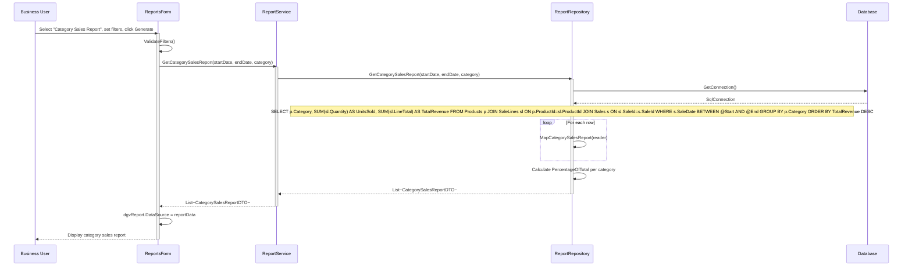
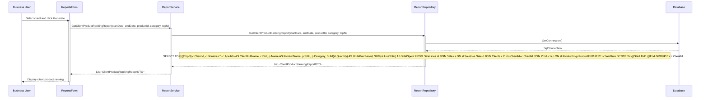
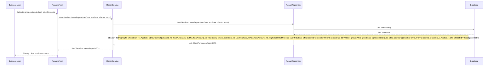
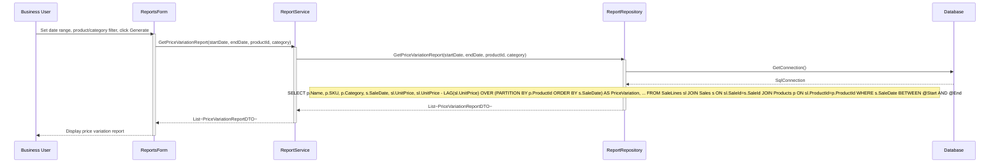
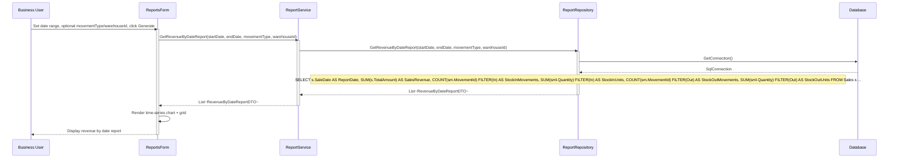
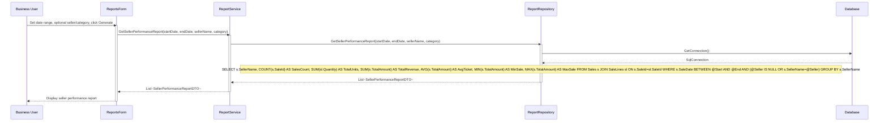
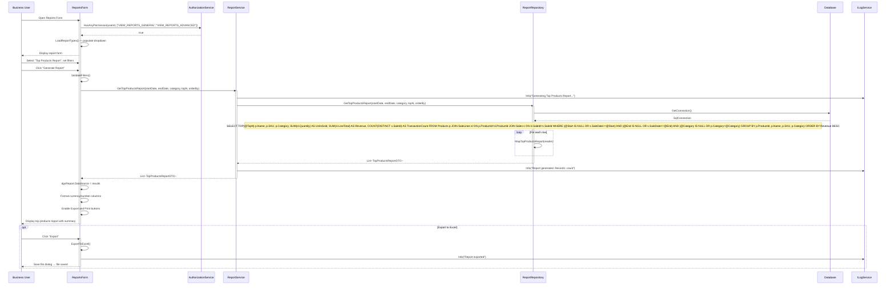

# Reports Management Process - Sequence Diagrams (Per Use Case)

This document contains UML Sequence Diagrams organized per use case for all Report operations.

---

## UC-01: GetCategorySalesReport



---

## UC-02: GetClientProductRankingReport



---

## UC-03: GetClientPurchasesReport



---

## UC-04: GetPriceVariationReport



---

## UC-05: GetRevenueByDateReport



---

## UC-06: GetSellerPerformanceReport



---

## UC-07: GetTopProductsReport



---

## Report Access Permissions

| Report | Required Permission |
|--------|--------------------|
| GetTopProductsReport | VIEW_REPORTS_GENERAL or VIEW_REPORTS_ADVANCED |
| GetClientPurchasesReport | VIEW_REPORTS_CLIENTS |
| GetPriceVariationReport | VIEW_REPORTS_ADVANCED |
| GetSellerPerformanceReport | VIEW_REPORTS_ADVANCED |
| GetCategorySalesReport | VIEW_REPORTS_GENERAL |
| GetRevenueByDateReport | VIEW_REPORTS_GENERAL |
| GetClientProductRankingReport | VIEW_REPORTS_CLIENTS |

```mermaid
sequenceDiagram
    participant User as Business User
    participant UI as ReportsForm<br/>(UI Layer)
    participant Auth as AuthorizationService<br/>(Services)
    participant BLL as ReportService<br/>(BLL)
    participant Repo as ReportRepository<br/>(DAO)
    participant DB as Database
    participant Log as ILogService

    %% Load Form
    User->>UI: Open Reports Form
    activate UI
    
    %% Check permissions
    UI->>Auth: HasAnyPermission(userId, ["VIEW_REPORTS_GENERAL", "VIEW_REPORTS_ADVANCED"])
    activate Auth
    Auth->>Auth: Check user permissions from SessionContext
    Auth-->>UI: true/false
    deactivate Auth
    
    alt No permission
        UI-->>User: Show "Access Denied" message
        UI->>UI: Close form
    else Has permission
        UI->>UI: LoadReportTypes()
        Note over UI: Populate report types:<br/>- Top Products<br/>- Client Purchases<br/>- Price Variation<br/>- Seller Performance<br/>- Category Sales<br/>- Low Stock<br/>- Stock Movements
        
        UI-->>User: Display report form with filters
    end
    deactivate UI

    %% Select Report Type
    User->>UI: Select "Top Products Report"
    activate UI
    UI->>UI: cboReportType_SelectedIndexChanged()
    UI->>UI: ShowReportFilters()
    Note over UI: Show filters:<br/>- Start Date<br/>- End Date<br/>- Category (dropdown)<br/>- Top N (numeric)<br/>- Order By (Units/Revenue)
    UI-->>User: Display appropriate filters
    deactivate UI

    %% Configure Filters
    User->>UI: Set Start Date = 2024-01-01
    User->>UI: Set End Date = 2024-12-31
    User->>UI: Select Category = "Electronics"
    User->>UI: Set Top N = 10
    User->>UI: Select Order By = "Revenue"

    %% Generate Report
    User->>UI: Click "Generate Report" button
    activate UI
    
    UI->>UI: ValidateFilters()
    Note over UI: Validate:<br/>- Start date <= End date<br/>- Top N > 0 (if specified)<br/>- Required fields populated
    
    alt Validation Fails
        UI-->>User: Show validation errors
    else Validation Passes
        
        Note over UI: Show loading indicator
        UI->>UI: Cursor = WaitCursor
        UI->>UI: Disable Generate button
        
        UI->>BLL: GetTopProductsReport(startDate, endDate, category, topN, orderBy)
        activate BLL
        
        %% Log request
        BLL->>Log: Info("Generating Top Products Report. DateRange: 2024-01-01 to 2024-12-31, Category: Electronics, TopN: 10, OrderBy: Revenue")
        activate Log
        deactivate Log
        
        %% Execute report query
        BLL->>Repo: GetTopProductsReport(startDate, endDate, category, topN, orderBy)
        activate Repo
        
        Repo->>DB: GetConnection()
        activate DB
        DB-->>Repo: SqlConnection
        deactivate DB
        
        Note over Repo: Build complex SQL query:<br/>SELECT TOP(@TopN)<br/>  p.SKU,<br/>  p.Name AS ProductName,<br/>  p.Category,<br/>  SUM(sl.Quantity) AS UnitsSold,<br/>  SUM(sl.LineTotal) AS Revenue,<br/>  p.UnitPrice AS ListPrice,<br/>  AVG(sl.UnitPrice) AS AverageSalePrice<br/>FROM Products p<br/>INNER JOIN SaleLines sl ON p.ProductId = sl.ProductId<br/>INNER JOIN Sales s ON sl.SaleId = s.SaleId<br/>WHERE (@StartDate IS NULL OR s.SaleDate >= @StartDate)<br/>  AND (@EndDate IS NULL OR s.SaleDate <= @EndDate)<br/>  AND (@Category IS NULL OR p.Category = @Category)<br/>GROUP BY p.ProductId, p.SKU, p.Name, p.Category, p.UnitPrice<br/>ORDER BY @OrderBy DESC
        
        Repo->>DB: ExecuteReader(query, parameters)
        activate DB
        DB-->>Repo: SqlDataReader with results
        deactivate DB
        
        loop For each row in ResultSet
            Repo->>Repo: MapTopProductsReport(reader)
            Note over Repo: Create TopProductsReportDTO:<br/>- SKU<br/>- ProductName<br/>- Category<br/>- UnitsSold<br/>- Revenue<br/>- ListPrice<br/>- AverageSalePrice<br/>- Ranking
        end
        
        Repo-->>BLL: List<TopProductsReportDTO>
        deactivate Repo
        
        BLL->>Log: Info("Top Products Report generated successfully. Records: {count}")
        activate Log
        deactivate Log
        
        BLL-->>UI: List<TopProductsReportDTO>
        deactivate BLL
        
        %% Display results
        UI->>UI: dgvReport.DataSource = reportData
        UI->>UI: FormatGrid()
        Note over UI: Format columns:<br/>- Revenue: Currency format<br/>- UnitsSold: Number format<br/>- TransactionCount: Number format<br/>- Add totals row
        
        UI->>UI: Calculate summary statistics
        Note over UI: Display:<br/>- Total Units Sold: Sum(UnitsSold)<br/>- Total Revenue: Sum(Revenue)<br/>- Average Revenue per Product<br/>- Total Transactions
        
        UI->>UI: Enable Export and Print buttons
        UI->>UI: Cursor = Default
        UI->>UI: Enable Generate button
        
        UI-->>User: Display report results in grid with summary
    end
    deactivate UI

    %% Export Report (Optional)
    opt User wants to export
        User->>UI: Click "Export to Excel" button
        activate UI
        
        UI->>UI: ExportToExcel()
        Note over UI: Generate Excel file:<br/>- Create workbook<br/>- Add headers<br/>- Populate data rows<br/>- Apply formatting<br/>- Add summary sheet<br/>- Add charts
        
        UI->>UI: SaveFileDialog.ShowDialog()
        UI-->>User: Prompt for save location
        
        User->>UI: Select location and confirm
        UI->>UI: Save Excel file
        
        UI->>Log: Info($"Report exported to: {filePath}")
        activate Log
        deactivate Log
        
        UI-->>User: Show "Export successful" message
        deactivate UI
    end

    %% Print Report (Optional)
    opt User wants to print
        User->>UI: Click "Print" button
        activate UI
        
        UI->>UI: PrintReport()
        Note over UI: Generate print document:<br/>- Format report data<br/>- Add headers/footers<br/>- Apply pagination<br/>- Include summary
        
        UI->>UI: PrintDialog.ShowDialog()
        UI-->>User: Show print dialog
        
        User->>UI: Configure printer and confirm
        UI->>UI: Send to printer
        
        UI->>Log: Info("Report printed")
        activate Log
        deactivate Log
        
        UI-->>User: Show "Print successful" message
        deactivate UI
    end
```



## Sequence Flow Description

### Phase 1: Authorization Check
1. Business user opens Reports Form
2. Form checks if user has report viewing permissions
3. AuthorizationService validates permissions from user's roles
4. If no permission, display "Access Denied" and close form
5. If has permission, load report types

### Phase 2: Report Type Selection
6. User selects "Top Products Report" from dropdown
7. Form dynamically shows appropriate filters for this report type:
   - Date range (start/end dates)
   - Category filter (optional)
   - Top N products (optional)
   - Order by (Units/Revenue)

### Phase 3: Configure Filters
8. User sets filter values:
   - Start Date: 2024-01-01
   - End Date: 2024-12-31
   - Category: "Electronics"
   - Top N: 10 (show only top 10 products)
   - Order By: "Revenue" (sort by total revenue)

### Phase 4: Validate & Generate
9. User clicks "Generate Report"
10. Form validates filter inputs
11. Display loading indicator and disable controls
12. ReportsForm calls ReportService.GetTopProductsReport()

### Phase 5: Service Layer Processing
13. ReportService logs the report request with all parameters
14. Calls ReportRepository.GetTopProductsReport()

### Phase 6: Data Access Layer
15. ReportRepository builds complex SQL query with:
    - JOINs across Products, SaleLines, Sales tables
    - WHERE clauses for date range and category filtering
    - GROUP BY for aggregation
    - ORDER BY for sorting
    - TOP N for limiting results
16. Executes query with parameterized values
17. Receives SqlDataReader with results

### Phase 7: Data Mapping
18. For each row in result set:
    - Map database columns to TopProductsReportDTO object
    - Extract: ProductName, SKU, Category, UnitsSold, Revenue, TransactionCount
19. Build List<TopProductsReportDTO>
20. Return to ReportService

### Phase 8: Display Results
21. ReportService logs success with record count
22. Returns report data to ReportsForm
23. Form binds data to DataGridView
24. Apply formatting:
    - Currency format for Revenue column
    - Number format for Units and Transaction columns
    - Add totals row at bottom

### Phase 9: Summary Statistics
25. Calculate and display summary:
    - Total Units Sold (sum across all products)
    - Total Revenue (sum across all products)
    - Average Revenue per Product
    - Total Transactions
26. Enable Export and Print buttons
27. Restore cursor and enable Generate button

### Phase 10: Export (Optional)
28. If user clicks "Export to Excel":
    - Create Excel workbook
    - Add formatted data with headers
    - Include summary sheet with charts
    - Prompt user for save location
    - Save file and log action

### Phase 11: Print (Optional)
29. If user clicks "Print":
    - Format data for printing
    - Add headers, footers, pagination
    - Show print dialog
    - Send to selected printer
    - Log action

## SQL Query Complexity

The Top Products Report requires a complex aggregate query:

```sql
SELECT TOP (@TopN)
    p.Name AS ProductName,
    p.SKU,
    p.Category,
    SUM(sl.Quantity) AS UnitsSold,
    SUM(sl.LineTotal) AS Revenue,
    COUNT(DISTINCT s.SaleId) AS TransactionCount
FROM Products p
INNER JOIN SaleLines sl ON p.ProductId = sl.ProductId
INNER JOIN Sales s ON sl.SaleId = s.SaleId
WHERE 
    (@StartDate IS NULL OR s.SaleDate >= @StartDate)
    AND (@EndDate IS NULL OR s.SaleDate <= @EndDate)
    AND (@Category IS NULL OR p.Category = @Category)
GROUP BY p.ProductId, p.Name, p.SKU, p.Category
ORDER BY 
    CASE WHEN @OrderBy = 'revenue' THEN SUM(sl.LineTotal) END DESC,
    CASE WHEN @OrderBy = 'units' THEN SUM(sl.Quantity) END DESC
```

## Performance Considerations

1. **Indexes**: Ensure indexes on:
   - Sales.SaleDate (for date range filtering)
   - Products.Category (for category filtering)
   - SaleLines.ProductId, SaleLines.SaleId (for JOINs)

2. **Parameterized Queries**: All filters use SQL parameters to prevent injection

3. **Optional Filters**: NULL checks allow flexible filtering

4. **Aggregation**: GROUP BY aggregates at database level for efficiency

5. **TOP N**: Limits result set size for better performance

## Security & Audit

1. **Permission Check**: Only authorized users can access reports
2. **Logging**: All report generation logged with parameters
3. **Parameter Validation**: Input validation prevents SQL injection
4. **User Context**: Report requests logged with user information
5. **Export Tracking**: File exports logged for audit trail
