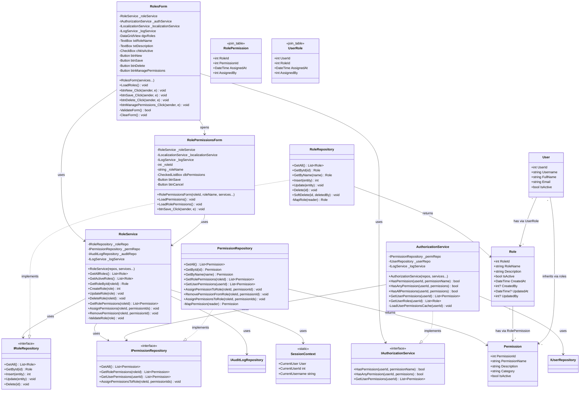

# Role & Permissions Management Process - Class Diagram

## UML Class Diagram (Mermaid Format)



## Layer Communication Flow

```
┌─────────────────────┐
│    UI LAYER         │  RolesForm
│                     │  RolePermissionsForm
└──────────┬──────────┘
           │ uses
           ▼
┌─────────────────────┐
│   BLL LAYER         │  RoleService
└──────────┬──────────┘
           │ calls
           ├──────────────────────┐
           ▼                      ▼
┌─────────────────────┐  ┌─────────────────────┐
│   DAO LAYER         │  │    SERVICES         │
│                     │  │     LAYER           │
│ RoleRepository      │  │ AuthorizationService│
│ PermissionRepository│  │ LogService          │
│ AuditLogRepository  │  │ SessionContext      │
└──────────┬──────────┘  └─────────────────────┘
           │ returns
           ▼
┌─────────────────────┐
│  DOMAIN LAYER       │  Role
│                     │  Permission
│                     │  User
│                     │  RolePermission (join)
│                     │  UserRole (join)
└─────────────────────┘
```

## Permission Categories

### User Management
- **VIEW_USERS**: View user list
- **CREATE_USERS**: Create new users
- **EDIT_USERS**: Modify user information
- **DELETE_USERS**: Delete/deactivate users
- **ASSIGN_ROLES**: Assign roles to users

### Role Management
- **VIEW_ROLES**: View role list
- **CREATE_ROLES**: Create new roles
- **EDIT_ROLES**: Modify role information
- **DELETE_ROLES**: Delete/deactivate roles
- **MANAGE_PERMISSIONS**: Assign permissions to roles

### Sales Management
- **VIEW_SALES**: View sales list
- **CREATE_SALES**: Create new sales
- **EDIT_SALES**: Modify sales
- **DELETE_SALES**: Delete sales

### Product Management
- **VIEW_PRODUCTS**: View product list
- **CREATE_PRODUCTS**: Add new products
- **EDIT_PRODUCTS**: Modify products
- **DELETE_PRODUCTS**: Delete products

### Stock Management
- **VIEW_STOCK**: View stock levels
- **CREATE_STOCK_MOVEMENTS**: Create inventory movements
- **VIEW_STOCK_MOVEMENTS**: View movement history
- **ADJUST_STOCK**: Perform stock adjustments

### Warehouse Management
- **VIEW_WAREHOUSES**: View warehouse list
- **CREATE_WAREHOUSES**: Add new warehouses
- **EDIT_WAREHOUSES**: Modify warehouses
- **DELETE_WAREHOUSES**: Delete warehouses

### Client Management
- **VIEW_CLIENTS**: View client list
- **CREATE_CLIENTS**: Add new clients
- **EDIT_CLIENTS**: Modify client information
- **DELETE_CLIENTS**: Delete clients

### Reports
- **VIEW_REPORTS_GENERAL**: View basic sales reports
- **VIEW_REPORTS_CLIENTS**: View client-related reports
- **VIEW_REPORTS_ADVANCED**: View advanced analytics
- **VIEW_REPORTS_INVENTORY**: View inventory reports

### System Administration
- **VIEW_AUDIT_LOG**: View system audit logs
- **MANAGE_SYSTEM_SETTINGS**: Modify system configuration
- **VIEW_USER_MANUAL**: Access user documentation

## Role-Based Access Control (RBAC) Model

### Hierarchy
```
User → Assigned Roles → Role Permissions → Permission Checks
```

### Default Roles

1. **Administrator**
   - All permissions
   - Full system access
   - Can manage all users and roles

2. **Manager**
   - View and create: Sales, Products, Clients
   - View reports (general and advanced)
   - View stock and movements
   - Cannot manage users or roles

3. **Sales Representative**
   - View and create: Sales, Clients
   - View products and stock (read-only)
   - View basic reports
   - Cannot edit products or manage stock

4. **Warehouse Operator**
   - View and create: Stock movements
   - View products and warehouses
   - View inventory reports
   - Cannot access sales or clients

5. **Auditor**
   - Read-only access to all data
   - View all reports
   - View audit logs
   - Cannot create, edit, or delete anything

## Key Operations

### Create Role Flow
1. UI validates role name and description
2. RoleService checks for duplicate role name
3. Create role in database
4. Log audit entry
5. Refresh role list

### Assign Permissions Flow
1. Open RolePermissionsForm with roleId
2. Load all available permissions (grouped by category)
3. Load current role permissions (check assigned)
4. User selects/deselects permissions
5. Save changes in transaction
6. Log audit entry
7. Clear permission cache for users with this role

### Permission Check Flow
1. Application component requests permission check
2. AuthorizationService retrieves user's roles from cache/database
3. For each role, retrieve permissions
4. Check if requested permission exists in user's permission set
5. Return true/false
6. Cache result for performance

## Security Features

1. **Least Privilege**: Users granted minimum permissions needed
2. **Role Hierarchy**: Organize permissions logically
3. **Audit Trail**: All role/permission changes logged
4. **Cache Invalidation**: Permission changes reflected immediately
5. **Soft Delete**: Roles deactivated, not deleted (preserves history)
6. **Transaction Safety**: Permission assignments atomic
