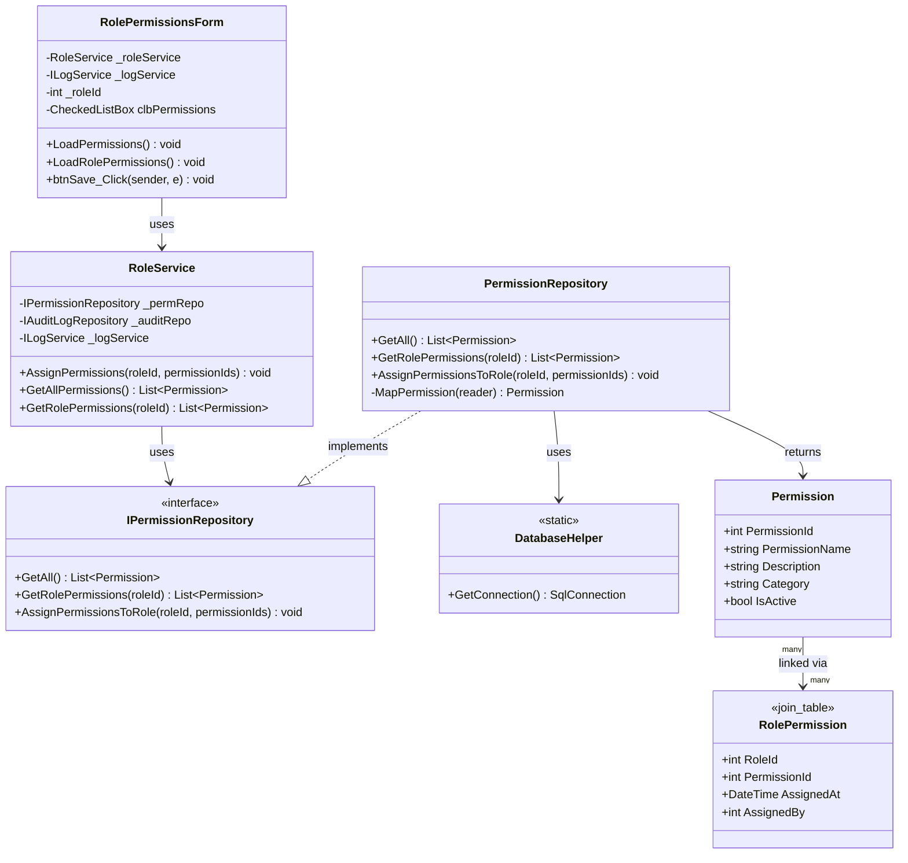
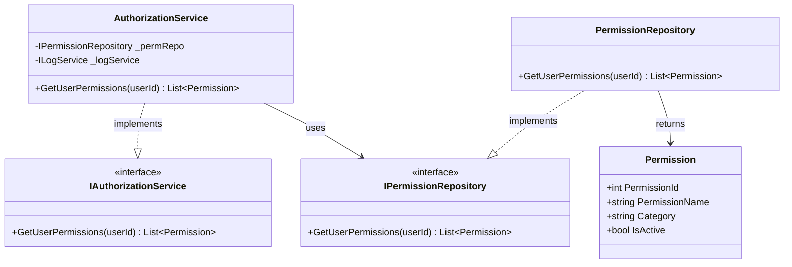
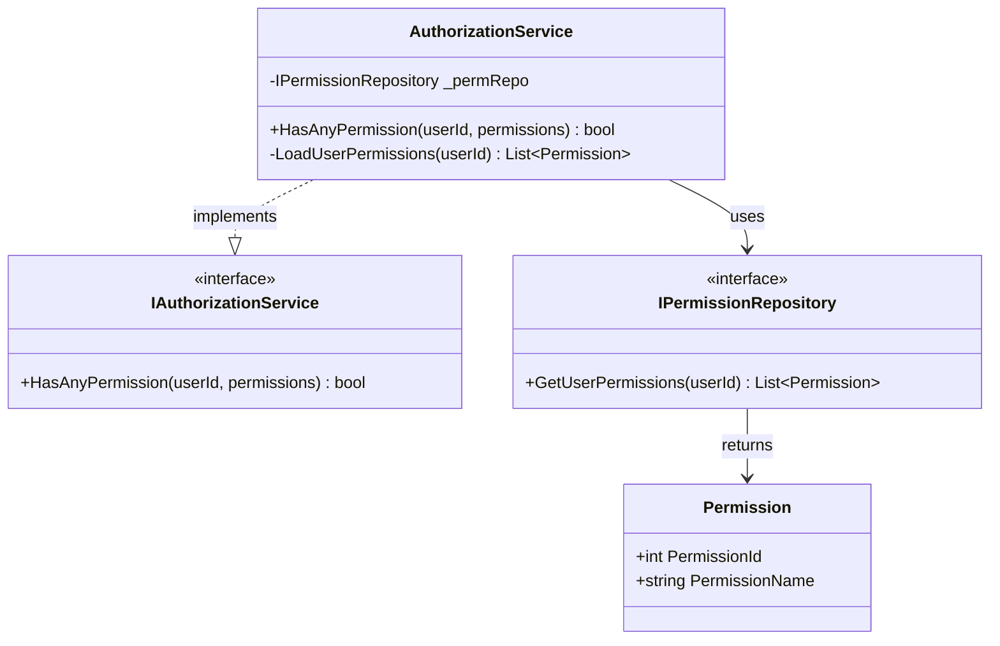
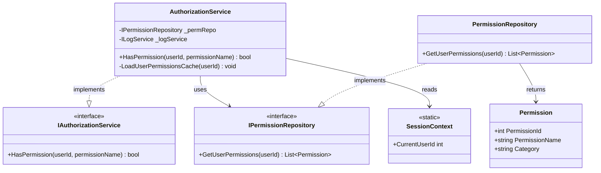

# Role & Permissions Management Process - Class Diagrams (Per Use Case)

This document contains UML Class Diagrams organized per use case for all Role and Permission operations.

---

## UC-01: CreateRole


---

## UC-02: DeleteRole


---

## UC-03: AssignPermissions



---

## UC-04: GetActiveRoles


---

## UC-05: GetAllPermissions


---

## UC-06: GetAllRoles


---

## UC-07: GetRoleById


---

## UC-08: GetRolePermissions


---

## UC-09: UpdateRole


---

## UC-10: GetUserPermissions



---

## UC-11: HasAllPermissions


---

## UC-12: HasAnyPermission



---

## UC-13: HasPermission



---

## Layer Communication Flow

```
┌─────────────────────┐
│    UI LAYER         │  RolesForm / RolePermissionsForm
└──────────┬──────────┘
           │ uses
           ▼
┌─────────────────────┐
│   BLL LAYER         │  RoleService
└──────────┬──────────┘
           │ calls
           ├──────────────────────┐
           ▼                      ▼
┌─────────────────────┐  ┌─────────────────────┐
│   DAO LAYER         │  │    SERVICES         │
│ RoleRepository      │  │ AuthorizationService│
│ PermissionRepository│  │ LogService          │
│ AuditLogRepository  │  │ SessionContext      │
└─────────────────────┘  └─────────────────────┘
```

## RBAC Model

```
User → UserRoles → Role → RolePermissions → Permission
```
        -RoleService _roleService
        -IAuthorizationService _authService
        -ILocalizationService _localizationService
        -ILogService _logService
        -DataGridView dgvRoles
        -TextBox txtRoleName
        -TextBox txtDescription
        -CheckBox chkIsActive
        -Button btnNew
        -Button btnSave
        -Button btnDelete
        -Button btnManagePermissions
        +RolesForm(services...)
        +LoadRoles() void
        +btnNew_Click(sender, e) void
        +btnSave_Click(sender, e) void
        +btnDelete_Click(sender, e) void
        +btnManagePermissions_Click(sender, e) void
        -ValidateForm() bool
        -ClearForm() void
    }

    class RolePermissionsForm {
        -RoleService _roleService
        -ILocalizationService _localizationService
        -ILogService _logService
        -int _roleId
        -string _roleName
        -CheckedListBox clbPermissions
        -Button btnSave
        -Button btnCancel
        +RolePermissionsForm(roleId, roleName, services...)
        +LoadPermissions() void
        +LoadRolePermissions() void
        +btnSave_Click(sender, e) void
    }

    %% BLL Layer
    class RoleService {
        -IRoleRepository _roleRepo
        -IPermissionRepository _permRepo
        -IAuditLogRepository _auditRepo
        -ILogService _logService
        +RoleService(repos, services...)
        +GetAllRoles() List~Role~
        +GetActiveRoles() List~Role~
        +GetRoleById(roleId) Role
        +CreateRole(role) int
        +UpdateRole(role) void
        +DeleteRole(roleId) void
        +GetRolePermissions(roleId) List~Permission~
        +AssignPermissions(roleId, permissionIds) void
        +RemovePermission(roleId, permissionId) void
        -ValidateRole(role) void
    }

    %% Services Layer
    class AuthorizationService {
        -IPermissionRepository _permRepo
        -IUserRepository _userRepo
        -ILogService _logService
        +AuthorizationService(repos, services...)
        +HasPermission(userId, permissionName) bool
        +HasAnyPermission(userId, permissions) bool
        +HasAllPermissions(userId, permissions) bool
        +GetUserPermissions(userId) List~Permission~
        +GetUserRoles(userId) List~Role~
        -LoadUserPermissionsCache(userId) void
    }

    class IAuthorizationService {
        <<interface>>
        +HasPermission(userId, permissionName) bool
        +HasAnyPermission(userId, permissions) bool
        +GetUserPermissions(userId) List~Permission~
    }

    class SessionContext {
        <<static>>
        +CurrentUser User
        +CurrentUserId int
        +CurrentUsername string
    }

    %% DAO Layer
    class RoleRepository {
        +GetAll() List~Role~
        +GetById(id) Role
        +GetByName(name) Role
        +Insert(entity) int
        +Update(entity) void
        +Delete(id) void
        +SoftDelete(id, deletedBy) void
        -MapRole(reader) Role
    }

    class IRoleRepository {
        <<interface>>
        +GetAll() List~Role~
        +GetById(id) Role
        +Insert(entity) int
        +Update(entity) void
        +Delete(id) void
    }

    class PermissionRepository {
        +GetAll() List~Permission~
        +GetById(id) Permission
        +GetByName(name) Permission
        +GetRolePermissions(roleId) List~Permission~
        +GetUserPermissions(userId) List~Permission~
        +AssignPermissionToRole(roleId, permissionId) void
        +RemovePermissionFromRole(roleId, permissionId) void
        +AssignPermissionsToRole(roleId, permissionIds) void
        -MapPermission(reader) Permission
    }

    class IPermissionRepository {
        <<interface>>
        +GetAll() List~Permission~
        +GetRolePermissions(roleId) List~Permission~
        +GetUserPermissions(userId) List~Permission~
        +AssignPermissionsToRole(roleId, permissionIds) void
    }

    %% Domain Layer
    class Role {
        +int RoleId
        +string RoleName
        +string Description
        +bool IsActive
        +DateTime CreatedAt
        +int? CreatedBy
        +DateTime? UpdatedAt
        +int? UpdatedBy
    }

    class Permission {
        +int PermissionId
        +string PermissionName
        +string Description
        +string Category
        +bool IsActive
    }

    class User {
        +int UserId
        +string Username
        +string FullName
        +string Email
        +bool IsActive
    }

    class RolePermission {
        <<join_table>>
        +int RoleId
        +int PermissionId
        +DateTime AssignedAt
        +int AssignedBy
    }

    class UserRole {
        <<join_table>>
        +int UserId
        +int RoleId
        +DateTime AssignedAt
        +int AssignedBy
    }

    %% Relationships
    RolesForm --> RoleService : uses
    RolesForm --> IAuthorizationService : uses
    RolesForm --> RolePermissionsForm : opens
    
    RolePermissionsForm --> RoleService : uses
    
    RoleService --> IRoleRepository : uses
    RoleService --> IPermissionRepository : uses
    RoleService --> IAuditLogRepository : uses
    RoleService --> SessionContext : uses
    
    AuthorizationService ..|> IAuthorizationService : implements
    AuthorizationService --> IPermissionRepository : uses
    AuthorizationService --> IUserRepository : uses
    
    RoleRepository ..|> IRoleRepository : implements
    PermissionRepository ..|> IPermissionRepository : implements
    
    RoleRepository --> Role : returns
    PermissionRepository --> Permission : returns
    
    Role "*" --> "*" Permission : has via RolePermission
    User "*" --> "*" Role : has via UserRole
    User "*" --> "*" Permission : inherits via roles
```

## Layer Communication Flow

```
┌─────────────────────┐
│    UI LAYER         │  RolesForm
│                     │  RolePermissionsForm
└──────────┬──────────┘
           │ uses
           ▼
┌─────────────────────┐
│   BLL LAYER         │  RoleService
└──────────┬──────────┘
           │ calls
           ├──────────────────────┐
           ▼                      ▼
┌─────────────────────┐  ┌─────────────────────┐
│   DAO LAYER         │  │    SERVICES         │
│                     │  │     LAYER           │
│ RoleRepository      │  │ AuthorizationService│
│ PermissionRepository│  │ LogService          │
│ AuditLogRepository  │  │ SessionContext      │
└──────────┬──────────┘  └─────────────────────┘
           │ returns
           ▼
┌─────────────────────┐
│  DOMAIN LAYER       │  Role
│                     │  Permission
│                     │  User
│                     │  RolePermission (join)
│                     │  UserRole (join)
└─────────────────────┘
```

## Permission Categories

### User Management
- **VIEW_USERS**: View user list
- **CREATE_USERS**: Create new users
- **EDIT_USERS**: Modify user information
- **DELETE_USERS**: Delete/deactivate users
- **ASSIGN_ROLES**: Assign roles to users

### Role Management
- **VIEW_ROLES**: View role list
- **CREATE_ROLES**: Create new roles
- **EDIT_ROLES**: Modify role information
- **DELETE_ROLES**: Delete/deactivate roles
- **MANAGE_PERMISSIONS**: Assign permissions to roles

### Sales Management
- **VIEW_SALES**: View sales list
- **CREATE_SALES**: Create new sales
- **EDIT_SALES**: Modify sales
- **DELETE_SALES**: Delete sales

### Product Management
- **VIEW_PRODUCTS**: View product list
- **CREATE_PRODUCTS**: Add new products
- **EDIT_PRODUCTS**: Modify products
- **DELETE_PRODUCTS**: Delete products

### Stock Management
- **VIEW_STOCK**: View stock levels
- **CREATE_STOCK_MOVEMENTS**: Create inventory movements
- **VIEW_STOCK_MOVEMENTS**: View movement history
- **ADJUST_STOCK**: Perform stock adjustments

### Warehouse Management
- **VIEW_WAREHOUSES**: View warehouse list
- **CREATE_WAREHOUSES**: Add new warehouses
- **EDIT_WAREHOUSES**: Modify warehouses
- **DELETE_WAREHOUSES**: Delete warehouses

### Client Management
- **VIEW_CLIENTS**: View client list
- **CREATE_CLIENTS**: Add new clients
- **EDIT_CLIENTS**: Modify client information
- **DELETE_CLIENTS**: Delete clients

### Reports
- **VIEW_REPORTS_GENERAL**: View basic sales reports
- **VIEW_REPORTS_CLIENTS**: View client-related reports
- **VIEW_REPORTS_ADVANCED**: View advanced analytics
- **VIEW_REPORTS_INVENTORY**: View inventory reports

### System Administration
- **VIEW_AUDIT_LOG**: View system audit logs
- **MANAGE_SYSTEM_SETTINGS**: Modify system configuration
- **VIEW_USER_MANUAL**: Access user documentation

## Role-Based Access Control (RBAC) Model

### Hierarchy
```
User → Assigned Roles → Role Permissions → Permission Checks
```

### Default Roles

1. **Administrator**
   - All permissions
   - Full system access
   - Can manage all users and roles

2. **Manager**
   - View and create: Sales, Products, Clients
   - View reports (general and advanced)
   - View stock and movements
   - Cannot manage users or roles

3. **Sales Representative**
   - View and create: Sales, Clients
   - View products and stock (read-only)
   - View basic reports
   - Cannot edit products or manage stock

4. **Warehouse Operator**
   - View and create: Stock movements
   - View products and warehouses
   - View inventory reports
   - Cannot access sales or clients

5. **Auditor**
   - Read-only access to all data
   - View all reports
   - View audit logs
   - Cannot create, edit, or delete anything

## Key Operations

### Create Role Flow
1. UI validates role name and description
2. RoleService checks for duplicate role name
3. Create role in database
4. Log audit entry
5. Refresh role list

### Assign Permissions Flow
1. Open RolePermissionsForm with roleId
2. Load all available permissions (grouped by category)
3. Load current role permissions (check assigned)
4. User selects/deselects permissions
5. Save changes in transaction
6. Log audit entry
7. Clear permission cache for users with this role

### Permission Check Flow
1. Application component requests permission check
2. AuthorizationService retrieves user's roles from cache/database
3. For each role, retrieve permissions
4. Check if requested permission exists in user's permission set
5. Return true/false
6. Cache result for performance

## Security Features

1. **Least Privilege**: Users granted minimum permissions needed
2. **Role Hierarchy**: Organize permissions logically
3. **Audit Trail**: All role/permission changes logged
4. **Cache Invalidation**: Permission changes reflected immediately
5. **Soft Delete**: Roles deactivated, not deleted (preserves history)
6. **Transaction Safety**: Permission assignments atomic
