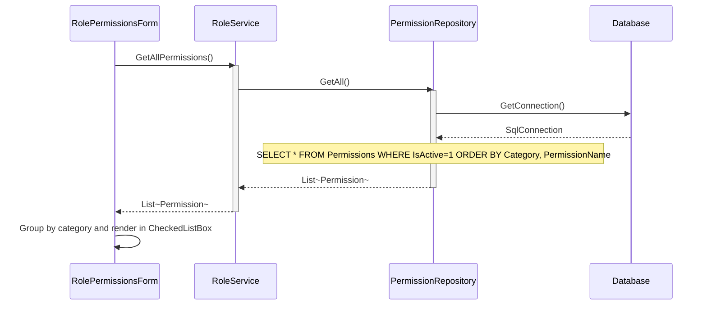
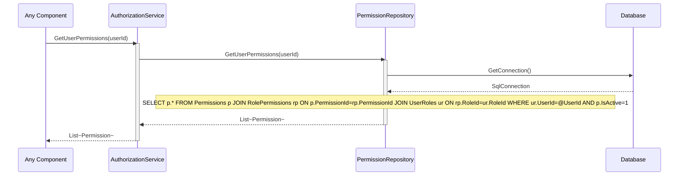
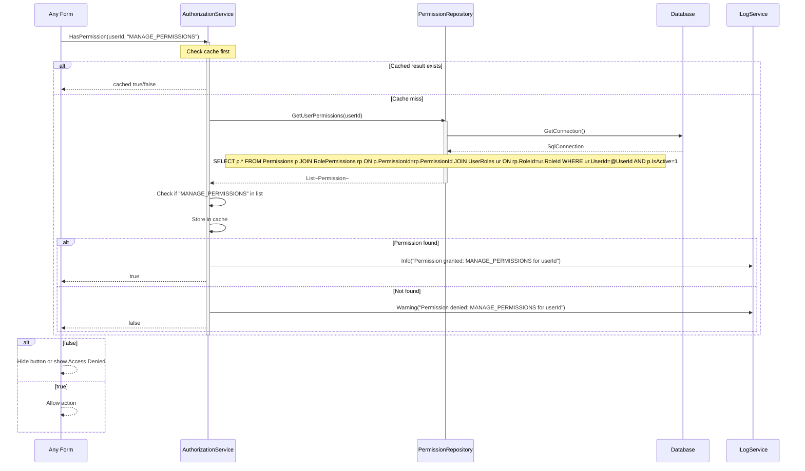

# Role & Permissions Management Process - Sequence Diagrams (Per Use Case)

This document contains UML Sequence Diagrams organized per use case for all Role and Permission operations.

---

## UC-01: CreateRole


---

## UC-02: DeleteRole


---

## UC-03: AssignPermissions

```mermaid
sequenceDiagram
    participant Admin as Administrator
    participant RolesUI as RolesForm
    participant PermUI as RolePermissionsForm
    participant BLL as RoleService
    participant PermRepo as PermissionRepository
    participant AuditRepo as AuditLogRepository
    participant DB as Database
    participant Session as SessionContext

    Admin->>RolesUI: Select role, click "Manage Permissions"
    activate RolesUI
    RolesUI->>PermUI: Open RolePermissionsForm(roleId, roleName)
    activate PermUI
    PermUI->>BLL: GetAllPermissions()
    BLL->>PermRepo: GetAll()
    PermRepo->>DB: SELECT * FROM Permissions WHERE IsActive=1 ORDER BY Category, PermissionName
    DB-->>PermRepo: ResultSet
    PermRepo-->>BLL: List~Permission~
    BLL-->>PermUI: List~Permission~
    PermUI->>BLL: GetRolePermissions(roleId)
    BLL->>PermRepo: GetRolePermissions(roleId)
    PermRepo->>DB: SELECT p.* FROM Permissions p JOIN RolePermissions rp ON p.PermissionId=rp.PermissionId WHERE rp.RoleId=@RoleId
    DB-->>PermRepo: ResultSet
    PermRepo-->>BLL: List~Permission~ (currently assigned)
    BLL-->>PermUI: List~Permission~
    PermUI-->>Admin: Display CheckedListBox with all permissions; current ones checked
    deactivate RolesUI

    Admin->>PermUI: Check/uncheck permissions, click "Save"
    PermUI->>BLL: AssignPermissions(roleId, selectedPermissionIds)
    activate BLL
    BLL->>Session: Get CurrentUserId
    Session-->>BLL: userId
    BLL->>PermRepo: GetRolePermissions(roleId)
    PermRepo-->>BLL: old permissions (for audit)
    BLL->>PermRepo: AssignPermissionsToRole(roleId, selectedPermissionIds)
    activate PermRepo
    PermRepo->>DB: BEGIN TRANSACTION
    Note over PermRepo: DELETE FROM RolePermissions WHERE RoleId=@RoleId
    loop For each selectedPermissionId
        Note over PermRepo: INSERT INTO RolePermissions (RoleId, PermissionId, AssignedAt, AssignedBy) VALUES (...)
    end
    PermRepo->>DB: COMMIT
    PermRepo-->>BLL: void
    deactivate PermRepo
    BLL->>AuditRepo: LogChange("RolePermissions", roleId, Update, oldPerms, newPerms, description, userId)
    AuditRepo->>DB: INSERT INTO AuditLog (...)
    DB-->>AuditRepo: Success
    BLL-->>PermUI: void
    deactivate BLL
    PermUI-->>Admin: Show "Permissions saved successfully"
    PermUI->>PermUI: Close dialog
    deactivate PermUI
```

---

## UC-04: GetActiveRoles


---

## UC-05: GetAllPermissions



---

## UC-06: GetAllRoles


---

## UC-07: GetRoleById


---

## UC-08: GetRolePermissions


---

## UC-09: UpdateRole


---

## UC-10: GetUserPermissions



---

## UC-11: HasAllPermissions


---

## UC-12: HasAnyPermission


---

## UC-13: HasPermission



---

## Permission Resolution Flow

```
User → UserRoles (table) → Role → RolePermissions (table) → Permission
     ↑
     HasPermission / HasAnyPermission / HasAllPermissions
     (Cache → DB if miss → return result)
```

## Business Rules Summary

| Use Case | Key Business Rules |
|----------|-------------------|
| CreateRole | Role name must be unique |
| DeleteRole | Soft-delete only (IsActive=0) |
| AssignPermissions | Atomic: delete all existing, then insert selected ones |
| HasPermission | Uses cache; cache invalidated when role permissions change |
| HasAllPermissions | Returns false if ANY required permission is missing |
| HasAnyPermission | Returns true if AT LEAST ONE permission is present |

```mermaid
sequenceDiagram
    participant User as Administrator
    participant RolesUI as RolesForm<br/>(UI Layer)
    participant PermUI as RolePermissionsForm<br/>(UI Layer)
    participant Auth as AuthorizationService<br/>(Services)
    participant BLL as RoleService<br/>(BLL)
    participant RoleRepo as RoleRepository<br/>(DAO)
    participant PermRepo as PermissionRepository<br/>(DAO)
    participant AuditRepo as AuditLogRepository<br/>(DAO)
    participant DB as Database
    participant Session as SessionContext
    participant Log as ILogService

    %% Load Roles Form
    User->>RolesUI: Open Roles Form
    activate RolesUI
    
    %% Check permission to manage roles
    RolesUI->>Auth: HasPermission(userId, "VIEW_ROLES")
    activate Auth
    Auth->>Session: Get CurrentUserId
    activate Session
    Session-->>Auth: userId
    deactivate Session
    Auth->>PermRepo: GetUserPermissions(userId)
    activate PermRepo
    PermRepo->>DB: SELECT p.* FROM Permissions p<br/>INNER JOIN RolePermissions rp ON...<br/>INNER JOIN UserRoles ur ON...<br/>WHERE ur.UserId = @UserId
    activate DB
    DB-->>PermRepo: ResultSet
    deactivate DB
    PermRepo-->>Auth: List<Permission>
    deactivate PermRepo
    Auth->>Auth: Check if "VIEW_ROLES" in permissions
    Auth-->>RolesUI: true/false
    deactivate Auth
    
    alt No permission
        RolesUI-->>User: Show "Access Denied" message
    else Has permission
        RolesUI->>BLL: GetAllRoles()
        activate BLL
        BLL->>RoleRepo: GetAll()
        activate RoleRepo
        RoleRepo->>DB: SELECT * FROM Roles ORDER BY RoleName
        activate DB
        DB-->>RoleRepo: ResultSet
        deactivate DB
        RoleRepo-->>BLL: List<Role>
        deactivate RoleRepo
        BLL-->>RolesUI: List<Role>
        deactivate BLL
        
        RolesUI-->>User: Display roles in grid
    end
    deactivate RolesUI

    %% Select Role and Manage Permissions
    User->>RolesUI: Select "Sales Representative" role
    activate RolesUI
    User->>RolesUI: Click "Manage Permissions" button
    
    %% Check permission to manage permissions
    RolesUI->>Auth: HasPermission(userId, "MANAGE_PERMISSIONS")
    activate Auth
    Auth-->>RolesUI: true/false
    deactivate Auth
    
    alt No permission
        RolesUI-->>User: Show "Access Denied" message
    else Has permission
        RolesUI->>PermUI: new RolePermissionsForm(roleId, roleName, services)
        activate PermUI
        
        %% Load all available permissions
        PermUI->>BLL: GetAllPermissions()
        activate BLL
        BLL->>PermRepo: GetAll()
        activate PermRepo
        PermRepo->>DB: SELECT * FROM Permissions<br/>WHERE IsActive = 1<br/>ORDER BY Category, PermissionName
        activate DB
        DB-->>PermRepo: ResultSet
        deactivate DB
        PermRepo->>PermRepo: MapPermission(reader) for each row
        PermRepo-->>BLL: List<Permission>
        deactivate PermRepo
        BLL-->>PermUI: List<Permission>
        deactivate BLL
        
        Note over PermUI: Group permissions by category:<br/>- User Management<br/>- Role Management<br/>- Sales Management<br/>- Product Management<br/>- Stock Management<br/>- Reports<br/>etc.
        
        %% Load current role permissions
        PermUI->>BLL: GetRolePermissions(roleId)
        activate BLL
        BLL->>PermRepo: GetRolePermissions(roleId)
        activate PermRepo
        PermRepo->>DB: SELECT p.* FROM Permissions p<br/>INNER JOIN RolePermissions rp<br/>  ON p.PermissionId = rp.PermissionId<br/>WHERE rp.RoleId = @RoleId<br/>  AND p.IsActive = 1
        activate DB
        DB-->>PermRepo: ResultSet
        deactivate DB
        PermRepo-->>BLL: List<Permission>
        deactivate PermRepo
        BLL-->>PermUI: List<Permission>
        deactivate BLL
        
        Note over PermUI: Display CheckedListBox:<br/>- All permissions listed<br/>- Current permissions checked<br/>- Grouped by category
        
        PermUI-->>User: Display permission selection dialog
        deactivate PermUI
    end
    deactivate RolesUI

    %% User Modifies Permissions
    User->>PermUI: Check "CREATE_SALES"
    activate PermUI
    User->>PermUI: Check "EDIT_SALES"
    User->>PermUI: Check "VIEW_PRODUCTS"
    User->>PermUI: Check "VIEW_CLIENTS"
    User->>PermUI: Uncheck "DELETE_SALES" (was previously checked)
    deactivate PermUI

    %% Save Permission Changes
    User->>PermUI: Click "Save" button
    activate PermUI
    
    PermUI->>PermUI: Get selected permission IDs from CheckedListBox
    Note over PermUI: selectedPermissionIds = [2, 3, 8, 15, ...]
    
    PermUI->>BLL: AssignPermissions(roleId, selectedPermissionIds)
    activate BLL
    
    %% Get current user for audit
    BLL->>Session: Get CurrentUserId
    activate Session
    Session-->>BLL: currentUserId
    deactivate Session
    
    %% Get old permissions for audit comparison
    BLL->>PermRepo: GetRolePermissions(roleId)
    activate PermRepo
    PermRepo->>DB: SELECT...
    activate DB
    DB-->>PermRepo: ResultSet (old permissions)
    deactivate DB
    PermRepo-->>BLL: List<Permission> (old)
    deactivate PermRepo
    
    Note over BLL: Compare old and new permissions:<br/>- Determine added permissions<br/>- Determine removed permissions
    
    %% Execute permission assignment (Transaction)
    BLL->>PermRepo: AssignPermissionsToRole(roleId, selectedPermissionIds)
    activate PermRepo
    PermRepo->>DB: BEGIN TRANSACTION
    activate DB
    
    %% Delete all existing permissions for this role
    Note over PermRepo: DELETE FROM RolePermissions<br/>WHERE RoleId = @RoleId
    PermRepo->>DB: ExecuteNonQuery()
    DB-->>PermRepo: Success
    
    %% Insert new permissions
    loop For each permissionId in selectedPermissionIds
        Note over PermRepo: INSERT INTO RolePermissions<br/>(RoleId, PermissionId, AssignedAt, AssignedBy)<br/>VALUES (@RoleId, @PermissionId, @AssignedAt, @AssignedBy)
        PermRepo->>DB: ExecuteNonQuery()
        DB-->>PermRepo: Success
    end
    
    PermRepo->>DB: COMMIT TRANSACTION
    deactivate DB
    PermRepo-->>BLL: Success
    deactivate PermRepo
    
    %% Log audit
    BLL->>AuditRepo: LogChange("RolePermissions", roleId, Update, oldPermissions, newPermissions, description, currentUserId)
    activate AuditRepo
    Note over AuditRepo: Description:<br/>"Updated permissions for role 'Sales Representative'<br/>Added: CREATE_SALES, EDIT_SALES, VIEW_PRODUCTS<br/>Removed: DELETE_SALES"
    AuditRepo->>DB: INSERT INTO AuditLog<br/>(TableName, RecordId, Action,<br/>OldValue, NewValue, Description,<br/>ChangeDate, ChangedBy)<br/>VALUES (...)
    activate DB
    DB-->>AuditRepo: Success
    deactivate DB
    deactivate AuditRepo
    
    %% Log info
    BLL->>Log: Info($"Permissions updated for role {roleName} by {currentUsername}")
    activate Log
    deactivate Log
    
    %% Clear permission cache for affected users
    Note over BLL: Invalidate permission cache<br/>for all users with this role
    BLL->>Auth: InvalidatePermissionCacheForRole(roleId)
    activate Auth
    Note over Auth: Clear cached permissions<br/>for users with this role<br/>(they will reload on next check)
    deactivate Auth
    
    BLL-->>PermUI: Success
    deactivate BLL
    
    PermUI->>Log: Info("Permissions saved successfully")
    activate Log
    deactivate Log
    
    PermUI-->>User: Show "Permissions saved successfully" message
    PermUI->>PermUI: Close dialog
    deactivate PermUI

    %% Refresh Roles Form
    RolesUI->>BLL: GetAllRoles()
    activate RolesUI
    activate BLL
    BLL->>RoleRepo: GetAll()
    activate RoleRepo
    RoleRepo->>DB: SELECT...
    activate DB
    DB-->>RoleRepo: ResultSet
    deactivate DB
    RoleRepo-->>BLL: List<Role>
    deactivate RoleRepo
    BLL-->>RolesUI: List<Role>
    deactivate BLL
    RolesUI-->>User: Refresh roles grid
    deactivate RolesUI

    %% Permission Check by Another User (Real-time Effect)
    Note over User: Later, a Sales Representative user<br/>attempts to create a sale...
    
    participant SalesUser as Sales Rep User
    participant SalesUI as SalesForm
    
    SalesUser->>SalesUI: Attempt to create sale
    activate SalesUI
    SalesUI->>Auth: HasPermission(salesUserId, "CREATE_SALES")
    activate Auth
    
    Note over Auth: Permission cache was invalidated,<br/>so reload from database
    Auth->>PermRepo: GetUserPermissions(salesUserId)
    activate PermRepo
    PermRepo->>DB: SELECT p.* FROM Permissions p<br/>INNER JOIN RolePermissions rp ON...<br/>INNER JOIN UserRoles ur ON...<br/>WHERE ur.UserId = @UserId
    activate DB
    DB-->>PermRepo: ResultSet (includes CREATE_SALES)
    deactivate DB
    PermRepo-->>Auth: List<Permission>
    deactivate PermRepo
    
    Auth->>Auth: Check if "CREATE_SALES" in permissions
    Note over Auth: Found! Permission granted.
    Auth-->>SalesUI: true
    deactivate Auth
    
    SalesUI-->>SalesUser: Allow sale creation
    deactivate SalesUI
```



## Sequence Flow Description

### Phase 1: Authorization & Load Roles
1. Administrator opens Roles Form
2. System checks if user has "VIEW_ROLES" permission
3. AuthorizationService retrieves user's permissions via role associations
4. If authorized, load all roles from database
5. Display roles in grid

### Phase 2: Select Role & Open Permissions Dialog
6. Administrator selects "Sales Representative" role
7. Clicks "Manage Permissions" button
8. System checks "MANAGE_PERMISSIONS" permission
9. If authorized, open RolePermissionsForm dialog

### Phase 3: Load Available Permissions
10. RolePermissionsForm requests all available permissions
11. PermissionRepository retrieves active permissions from database
12. Permissions ordered by category and name
13. Group permissions by category for display

### Phase 4: Load Current Role Permissions
14. Request current permissions assigned to selected role
15. PermissionRepository joins RolePermissions table
16. Returns list of currently assigned permissions
17. Display all permissions with current ones checked

### Phase 5: User Modifies Permissions
18. Administrator checks new permissions:
    - CREATE_SALES
    - EDIT_SALES
    - VIEW_PRODUCTS
    - VIEW_CLIENTS
19. Unchecks removed permission:
    - DELETE_SALES

### Phase 6: Save Changes (Transaction)
20. User clicks "Save"
21. Form collects all selected permission IDs
22. Calls RoleService.AssignPermissions()
23. Service retrieves current user ID from SessionContext
24. Service loads old permissions for audit comparison

### Phase 7: Database Transaction
25. Begin database transaction
26. Delete all existing RolePermissions for this role
27. Insert new RolePermissions for each selected permission
28. Set AssignedAt = now, AssignedBy = current user
29. Commit transaction (atomic operation)

### Phase 8: Audit Logging
30. Log change to AuditLog table
31. Include old and new permission sets
32. Describe added and removed permissions
33. Record who made the change and when

### Phase 9: Cache Invalidation
34. Clear permission cache for all users with this role
35. Ensures permission changes take effect immediately
36. Next permission check will reload from database

### Phase 10: Completion
37. Display success message to administrator
38. Close permissions dialog
39. Refresh roles grid
40. Log success message

### Phase 11: Real-Time Effect
41. Sales Representative user later attempts to create a sale
42. SalesForm checks "CREATE_SALES" permission
43. AuthorizationService cache is invalid, reloads from database
44. New permissions include "CREATE_SALES"
45. Permission granted, user can proceed

## Permission Resolution Flow

```
User Attempts Action
    ↓
Check Required Permission
    ↓
Is Permission Cached?
    ├─ Yes → Check Cache
    └─ No → Load from Database
        ↓
    Get User's Roles (UserRoles table)
        ↓
    Get Permissions for Each Role (RolePermissions table)
        ↓
    Aggregate All Permissions
        ↓
    Cache for Performance
        ↓
    Check if Required Permission Exists
        ↓
    Return true/false
```

## Security & Performance Features

1. **Transaction Safety**: All permission changes in single transaction
2. **Audit Trail**: Complete history of permission changes
3. **Cache Invalidation**: Changes take effect immediately
4. **Permission Caching**: Improves performance for frequent checks
5. **Least Privilege**: Only grant necessary permissions
6. **Hierarchical Organization**: Permissions grouped by category
7. **Soft Delete**: Permissions can be deactivated, not deleted
8. **User Context**: All changes tracked with user information

## Business Rules

1. **Atomic Operations**: Permission assignment is all-or-nothing
2. **No Partial States**: Transaction ensures consistency
3. **Immediate Effect**: Cache invalidation ensures real-time updates
4. **Audit Requirement**: All changes must be logged
5. **Active Check**: Only active permissions can be assigned
6. **Role Association**: Permissions assigned to roles, not directly to users
7. **Multiple Roles**: Users can have multiple roles, inheriting all permissions
