# Products - Use Case Diagrams

This document contains UML Class Diagrams and Sequence Diagrams for all Product-related use cases.

---

## UC-01: CreateProduct

### Class Diagram

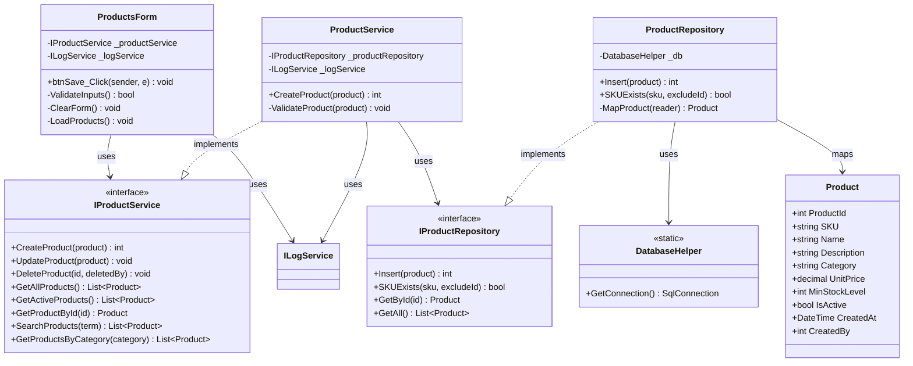

### Sequence Diagram

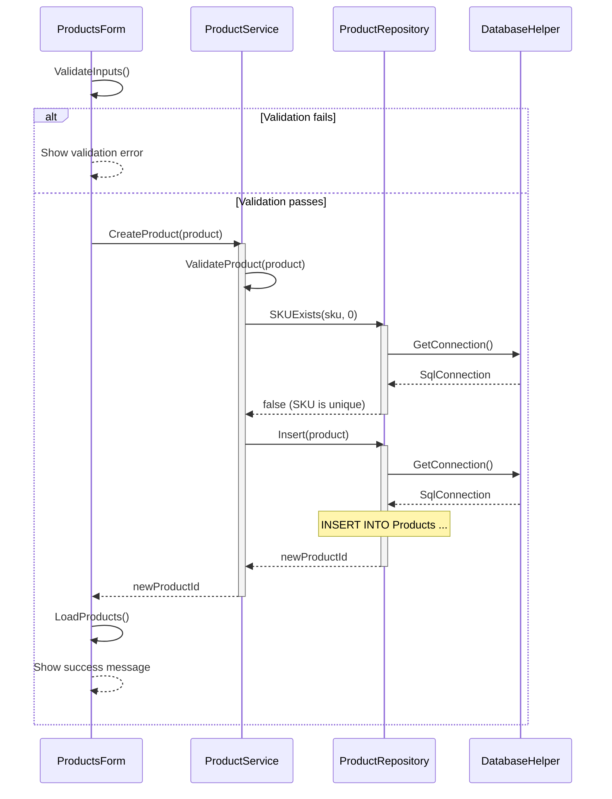

---

## UC-02: DeleteProduct

### Class Diagram

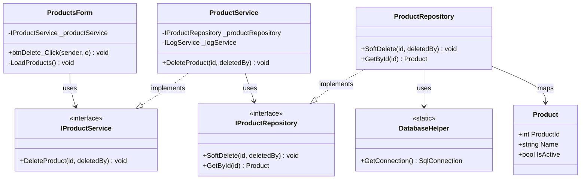

### Sequence Diagram

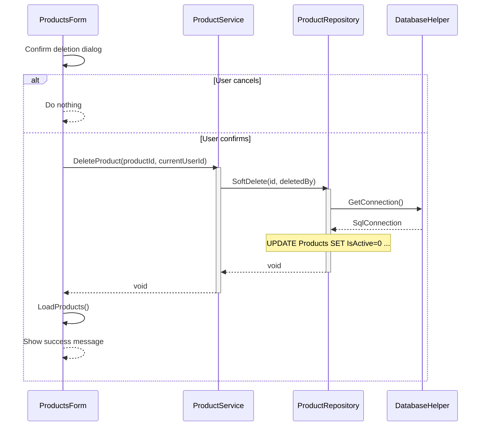

---

## UC-03: GetActiveProducts

### Class Diagram

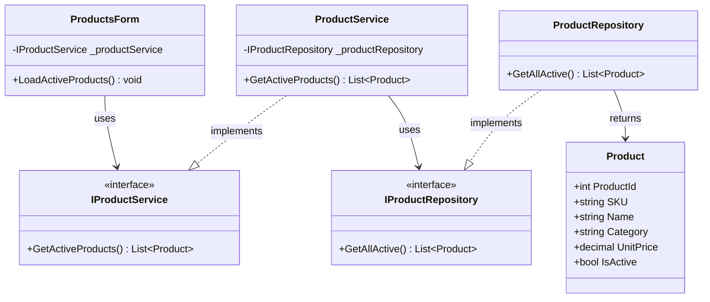

### Sequence Diagram

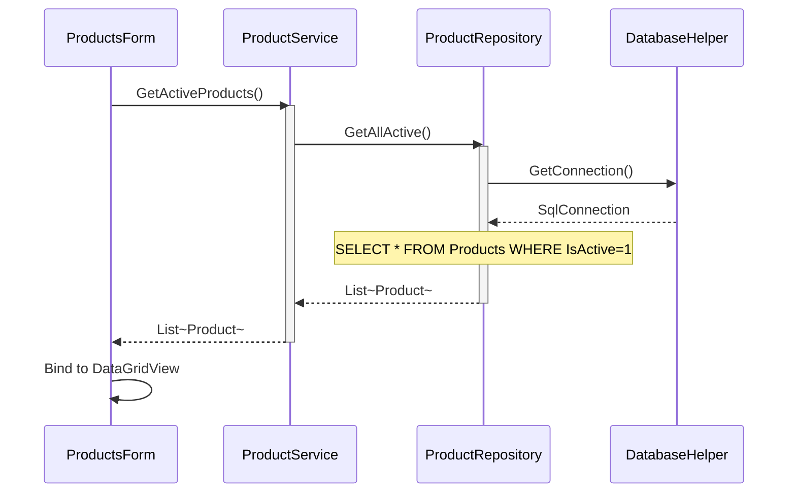

---

## UC-04: GetAllProducts

### Class Diagram

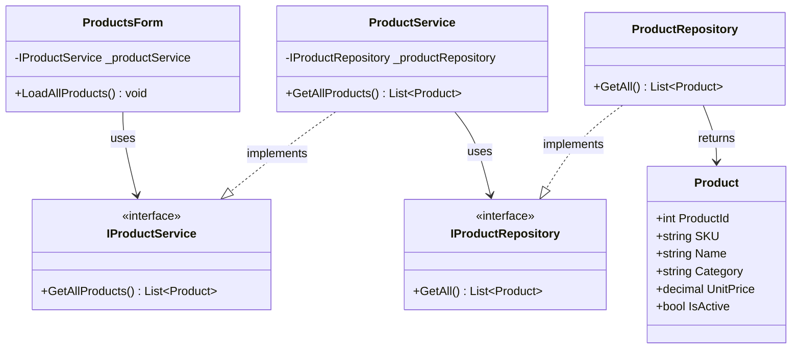

### Sequence Diagram

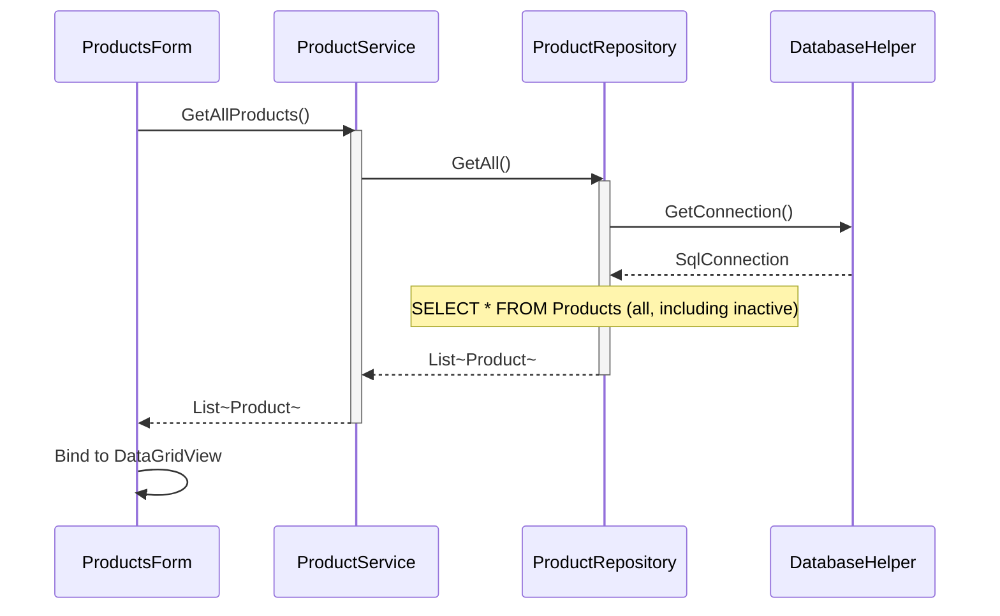

---

## UC-05: GetProductById

### Class Diagram

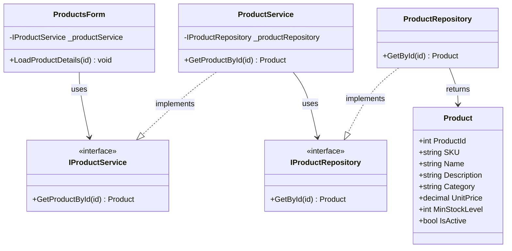

### Sequence Diagram

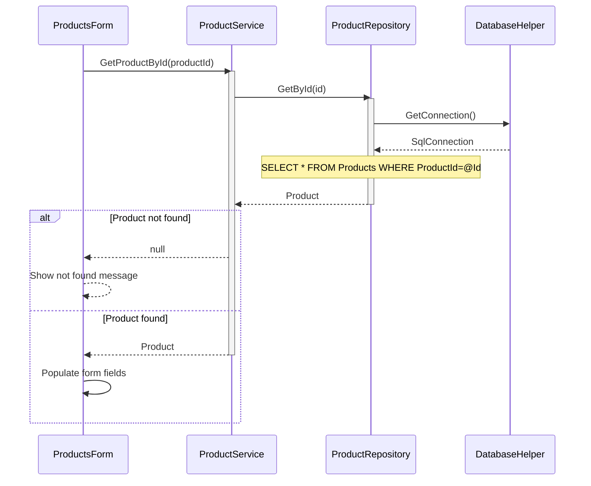

---

## UC-06: GetProductsByCategory

### Class Diagram

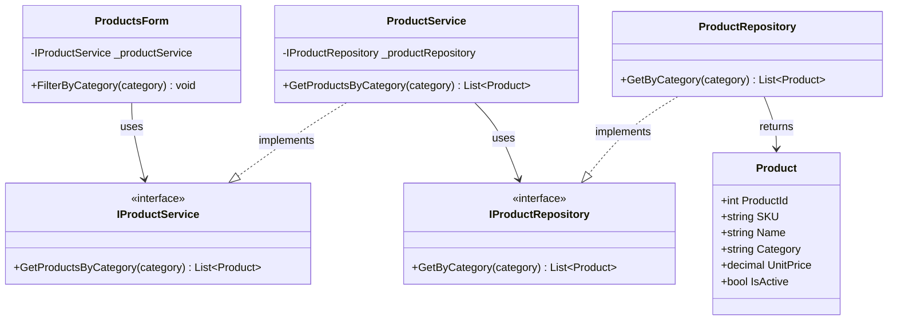

### Sequence Diagram

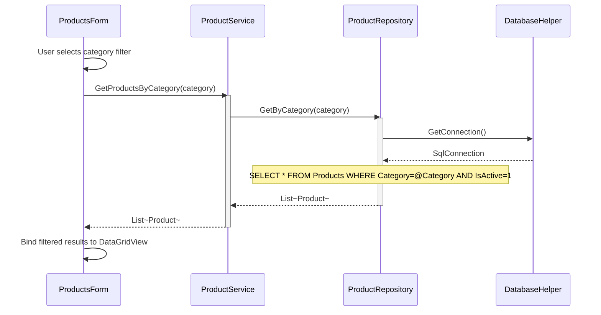

---

## UC-07: SearchProduct

### Class Diagram

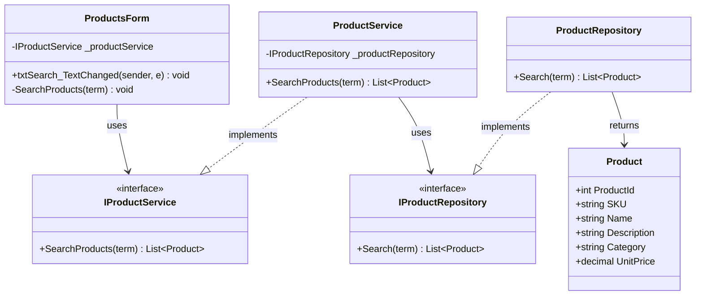

### Sequence Diagram

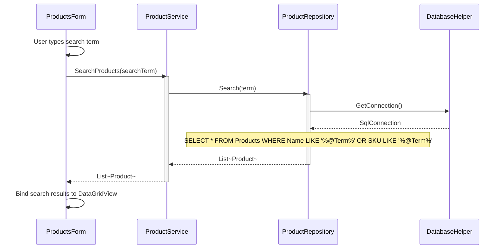

---

## UC-08: UpdateProduct

### Class Diagram

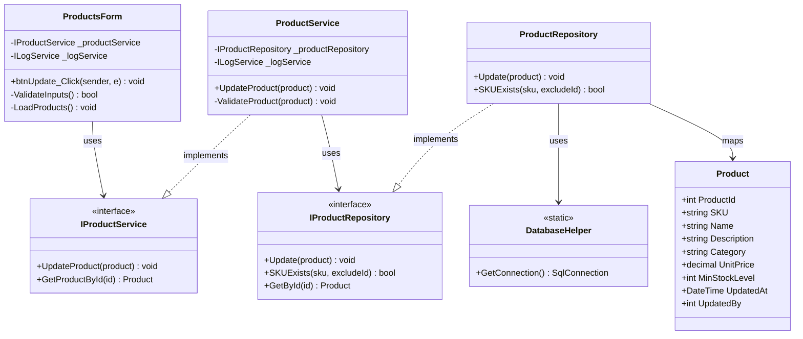

### Sequence Diagram

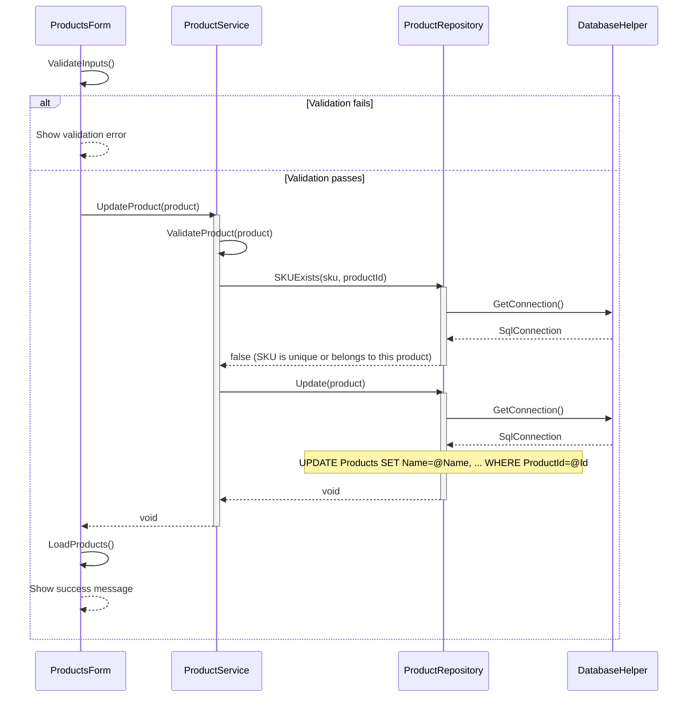

---
