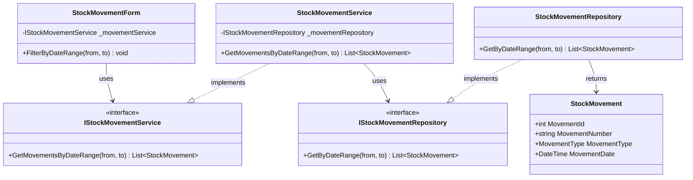
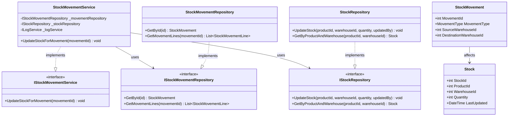

# Stock Movements - Use Case Diagrams

This document contains UML Class Diagrams and Sequence Diagrams for all Stock Movement-related use cases.

---

## UC-01: CreateMovement

### Class Diagram

### Sequence Diagram

---

## UC-02: GetAllMovements

### Class Diagram

### Sequence Diagram

---

## UC-03: GetAllMovementsById

### Class Diagram

### Sequence Diagram

---

## UC-04: GetMovementLines

### Class Diagram

### Sequence Diagram

---

## UC-05: GetMovementsByDateRange

### Class Diagram

### Sequence Diagram

---

## UC-06: GetMovementsByType

### Class Diagram

### Sequence Diagram

---

## UC-07: UpdateProductPrices

### Class Diagram

### Sequence Diagram

---

## UC-08: UpdateStockForMovement

### Class Diagram

### Sequence Diagram

---
