# Sales - Use Case Diagrams

This document contains UML Class Diagrams and Sequence Diagrams for all Sales-related use cases.

---

## UC-01: CreateSale

### Class Diagram

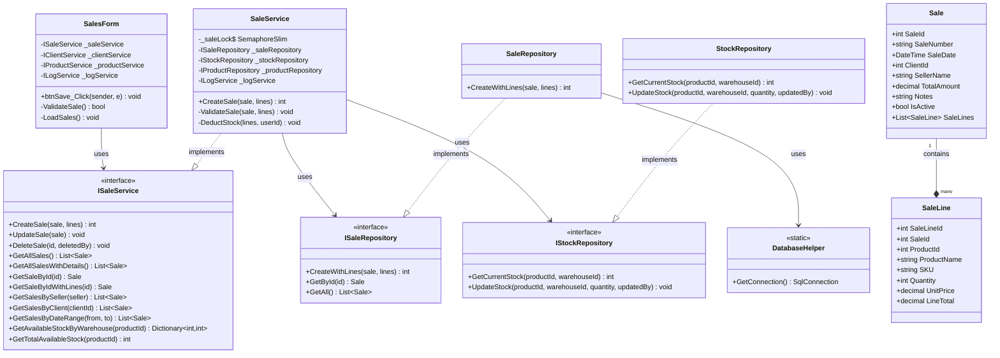

### Sequence Diagram

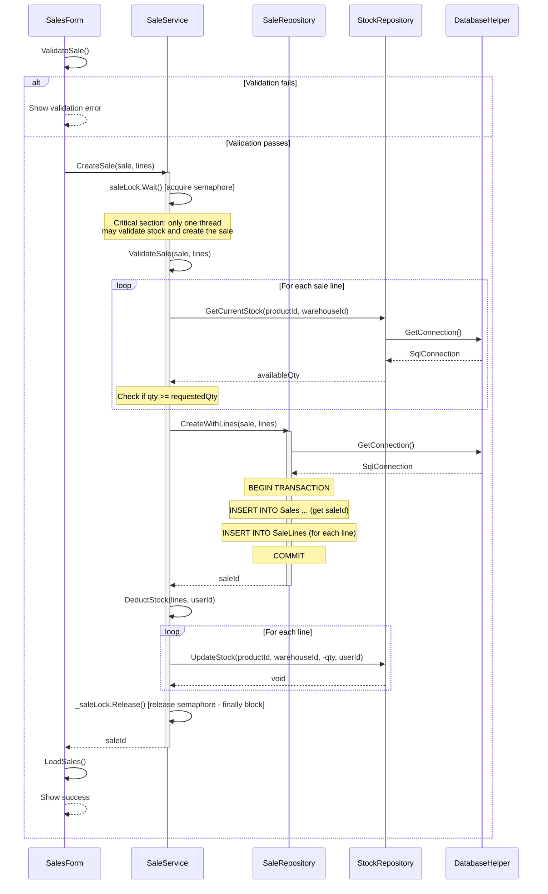

---

## UC-02: DeleteSale

### Class Diagram

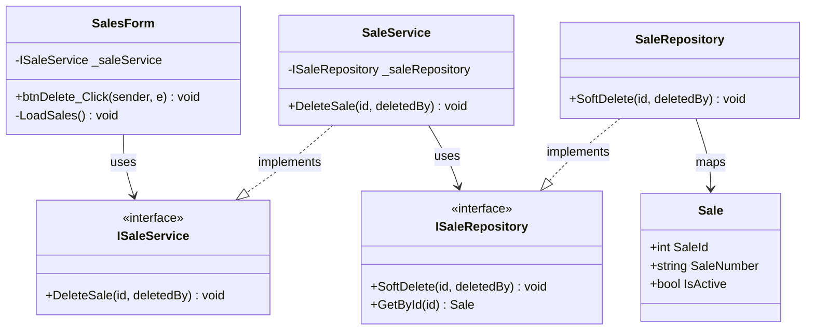

### Sequence Diagram

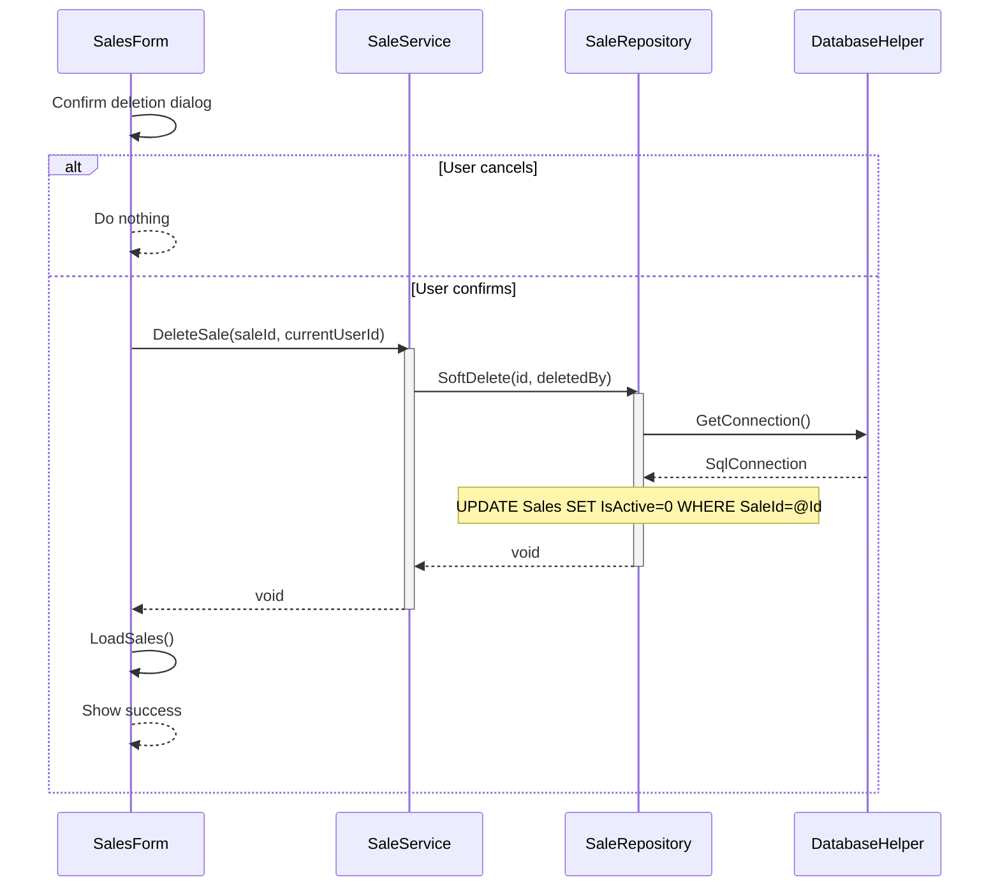

---

## UC-03: GetAllSales

### Class Diagram

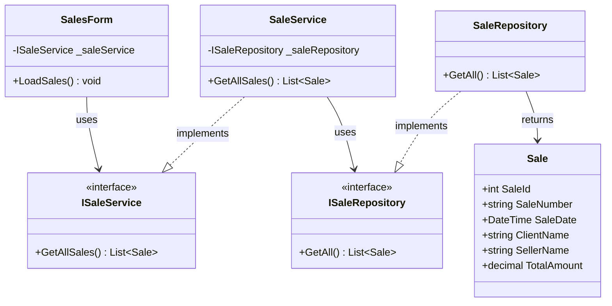

### Sequence Diagram

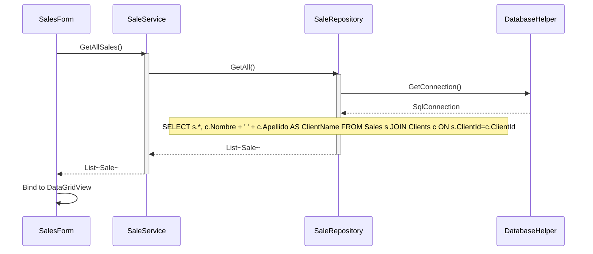

---

## UC-04: GetAllSalesWithDetails

### Class Diagram

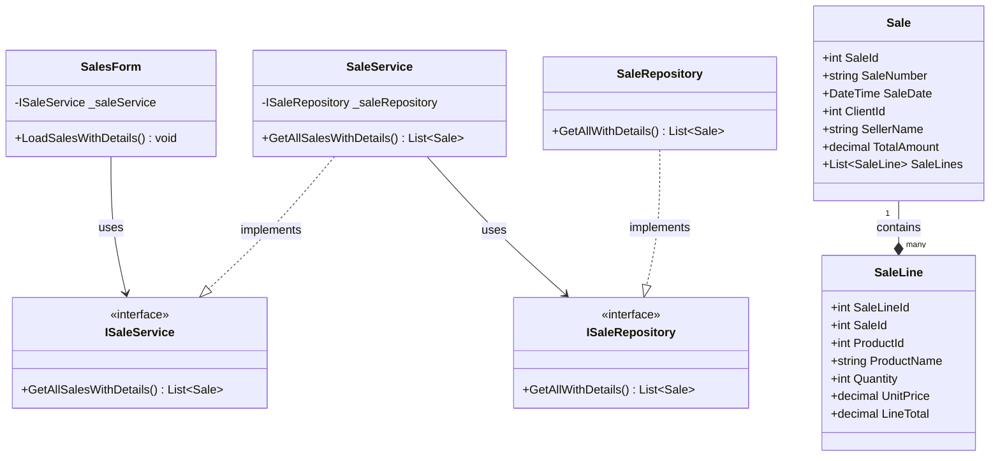

### Sequence Diagram

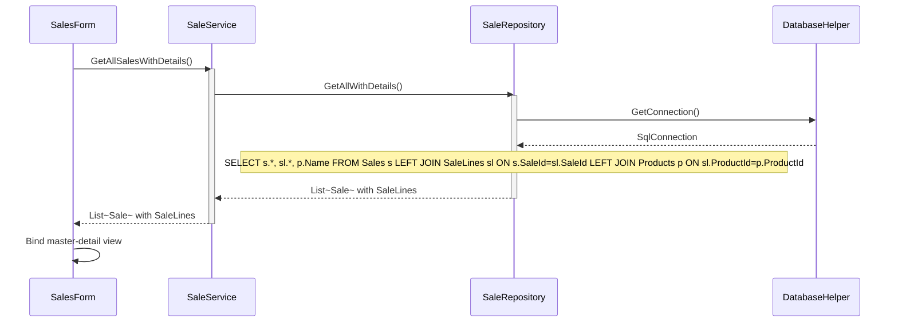

---

## UC-05: GetAvailabelStockByWarehouse

### Class Diagram

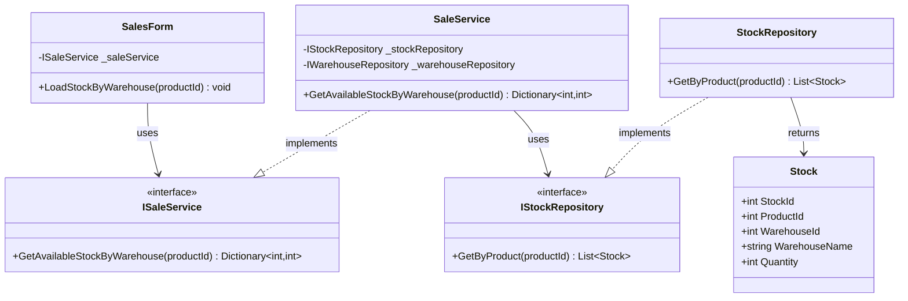

### Sequence Diagram

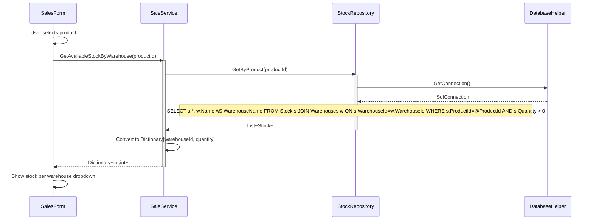

---

## UC-06: GetSaleById

### Class Diagram

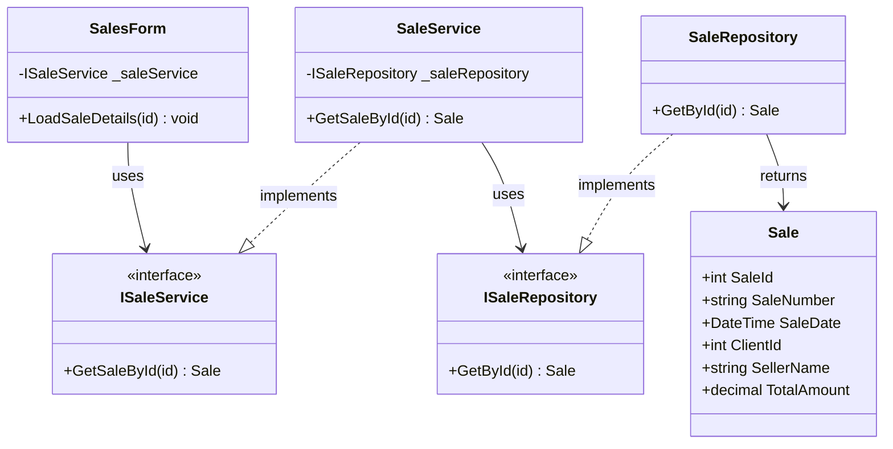

### Sequence Diagram

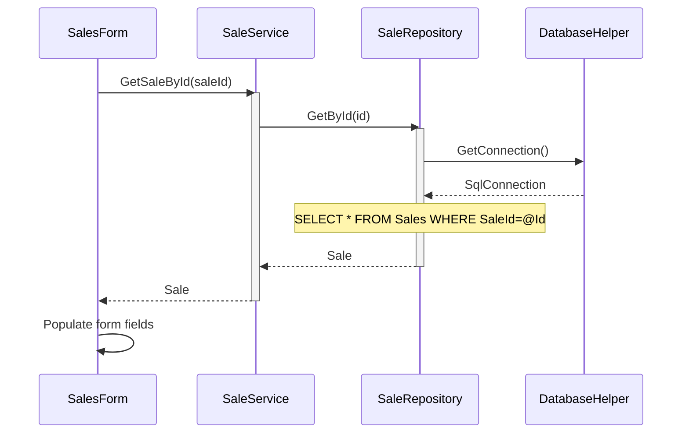

---

## UC-07: GetSaleByIdWithLines

### Class Diagram

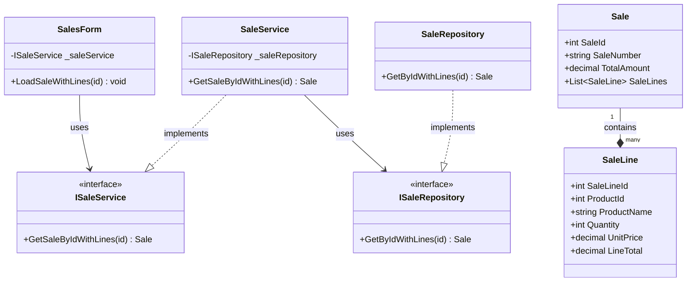

### Sequence Diagram

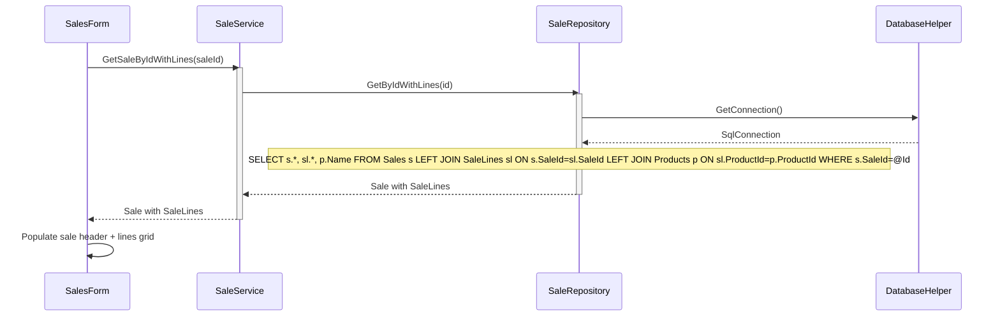

---

## UC-08: GetSaleByClient

### Class Diagram

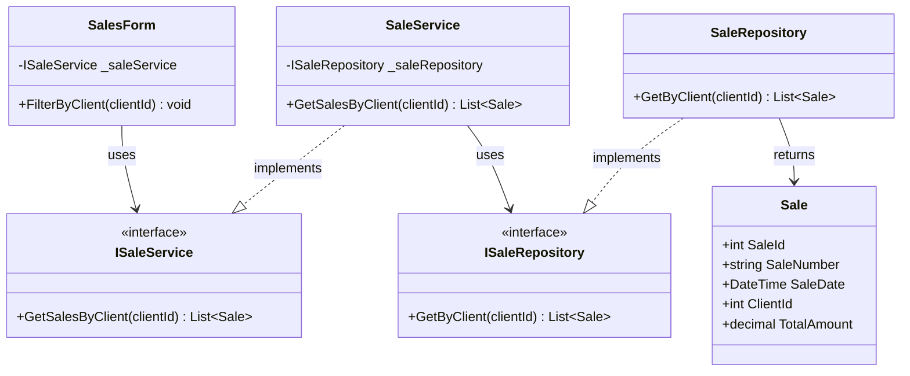

### Sequence Diagram

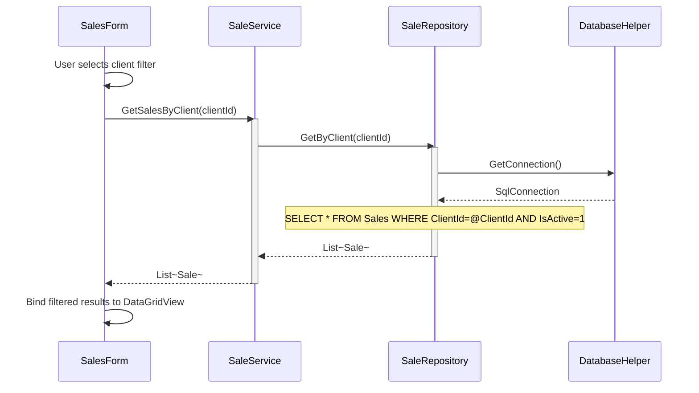

---

## UC-09: GetSaleByDateRange

### Class Diagram

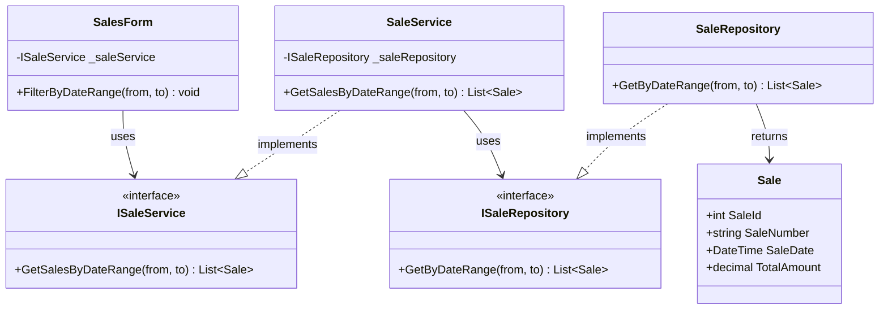

### Sequence Diagram

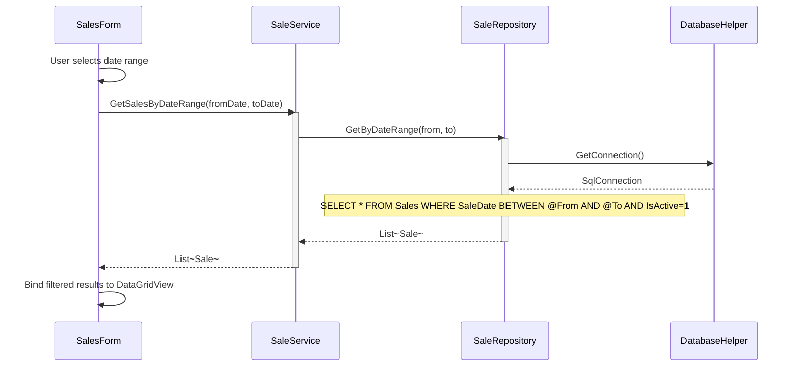

---

## UC-10: GetSaleBySeller

### Class Diagram

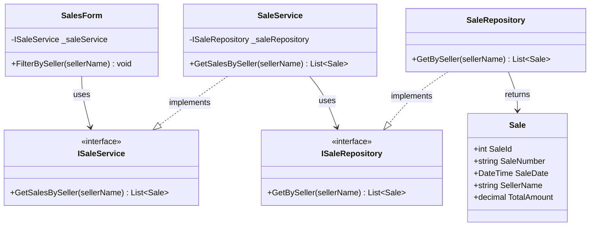

### Sequence Diagram

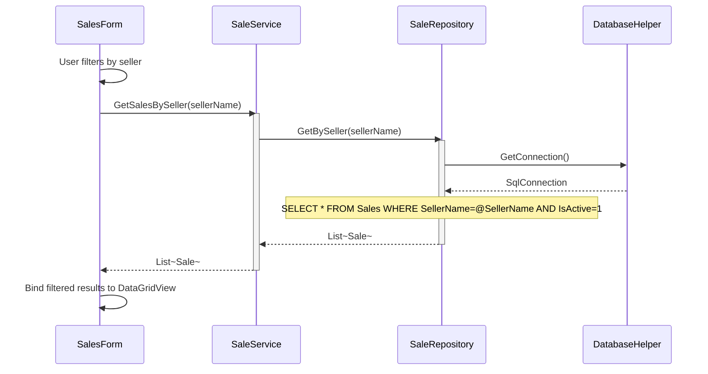

---

## UC-11: GetTotalAvailableStock

### Class Diagram

```mermaid
classDiagram
    class SalesForm {
        -ISaleService _saleService
        +CheckTotalStock(productId) void
    }

    class ISaleService {
        <<interface>>
        +GetTotalAvailableStock(productId) int
    }

    class SaleService {
        -IStockRepository _stockRepository
        +GetTotalAvailableStock(productId) int
    }

    class IStockRepository {
        <<interface>>
        +GetCurrentStock(productId) int
        +GetByProduct(productId) List~Stock~
    }

    class StockRepository {
        +GetCurrentStock(productId) int
        +GetByProduct(productId) List~Stock~
    }

    class Stock {
        +int StockId
        +int ProductId
        +int WarehouseId
        +int Quantity
    }

    SalesForm --> ISaleService : uses
    SaleService ..|> ISaleService : implements
    SaleService --> IStockRepository : uses
    StockRepository ..|> IStockRepository : implements
    StockRepository --> Stock : returns
```

### Sequence Diagram

```mermaid
sequenceDiagram
    participant UI as SalesForm
    participant SVC as SaleService
    participant SREPO as StockRepository
    participant DB as DatabaseHelper

    UI->>SVC: GetTotalAvailableStock(productId)
    activate SVC
    SVC->>SREPO: GetByProduct(productId)
    activate SREPO
    SREPO->>DB: GetConnection()
    DB-->>SREPO: SqlConnection
    Note over SREPO: SELECT SUM(Quantity) FROM Stock WHERE ProductId=@ProductId
    SREPO-->>SVC: List~Stock~
    deactivate SREPO
    SVC->>SVC: Sum all warehouse quantities
    SVC-->>UI: totalStock
    deactivate SVC
    UI->>UI: Show total available stock label
```

---

## UC-12: UpdateSale

### Class Diagram

```mermaid
classDiagram
    class SalesForm {
        -ISaleService _saleService
        +btnUpdate_Click(sender, e) void
        -ValidateSale() bool
        -LoadSales() void
    }

    class ISaleService {
        <<interface>>
        +UpdateSale(sale) void
        +GetSaleById(id) Sale
    }

    class SaleService {
        -ISaleRepository _saleRepository
        -ILogService _logService
        +UpdateSale(sale) void
    }

    class ISaleRepository {
        <<interface>>
        +Update(sale) void
        +GetById(id) Sale
    }

    class SaleRepository {
        +Update(sale) void
    }

    class DatabaseHelper {
        <<static>>
        +GetConnection() SqlConnection
    }

    class Sale {
        +int SaleId
        +string SaleNumber
        +DateTime SaleDate
        +int ClientId
        +string SellerName
        +decimal TotalAmount
        +string Notes
        +DateTime UpdatedAt
        +int UpdatedBy
    }

    SalesForm --> ISaleService : uses
    SaleService ..|> ISaleService : implements
    SaleService --> ISaleRepository : uses
    SaleRepository ..|> ISaleRepository : implements
    SaleRepository --> DatabaseHelper : uses
    SaleRepository --> Sale : maps
```

### Sequence Diagram

```mermaid
sequenceDiagram
    participant UI as SalesForm
    participant SVC as SaleService
    participant REPO as SaleRepository
    participant DB as DatabaseHelper

    UI->>UI: ValidateSale()
    alt Validation fails
        UI-->>UI: Show validation error
    else Validation passes
        UI->>SVC: UpdateSale(sale)
        activate SVC
        SVC->>REPO: Update(sale)
        activate REPO
        REPO->>DB: GetConnection()
        DB-->>REPO: SqlConnection
        Note over REPO: UPDATE Sales SET SaleDate=@Date, SellerName=@Seller, Notes=@Notes, UpdatedAt=@Now WHERE SaleId=@Id
        REPO-->>SVC: void
        deactivate REPO
        SVC-->>UI: void
        deactivate SVC
        UI->>UI: LoadSales()
        UI-->>UI: Show success
    end
```

---
