# Warehouses - Use Case Diagrams

This document contains UML Class Diagrams and Sequence Diagrams for all Warehouse-related use cases.

---

## UC-01: CreateWareHouse

### Class Diagram

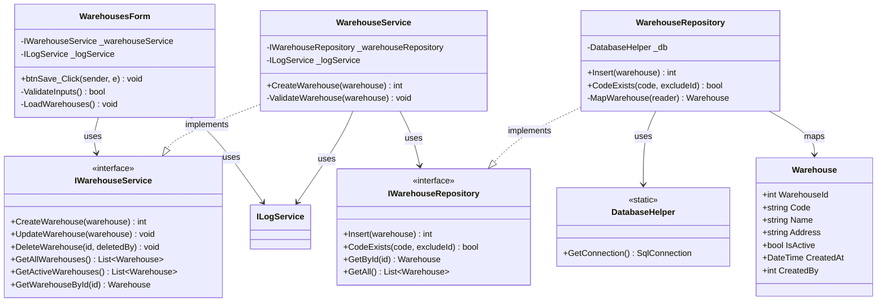

### Sequence Diagram

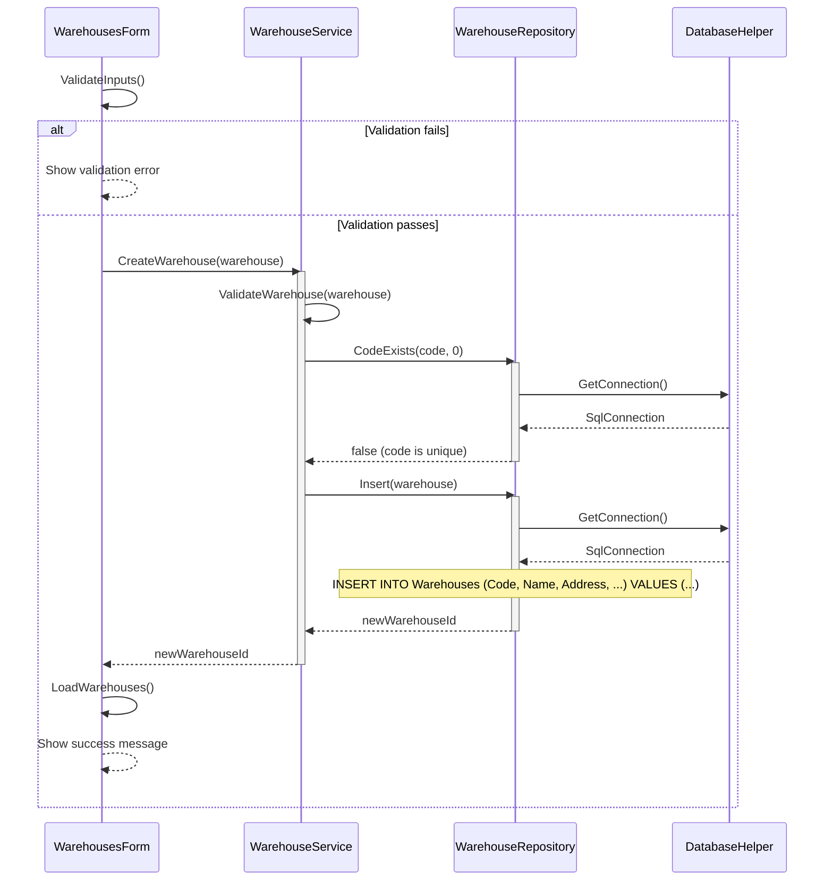

---

## UC-02: DeleteWarehouse

### Class Diagram

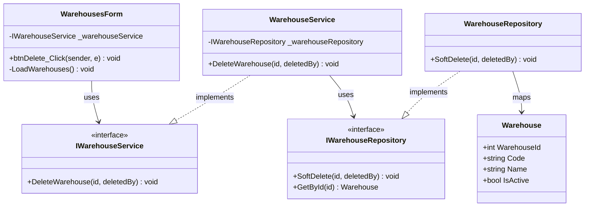

### Sequence Diagram

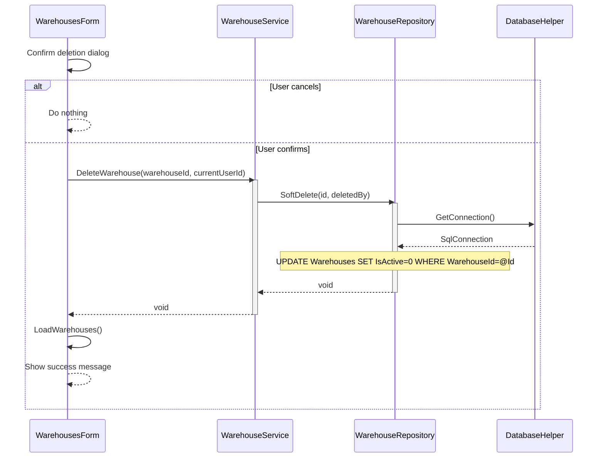

---

## UC-03: GetAllActiveWarehouses

### Class Diagram

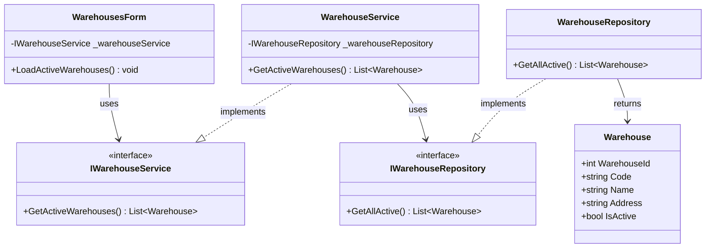

### Sequence Diagram

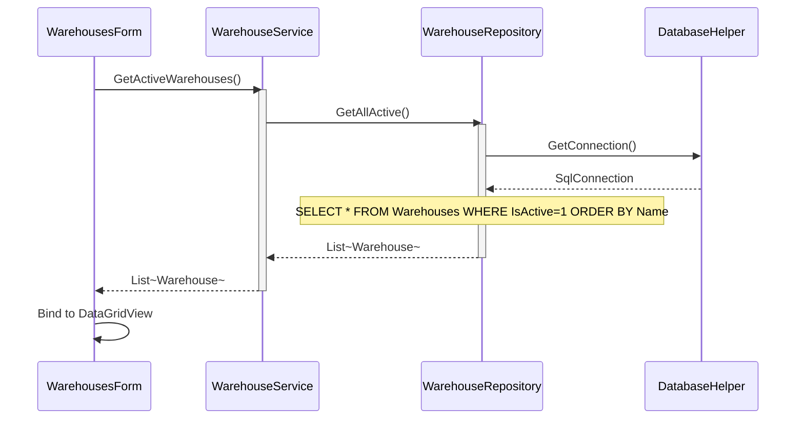

---

## UC-04: GetAllWarehouses

### Class Diagram

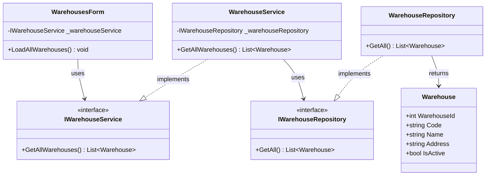

### Sequence Diagram

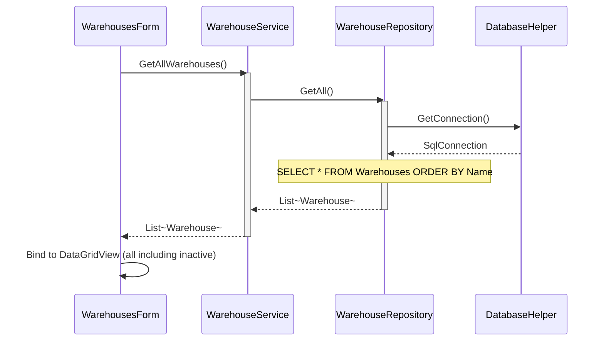

---

## UC-05: GetWarehousesById

### Class Diagram

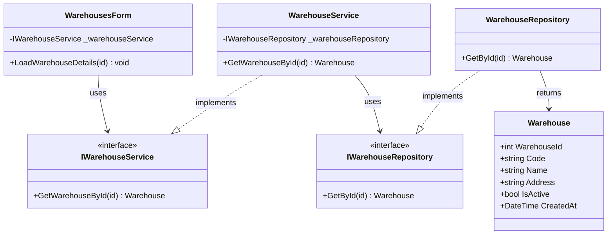

### Sequence Diagram

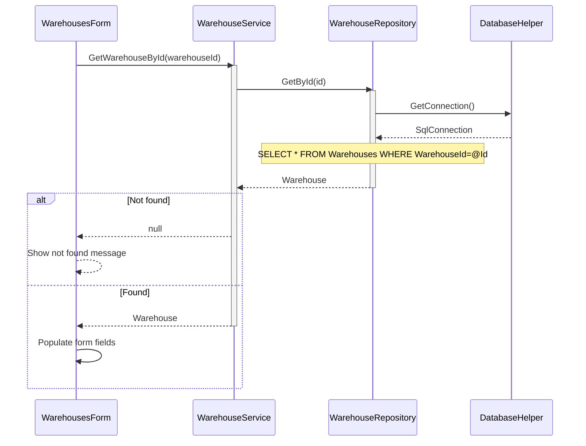

---

## UC-06: UpdateWarehouse

### Class Diagram

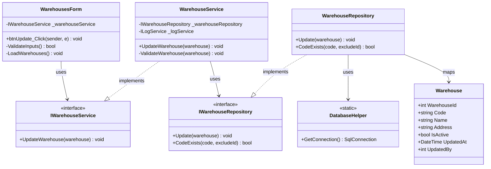

### Sequence Diagram

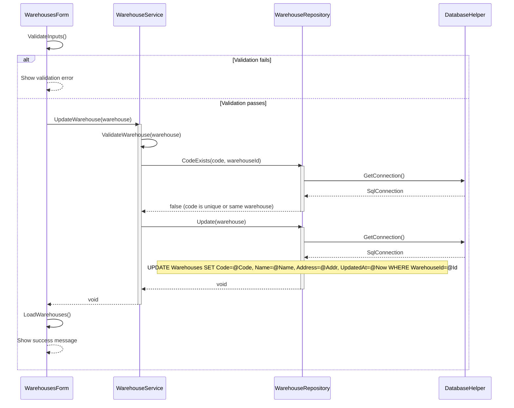

---
