# Clients - Use Case Diagrams

This document contains UML Class Diagrams and Sequence Diagrams for all Client-related use cases.

---

## UC-01: CreateClient

### Class Diagram

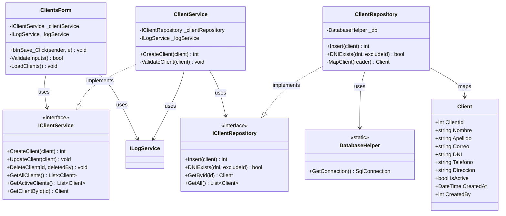

### Sequence Diagram

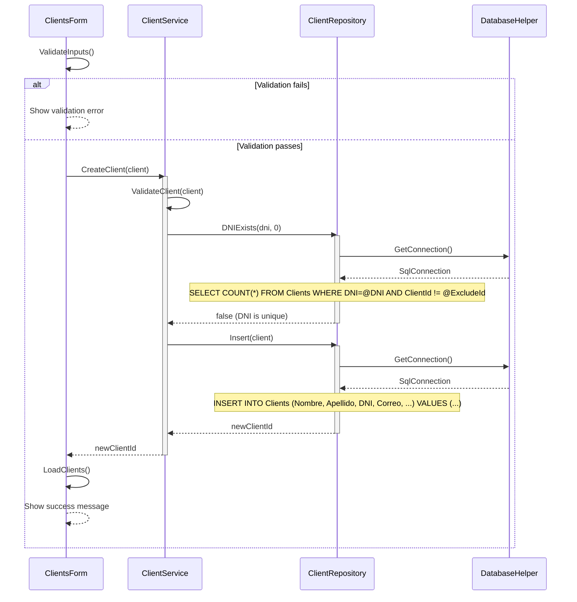

---

## UC-02: DeleteClient

### Class Diagram

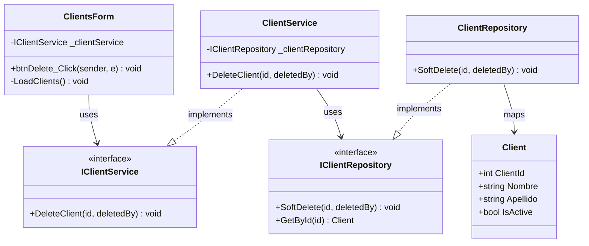

### Sequence Diagram

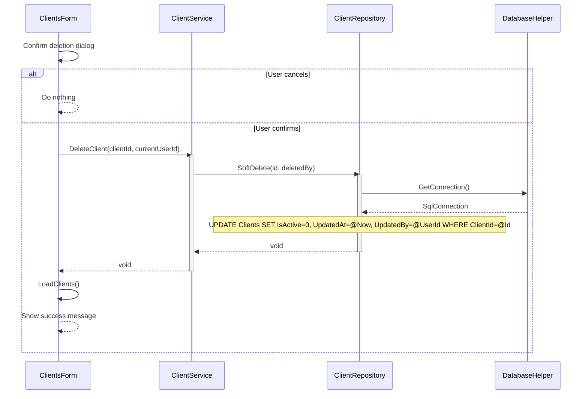

---

## UC-03: GetActiveClients

### Class Diagram

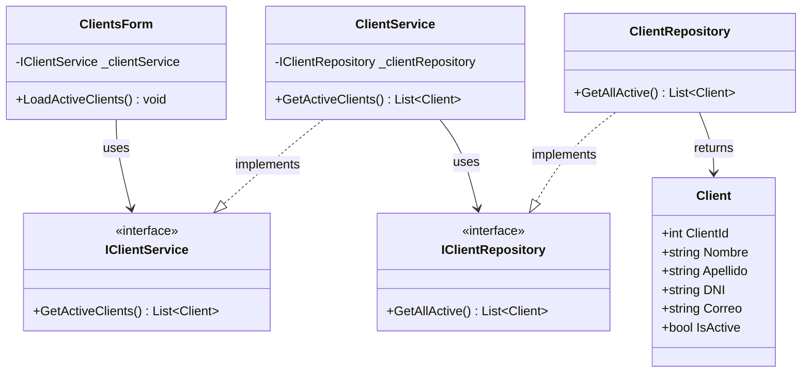

### Sequence Diagram

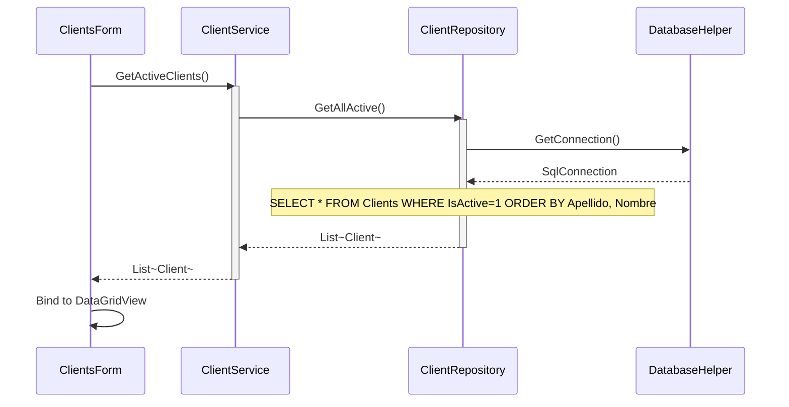

---

## UC-04: GetAllClients

### Class Diagram

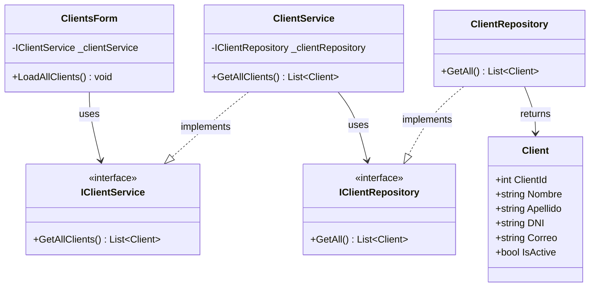

### Sequence Diagram

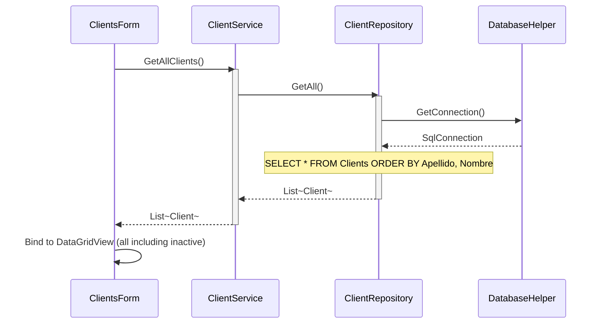

---

## UC-05: GetClientById

### Class Diagram

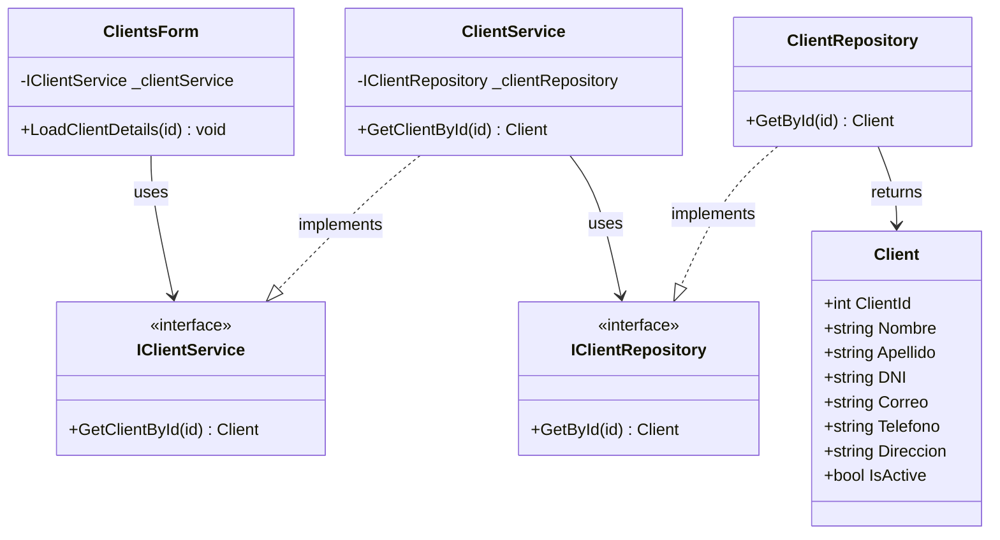

### Sequence Diagram

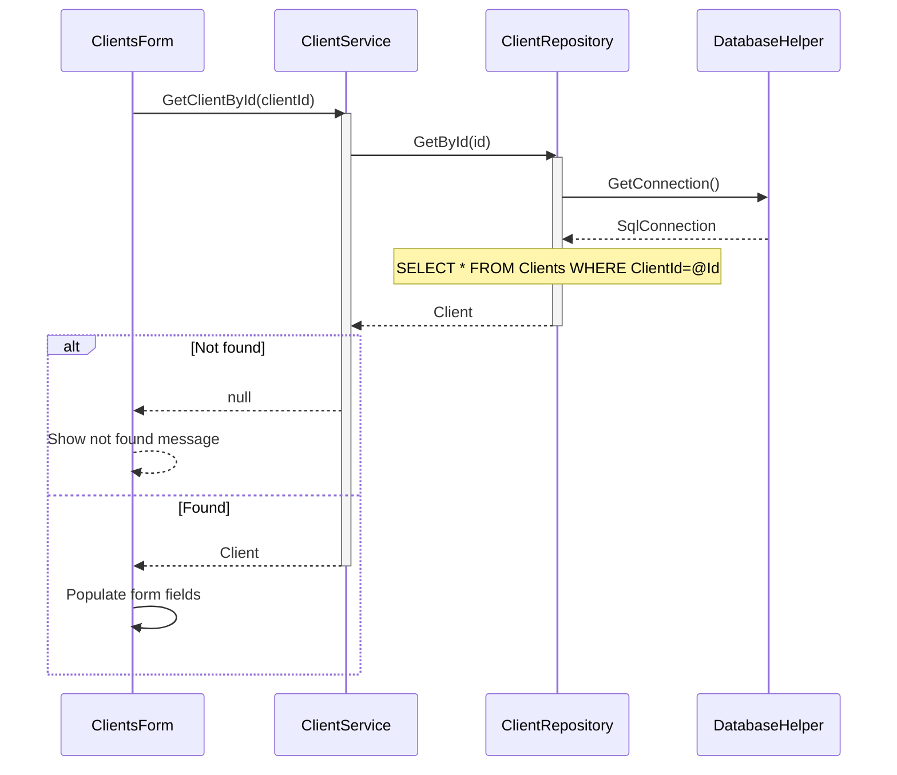

---

## UC-06: UpdateClient

### Class Diagram

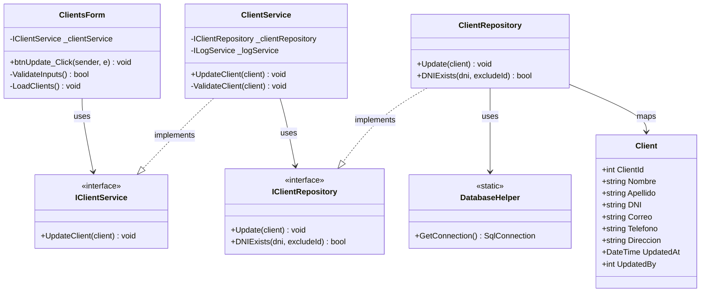

### Sequence Diagram

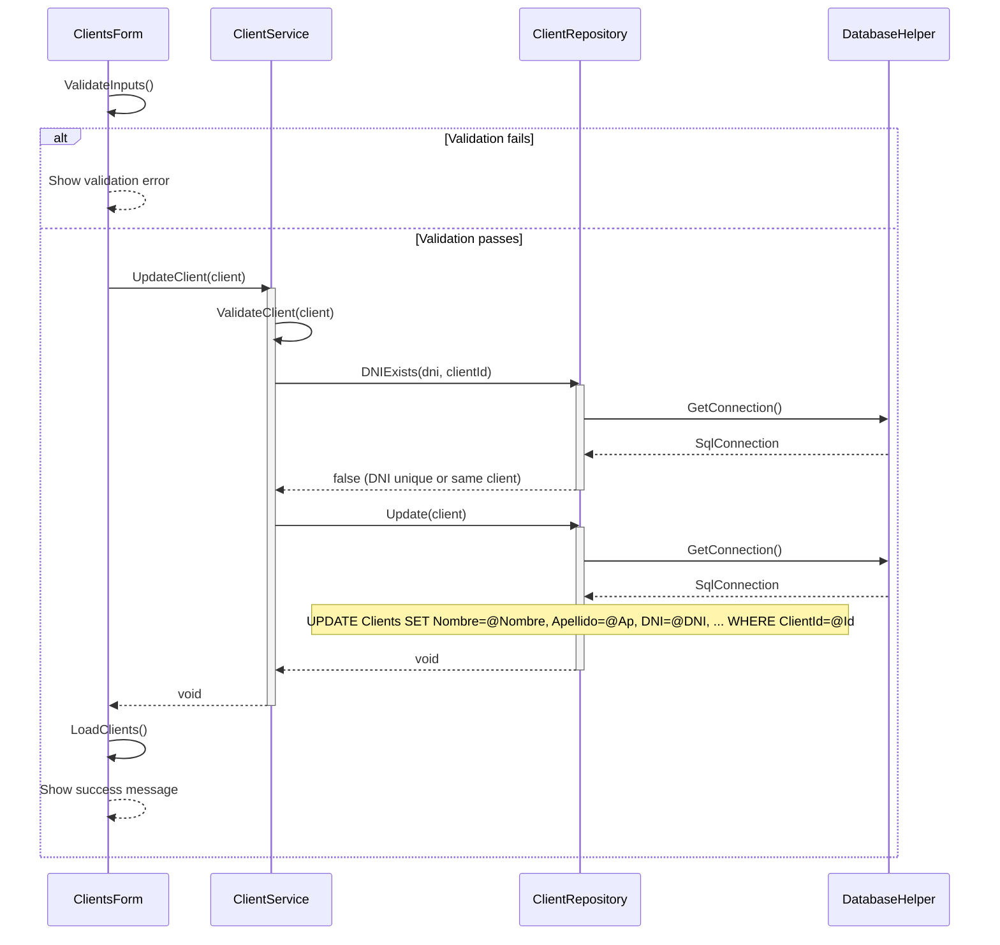

---
