# Reports - Use Case Diagrams

This document contains UML Class Diagrams and Sequence Diagrams for all Report-related use cases.

---

## UC-01: GetCategorySalesReport

### Class Diagram

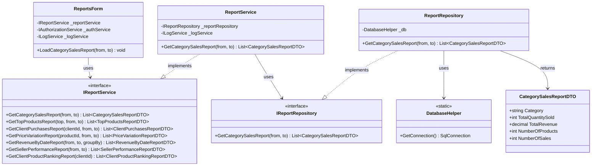

### Sequence Diagram

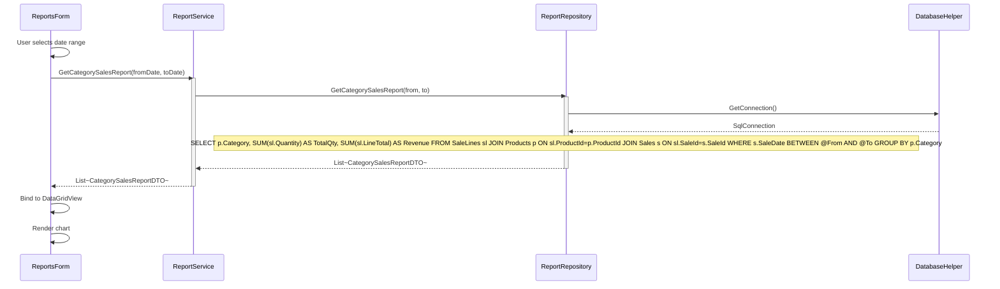

---

## UC-02: GetClientProductRankingReport

### Class Diagram

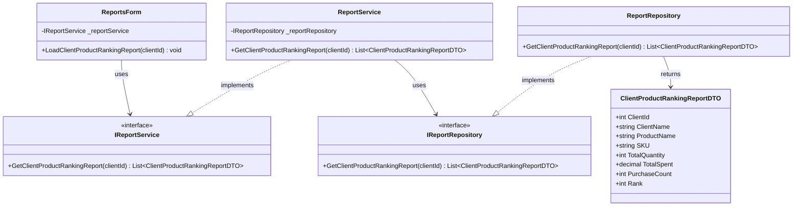

### Sequence Diagram

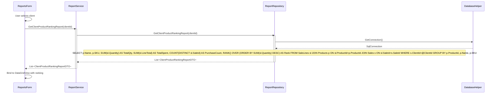

---

## UC-03: GetClientPurchasesReport

### Class Diagram

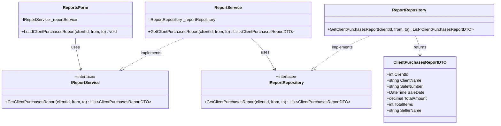

### Sequence Diagram

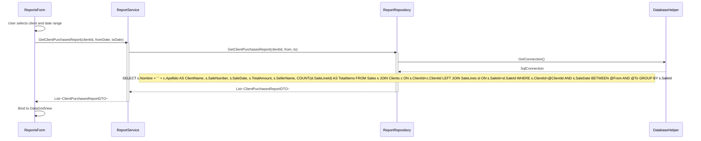

---

## UC-04: GetPriceVariationReport

### Class Diagram

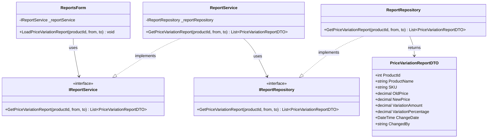

### Sequence Diagram

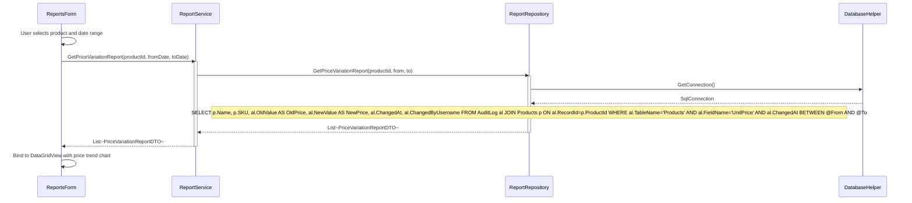

---

## UC-05: GetRevenueByDateReport

### Class Diagram

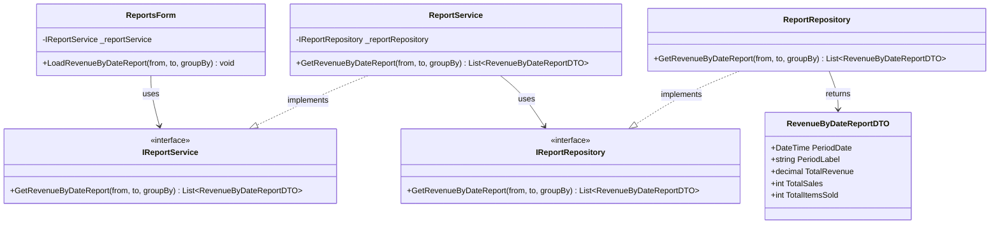

### Sequence Diagram

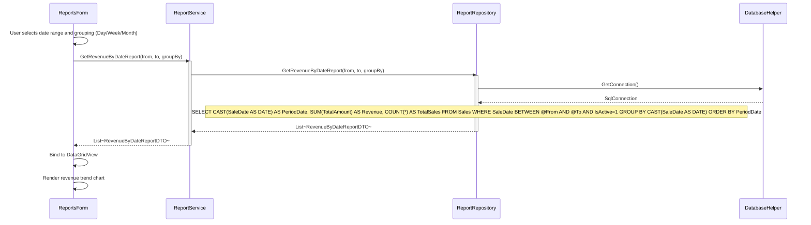

---

## UC-06: GetSellerPerformanceReport

### Class Diagram

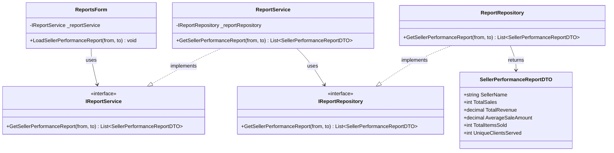

### Sequence Diagram

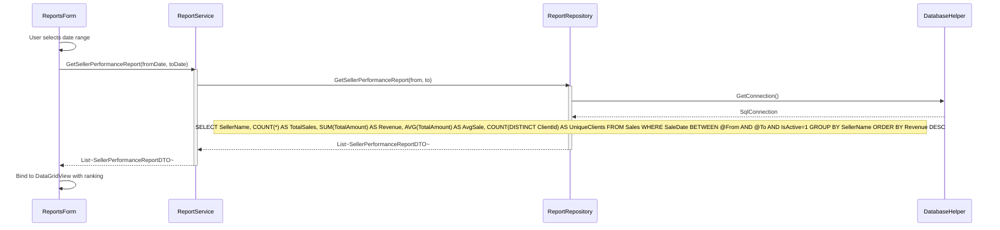

---

## UC-07: GetTopProductsReport

### Class Diagram

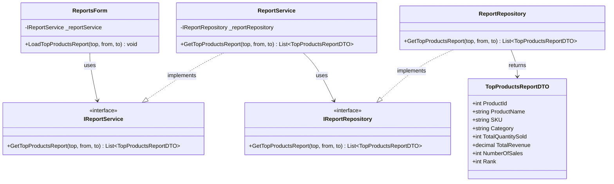

### Sequence Diagram

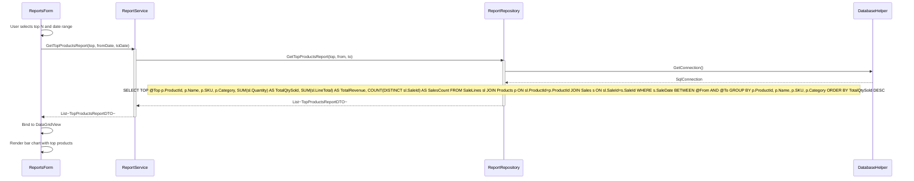

---
