# Users - Use Case Diagrams

This document contains UML Class Diagrams and Sequence Diagrams for all User-related use cases.

---

## UC-01: AssignRolesToUser

### Class Diagram

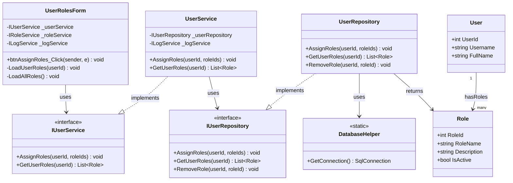

### Sequence Diagram

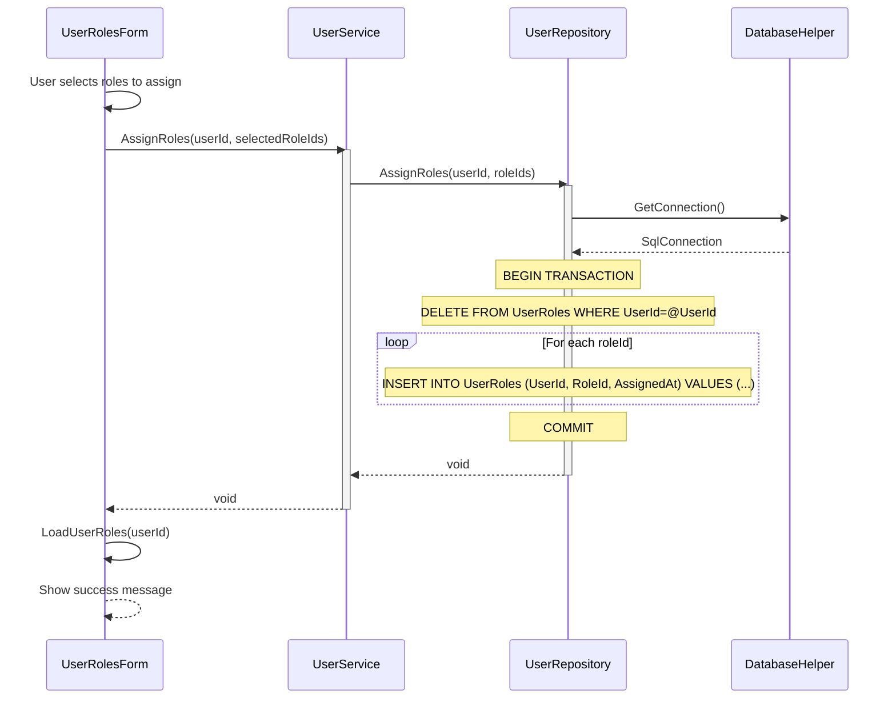

---

## UC-02: ChangePassword

### Class Diagram

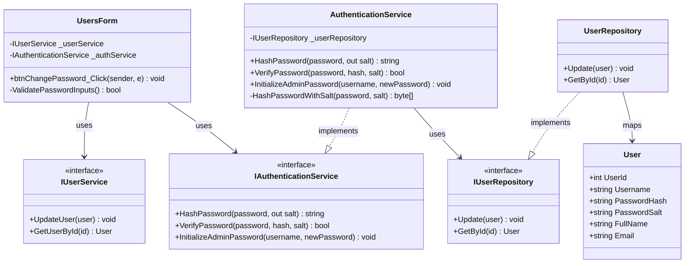

### Sequence Diagram

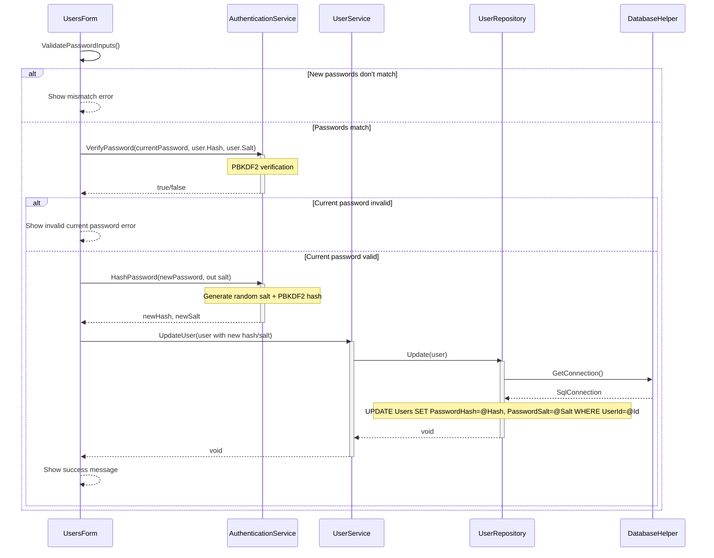

---

## UC-03: CreateUser

### Class Diagram

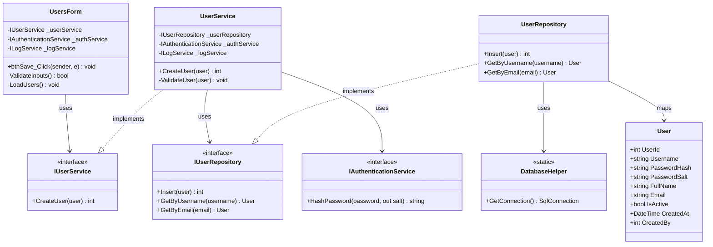

### Sequence Diagram

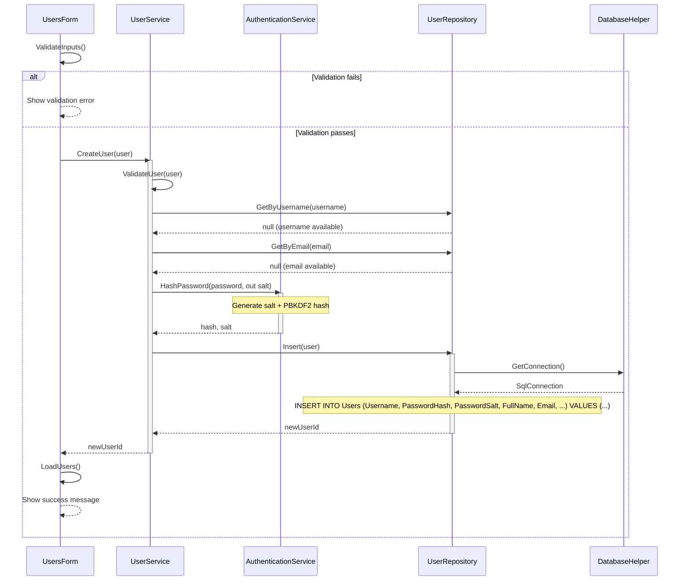

---

## UC-04: DeleteUser

### Class Diagram

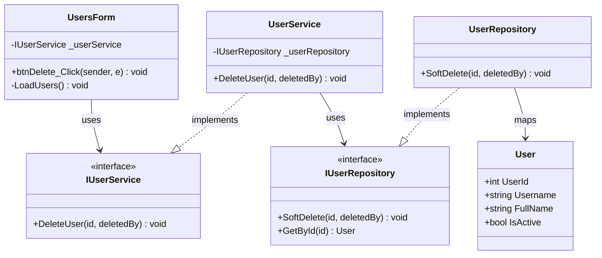

### Sequence Diagram

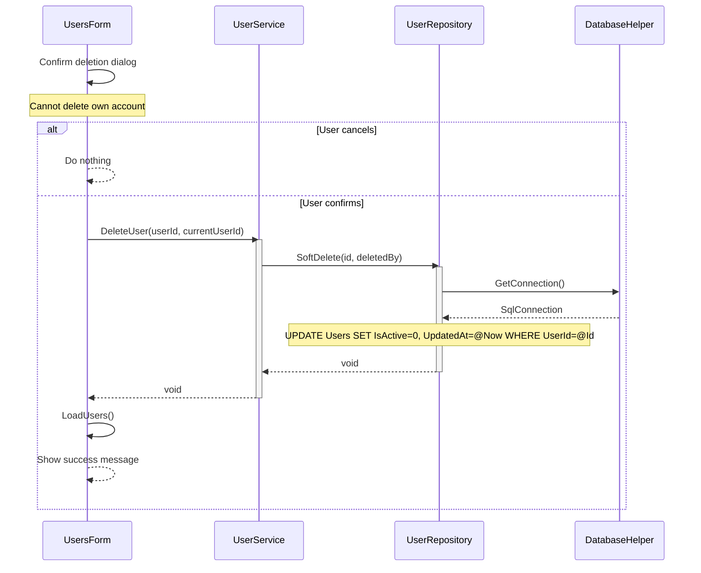

---

## UC-05: GetActiveUsers

### Class Diagram

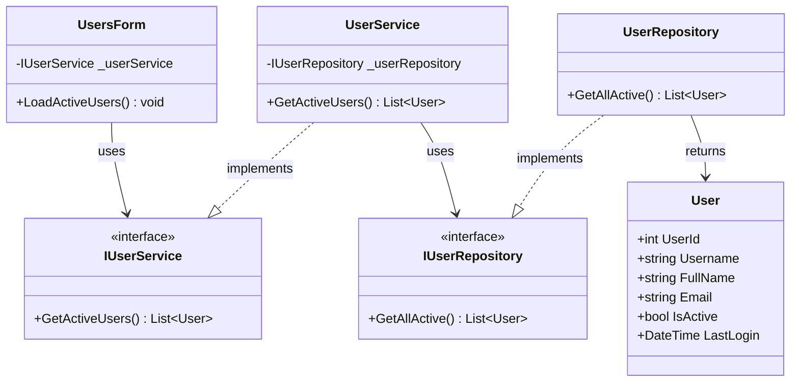

### Sequence Diagram

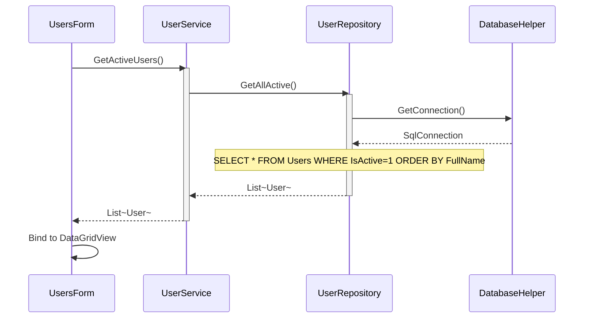

---

## UC-06: GetAllUsers

### Class Diagram

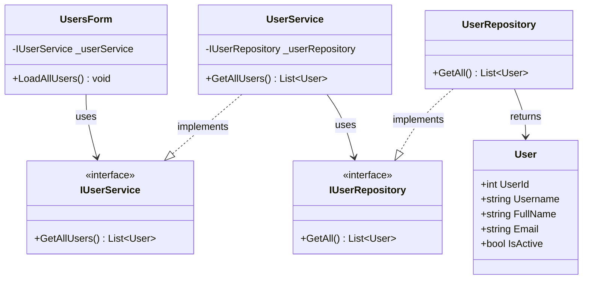

### Sequence Diagram

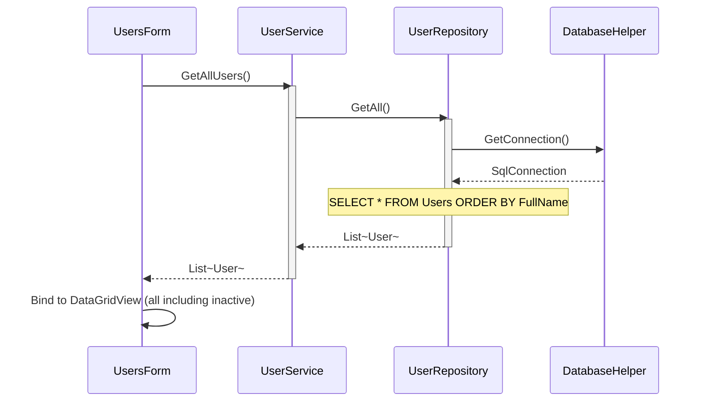

---

## UC-07: GetUserById

### Class Diagram

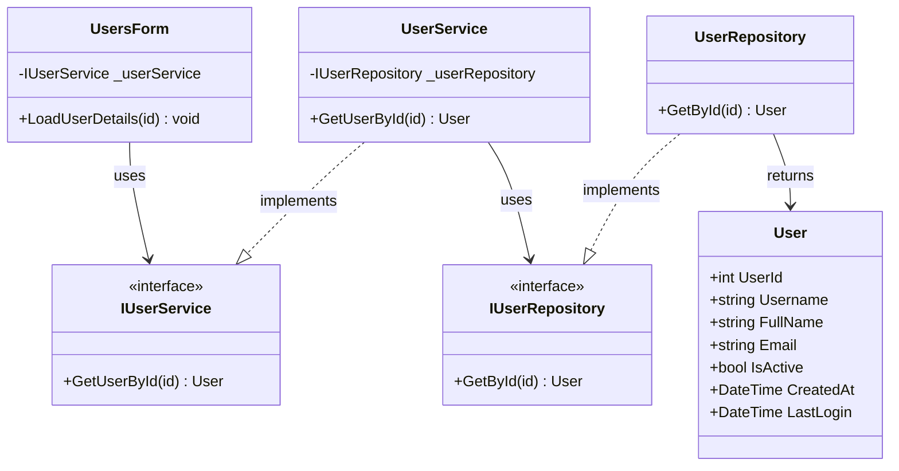

### Sequence Diagram

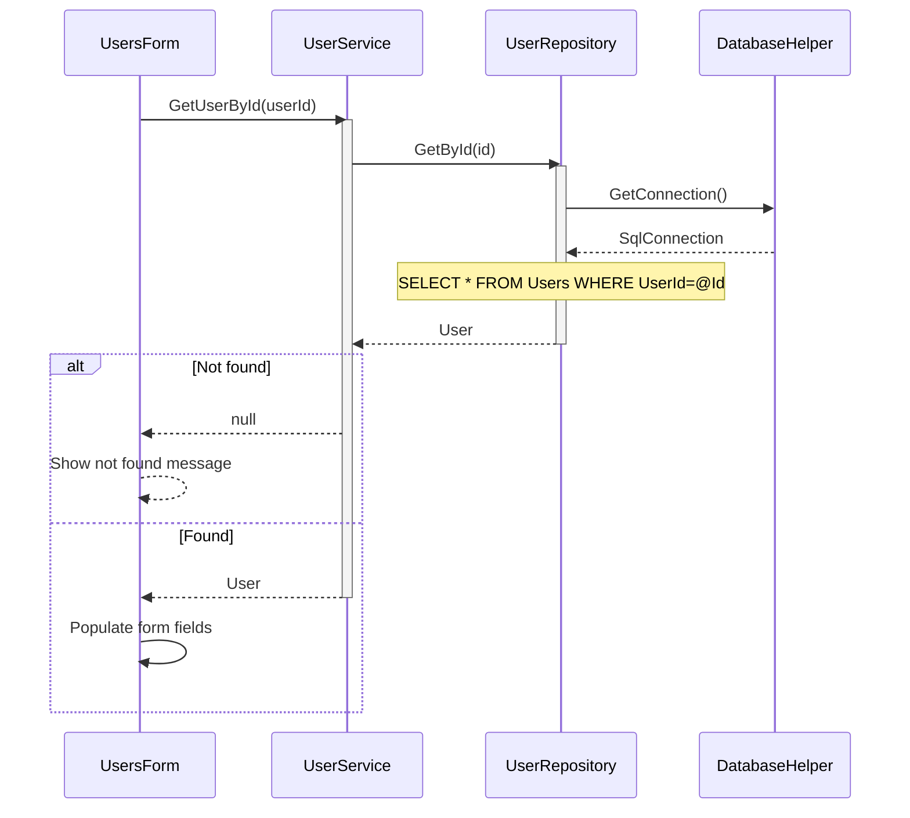

---

## UC-08: GetUserRoles

### Class Diagram

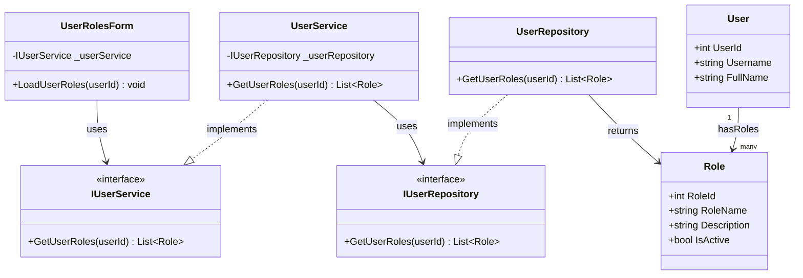

### Sequence Diagram

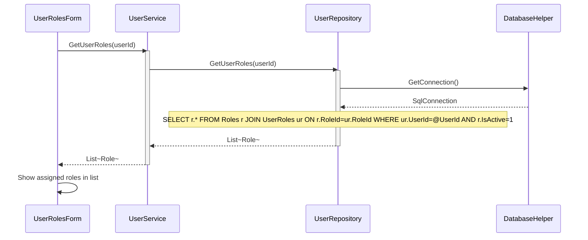

---

## UC-09: UpdateUser

### Class Diagram

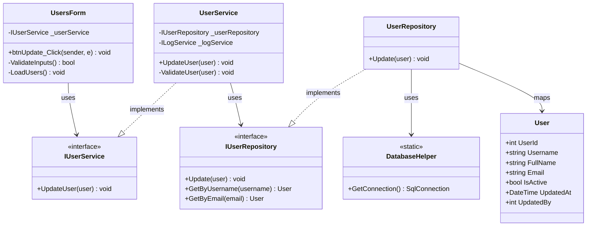

### Sequence Diagram

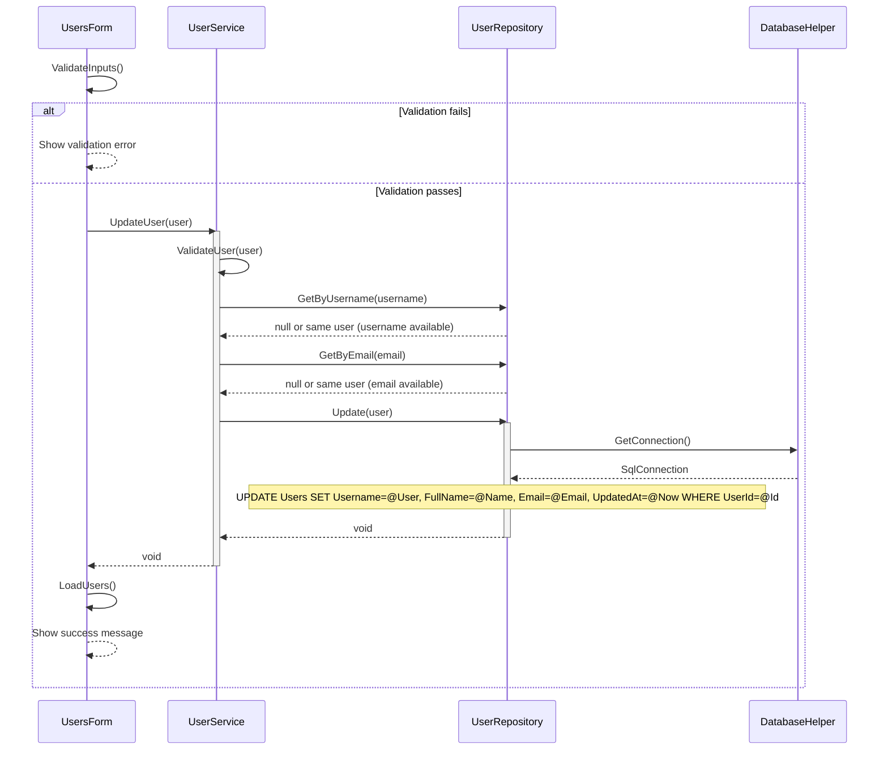

---
