# Roles - Use Case Diagrams

This document contains UML Class Diagrams and Sequence Diagrams for all Role-related use cases.

---

## UC-01: CreateRole

### Class Diagram

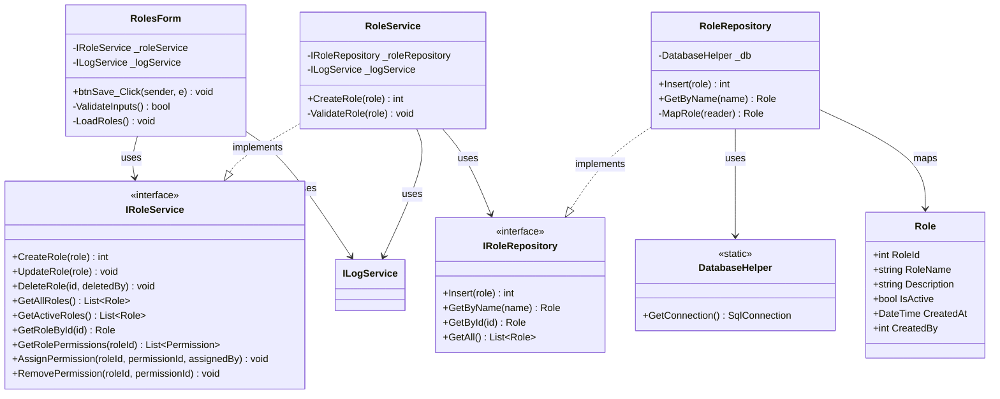

### Sequence Diagram

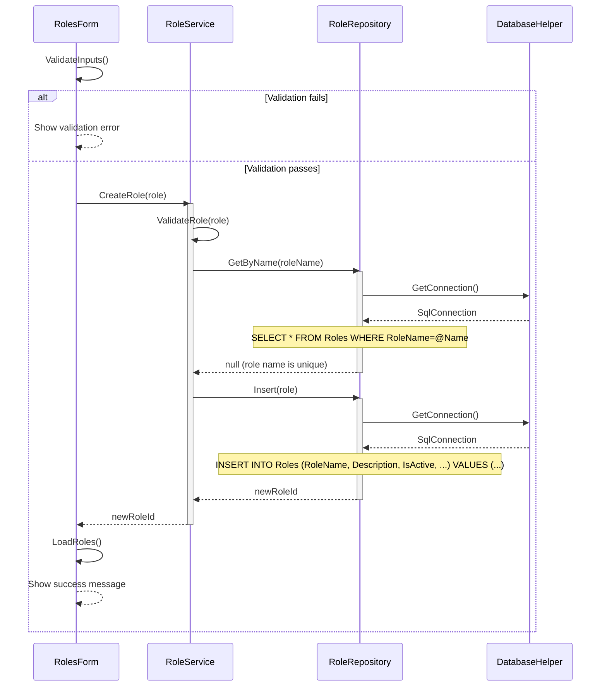

---

## UC-02: DeleteRole

### Class Diagram

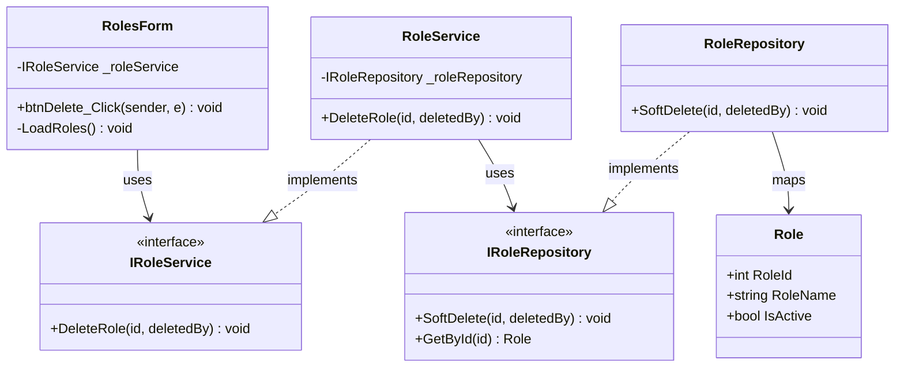

### Sequence Diagram

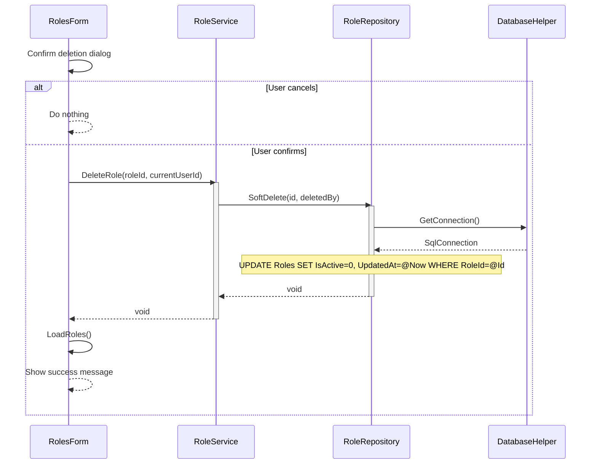

---

## UC-03: AssignPermissions

### Class Diagram

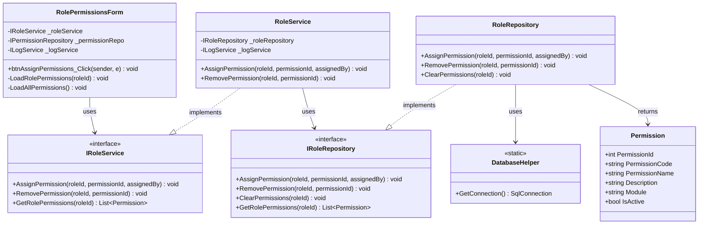

### Sequence Diagram

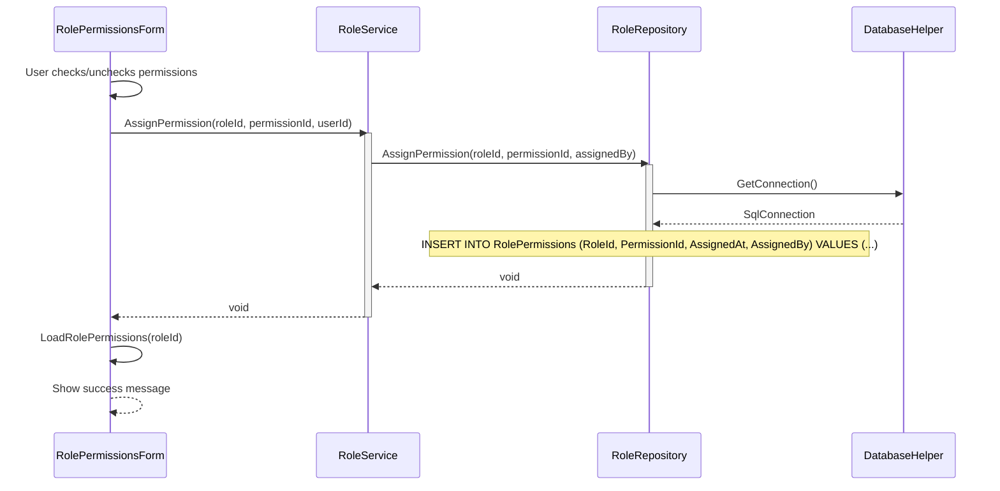

---

## UC-04: GetActiveRoles

### Class Diagram

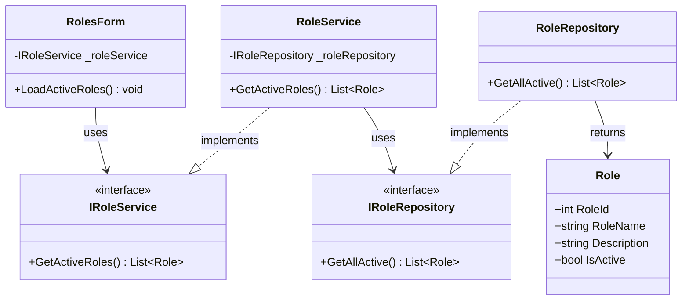

### Sequence Diagram

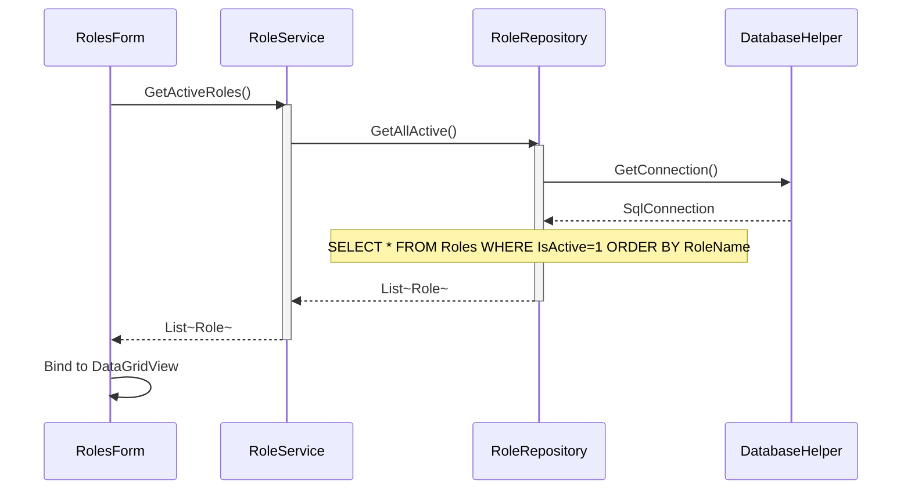

---

## UC-05: GetAllPermissions

### Class Diagram

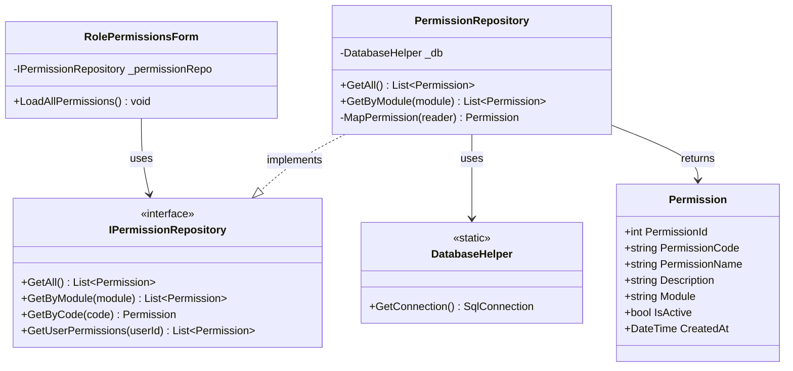

### Sequence Diagram

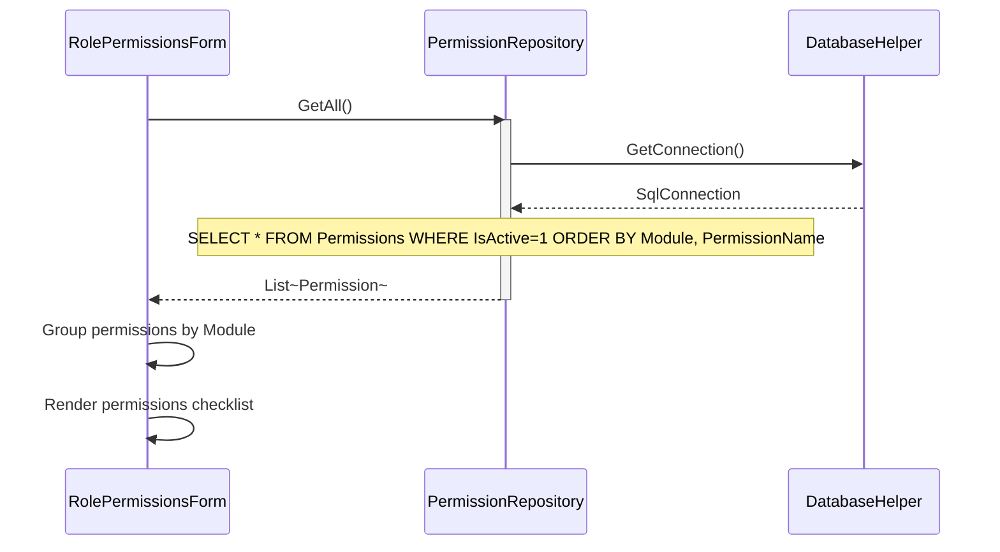

---

## UC-06: GetAllRoles

### Class Diagram

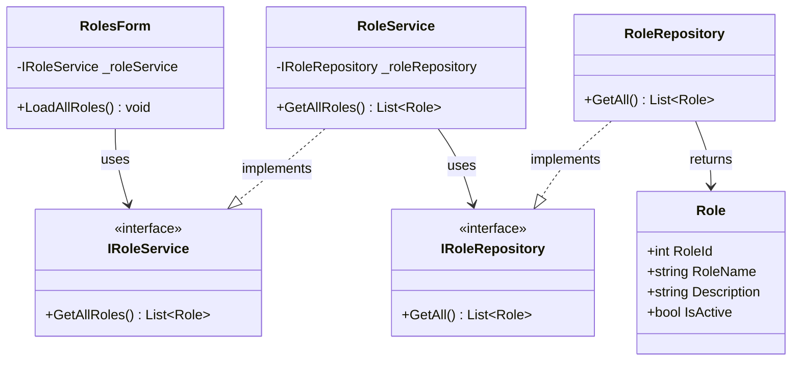

### Sequence Diagram

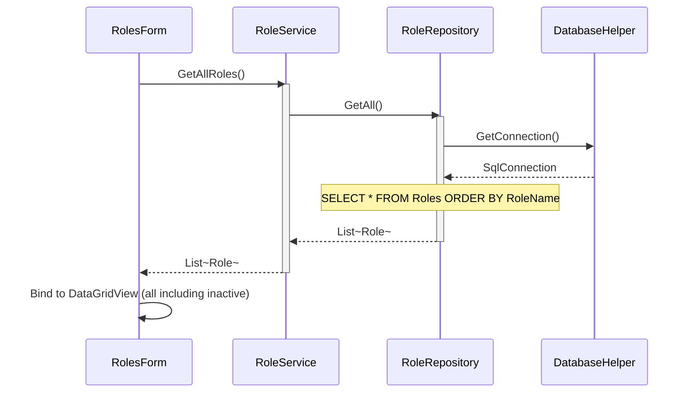

---

## UC-07: GetRoleById

### Class Diagram

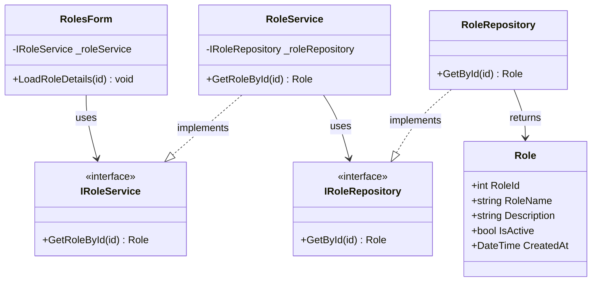

### Sequence Diagram

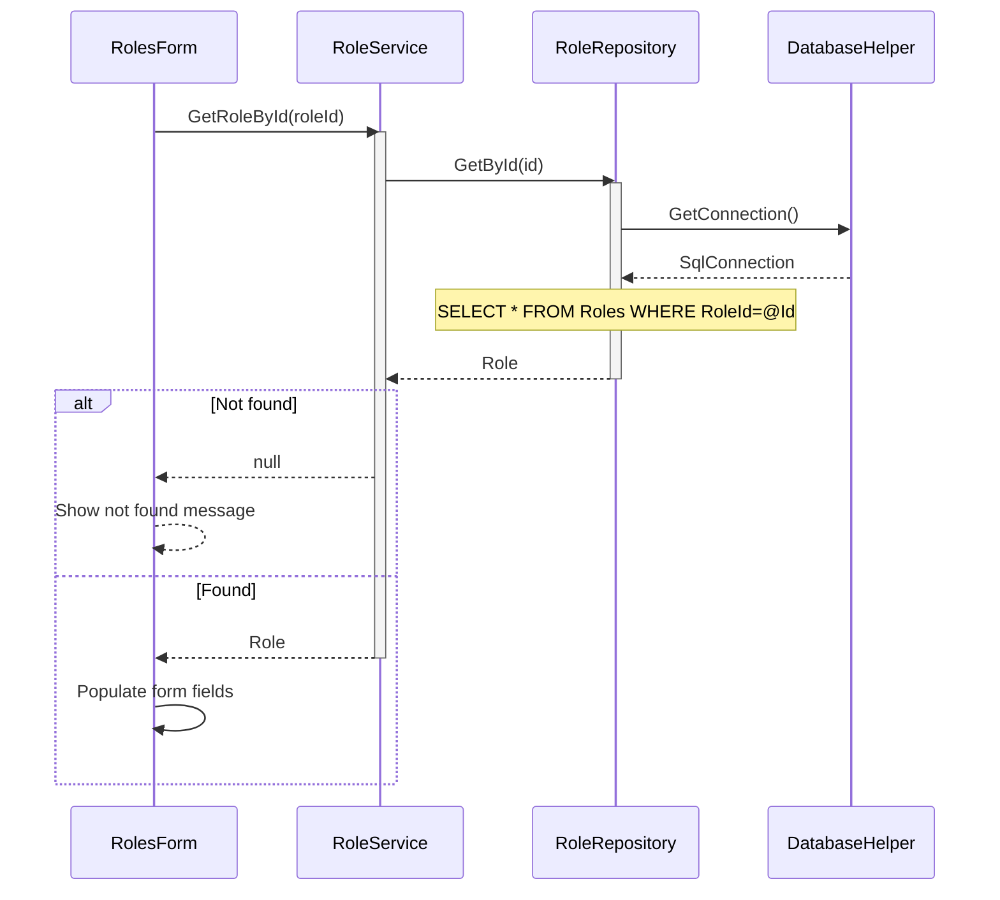

---

## UC-08: GetRolePermissions

### Class Diagram

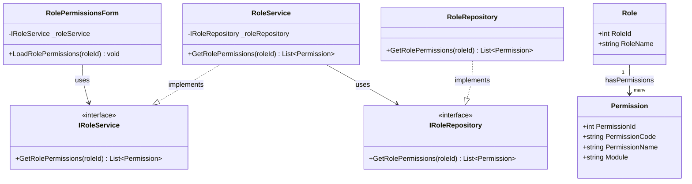

### Sequence Diagram

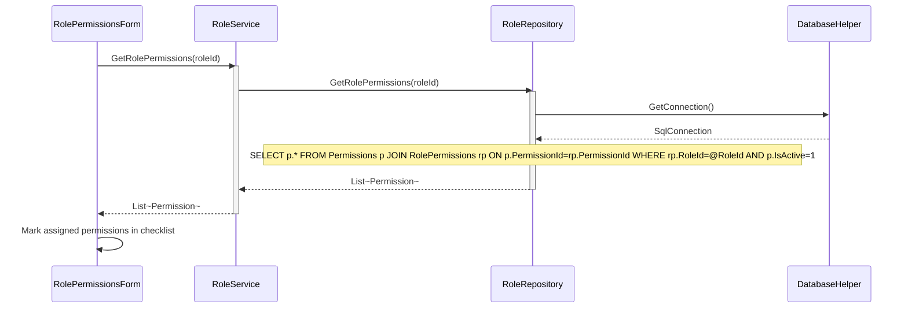

---

## UC-09: UpdateRole

### Class Diagram

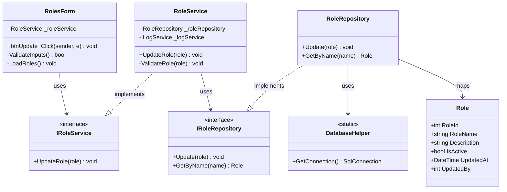

### Sequence Diagram

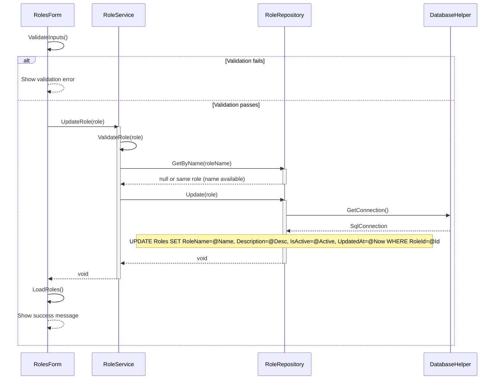

---
