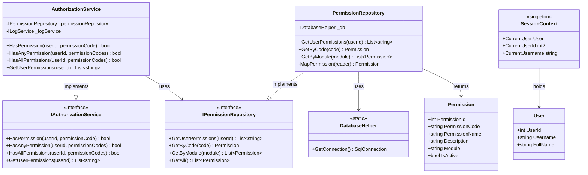
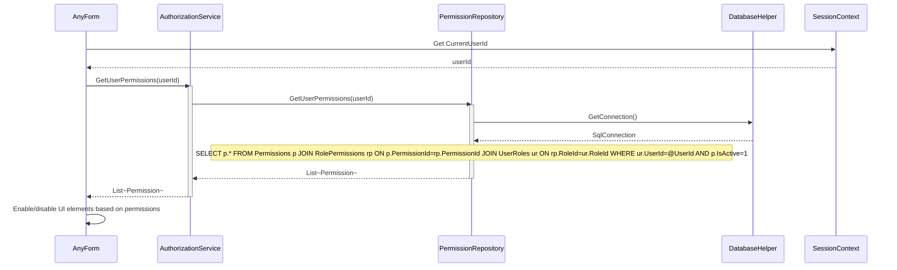
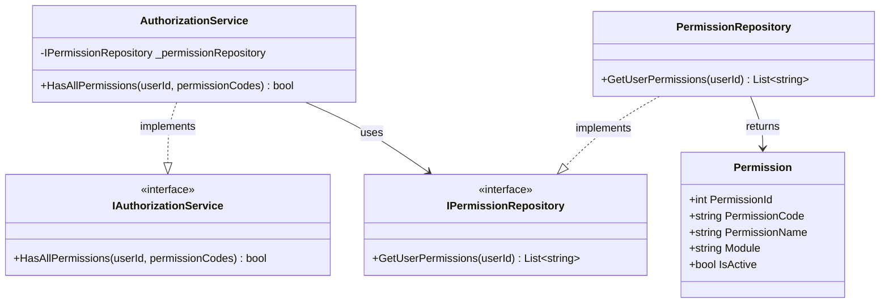
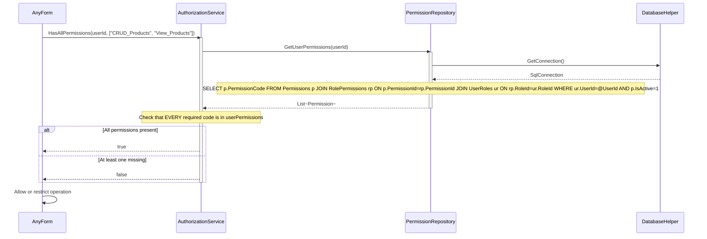
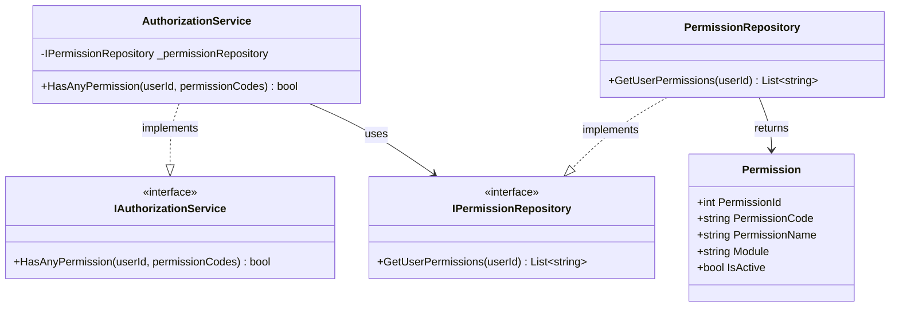
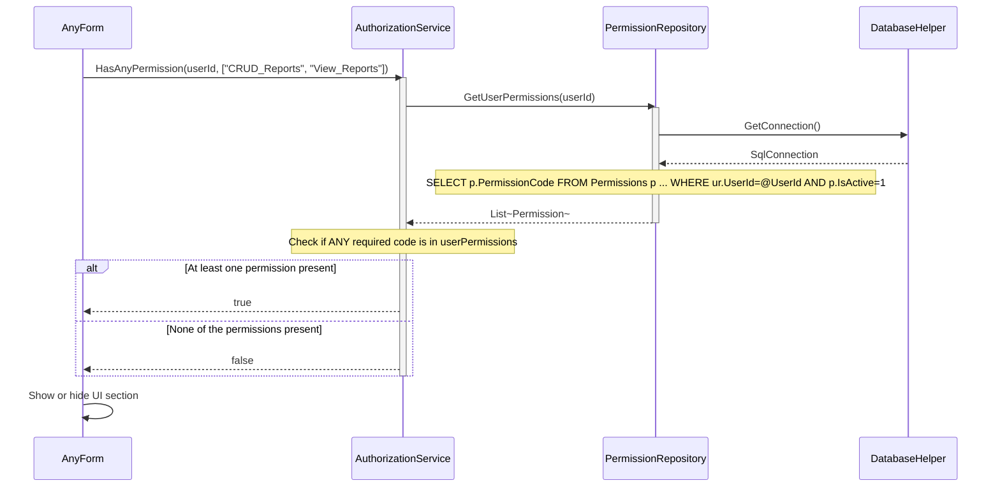
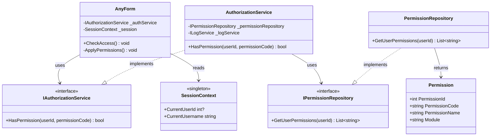
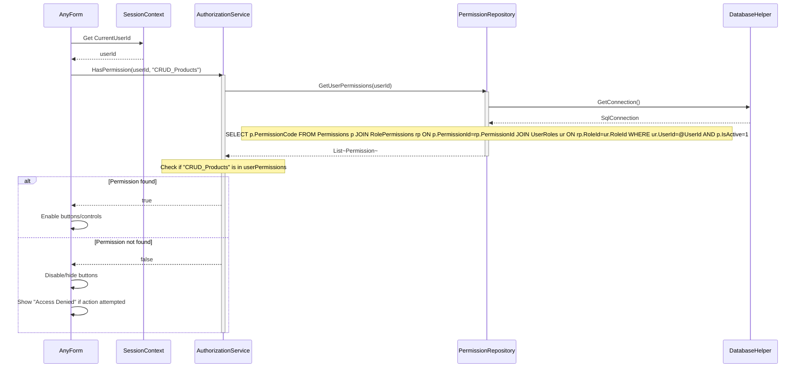

# Permissions & Authorization - Use Case Diagrams

This document contains UML Class Diagrams and Sequence Diagrams for all Permission and Authorization-related use cases.

---

## UC-01: GetUserPermissions

### Class Diagram

### Sequence Diagram

---

## UC-02: HasAllPermissions

### Class Diagram

### Sequence Diagram

---

## UC-03: HasAnyPermission

### Class Diagram

### Sequence Diagram

---

## UC-04: HasPermission

### Class Diagram

### Sequence Diagram

---
