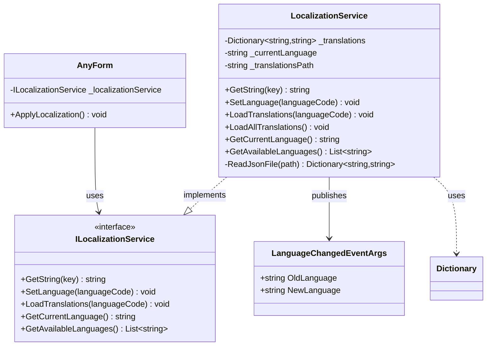
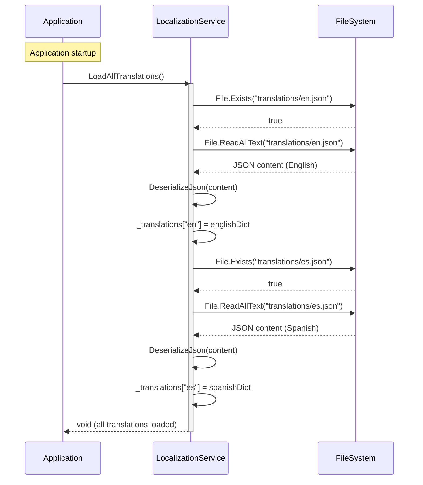
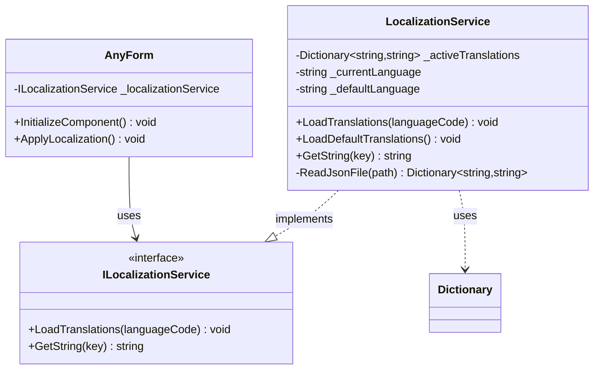
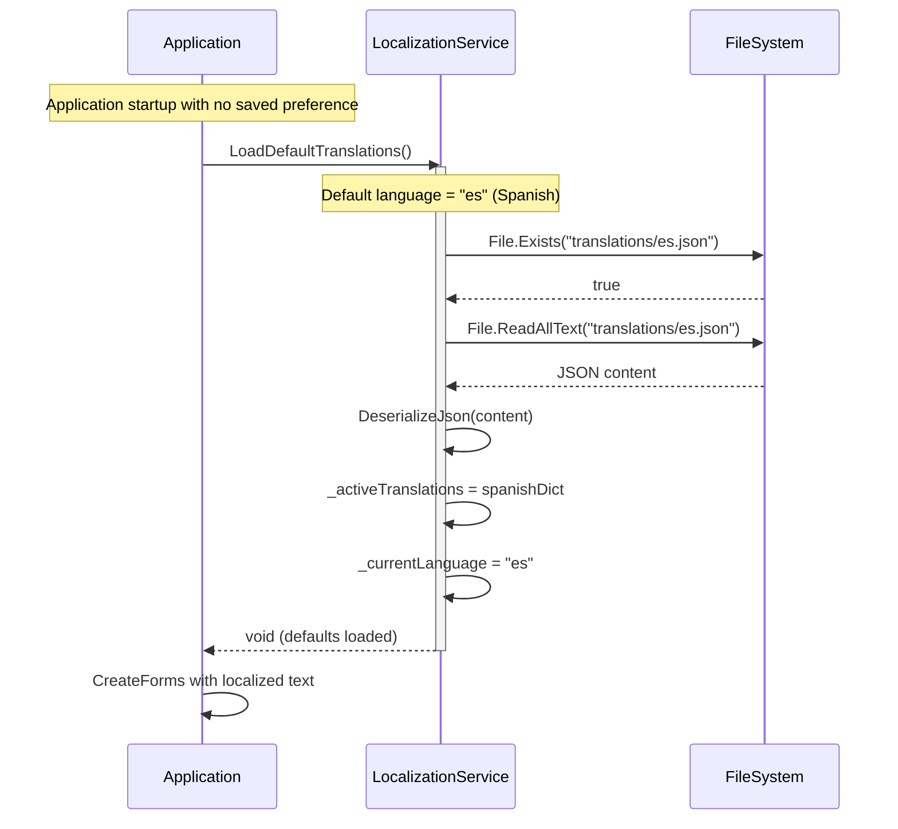
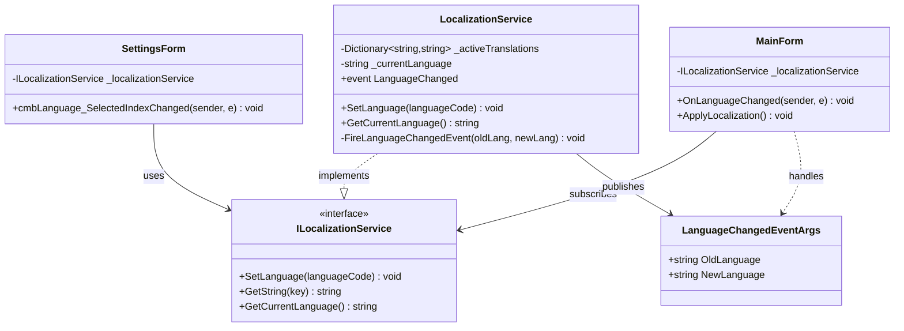
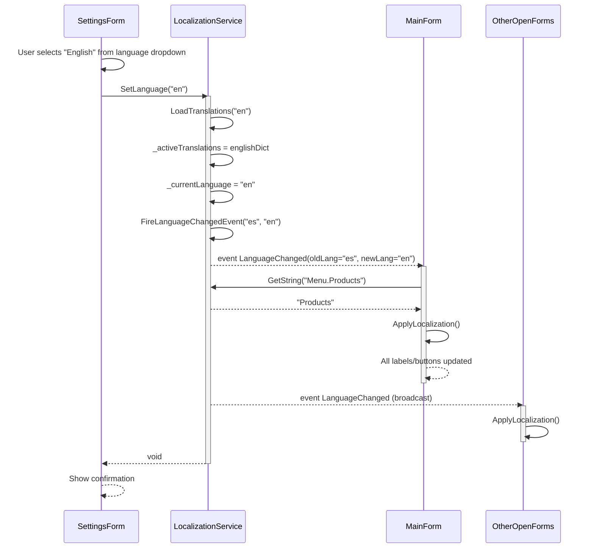
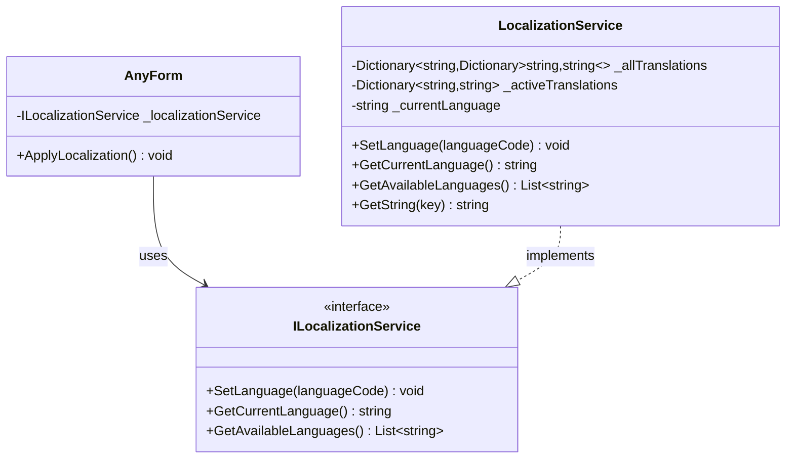
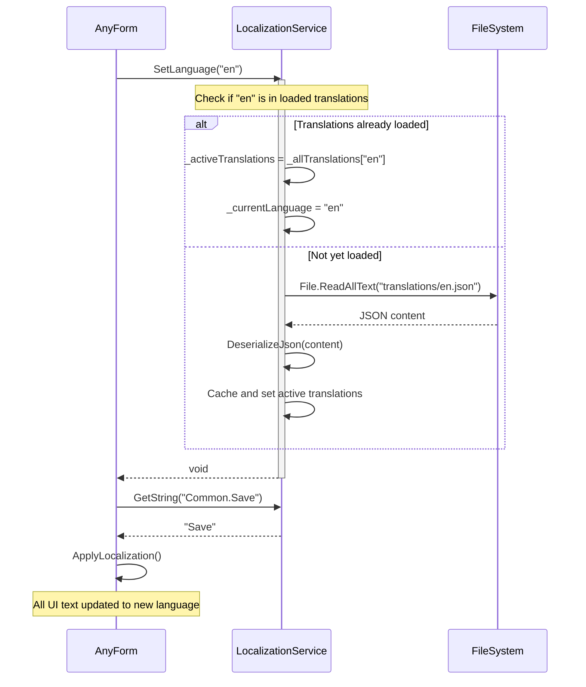

# Localization - Use Case Diagrams

This document contains UML Class Diagrams and Sequence Diagrams for all Localization-related use cases.

---

## UC-01: LoadAllTranslations

### Class Diagram

### Sequence Diagram

---

## UC-02: LoadDefaultTranslations

### Class Diagram

### Sequence Diagram

---

## UC-03: OnLanguageChanged

### Class Diagram

### Sequence Diagram

---

## UC-04: SetLanguage

### Class Diagram

### Sequence Diagram

---
