# UML Use Case Diagrams

This document contains UML Use Case Diagrams in Mermaid format for all subsystems of the **tp_diploma_nk_2026** inventory management system.  
Each diagram shows the **actors** involved and the **use cases** they can perform within each subsystem.

---

## Actors

| Actor | Description |
|-------|-------------|
| 👤 **Administrador** | Full system access: manages users, roles, permissions, warehouses and products |
| 👤 **Vendedor** | Sales operator: creates sales and manages clients |
| 👤 **Almacenista** | Warehouse operator: manages stock movements and warehouses |
| 👤 **Supervisor** | Oversight: consults reports and monitors stock |
| 👤 **Usuario** | Any authenticated user: login, logout and password change |
| ⚙️ **Sistema** | Internal system component: cross-cutting services (logging, localization) |

---

## 1. Autenticación / Login

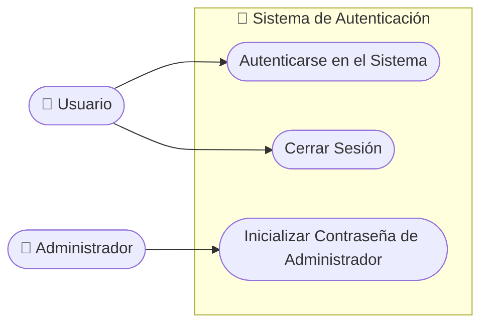

---

## 2. Gestión de Usuarios

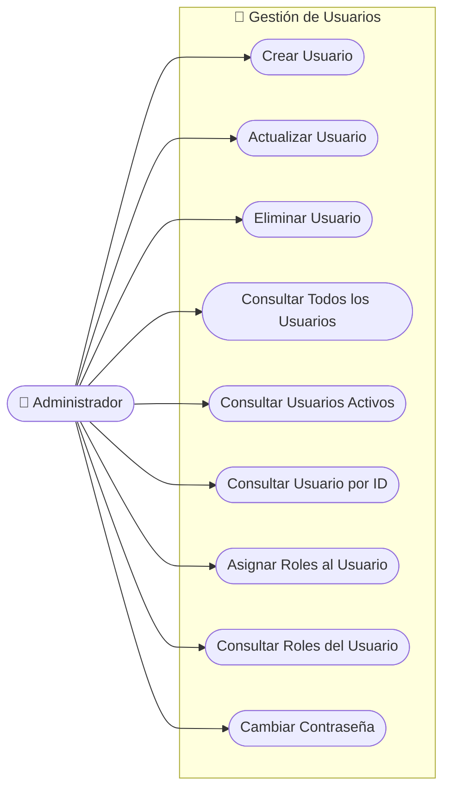

---

## 3. Gestión de Productos

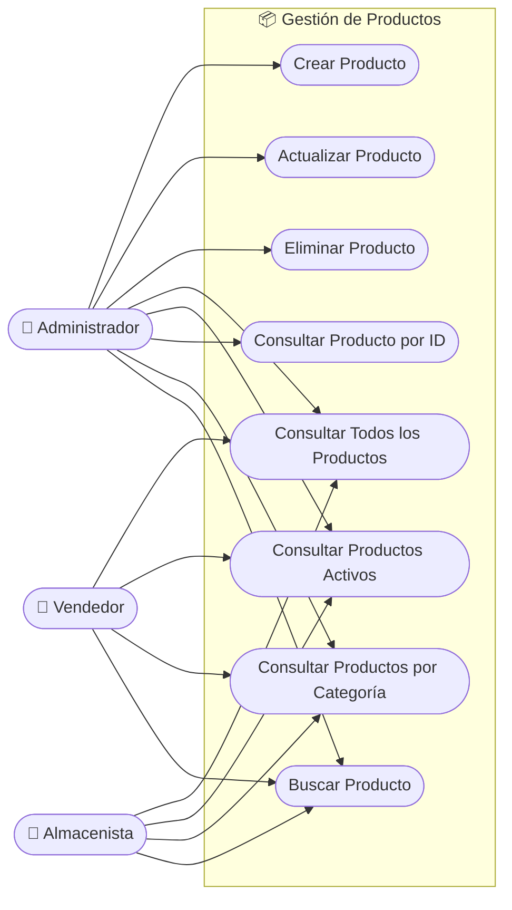

---

## 4. Gestión de Ventas

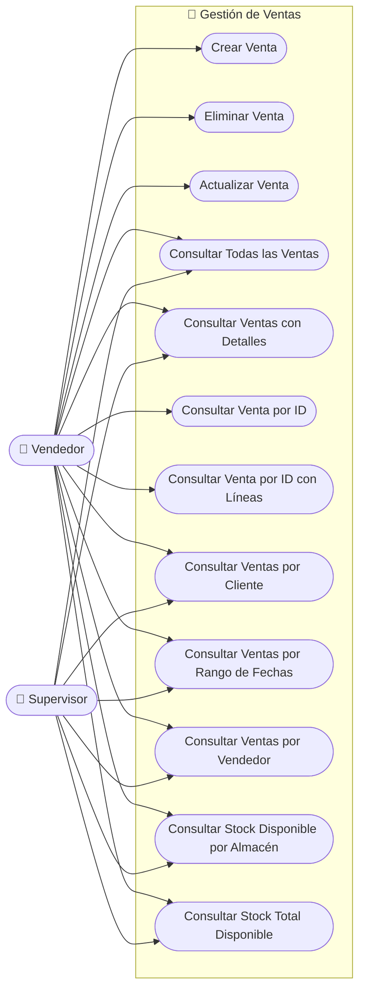

---

## 5. Gestión de Movimientos de Stock

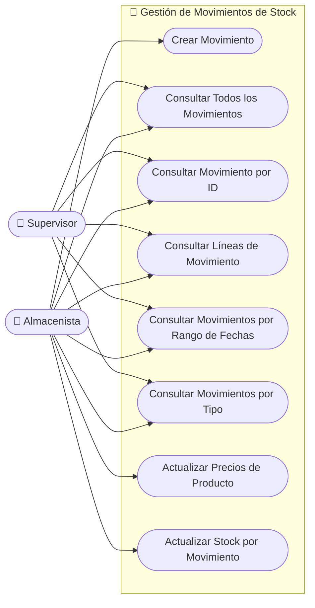

---

## 6. Gestión de Almacenes

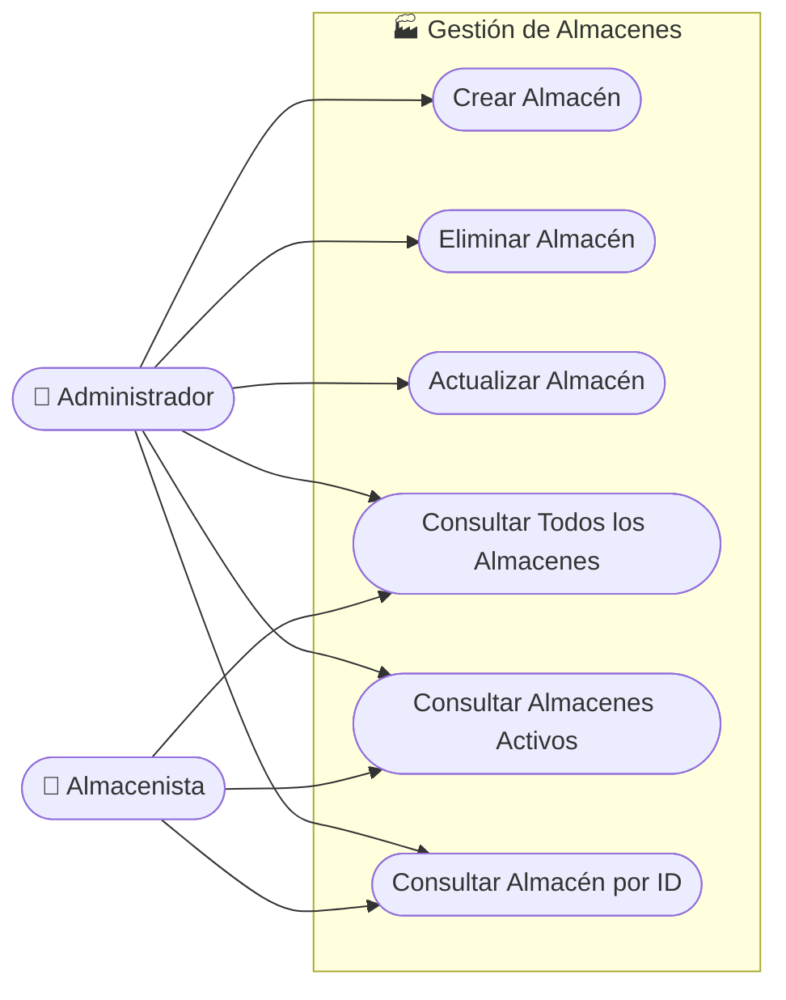

---

## 7. Gestión de Clientes

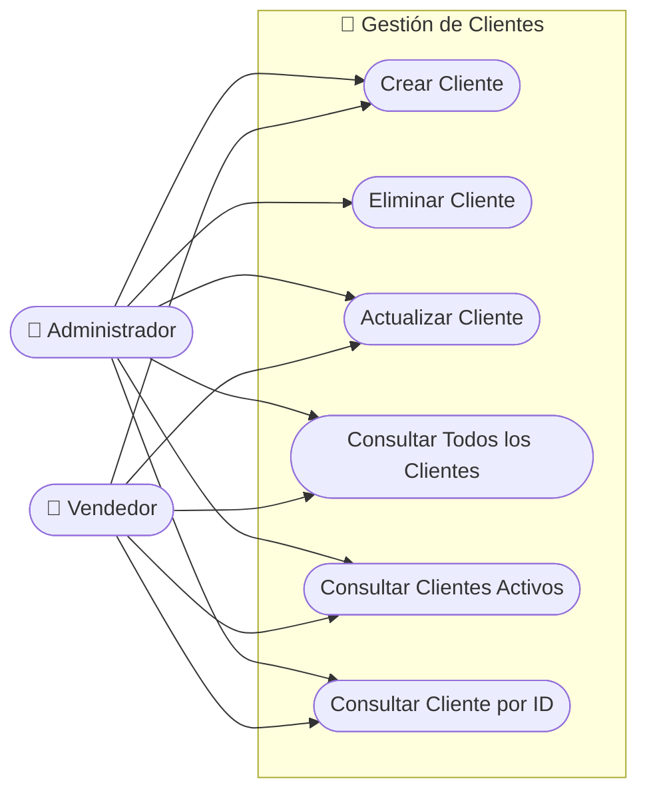

---

## 8. Gestión de Reportes

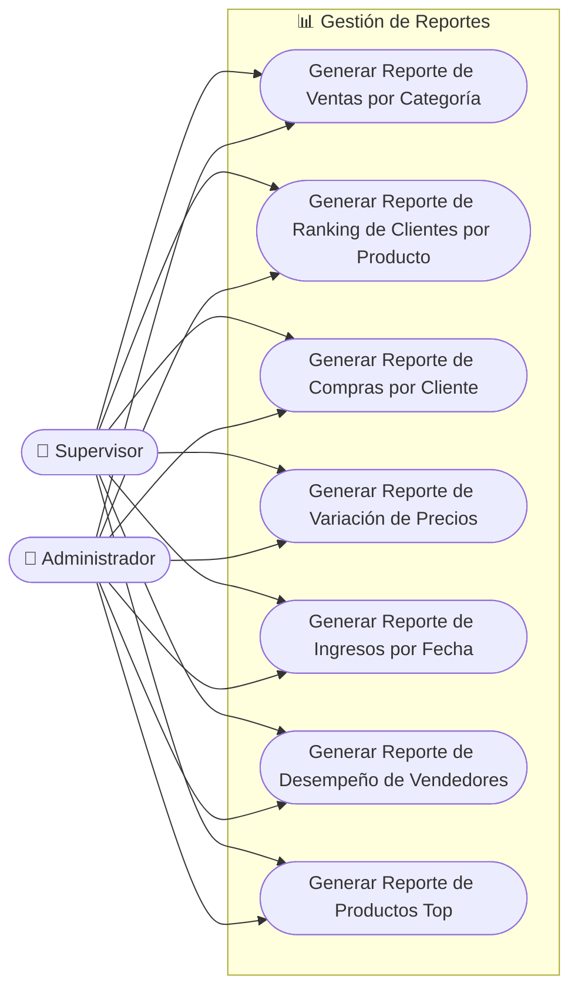

---

## 9. Gestión de Roles y Permisos

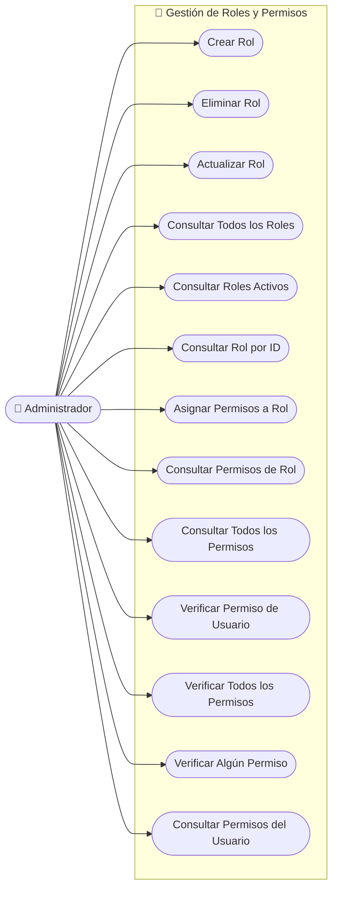

---

## 10. Localización del Sistema

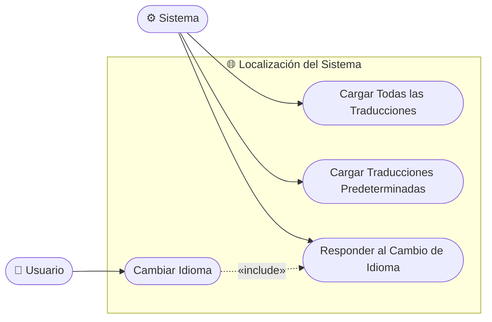

---

## Diagrama de Visión General del Sistema

```mermaid
flowchart TB
    admin(["👤 Administrador"])
    vendedor(["👤 Vendedor"])
    almacenista(["👤 Almacenista"])
    supervisor(["👤 Supervisor"])
    usuario(["👤 Usuario"])
    sistema(["⚙️ Sistema"])

    subgraph SYS["🏢 Sistema de Gestión de Inventario"]
        subgraph AUTH["🔐 Autenticación"]
            login(["Autenticarse"])
            logout(["Cerrar Sesión"])
        end
        subgraph MGMT["⚙️ Administración"]
            usermgmt(["Gestionar Usuarios"])
            rolesmgmt(["Gestionar Roles y Permisos"])
            whmgmt(["Gestionar Almacenes"])
        end
        subgraph OPS["📋 Operaciones"]
            prodmgmt(["Gestionar Productos"])
            clientmgmt(["Gestionar Clientes"])
            salesmgmt(["Gestionar Ventas"])
            movmgmt(["Gestionar Movimientos de Stock"])
        end
        subgraph INTEL["📊 Inteligencia de Negocio"]
            reportsmgmt(["Generar Reportes"])
        end
        subgraph CROSS["🔧 Servicios Transversales"]
            localization(["Localización"])
            logging(["Registro de Auditoría"])
        end
    end

    usuario --> login
    usuario --> logout
    admin --> usermgmt
    admin --> rolesmgmt
    admin --> whmgmt
    admin --> prodmgmt
    admin --> clientmgmt
    admin --> reportsmgmt
    vendedor --> salesmgmt
    vendedor --> clientmgmt
    vendedor --> prodmgmt
    almacenista --> movmgmt
    almacenista --> whmgmt
    almacenista --> prodmgmt
    supervisor --> reportsmgmt
    supervisor --> movmgmt
    supervisor --> salesmgmt
    sistema --> localization
    sistema --> logging
```

---

**Last Updated**: 2026-02-23  
**Version**: 1.0  
**Author**: Development Team
