# UML Use Case Diagrams

This document contains UML Use Case Diagrams in Mermaid format for all subsystems of the **tp_diploma_nk_2026** inventory management system.  
Each diagram shows the **actors**, the **use cases** they can perform, and the **relationships** between use cases.

## Relationship Legend

| Notation | Meaning |
|----------|---------|
| `Actor --> UC` | Association: actor initiates the use case |
| `UC -.->|"«include»"| UC2` | Include: UC always invokes UC2 as a mandatory sub-behavior |
| `UC -.->|"«extend»"| UC2` | Extend: UC optionally extends UC2 with additional behavior |

> **Note:** Support use cases (shaded in diagrams) are only triggered via «include» or «extend», not directly by actors.

---

## Actors

| Actor | Description |
|-------|-------------|
| 👤 **Administrador** | Full system access: manages users, roles, permissions, warehouses and products |
| 👤 **Vendedor** | Sales operator: creates sales and manages clients |
| 👤 **Almacenista** | Warehouse operator: manages stock movements and warehouses |
| 👤 **Supervisor** | Oversight: consults reports and monitors stock |
| 👤 **Usuario** | Any authenticated user: login, logout and password change |
| ⚙️ **Sistema** | Internal system component: cross-cutting services (logging, localization) |

---

## 1. Autenticación / Login

```mermaid
flowchart LR
    usuario(["👤 Usuario"])
    admin(["👤 Administrador"])

    subgraph LOGIN["🔐 Sistema de Autenticación"]
        uc1(["Autenticarse en el Sistema"])
        uc2(["Cerrar Sesión"])
        uc3(["Inicializar Contraseña de Administrador"])
        ucV(["Verificar Credenciales\n―support―"])
        ucU(["Registrar Último Acceso\n―support―"])
        ucH(["Hashear Contraseña\n―support―"])
        ucR(["Registrar Evento de Sesión\n―support―"])
    end

    usuario --> uc1
    usuario --> uc2
    admin --> uc3

    uc1 -.->|"«include»"| ucV
    uc1 -.->|"«include»"| ucU
    uc1 -.->|"«include»"| ucR
    uc2 -.->|"«include»"| ucR
    uc3 -.->|"«include»"| ucH
```

---

## 2. Gestión de Usuarios

```mermaid
flowchart LR
    admin(["👤 Administrador"])

    subgraph USERS["👥 Gestión de Usuarios"]
        uc1(["Crear Usuario"])
        uc2(["Actualizar Usuario"])
        uc3(["Eliminar Usuario"])
        uc4(["Consultar Todos los Usuarios"])
        uc5(["Consultar Usuarios Activos"])
        uc6(["Consultar Usuario por ID"])
        uc7(["Asignar Roles al Usuario"])
        uc8(["Consultar Roles del Usuario"])
        uc9(["Cambiar Contraseña"])
        ucV(["Validar Datos del Usuario\n―support―"])
        ucP(["Verificar Contraseña Actual\n―support―"])
        ucA(["Registrar Auditoría\n―support―"])
        uc5 -.->|"«extend»"| uc4
    end

    admin --> uc1
    admin --> uc2
    admin --> uc3
    admin --> uc4
    admin --> uc5
    admin --> uc6
    admin --> uc7
    admin --> uc8
    admin --> uc9

    uc1 -.->|"«include»"| ucV
    uc2 -.->|"«include»"| ucV
    uc2 -.->|"«include»"| uc6
    uc3 -.->|"«include»"| uc6
    uc7 -.->|"«include»"| uc8
    uc9 -.->|"«include»"| ucP
    uc1 -.->|"«include»"| ucA
    uc2 -.->|"«include»"| ucA
    uc3 -.->|"«include»"| ucA
    uc7 -.->|"«include»"| ucA
    uc9 -.->|"«include»"| ucA
```

---

## 3. Gestión de Productos

```mermaid
flowchart LR
    admin(["👤 Administrador"])
    vendedor(["👤 Vendedor"])
    almacenista(["👤 Almacenista"])

    subgraph PRODUCTS["📦 Gestión de Productos"]
        uc1(["Crear Producto"])
        uc2(["Actualizar Producto"])
        uc3(["Eliminar Producto"])
        uc4(["Consultar Todos los Productos"])
        uc5(["Consultar Productos Activos"])
        uc6(["Consultar Producto por ID"])
        uc7(["Consultar Productos por Categoría"])
        uc8(["Buscar Producto"])
        ucV(["Validar Datos del Producto\n―support―"])
        ucS(["Verificar SKU Único\n―support―"])
        ucA(["Registrar Auditoría\n―support―"])
        uc5 -.->|"«extend»"| uc4
        uc7 -.->|"«extend»"| uc5
        uc8 -.->|"«extend»"| uc4
    end

    admin --> uc1
    admin --> uc2
    admin --> uc3
    admin --> uc4
    admin --> uc5
    admin --> uc6
    admin --> uc7
    admin --> uc8
    vendedor --> uc4
    vendedor --> uc5
    vendedor --> uc7
    vendedor --> uc8
    almacenista --> uc4
    almacenista --> uc5
    almacenista --> uc7
    almacenista --> uc8

    uc1 -.->|"«include»"| ucV
    uc1 -.->|"«include»"| ucS
    uc2 -.->|"«include»"| ucV
    uc2 -.->|"«include»"| ucS
    uc2 -.->|"«include»"| uc6
    uc3 -.->|"«include»"| uc6
    uc1 -.->|"«include»"| ucA
    uc2 -.->|"«include»"| ucA
    uc3 -.->|"«include»"| ucA
```

---

## 4. Gestión de Ventas

```mermaid
flowchart LR
    vendedor(["👤 Vendedor"])
    supervisor(["👤 Supervisor"])

    subgraph SALES["🛒 Gestión de Ventas"]
        uc1(["Crear Venta"])
        uc2(["Eliminar Venta"])
        uc3(["Actualizar Venta"])
        uc4(["Consultar Todas las Ventas"])
        uc5(["Consultar Ventas con Detalles"])
        uc6(["Consultar Venta por ID"])
        uc7(["Consultar Venta por ID con Líneas"])
        uc8(["Consultar Ventas por Cliente"])
        uc9(["Consultar Ventas por Rango de Fechas"])
        uc10(["Consultar Ventas por Vendedor"])
        uc11(["Consultar Stock Disponible por Almacén"])
        uc12(["Consultar Stock Total Disponible"])
        ucV(["Validar Datos de Venta\n―support―"])
        ucSt(["Verificar Stock Disponible\n―support―"])
        ucD(["Descontar Inventario\n―support―"])
        ucA(["Registrar Auditoría\n―support―"])
        uc5 -.->|"«extend»"| uc4
        uc7 -.->|"«extend»"| uc6
        uc8 -.->|"«extend»"| uc4
        uc9 -.->|"«extend»"| uc4
        uc10 -.->|"«extend»"| uc4
        uc12 -.->|"«include»"| uc11
    end

    vendedor --> uc1
    vendedor --> uc2
    vendedor --> uc3
    vendedor --> uc4
    vendedor --> uc5
    vendedor --> uc6
    vendedor --> uc7
    vendedor --> uc8
    vendedor --> uc9
    vendedor --> uc10
    vendedor --> uc11
    vendedor --> uc12
    supervisor --> uc4
    supervisor --> uc5
    supervisor --> uc8
    supervisor --> uc9
    supervisor --> uc10
    supervisor --> uc11
    supervisor --> uc12

    uc1 -.->|"«include»"| ucV
    uc1 -.->|"«include»"| ucSt
    uc1 -.->|"«include»"| ucD
    ucSt -.->|"«include»"| uc12
    uc2 -.->|"«include»"| uc6
    uc3 -.->|"«include»"| uc6
    uc1 -.->|"«include»"| ucA
    uc2 -.->|"«include»"| ucA
    uc3 -.->|"«include»"| ucA
```

---

## 5. Gestión de Movimientos de Stock

```mermaid
flowchart LR
    almacenista(["👤 Almacenista"])
    supervisor(["👤 Supervisor"])

    subgraph MOVEMENTS["🔄 Gestión de Movimientos de Stock"]
        uc1(["Crear Movimiento"])
        uc2(["Consultar Todos los Movimientos"])
        uc3(["Consultar Movimiento por ID"])
        uc4(["Consultar Líneas de Movimiento"])
        uc5(["Consultar Movimientos por Rango de Fechas"])
        uc6(["Consultar Movimientos por Tipo"])
        uc7(["Actualizar Precios de Producto"])
        uc8(["Actualizar Stock por Movimiento"])
        ucVal(["Validar Movimiento\n―support―"])
        ucSt(["Verificar Stock Suficiente\n―support―"])
        ucA(["Registrar Auditoría\n―support―"])
        uc5 -.->|"«extend»"| uc2
        uc6 -.->|"«extend»"| uc2
        uc4 -.->|"«include»"| uc3
        uc1 -.->|"«extend»"| uc7
    end

    almacenista --> uc1
    almacenista --> uc2
    almacenista --> uc3
    almacenista --> uc4
    almacenista --> uc5
    almacenista --> uc6
    almacenista --> uc7
    almacenista --> uc8
    supervisor --> uc2
    supervisor --> uc3
    supervisor --> uc4
    supervisor --> uc5
    supervisor --> uc6

    uc1 -.->|"«include»"| ucVal
    uc1 -.->|"«include»"| uc8
    ucVal -.->|"«extend»"| ucSt
    uc1 -.->|"«include»"| ucA
```

---

## 6. Gestión de Almacenes

```mermaid
flowchart LR
    admin(["👤 Administrador"])
    almacenista(["👤 Almacenista"])

    subgraph WAREHOUSES["🏭 Gestión de Almacenes"]
        uc1(["Crear Almacén"])
        uc2(["Eliminar Almacén"])
        uc3(["Actualizar Almacén"])
        uc4(["Consultar Todos los Almacenes"])
        uc5(["Consultar Almacenes Activos"])
        uc6(["Consultar Almacén por ID"])
        ucV(["Validar Datos del Almacén\n―support―"])
        ucC(["Verificar Código Único\n―support―"])
        ucA(["Registrar Auditoría\n―support―"])
        uc5 -.->|"«extend»"| uc4
    end

    admin --> uc1
    admin --> uc2
    admin --> uc3
    admin --> uc4
    admin --> uc5
    admin --> uc6
    almacenista --> uc4
    almacenista --> uc5
    almacenista --> uc6

    uc1 -.->|"«include»"| ucV
    uc1 -.->|"«include»"| ucC
    uc3 -.->|"«include»"| ucV
    uc3 -.->|"«include»"| ucC
    uc3 -.->|"«include»"| uc6
    uc2 -.->|"«include»"| uc6
    uc1 -.->|"«include»"| ucA
    uc2 -.->|"«include»"| ucA
    uc3 -.->|"«include»"| ucA
```

---

## 7. Gestión de Clientes

```mermaid
flowchart LR
    admin(["👤 Administrador"])
    vendedor(["👤 Vendedor"])

    subgraph CLIENTS["🤝 Gestión de Clientes"]
        uc1(["Crear Cliente"])
        uc2(["Eliminar Cliente"])
        uc3(["Actualizar Cliente"])
        uc4(["Consultar Todos los Clientes"])
        uc5(["Consultar Clientes Activos"])
        uc6(["Consultar Cliente por ID"])
        ucV(["Validar Datos del Cliente\n―support―"])
        ucD(["Verificar DNI Único\n―support―"])
        ucA(["Registrar Auditoría\n―support―"])
        uc5 -.->|"«extend»"| uc4
    end

    admin --> uc1
    admin --> uc2
    admin --> uc3
    admin --> uc4
    admin --> uc5
    admin --> uc6
    vendedor --> uc1
    vendedor --> uc3
    vendedor --> uc4
    vendedor --> uc5
    vendedor --> uc6

    uc1 -.->|"«include»"| ucV
    uc1 -.->|"«include»"| ucD
    uc3 -.->|"«include»"| ucV
    uc3 -.->|"«include»"| ucD
    uc3 -.->|"«include»"| uc6
    uc2 -.->|"«include»"| uc6
    uc1 -.->|"«include»"| ucA
    uc2 -.->|"«include»"| ucA
    uc3 -.->|"«include»"| ucA
```

---

## 8. Gestión de Reportes

```mermaid
flowchart LR
    supervisor(["👤 Supervisor"])
    admin(["👤 Administrador"])

    subgraph REPORTS["📊 Gestión de Reportes"]
        uc1(["Generar Reporte de Ventas por Categoría"])
        uc2(["Generar Reporte de Ranking de Clientes por Producto"])
        uc3(["Generar Reporte de Compras por Cliente"])
        uc4(["Generar Reporte de Variación de Precios"])
        uc5(["Generar Reporte de Ingresos por Fecha"])
        uc6(["Generar Reporte de Desempeño de Vendedores"])
        uc7(["Generar Reporte de Productos Top"])
        ucP(["Verificar Permisos del Usuario\n―support―"])
        ucF(["Aplicar Filtro de Fechas\n―support―"])
        ucE(["Exportar a Excel\n―support―"])
        ucI(["Imprimir Reporte\n―support―"])
    end

    supervisor --> uc1
    supervisor --> uc2
    supervisor --> uc3
    supervisor --> uc4
    supervisor --> uc5
    supervisor --> uc6
    supervisor --> uc7
    admin --> uc1
    admin --> uc2
    admin --> uc3
    admin --> uc4
    admin --> uc5
    admin --> uc6
    admin --> uc7

    uc1 -.->|"«include»"| ucP
    uc2 -.->|"«include»"| ucP
    uc3 -.->|"«include»"| ucP
    uc4 -.->|"«include»"| ucP
    uc5 -.->|"«include»"| ucP
    uc6 -.->|"«include»"| ucP
    uc7 -.->|"«include»"| ucP

    uc1 -.->|"«include»"| ucF
    uc2 -.->|"«include»"| ucF
    uc3 -.->|"«include»"| ucF
    uc5 -.->|"«include»"| ucF
    uc6 -.->|"«include»"| ucF

    uc1 -.->|"«extend»"| ucE
    uc2 -.->|"«extend»"| ucE
    uc3 -.->|"«extend»"| ucE
    uc4 -.->|"«extend»"| ucE
    uc5 -.->|"«extend»"| ucE
    uc6 -.->|"«extend»"| ucE
    uc7 -.->|"«extend»"| ucE

    uc1 -.->|"«extend»"| ucI
    uc2 -.->|"«extend»"| ucI
    uc3 -.->|"«extend»"| ucI
    uc4 -.->|"«extend»"| ucI
    uc5 -.->|"«extend»"| ucI
    uc6 -.->|"«extend»"| ucI
    uc7 -.->|"«extend»"| ucI
```

---

## 9. Gestión de Roles y Permisos

```mermaid
flowchart LR
    admin(["👤 Administrador"])

    subgraph ROLES["🔑 Gestión de Roles y Permisos"]
        uc1(["Crear Rol"])
        uc2(["Eliminar Rol"])
        uc3(["Actualizar Rol"])
        uc4(["Consultar Todos los Roles"])
        uc5(["Consultar Roles Activos"])
        uc6(["Consultar Rol por ID"])
        uc7(["Asignar Permisos a Rol"])
        uc8(["Consultar Permisos de Rol"])
        uc9(["Consultar Todos los Permisos"])
        uc10(["Verificar Permiso de Usuario"])
        uc11(["Verificar Todos los Permisos"])
        uc12(["Verificar Algún Permiso"])
        uc13(["Consultar Permisos del Usuario"])
        ucV(["Validar Datos del Rol\n―support―"])
        ucA(["Registrar Auditoría\n―support―"])
        uc5 -.->|"«extend»"| uc4
    end

    admin --> uc1
    admin --> uc2
    admin --> uc3
    admin --> uc4
    admin --> uc5
    admin --> uc6
    admin --> uc7
    admin --> uc8
    admin --> uc9
    admin --> uc10
    admin --> uc11
    admin --> uc12
    admin --> uc13

    uc1 -.->|"«include»"| ucV
    uc3 -.->|"«include»"| ucV
    uc3 -.->|"«include»"| uc6
    uc2 -.->|"«include»"| uc6
    uc7 -.->|"«include»"| uc6
    uc7 -.->|"«include»"| uc8
    uc7 -.->|"«include»"| uc9
    uc11 -.->|"«include»"| uc10
    uc12 -.->|"«include»"| uc10
    uc10 -.->|"«include»"| uc13
    uc1 -.->|"«include»"| ucA
    uc2 -.->|"«include»"| ucA
    uc3 -.->|"«include»"| ucA
    uc7 -.->|"«include»"| ucA
```

---

## 10. Localización del Sistema

```mermaid
flowchart LR
    sistema(["⚙️ Sistema"])
    usuario(["👤 Usuario"])

    subgraph LOCALIZATION["🌐 Localización del Sistema"]
        uc1(["Cargar Todas las Traducciones"])
        uc2(["Cargar Traducciones Predeterminadas"])
        uc3(["Cambiar Idioma"])
        uc4(["Responder al Cambio de Idioma"])
    end

    sistema --> uc1
    sistema --> uc2
    sistema --> uc4
    usuario --> uc3

    uc2 -.->|"«include»"| uc1
    uc3 -.->|"«include»"| uc4
    uc4 -.->|"«include»"| uc1
```

---

## Diagrama de Visión General del Sistema

```mermaid
flowchart TB
    admin(["👤 Administrador"])
    vendedor(["👤 Vendedor"])
    almacenista(["👤 Almacenista"])
    supervisor(["👤 Supervisor"])
    usuario(["👤 Usuario"])
    sistema(["⚙️ Sistema"])

    subgraph SYS["🏢 Sistema de Gestión de Inventario"]
        subgraph AUTH["🔐 Autenticación"]
            login(["Autenticarse"])
            logout(["Cerrar Sesión"])
        end
        subgraph MGMT["⚙️ Administración"]
            usermgmt(["Gestionar Usuarios"])
            rolesmgmt(["Gestionar Roles y Permisos"])
            whmgmt(["Gestionar Almacenes"])
        end
        subgraph OPS["📋 Operaciones"]
            prodmgmt(["Gestionar Productos"])
            clientmgmt(["Gestionar Clientes"])
            salesmgmt(["Gestionar Ventas"])
            movmgmt(["Gestionar Movimientos de Stock"])
        end
        subgraph INTEL["📊 Inteligencia de Negocio"]
            reportsmgmt(["Generar Reportes"])
        end
        subgraph CROSS["🔧 Servicios Transversales"]
            authn(["Validar Sesión de Usuario"])
            authz(["Verificar Permisos de Acceso"])
            logging(["Registrar Auditoría"])
            localization(["Localización"])
        end
    end

    usuario --> login
    usuario --> logout
    admin --> usermgmt
    admin --> rolesmgmt
    admin --> whmgmt
    admin --> prodmgmt
    admin --> clientmgmt
    admin --> reportsmgmt
    vendedor --> salesmgmt
    vendedor --> clientmgmt
    vendedor --> prodmgmt
    almacenista --> movmgmt
    almacenista --> whmgmt
    almacenista --> prodmgmt
    supervisor --> reportsmgmt
    supervisor --> movmgmt
    supervisor --> salesmgmt
    sistema --> localization
    sistema --> logging

    usermgmt -.->|"«include»"| authn
    rolesmgmt -.->|"«include»"| authn
    whmgmt -.->|"«include»"| authn
    prodmgmt -.->|"«include»"| authn
    clientmgmt -.->|"«include»"| authn
    salesmgmt -.->|"«include»"| authn
    movmgmt -.->|"«include»"| authn
    reportsmgmt -.->|"«include»"| authn

    usermgmt -.->|"«include»"| authz
    rolesmgmt -.->|"«include»"| authz
    whmgmt -.->|"«include»"| authz
    prodmgmt -.->|"«include»"| authz
    clientmgmt -.->|"«include»"| authz
    salesmgmt -.->|"«include»"| authz
    movmgmt -.->|"«include»"| authz
    reportsmgmt -.->|"«include»"| authz

    salesmgmt -.->|"«include»"| prodmgmt
    salesmgmt -.->|"«include»"| clientmgmt
    movmgmt -.->|"«include»"| prodmgmt
    movmgmt -.->|"«include»"| whmgmt
    reportsmgmt -.->|"«include»"| salesmgmt
    reportsmgmt -.->|"«include»"| prodmgmt
    reportsmgmt -.->|"«include»"| clientmgmt
```

---

**Last Updated**: 2026-02-23  
**Version**: 2.0  
**Author**: Development Team
