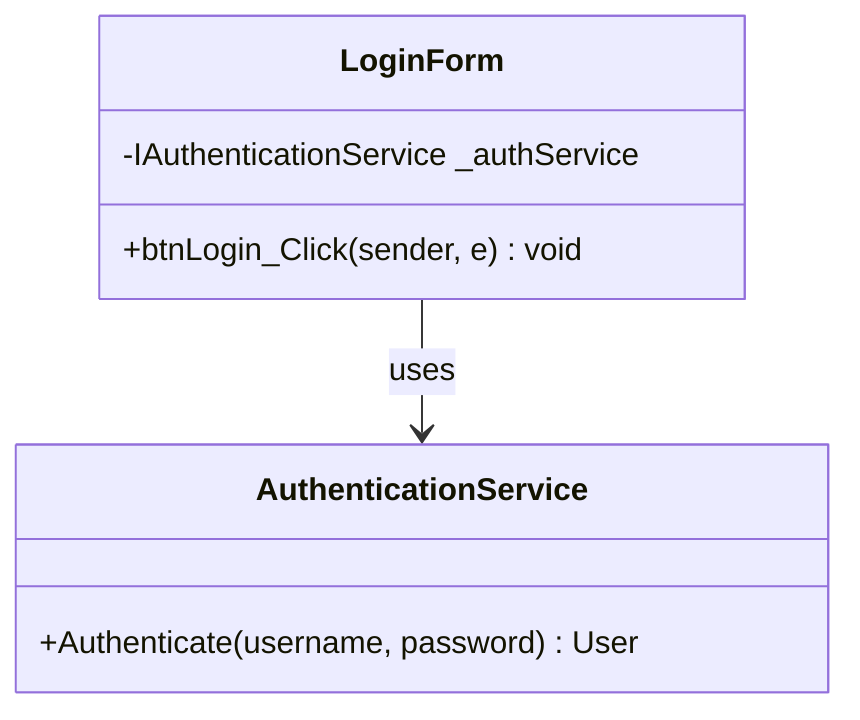

# UML Diagrams Documentation

This directory contains comprehensive UML class diagrams and sequence diagrams for all major processes in the **tp_diploma_nk_2026** inventory management system. All diagrams are provided in **Mermaid format** following UML standards and show the complete layer communication (UI → BLL → DAO → Services).

## 📋 Table of Contents

- [Overview](#overview)
- [Architecture Layers](#architecture-layers)
- [Diagram Index](#diagram-index)
- [How to Use](#how-to-use)
- [Mermaid Rendering](#mermaid-rendering)

---

## 🏗️ Overview

The system follows a layered architecture pattern with clear separation of concerns:

- **UI Layer**: Windows Forms for user interface
- **BLL Layer**: Business Logic Layer for business rules
- **DAO Layer**: Data Access Objects for database operations
- **Services Layer**: Cross-cutting concerns (authentication, authorization, logging, localization)
- **Domain Layer**: Entities and DTOs

Each process includes:
1. **Class Diagram**: Shows classes, attributes, methods, and relationships
2. **Sequence Diagram**: Shows interaction flow between layers

---

## 🏛️ Architecture Layers

```
┌─────────────────────────────────────────────────────────┐
│  UI LAYER (Windows Forms)                               │
│  - LoginForm, UsersForm, SalesForm, etc.                │
└────────────────────┬────────────────────────────────────┘
                     │ uses
                     ▼
┌─────────────────────────────────────────────────────────┐
│  BLL LAYER (Business Logic)                             │
│  - UserService, SaleService, StockMovementService, etc. │
└────────────────────┬────────────────────────────────────┘
                     │ calls
        ┌────────────┴──────────────┐
        ▼                           ▼
┌───────────────────────┐  ┌───────────────────────────┐
│  DAO LAYER            │  │  SERVICES LAYER           │
│  - UserRepository     │  │  - AuthenticationService  │
│  - SaleRepository     │  │  - AuthorizationService   │
│  - ProductRepository  │  │  - LocalizationService    │
│  - DatabaseHelper     │  │  - LogService             │
└───────────┬───────────┘  └───────────────────────────┘
            │ returns
            ▼
┌─────────────────────────────────────────────────────────┐
│  DOMAIN LAYER                                            │
│  - Entities: User, Sale, Product, Stock, etc.            │
│  - DTOs: Report DTOs                                     │
│  - Enums: MovementType, AuditAction, LogLevel           │
└─────────────────────────────────────────────────────────┘
```

---

## 📊 Diagram Index

### 1. Login Process
- **[01_Login_Process_Class_Diagram.md](./01_Login_Process_Class_Diagram.md)**
  - Classes: LoginForm, AuthenticationService, UserRepository, SessionContext
  - Layer Flow: UI → Services → DAO → Domain
  - Security: PBKDF2 password hashing with salt

- **[02_Login_Process_Sequence_Diagram.md](./02_Login_Process_Sequence_Diagram.md)**
  - Flow: Form load → Input validation → Authentication → Session establishment
  - Key Operations: Password verification, last login update, session context setting

---

### 2. User Management Process
- **[03_User_Management_Process_Class_Diagram.md](./03_User_Management_Process_Class_Diagram.md)**
  - Classes: UsersForm, UserService, UserRepository, AuditLogRepository
  - Operations: Create, Update, Delete, Assign Roles
  - Validation: Username uniqueness, email uniqueness, password strength

- **[04_User_Management_Process_Sequence_Diagram.md](./04_User_Management_Process_Sequence_Diagram.md)**
  - Flow: Create User with password hashing and audit logging
  - Key Operations: Validation, duplication check, password hashing, audit trail

---

### 3. Sales Management Process
- **[05_Sales_Management_Process_Class_Diagram.md](./05_Sales_Management_Process_Class_Diagram.md)**
  - Classes: SalesForm, SaleService, SaleRepository, ClientRepository, ProductRepository, StockRepository
  - Relationships: Sale → SaleLines → Products, Client association
  - Business Rules: Stock validation, automatic number generation

- **[06_Sales_Management_Process_Sequence_Diagram.md](./06_Sales_Management_Process_Sequence_Diagram.md)**
  - Flow: Create Sale with lines, stock validation, inventory deduction
  - Key Operations: Sale lines, stock checks, transaction management, inventory updates

---

### 4. Stock Movement Process
- **[07_Stock_Movement_Process_Class_Diagram.md](./07_Stock_Movement_Process_Class_Diagram.md)**
  - Classes: StockMovementForm, StockMovementService, StockMovementRepository, StockRepository
  - Movement Types: Entry, Exit, Transfer, Adjustment
  - Warehouse Management: Source and destination tracking

- **[08_Stock_Movement_Process_Sequence_Diagram.md](./08_Stock_Movement_Process_Sequence_Diagram.md)**
  - Flow: Transfer Movement between warehouses with stock updates
  - Key Operations: Stock validation, dual warehouse updates, transaction safety

---

### 5. Reports Management Process
- **[09_Reports_Management_Process_Class_Diagram.md](./09_Reports_Management_Process_Class_Diagram.md)**
  - Classes: ReportsForm, ReportService, ReportRepository
  - Report Types: Top Products, Client Purchases, Price Variation, Seller Performance, Category Sales, Low Stock, Stock Movements
  - DTOs: Specialized report DTOs for each report type

- **[10_Reports_Management_Process_Sequence_Diagram.md](./10_Reports_Management_Process_Sequence_Diagram.md)**
  - Flow: Top Products Report generation with filtering and export
  - Key Operations: Complex SQL aggregation, dynamic filtering, export to Excel

---

### 6. Role & Permissions Management Process
- **[11_Role_Permissions_Process_Class_Diagram.md](./11_Role_Permissions_Process_Class_Diagram.md)**
  - Classes: RolesForm, RolePermissionsForm, RoleService, AuthorizationService, PermissionRepository
  - RBAC Model: User → Roles → Permissions
  - Permission Categories: 40+ permissions across 9 categories

- **[12_Role_Permissions_Process_Sequence_Diagram.md](./12_Role_Permissions_Process_Sequence_Diagram.md)**
  - Flow: Assign permissions to role with cache invalidation
  - Key Operations: Permission assignment, transaction management, cache invalidation, real-time effect

---

## 🎯 How to Use

### For Developers
1. **Understanding Architecture**: Start with class diagrams to understand system structure
2. **Implementing Features**: Use sequence diagrams to understand interaction flow
3. **Debugging**: Follow sequence diagrams to trace execution flow
4. **Code Review**: Reference diagrams to ensure adherence to architecture

### For Architects
1. **System Design**: Use as reference for architectural decisions
2. **Documentation**: Keep diagrams updated as system evolves
3. **Training**: Use diagrams to onboard new team members
4. **Communication**: Share with stakeholders to explain system design

### For Business Analysts
1. **Process Understanding**: Sequence diagrams show complete business flow
2. **Requirements Validation**: Verify business rules are correctly implemented
3. **Gap Analysis**: Compare diagrams with requirements to find gaps

---

## 🖼️ Mermaid Rendering

All diagrams are in Mermaid format and can be rendered in:

### GitHub
Simply view the `.md` files on GitHub - Mermaid diagrams render automatically

### VS Code
Install the **Mermaid Preview** extension:
```
ext install bierner.markdown-mermaid
```

### Online Editors
- [Mermaid Live Editor](https://mermaid.live/)
- Copy/paste the diagram code from markdown files

### Documentation Sites
- GitHub Pages
- GitBook
- MkDocs with Mermaid plugin

### Example Rendering



---

## 📐 Diagram Standards

All diagrams follow these standards:

### Class Diagrams
- **Visibility**: - (private), + (public), # (protected)
- **Types**: Return types and parameter types specified
- **Relationships**: 
  - `-->` uses/dependency
  - `--|>` inheritance/implements
  - `--*` composition
  - `--o` aggregation

### Sequence Diagrams
- **Participants**: Organized top-to-bottom by layer
- **Activation**: Shows when objects are active
- **Alt/Opt/Loop**: Control flow clearly marked
- **Notes**: Explain complex operations

---

## 🔄 Maintenance

### Keeping Diagrams Updated
1. **Code Changes**: Update diagrams when changing class structure or flow
2. **New Features**: Add diagrams for new major features
3. **Refactoring**: Update diagrams to reflect architectural changes
4. **Documentation**: Keep this README updated with new diagrams

### Version Control
- All diagrams are version controlled with code
- Changes to diagrams should be part of feature branches
- Review diagrams during code review process

---

## 📚 Additional Resources

### Related Documentation
- [README.md](../../README.md) - Project overview
- [SETUP.md](../../SETUP.md) - Installation guide
- [PROJECT_SUMMARY.md](../../PROJECT_SUMMARY.md) - Technical summary
- [IMPLEMENTATION.md](../../IMPLEMENTATION.md) - Implementation details

### External References
- [Mermaid Documentation](https://mermaid.js.org/)
- [UML Class Diagram Guide](https://www.uml-diagrams.org/class-diagrams-overview.html)
- [UML Sequence Diagram Guide](https://www.uml-diagrams.org/sequence-diagrams.html)

---

## 📝 Notes

- All diagrams include **methods and attributes** as required
- **Layer communication** is clearly shown in all diagrams
- Diagrams follow **UML 2.0 standards**
- **Mermaid syntax** is validated and renderable
- Each process has both **class and sequence diagrams**

---

**Last Updated**: 2026-02-17  
**Version**: 1.0  
**Author**: Development Team
