# Documentación del Proyecto

**Stock Manager – Sistema integral de gestión de inventario y ventas para accesorios de celulares**

---

## 1. Visión general

### 1.1 Propósito

Stock Manager es una aplicación de escritorio desarrollada en .NET Framework 4.8 con interfaz WinForms que permite gestionar de forma integral el inventario y las ventas de una empresa comercializadora de accesorios de celulares. El sistema centraliza los procesos de alta, modificación y baja de productos, almacenes, clientes y ventas, el registro de movimientos de stock, la generación de reportes y el control de acceso basado en roles.

### 1.2 Alcance

| Área funcional | Descripción resumida |
|---|---|
| Gestión de productos | CRUD completo con SKU, categoría, precio y nivel mínimo de stock |
| Gestión de almacenes | CRUD de almacenes con código, nombre y dirección |
| Gestión de stock y movimientos | Entradas, salidas, transferencias y ajustes; consulta de stock por producto/almacén |
| Gestión de clientes | CRUD con DNI, email y teléfono |
| Gestión de ventas | Registro de ventas con líneas de detalle, filtros por fecha y cliente |
| Reportería | Reportes de top de productos, ventas por vendedor, ingresos por fecha y ventas por categoría |
| Control de acceso (RBAC) | Autenticación con hash/salt, roles, permisos granulares por módulo, auditoría |
| Localización | Textos multilenguaje (español por defecto) con soporte para cambio de idioma en tiempo de ejecución |

### 1.3 Lista de módulos

1. Autenticación / Login
2. Gestión de Usuarios
3. Gestión de Roles
4. Gestión de Permisos y Autorización
5. Gestión de Productos
6. Gestión de Almacenes
7. Gestión de Stock y Movimientos
8. Gestión de Clientes
9. Gestión de Ventas
10. Reportería
11. Localización

### 1.4 Supuestos

- La base de datos es SQL Server (local o remota) y el esquema es administrado fuera de la aplicación mediante scripts de migración.
- La aplicación atiende a una única empresa (single-tenant).
- El idioma predeterminado es español (es-AR); otros idiomas son opcionales.
- La primera ejecución requiere inicializar la contraseña del usuario administrador.

### 1.5 Restricciones

- Plataforma: .NET Framework 4.8, Windows (WinForms).
- Acceso a datos: ADO.NET puro (sin ORM).
- Despliegue: aplicación de escritorio; no se provee versión web ni móvil.

---

## 2. Arquitectura (alto nivel)

### 2.1 Descripción de capas

```
┌────────────────────────────────────────────────────────────────┐
│  UI  (WinForms – proyecto: UI)                                 │
│  Forms: LoginForm, Form1 (MDI), ProductsForm, WarehousesForm,  │
│         ClientsForm, SalesForm, StockMovementForm, …           │
└────────────────────┬───────────────────────────────────────────┘
                     │ llama a
┌────────────────────▼───────────────────────────────────────────┐
│  BLL  (Business Logic Layer – proyecto: BLL)                   │
│  Services: ProductService, WarehouseService, ClientService,    │
│            SaleService, StockMovementService, ReportService    │
└────────────────────┬───────────────────────────────────────────┘
                     │ llama a / comparte con
┌────────────────────▼───────────────────────────────────────────┐
│  SERVICES  (Cross-Cutting Services – proyecto: SERVICES)       │
│  Services: AuthenticationService, AuthorizationService,        │
│            RoleService, UserService, LocalizationService       │
│  DAL:      UserRepository, RoleRepository, PermissionRepository│
│            AuditLogRepository                                  │
└────────────────────┬───────────────────────────────────────────┘
                     │ llama a
┌────────────────────▼───────────────────────────────────────────┐
│  DAO  (Data Access Objects – proyecto: DAO)                    │
│  Repositories: ProductRepository, WarehouseRepository,         │
│                ClientRepository, SaleRepository,               │
│                StockRepository, StockMovementRepository,       │
│                ReportRepository                                │
└────────────────────┬───────────────────────────────────────────┘
                     │ implementa contratos de
┌────────────────────▼───────────────────────────────────────────┐
│  DOMAIN  (Entities & Contracts – proyecto: DOMAIN)             │
│  Entities: Product, Warehouse, Stock, StockMovement,           │
│            StockMovementLine, Client, Sale, SaleLine,          │
│            User, Role, Permission                              │
│  Interfaces: IProductRepository, IWarehouseRepository, …      │
└────────────────────────────────────────────────────────────────┘
```

### 2.2 Convenciones de nombres

| Sufijo / Prefijo | Uso |
|---|---|
| `*Service` | Clase de lógica de negocio (BLL o SERVICES) |
| `*Repository` | Clase de acceso a datos (DAO o SERVICES/DAL) |
| `*Form` | Formulario WinForms (UI) |
| `*DTO` | Objeto de transferencia de datos |
| `I*` | Interfaz (definida en DOMAIN) |

### 2.3 Diagrama de dependencias entre capas

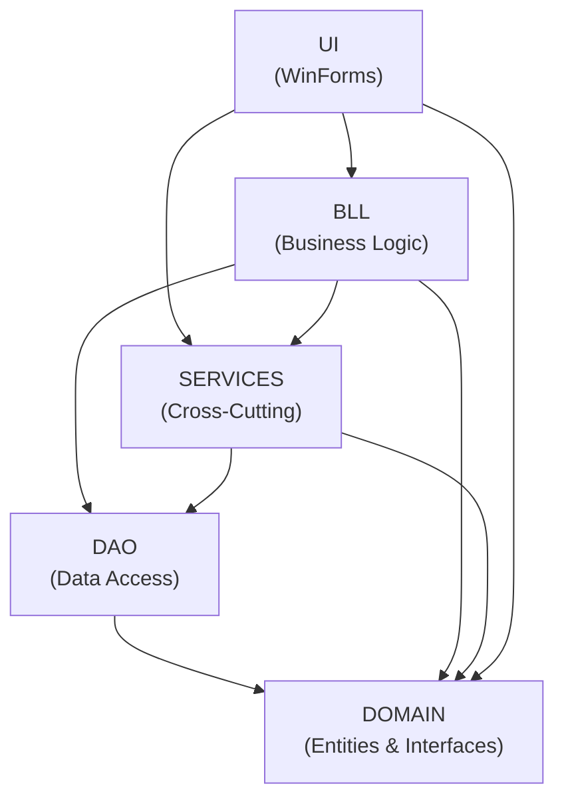
```mermaid
flowchart TD
    UI["UI\n(WinForms)"]
    BLL["BLL\n(Business Logic)"]
    SVC["SERVICES\n(Cross-Cutting)"]
    DAO["DAO\n(Data Access)"]
    DOM["DOMAIN\n(Entities & Interfaces)"]

    UI --> BLL
    UI --> SVC
    BLL --> SVC
    BLL --> DAO
    SVC --> DAO
    DAO --> DOM
    BLL --> DOM
    SVC --> DOM
    UI --> DOM
```

### 2.4 Patrones de diseño utilizados

| Patrón | Aplicación en el proyecto |
|---|---|
| **Repository** | Cada entidad tiene su repositorio que abstrae SQL Server |
| **Unit of Work** | Agrupa operaciones de escritura en una única transacción de base de datos |
| **Singleton** | `SessionContext` mantiene el usuario autenticado durante la sesión |
| **Factory** | `ModuleFactory` en UI instancia el formulario correcto según el módulo solicitado |
| **Strategy** | `ReportService` utiliza estrategias intercambiables para cada tipo de reporte |
| **Composite** | Los permisos se componen jerárquicamente (módulo → operación) |
| **Decorator** | `AuthLoggingDecorator` envuelve `AuthenticationService` para auditar intentos de login |

---

## 3. Módulos y Casos de Uso

---

### 3.1 Módulo: Autenticación / Login

#### Diagrama de casos de uso

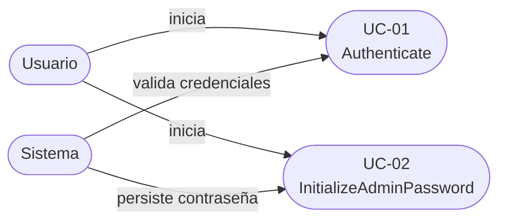
```mermaid
flowchart LR
    Usuario(["Usuario"])
    Sistema(["Sistema"])

    UC01(["UC-01\nAuthenticate"])
    UC02(["UC-02\nInitializeAdminPassword"])

    Usuario -- inicia --> UC01
    Usuario -- inicia --> UC02
    Sistema -- valida credenciales --> UC01
    Sistema -- persiste contraseña --> UC02
```

---

#### UC-01: Authenticate

##### Diagrama de clases

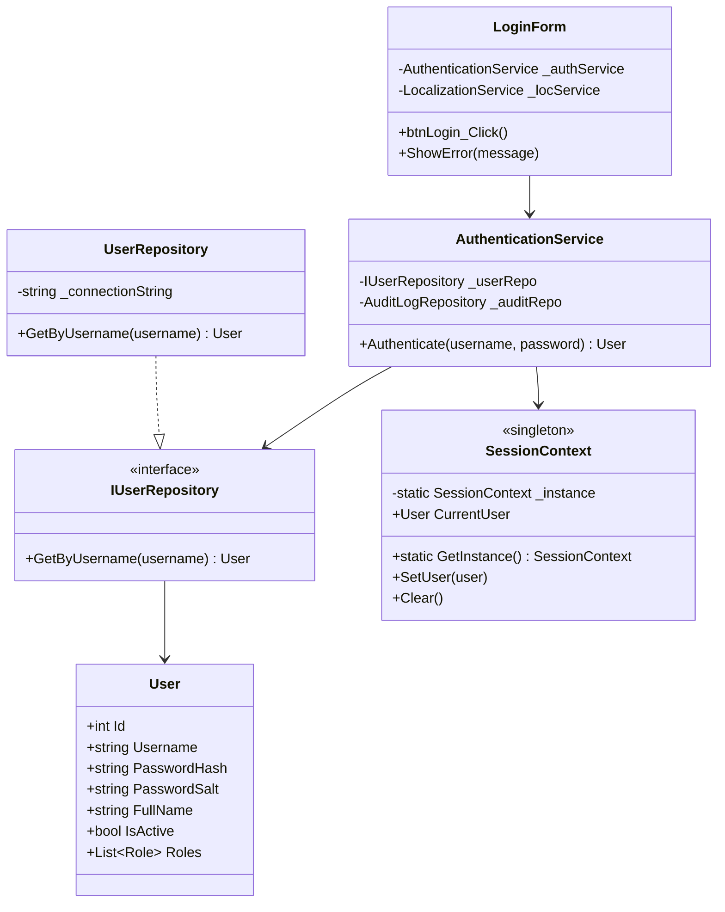
```mermaid
classDiagram
    class LoginForm {
        -AuthenticationService _authService
        -LocalizationService _locService
        +btnLogin_Click()
        +ShowError(message)
    }

    class AuthenticationService {
        -IUserRepository _userRepo
        -AuditLogRepository _auditRepo
        +Authenticate(username, password) User
    }

    class IUserRepository {
        <<interface>>
        +GetByUsername(username) User
    }

    class UserRepository {
        -string _connectionString
        +GetByUsername(username) User
    }

    class User {
        +int Id
        +string Username
        +string PasswordHash
        +string PasswordSalt
        +string FullName
        +bool IsActive
        +List~Role~ Roles
    }

    class SessionContext {
        <<singleton>>
        -static SessionContext _instance
        +User CurrentUser
        +static GetInstance() SessionContext
        +SetUser(user)
        +Clear()
    }

    LoginForm --> AuthenticationService
    AuthenticationService --> IUserRepository
    UserRepository ..|> IUserRepository
    AuthenticationService --> SessionContext
    IUserRepository --> User
```

##### Diagrama de secuencia

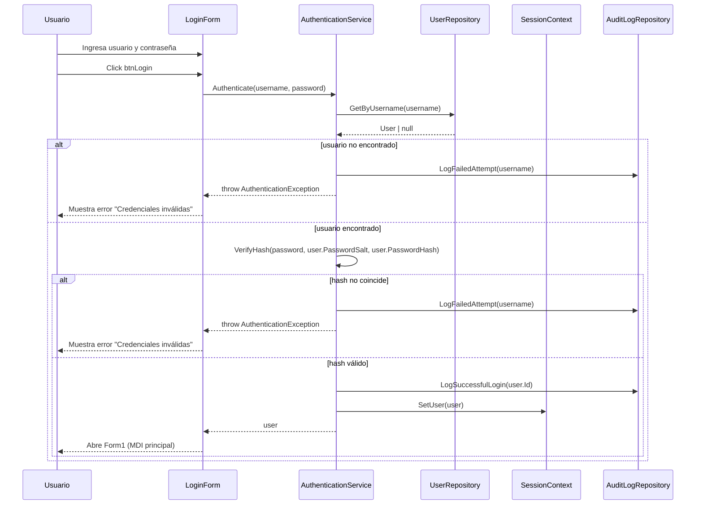
```mermaid
sequenceDiagram
    participant U as Usuario
    participant LF as LoginForm
    participant AS as AuthenticationService
    participant UR as UserRepository
    participant SC as SessionContext
    participant AL as AuditLogRepository

    U->>LF: Ingresa usuario y contraseña
    U->>LF: Click btnLogin
    LF->>AS: Authenticate(username, password)
    AS->>UR: GetByUsername(username)
    UR-->>AS: User | null
    alt usuario no encontrado
        AS->>AL: LogFailedAttempt(username)
        AS-->>LF: throw AuthenticationException
        LF-->>U: Muestra error "Credenciales inválidas"
    else usuario encontrado
        AS->>AS: VerifyHash(password, user.PasswordSalt, user.PasswordHash)
        alt hash no coincide
            AS->>AL: LogFailedAttempt(username)
            AS-->>LF: throw AuthenticationException
            LF-->>U: Muestra error "Credenciales inválidas"
        else hash válido
            AS->>AL: LogSuccessfulLogin(user.Id)
            AS->>SC: SetUser(user)
            AS-->>LF: user
            LF-->>U: Abre Form1 (MDI principal)
        end
    end
```

##### Descripción textual

**Introducción**  
Permite que un usuario registrado acceda al sistema proporcionando sus credenciales. Utiliza hashing con salt (SHA-256 o similar) para verificar la contraseña sin almacenarla en texto plano.

**Precondición**  
- La base de datos está disponible.  
- Existe al menos un usuario activo con contraseña inicializada.

**Entradas**  
- `username`: nombre de usuario (string, obligatorio).  
- `password`: contraseña en texto plano (string, obligatorio).

**Proceso**  
1. `LoginForm` recolecta las entradas y llama a `AuthenticationService.Authenticate`.  
2. El servicio recupera el `User` por `username` a través de `UserRepository`.  
3. Si no existe o el usuario está inactivo, se registra el intento fallido y se lanza excepción.  
4. Se recalcula el hash con el salt almacenado y se compara con `PasswordHash`.  
5. Si coincide, se registra el login exitoso y se almacena el usuario en `SessionContext`.

**Salida**  
- Éxito: `SessionContext` contiene el usuario autenticado; la UI navega al formulario principal.  
- Error: se muestra un mensaje de credenciales inválidas; el intento queda auditado.

**Paso a paso**  
1. El usuario escribe su nombre de usuario y contraseña en `LoginForm`.  
2. Presiona el botón **Ingresar**.  
3. `LoginForm` invoca `AuthenticationService.Authenticate(username, password)`.  
4. El servicio consulta `UserRepository.GetByUsername(username)`.  
5. Si el resultado es `null` o `!IsActive`, se registra el fallo y se lanza `AuthenticationException`.  
6. El servicio calcula `hash = SHA256(password + salt)` y compara con `user.PasswordHash`.  
7. Si no coincide, igual se registra el fallo y se lanza `AuthenticationException`.  
8. Si coincide, se llama `AuditLogRepository.LogSuccessfulLogin` y `SessionContext.SetUser(user)`.  
9. `LoginForm` cierra y se abre `Form1` (ventana MDI principal).

---

#### UC-02: InitializeAdminPassword

##### Diagrama de clases

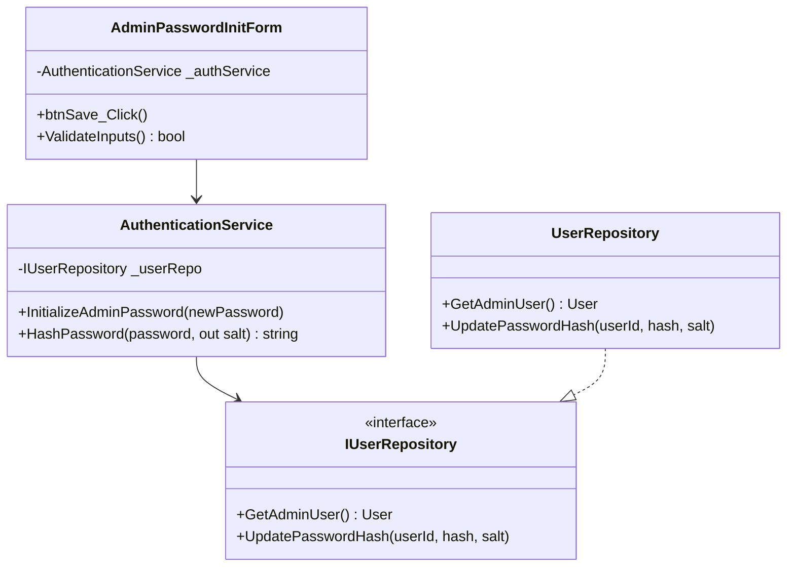
```mermaid
classDiagram
    class AdminPasswordInitForm {
        -AuthenticationService _authService
        +btnSave_Click()
        +ValidateInputs() bool
    }

    class AuthenticationService {
        -IUserRepository _userRepo
        +InitializeAdminPassword(newPassword)
        +HashPassword(password, out salt) string
    }

    class IUserRepository {
        <<interface>>
        +GetAdminUser() User
        +UpdatePasswordHash(userId, hash, salt)
    }

    class UserRepository {
        +GetAdminUser() User
        +UpdatePasswordHash(userId, hash, salt)
    }

    AdminPasswordInitForm --> AuthenticationService
    AuthenticationService --> IUserRepository
    UserRepository ..|> IUserRepository
```

##### Diagrama de secuencia

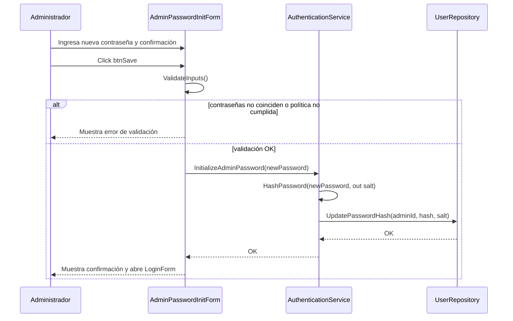
```mermaid
sequenceDiagram
    participant A as Administrador
    participant APF as AdminPasswordInitForm
    participant AS as AuthenticationService
    participant UR as UserRepository

    A->>APF: Ingresa nueva contraseña y confirmación
    A->>APF: Click btnSave
    APF->>APF: ValidateInputs()
    alt contraseñas no coinciden o política no cumplida
        APF-->>A: Muestra error de validación
    else validación OK
        APF->>AS: InitializeAdminPassword(newPassword)
        AS->>AS: HashPassword(newPassword, out salt)
        AS->>UR: UpdatePasswordHash(adminId, hash, salt)
        UR-->>AS: OK
        AS-->>APF: OK
        APF-->>A: Muestra confirmación y abre LoginForm
    end
```

##### Descripción textual

**Introducción**  
En la primera ejecución del sistema, el usuario administrador no tiene contraseña asignada. Este caso de uso permite establecerla de forma segura.

**Precondición**  
- El usuario administrador existe en la base de datos con `PasswordHash` vacío o nulo.  
- La aplicación detecta esta condición al iniciar y redirige a `AdminPasswordInitForm`.

**Entradas**  
- `newPassword`: nueva contraseña (string, mínimo 8 caracteres).  
- `confirmPassword`: repetición de la contraseña (string).

**Proceso**  
1. El formulario valida que ambas contraseñas coincidan y cumplan la política de seguridad.  
2. Se genera un salt aleatorio y se calcula el hash.  
3. Se persiste `PasswordHash` y `PasswordSalt` en la tabla `Users`.

**Salida**  
- Éxito: contraseña inicializada; la aplicación redirige a `LoginForm`.  
- Error: se muestran mensajes de validación descriptivos.

**Paso a paso**  
1. La aplicación detecta que `admin.PasswordHash` está vacío y abre `AdminPasswordInitForm`.  
2. El administrador ingresa la nueva contraseña y su confirmación.  
3. `AdminPasswordInitForm.ValidateInputs()` verifica longitud mínima y coincidencia.  
4. Se llama `AuthenticationService.InitializeAdminPassword(newPassword)`.  
5. El servicio genera `salt = Guid.NewGuid().ToString()` y calcula `hash = SHA256(password + salt)`.  
6. Se llama `UserRepository.UpdatePasswordHash(adminId, hash, salt)`.  
7. El formulario muestra "Contraseña establecida correctamente" y abre `LoginForm`.

---

### 3.2 Módulo: Gestión de Usuarios

#### Diagrama de casos de uso

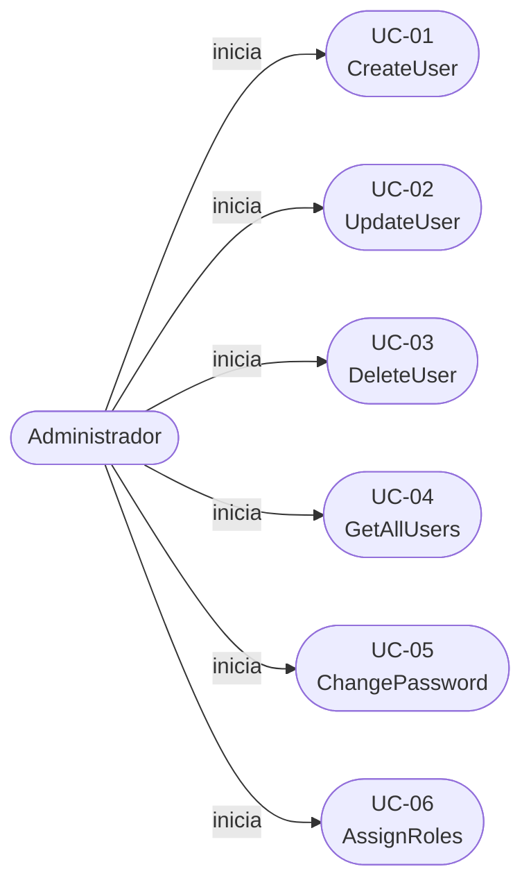
```mermaid
flowchart LR
    Admin(["Administrador"])

    UC01(["UC-01\nCreateUser"])
    UC02(["UC-02\nUpdateUser"])
    UC03(["UC-03\nDeleteUser"])
    UC04(["UC-04\nGetAllUsers"])
    UC05(["UC-05\nChangePassword"])
    UC06(["UC-06\nAssignRoles"])

    Admin -- inicia --> UC01
    Admin -- inicia --> UC02
    Admin -- inicia --> UC03
    Admin -- inicia --> UC04
    Admin -- inicia --> UC05
    Admin -- inicia --> UC06
```

---

#### UC-01: CreateUser

##### Diagrama de clases

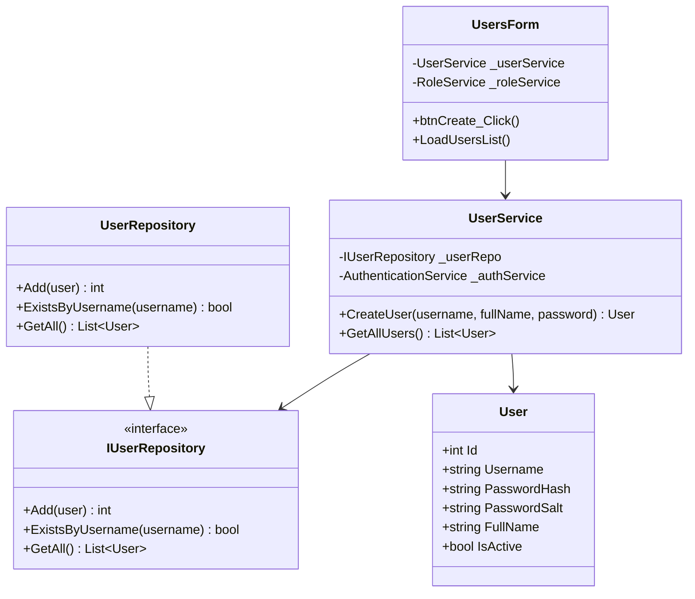
```mermaid
classDiagram
    class UsersForm {
        -UserService _userService
        -RoleService _roleService
        +btnCreate_Click()
        +LoadUsersList()
    }

    class UserService {
        -IUserRepository _userRepo
        -AuthenticationService _authService
        +CreateUser(username, fullName, password) User
        +GetAllUsers() List~User~
    }

    class IUserRepository {
        <<interface>>
        +Add(user) int
        +ExistsByUsername(username) bool
        +GetAll() List~User~
    }

    class UserRepository {
        +Add(user) int
        +ExistsByUsername(username) bool
        +GetAll() List~User~
    }

    class User {
        +int Id
        +string Username
        +string PasswordHash
        +string PasswordSalt
        +string FullName
        +bool IsActive
    }

    UsersForm --> UserService
    UserService --> IUserRepository
    UserRepository ..|> IUserRepository
    UserService --> User
```

##### Diagrama de secuencia

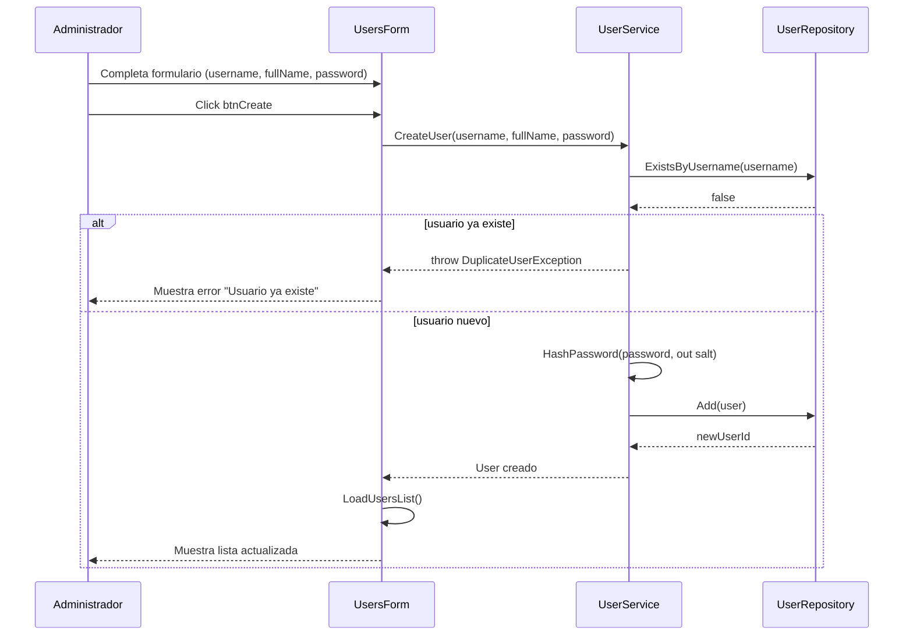
```mermaid
sequenceDiagram
    participant A as Administrador
    participant UF as UsersForm
    participant US as UserService
    participant UR as UserRepository

    A->>UF: Completa formulario (username, fullName, password)
    A->>UF: Click btnCreate
    UF->>US: CreateUser(username, fullName, password)
    US->>UR: ExistsByUsername(username)
    UR-->>US: false
    alt usuario ya existe
        US-->>UF: throw DuplicateUserException
        UF-->>A: Muestra error "Usuario ya existe"
    else usuario nuevo
        US->>US: HashPassword(password, out salt)
        US->>UR: Add(user)
        UR-->>US: newUserId
        US-->>UF: User creado
        UF->>UF: LoadUsersList()
        UF-->>A: Muestra lista actualizada
    end
```

##### Descripción textual

**Introducción**  
Permite al administrador registrar un nuevo usuario en el sistema con nombre de usuario único, nombre completo y contraseña inicial.

**Precondición**  
- El administrador está autenticado y tiene el permiso `USERS_CREATE`.

**Entradas**  
- `username`: identificador único de login (string, obligatorio).  
- `fullName`: nombre completo para visualización (string, obligatorio).  
- `password`: contraseña inicial (string, mínimo 8 caracteres).

**Proceso**  
1. Verificar que no exista otro usuario con el mismo `username`.  
2. Generar salt y hash de la contraseña.  
3. Persistir el nuevo `User` con `IsActive = true`.

**Salida**  
- Éxito: usuario creado; la lista de usuarios se refresca.  
- Error: mensaje descriptivo (usuario duplicado, validación fallida).

**Paso a paso**  
1. El administrador abre `UsersForm` y completa el formulario.  
2. Presiona **Crear**.  
3. `UserService.CreateUser` verifica unicidad de `username`.  
4. Genera `salt` y `hash`.  
5. Llama `UserRepository.Add(user)`.  
6. Retorna el `User` persistido con su `Id` asignado.  
7. `UsersForm` recarga la grilla de usuarios.

---

#### UC-02: UpdateUser

##### Diagrama de clases

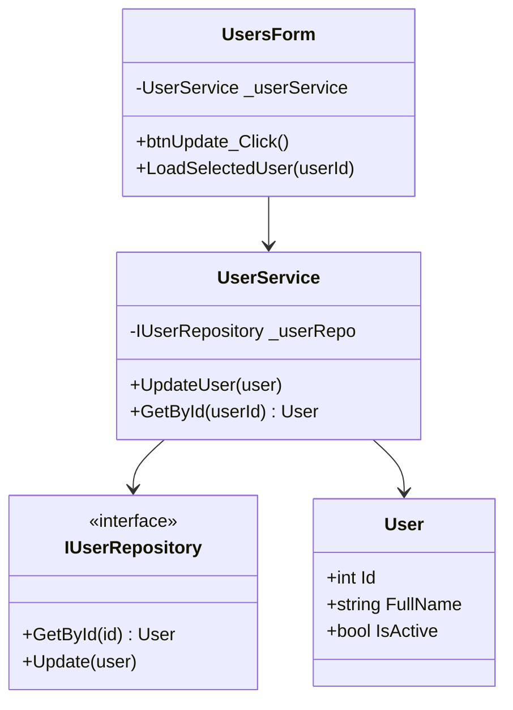
```mermaid
classDiagram
    class UsersForm {
        -UserService _userService
        +btnUpdate_Click()
        +LoadSelectedUser(userId)
    }

    class UserService {
        -IUserRepository _userRepo
        +UpdateUser(user)
        +GetById(userId) User
    }

    class IUserRepository {
        <<interface>>
        +GetById(id) User
        +Update(user)
    }

    class User {
        +int Id
        +string FullName
        +bool IsActive
    }

    UsersForm --> UserService
    UserService --> IUserRepository
    UserService --> User
```

##### Diagrama de secuencia

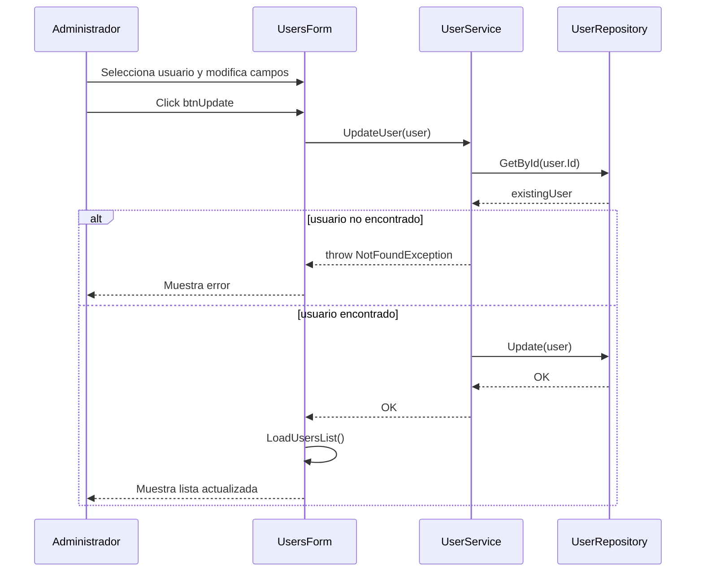
```mermaid
sequenceDiagram
    participant A as Administrador
    participant UF as UsersForm
    participant US as UserService
    participant UR as UserRepository

    A->>UF: Selecciona usuario y modifica campos
    A->>UF: Click btnUpdate
    UF->>US: UpdateUser(user)
    US->>UR: GetById(user.Id)
    UR-->>US: existingUser
    alt usuario no encontrado
        US-->>UF: throw NotFoundException
        UF-->>A: Muestra error
    else usuario encontrado
        US->>UR: Update(user)
        UR-->>US: OK
        US-->>UF: OK
        UF->>UF: LoadUsersList()
        UF-->>A: Muestra lista actualizada
    end
```

##### Descripción textual

**Introducción**  
Permite modificar los datos de un usuario existente (nombre completo, estado activo/inactivo).

**Precondición**  
- El administrador está autenticado con permiso `USERS_EDIT`.  
- El usuario a modificar existe en la base de datos.

**Entradas**  
- `user.Id`: identificador del usuario (int).  
- `user.FullName`: nuevo nombre completo (string).  
- `user.IsActive`: estado activo (bool).

**Proceso**  
1. Verificar que el usuario existe.  
2. Aplicar los cambios en la base de datos.  
3. Refrescar la lista en UI.

**Salida**  
- Éxito: datos actualizados.  
- Error: usuario no encontrado o error de base de datos.

**Paso a paso**  
1. El administrador selecciona un usuario en la grilla.  
2. Modifica `FullName` o `IsActive` en el panel de edición.  
3. Presiona **Guardar**.  
4. `UserService.UpdateUser` verifica existencia y llama `UserRepository.Update`.  
5. La grilla se refresca.

---

#### UC-03: DeleteUser

##### Diagrama de clases

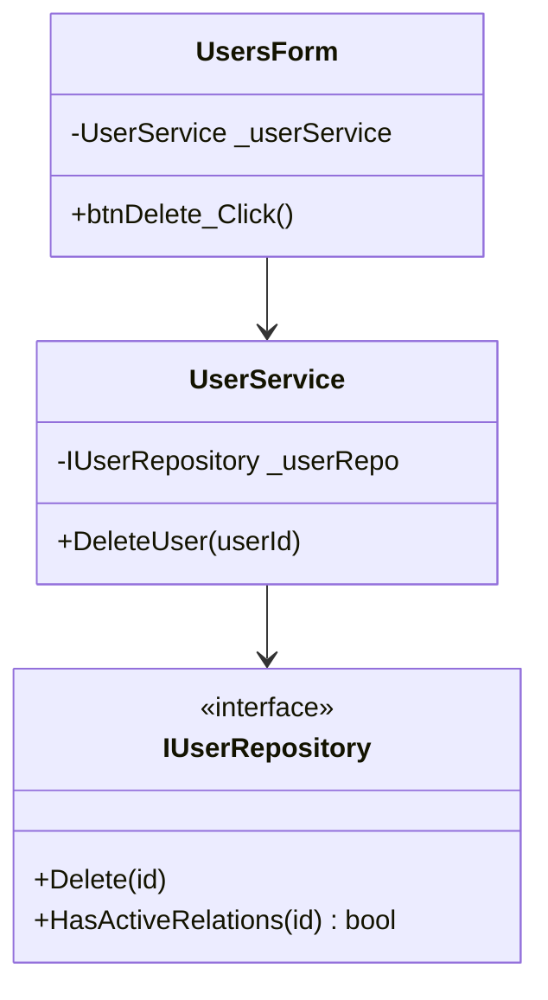
```mermaid
classDiagram
    class UsersForm {
        -UserService _userService
        +btnDelete_Click()
    }

    class UserService {
        -IUserRepository _userRepo
        +DeleteUser(userId)
    }

    class IUserRepository {
        <<interface>>
        +Delete(id)
        +HasActiveRelations(id) bool
    }

    UsersForm --> UserService
    UserService --> IUserRepository
```

##### Diagrama de secuencia

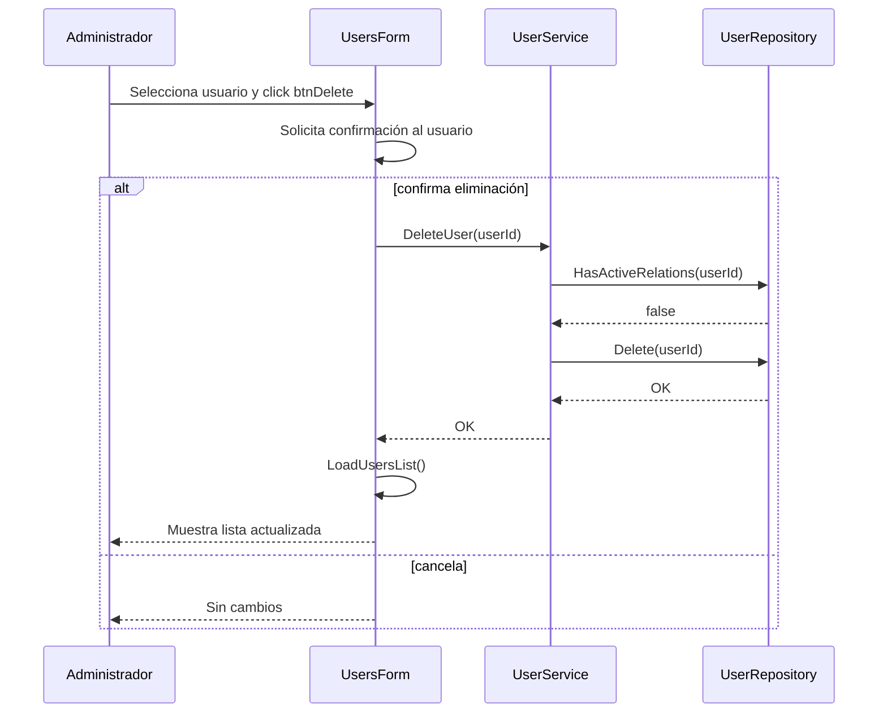
```mermaid
sequenceDiagram
    participant A as Administrador
    participant UF as UsersForm
    participant US as UserService
    participant UR as UserRepository

    A->>UF: Selecciona usuario y click btnDelete
    UF->>UF: Solicita confirmación al usuario
    alt confirma eliminación
        UF->>US: DeleteUser(userId)
        US->>UR: HasActiveRelations(userId)
        UR-->>US: false
        US->>UR: Delete(userId)
        UR-->>US: OK
        US-->>UF: OK
        UF->>UF: LoadUsersList()
        UF-->>A: Muestra lista actualizada
    else cancela
        UF-->>A: Sin cambios
    end
```

##### Descripción textual

**Introducción**  
Elimina un usuario del sistema. Si el usuario tiene relaciones activas (ventas, movimientos) se deniega la eliminación y se sugiere desactivarlo.

**Precondición**  
- El administrador tiene permiso `USERS_DELETE`.  
- El usuario objetivo no es el administrador del sistema.

**Entradas**  
- `userId`: identificador del usuario a eliminar.

**Proceso**  
1. Verificar que no existen relaciones activas.  
2. Eliminar el registro de la base de datos.

**Salida**  
- Éxito: usuario eliminado.  
- Error: restricción de integridad referencial; se muestra mensaje para desactivar en su lugar.

**Paso a paso**  
1. Administrador selecciona usuario y presiona **Eliminar**.  
2. Se muestra diálogo de confirmación.  
3. `UserService.DeleteUser` verifica relaciones con `HasActiveRelations`.  
4. Si no hay relaciones, llama `UserRepository.Delete`.  
5. Lista se recarga.

---

#### UC-04: GetAllUsers

##### Diagrama de secuencia

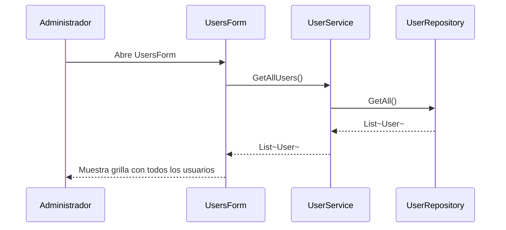
```mermaid
sequenceDiagram
    participant A as Administrador
    participant UF as UsersForm
    participant US as UserService
    participant UR as UserRepository

    A->>UF: Abre UsersForm
    UF->>US: GetAllUsers()
    US->>UR: GetAll()
    UR-->>US: List~User~
    US-->>UF: List~User~
    UF-->>A: Muestra grilla con todos los usuarios
```

---

#### UC-05: ChangePassword

##### Diagrama de secuencia

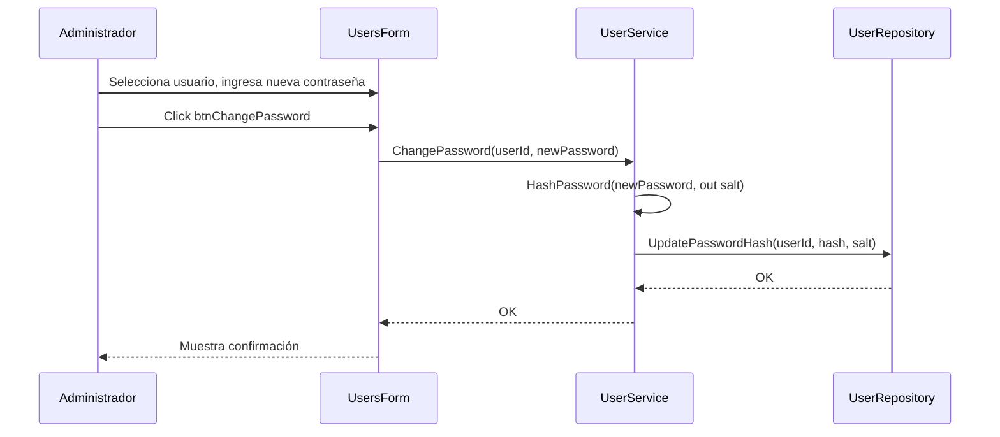
```mermaid
sequenceDiagram
    participant A as Administrador
    participant UF as UsersForm
    participant US as UserService
    participant UR as UserRepository

    A->>UF: Selecciona usuario, ingresa nueva contraseña
    A->>UF: Click btnChangePassword
    UF->>US: ChangePassword(userId, newPassword)
    US->>US: HashPassword(newPassword, out salt)
    US->>UR: UpdatePasswordHash(userId, hash, salt)
    UR-->>US: OK
    US-->>UF: OK
    UF-->>A: Muestra confirmación
```

---

#### UC-06: AssignRoles

##### Diagrama de secuencia

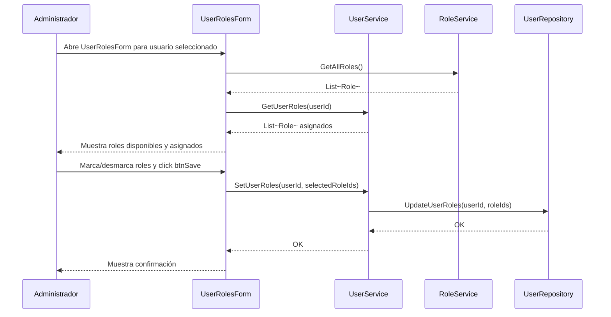
```mermaid
sequenceDiagram
    participant A as Administrador
    participant URF as UserRolesForm
    participant US as UserService
    participant RS as RoleService
    participant UR as UserRepository

    A->>URF: Abre UserRolesForm para usuario seleccionado
    URF->>RS: GetAllRoles()
    RS-->>URF: List~Role~
    URF->>US: GetUserRoles(userId)
    US-->>URF: List~Role~ asignados
    URF-->>A: Muestra roles disponibles y asignados
    A->>URF: Marca/desmarca roles y click btnSave
    URF->>US: SetUserRoles(userId, selectedRoleIds)
    US->>UR: UpdateUserRoles(userId, roleIds)
    UR-->>US: OK
    US-->>URF: OK
    URF-->>A: Muestra confirmación
```

---

### 3.3 Módulo: Gestión de Roles

#### Diagrama de casos de uso

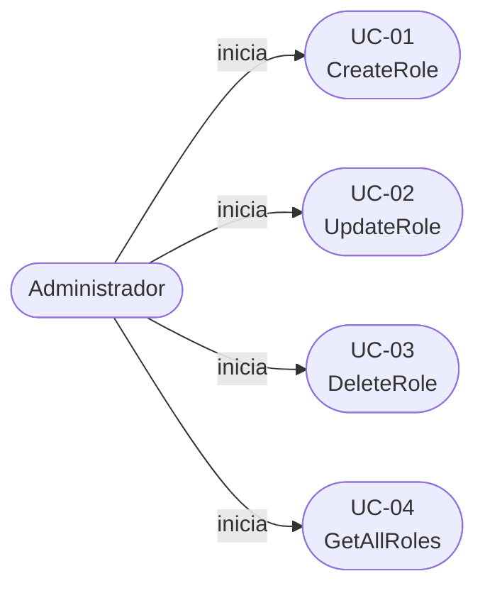
```mermaid
flowchart LR
    Admin(["Administrador"])

    UC01(["UC-01\nCreateRole"])
    UC02(["UC-02\nUpdateRole"])
    UC03(["UC-03\nDeleteRole"])
    UC04(["UC-04\nGetAllRoles"])

    Admin -- inicia --> UC01
    Admin -- inicia --> UC02
    Admin -- inicia --> UC03
    Admin -- inicia --> UC04
```

---

#### UC-01: CreateRole

##### Diagrama de clases

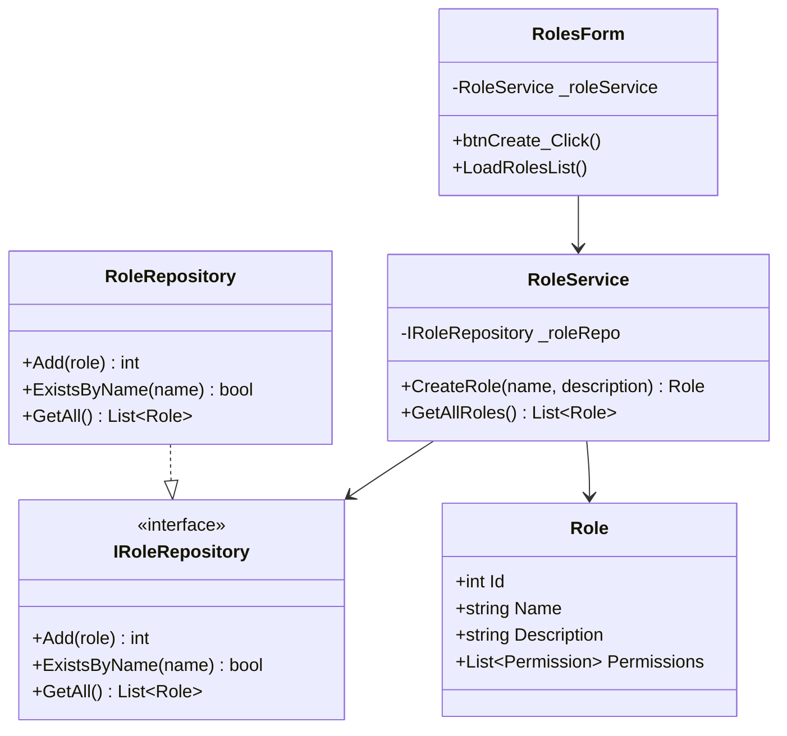
```mermaid
classDiagram
    class RolesForm {
        -RoleService _roleService
        +btnCreate_Click()
        +LoadRolesList()
    }

    class RoleService {
        -IRoleRepository _roleRepo
        +CreateRole(name, description) Role
        +GetAllRoles() List~Role~
    }

    class IRoleRepository {
        <<interface>>
        +Add(role) int
        +ExistsByName(name) bool
        +GetAll() List~Role~
    }

    class RoleRepository {
        +Add(role) int
        +ExistsByName(name) bool
        +GetAll() List~Role~
    }

    class Role {
        +int Id
        +string Name
        +string Description
        +List~Permission~ Permissions
    }

    RolesForm --> RoleService
    RoleService --> IRoleRepository
    RoleRepository ..|> IRoleRepository
    RoleService --> Role
```

##### Diagrama de secuencia

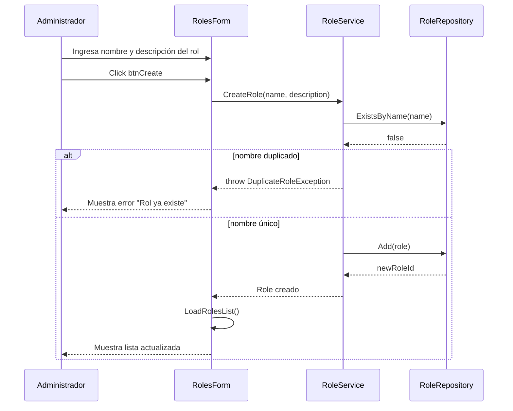
```mermaid
sequenceDiagram
    participant A as Administrador
    participant RF as RolesForm
    participant RS as RoleService
    participant RR as RoleRepository

    A->>RF: Ingresa nombre y descripción del rol
    A->>RF: Click btnCreate
    RF->>RS: CreateRole(name, description)
    RS->>RR: ExistsByName(name)
    RR-->>RS: false
    alt nombre duplicado
        RS-->>RF: throw DuplicateRoleException
        RF-->>A: Muestra error "Rol ya existe"
    else nombre único
        RS->>RR: Add(role)
        RR-->>RS: newRoleId
        RS-->>RF: Role creado
        RF->>RF: LoadRolesList()
        RF-->>A: Muestra lista actualizada
    end
```

##### Descripción textual

**Introducción**  
Permite al administrador crear un nuevo rol que agrupa un conjunto de permisos asignables a usuarios.

**Precondición**  
- Administrador autenticado con permiso `ROLES_CREATE`.

**Entradas**  
- `name`: nombre único del rol (string, obligatorio).  
- `description`: descripción del rol (string, opcional).

**Proceso**  
1. Verificar unicidad del nombre.  
2. Persistir el rol en la base de datos.

**Salida**  
- Éxito: rol creado; lista actualizada.  
- Error: nombre duplicado o validación fallida.

**Paso a paso**  
1. Administrador abre `RolesForm` y completa nombre y descripción.  
2. Presiona **Crear**.  
3. `RoleService.CreateRole` verifica unicidad.  
4. Llama `RoleRepository.Add(role)`.  
5. Grilla se recarga.

---

#### UC-02: UpdateRole

##### Diagrama de clases

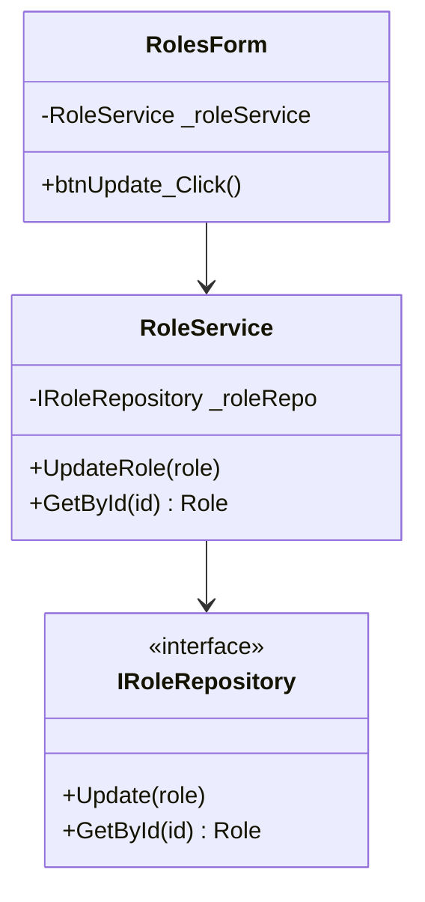
```mermaid
classDiagram
    class RolesForm {
        -RoleService _roleService
        +btnUpdate_Click()
    }

    class RoleService {
        -IRoleRepository _roleRepo
        +UpdateRole(role)
        +GetById(id) Role
    }

    class IRoleRepository {
        <<interface>>
        +Update(role)
        +GetById(id) Role
    }

    RolesForm --> RoleService
    RoleService --> IRoleRepository
```

##### Diagrama de secuencia

```mermaid
sequenceDiagram
    participant A as Administrador
    participant RF as RolesForm
    participant RS as RoleService
    participant RR as RoleRepository

    A->>RF: Selecciona rol, modifica descripción
    A->>RF: Click btnUpdate
    RF->>RS: UpdateRole(role)
    RS->>RR: GetById(role.Id)
    RR-->>RS: existingRole
    RS->>RR: Update(role)
    RR-->>RS: OK
    RS-->>RF: OK
    RF->>RF: LoadRolesList()
    RF-->>A: Muestra lista actualizada
```

##### Descripción textual

**Introducción**  
Modifica la descripción de un rol existente. El nombre del rol no puede cambiarse si ya tiene usuarios asignados.

**Precondición**  
- Administrador con permiso `ROLES_EDIT`.  
- El rol existe.

**Entradas**  
- `role.Id`: identificador del rol.  
- `role.Description`: nueva descripción.

**Proceso**  
1. Verificar existencia del rol.  
2. Actualizar la descripción en la base de datos.

**Salida**  
- Éxito: descripción actualizada.

**Paso a paso**  
1. Administrador selecciona un rol en la grilla y edita la descripción.  
2. Presiona **Guardar**.  
3. `RoleService.UpdateRole` verifica existencia y llama `RoleRepository.Update`.  
4. Grilla se recarga.

---

#### UC-03: DeleteRole

##### Diagrama de secuencia

```mermaid
sequenceDiagram
    participant A as Administrador
    participant RF as RolesForm
    participant RS as RoleService
    participant RR as RoleRepository

    A->>RF: Selecciona rol y click btnDelete
    RF->>RF: Solicita confirmación
    RF->>RS: DeleteRole(roleId)
    RS->>RR: HasAssignedUsers(roleId)
    RR-->>RS: false
    RS->>RR: Delete(roleId)
    RR-->>RS: OK
    RS-->>RF: OK
    RF->>RF: LoadRolesList()
    RF-->>A: Lista actualizada
```

---

#### UC-04: GetAllRoles

##### Diagrama de secuencia

```mermaid
sequenceDiagram
    participant A as Administrador
    participant RF as RolesForm
    participant RS as RoleService
    participant RR as RoleRepository

    A->>RF: Abre RolesForm
    RF->>RS: GetAllRoles()
    RS->>RR: GetAll()
    RR-->>RS: List~Role~
    RS-->>RF: List~Role~
    RF-->>A: Muestra grilla con todos los roles
```

---

### 3.4 Módulo: Gestión de Permisos y Autorización

#### Diagrama de casos de uso

```mermaid
flowchart LR
    Admin(["Administrador"])
    Sistema(["Sistema"])

    UC01(["UC-01\nAssignPermissionsToRole"])
    UC02(["UC-02\nCheckPermission"])
    UC03(["UC-03\nGetUserPermissions"])

    Admin -- inicia --> UC01
    Admin -- inicia --> UC03
    Sistema -- valida --> UC02
```

---

#### UC-01: AssignPermissionsToRole

##### Diagrama de clases

```mermaid
classDiagram
    class RolePermissionsForm {
        -AuthorizationService _authzService
        -RoleService _roleService
        +btnSave_Click()
        +LoadPermissions(roleId)
    }

    class AuthorizationService {
        -IPermissionRepository _permRepo
        -IRoleRepository _roleRepo
        +GetAllPermissions() List~Permission~
        +GetRolePermissions(roleId) List~Permission~
        +SetRolePermissions(roleId, permissionCodes)
    }

    class IPermissionRepository {
        <<interface>>
        +GetAll() List~Permission~
        +GetByRoleId(roleId) List~Permission~
        +SetRolePermissions(roleId, permCodes)
    }

    class PermissionRepository {
        +GetAll() List~Permission~
        +GetByRoleId(roleId) List~Permission~
        +SetRolePermissions(roleId, permCodes)
    }

    class Permission {
        +int Id
        +string Code
        +string Module
        +string Description
    }

    RolePermissionsForm --> AuthorizationService
    AuthorizationService --> IPermissionRepository
    PermissionRepository ..|> IPermissionRepository
    AuthorizationService --> Permission
```

##### Diagrama de secuencia

```mermaid
sequenceDiagram
    participant A as Administrador
    participant RPF as RolePermissionsForm
    participant AZ as AuthorizationService
    participant PR as PermissionRepository

    A->>RPF: Abre RolePermissionsForm para un rol
    RPF->>AZ: GetAllPermissions()
    AZ->>PR: GetAll()
    PR-->>AZ: List~Permission~
    AZ-->>RPF: List~Permission~
    RPF->>AZ: GetRolePermissions(roleId)
    AZ->>PR: GetByRoleId(roleId)
    PR-->>AZ: List~Permission~
    AZ-->>RPF: List~Permission~ actuales
    RPF-->>A: Muestra checkboxes con permisos marcados
    A->>RPF: Marca/desmarca permisos y click btnSave
    RPF->>AZ: SetRolePermissions(roleId, selectedCodes)
    AZ->>PR: SetRolePermissions(roleId, selectedCodes)
    PR-->>AZ: OK
    AZ-->>RPF: OK
    RPF-->>A: Muestra confirmación
```

##### Descripción textual

**Introducción**  
Permite al administrador asignar o revocar permisos a un rol. Los permisos tienen estructura `MÓDULO_OPERACIÓN` (ej.: `PRODUCTS_CREATE`, `SALES_VIEW`).

**Precondición**  
- Administrador con permiso `PERMISSIONS_MANAGE`.  
- El rol existe.

**Entradas**  
- `roleId`: identificador del rol.  
- `selectedCodes`: lista de códigos de permiso seleccionados.

**Proceso**  
1. Cargar todos los permisos disponibles del sistema.  
2. Cargar los permisos actuales del rol.  
3. Reemplazar el conjunto completo de permisos del rol con la nueva selección.

**Salida**  
- Éxito: permisos del rol actualizados.  
- Error: rol no encontrado o permiso inválido.

**Paso a paso**  
1. Administrador abre `RolePermissionsForm` para el rol objetivo.  
2. Se cargan todos los permisos y se marcan los que el rol ya tiene.  
3. El administrador ajusta la selección y presiona **Guardar**.  
4. `AuthorizationService.SetRolePermissions` reemplaza en la tabla `RolePermissions`.  
5. Se muestra confirmación.

---

#### UC-02: CheckPermission

##### Diagrama de clases

```mermaid
classDiagram
    class AuthorizationService {
        -IPermissionRepository _permRepo
        -SessionContext _session
        +HasPermission(permissionCode) bool
        +GetUserPermissions(userId) List~Permission~
    }

    class SessionContext {
        <<singleton>>
        +User CurrentUser
    }

    class IPermissionRepository {
        <<interface>>
        +GetByUserId(userId) List~Permission~
    }

    AuthorizationService --> SessionContext
    AuthorizationService --> IPermissionRepository
```

##### Diagrama de secuencia

```mermaid
sequenceDiagram
    participant F as Form (cualquier módulo)
    participant AZ as AuthorizationService
    participant SC as SessionContext
    participant PR as PermissionRepository

    F->>AZ: HasPermission("PRODUCTS_CREATE")
    AZ->>SC: CurrentUser
    SC-->>AZ: user
    AZ->>PR: GetByUserId(user.Id)
    PR-->>AZ: List~Permission~
    AZ->>AZ: permissions.Any(p => p.Code == "PRODUCTS_CREATE")
    alt tiene permiso
        AZ-->>F: true
        F-->>F: Habilita acción
    else no tiene permiso
        AZ-->>F: false
        F-->>F: Muestra mensaje "Sin autorización"
    end
```

##### Descripción textual

**Introducción**  
Verifica en tiempo de ejecución si el usuario actualmente autenticado posee un permiso específico antes de ejecutar una operación.

**Precondición**  
- Usuario autenticado en `SessionContext`.

**Entradas**  
- `permissionCode`: código del permiso a verificar (ej.: `SALES_DELETE`).

**Proceso**  
1. Obtener el usuario actual de `SessionContext`.  
2. Recuperar sus permisos efectivos (unión de permisos de todos sus roles).  
3. Verificar si la lista contiene el código solicitado.

**Salida**  
- `true`: el usuario tiene el permiso.  
- `false`: el usuario carece del permiso; la UI deshabilita o bloquea la acción.

**Paso a paso**  
1. Un formulario (ej.: `ProductsForm`) llama `AuthorizationService.HasPermission("PRODUCTS_CREATE")` al cargar.  
2. El servicio obtiene el usuario de `SessionContext`.  
3. Consulta `PermissionRepository.GetByUserId` para recuperar permisos efectivos.  
4. Devuelve `true` o `false`.  
5. El formulario habilita o deshabilita el botón correspondiente.

---

#### UC-03: GetUserPermissions

##### Diagrama de secuencia

```mermaid
sequenceDiagram
    participant A as Administrador
    participant UF as UsersForm
    participant AZ as AuthorizationService
    participant PR as PermissionRepository

    A->>UF: Selecciona usuario y click "Ver permisos"
    UF->>AZ: GetUserPermissions(userId)
    AZ->>PR: GetByUserId(userId)
    PR-->>AZ: List~Permission~
    AZ-->>UF: List~Permission~
    UF-->>A: Muestra panel con permisos efectivos del usuario
```

---

### 3.5 Módulo: Gestión de Productos

#### Diagrama de casos de uso

```mermaid
flowchart LR
    Admin(["Administrador"])
    Almacenista(["Almacenista"])

    UC01(["UC-01\nCreateProduct"])
    UC02(["UC-02\nUpdateProduct"])
    UC03(["UC-03\nDeleteProduct"])
    UC04(["UC-04\nGetActiveProducts"])

    Admin -- inicia --> UC01
    Admin -- inicia --> UC02
    Admin -- inicia --> UC03
    Admin -- inicia --> UC04
    Almacenista -- consulta --> UC04
```

---

#### UC-01: CreateProduct

##### Diagrama de clases

```mermaid
classDiagram
    class ProductsForm {
        -ProductService _productService
        -AuthorizationService _authzService
        +btnCreate_Click()
        +LoadProductsList()
    }

    class ProductService {
        -IProductRepository _productRepo
        +CreateProduct(sku, name, category, unitPrice, minStockLevel) Product
        +GetActiveProducts() List~Product~
    }

    class IProductRepository {
        <<interface>>
        +Add(product) int
        +ExistsBySku(sku) bool
        +GetAllActive() List~Product~
    }

    class ProductRepository {
        -string _connectionString
        +Add(product) int
        +ExistsBySku(sku) bool
        +GetAllActive() List~Product~
    }

    class Product {
        +int Id
        +string SKU
        +string Name
        +string Category
        +decimal UnitPrice
        +int MinStockLevel
        +bool IsActive
    }

    ProductsForm --> ProductService
    ProductsForm --> AuthorizationService
    ProductService --> IProductRepository
    ProductRepository ..|> IProductRepository
    ProductService --> Product
```

##### Diagrama de secuencia

```mermaid
sequenceDiagram
    participant A as Administrador
    participant PF as ProductsForm
    participant PS as ProductService
    participant PR as ProductRepository

    A->>PF: Completa datos del producto (SKU, nombre, categoría, precio, minStock)
    A->>PF: Click btnCreate
    PF->>PS: CreateProduct(sku, name, category, unitPrice, minStockLevel)
    PS->>PR: ExistsBySku(sku)
    PR-->>PS: false
    alt SKU duplicado
        PS-->>PF: throw DuplicateSkuException
        PF-->>A: Muestra error "SKU ya existe"
    else SKU único
        PS->>PR: Add(product)
        PR-->>PS: newProductId
        PS-->>PF: Product creado
        PF->>PF: LoadProductsList()
        PF-->>A: Muestra lista actualizada
    end
```

##### Descripción textual

**Introducción**  
Registra un nuevo producto en el catálogo con SKU único, categoría, precio unitario y nivel mínimo de stock para alertas de reposición.

**Precondición**  
- Usuario autenticado con permiso `PRODUCTS_CREATE`.

**Entradas**  
- `sku`: código único del producto (string, obligatorio).  
- `name`: nombre descriptivo (string, obligatorio).  
- `category`: categoría (string, obligatorio).  
- `unitPrice`: precio de venta (decimal, > 0).  
- `minStockLevel`: cantidad mínima antes de alerta (int, >= 0).

**Proceso**  
1. Verificar unicidad del SKU.  
2. Crear instancia de `Product` con `IsActive = true`.  
3. Persistir en la base de datos.

**Salida**  
- Éxito: producto creado; lista actualizada.  
- Error: SKU duplicado o validación fallida.

**Paso a paso**  
1. Usuario abre `ProductsForm` y completa el formulario.  
2. Presiona **Crear**.  
3. `ProductService.CreateProduct` verifica `ExistsBySku`.  
4. Si es único, llama `ProductRepository.Add`.  
5. La grilla se recarga.

---

#### UC-02: UpdateProduct

##### Diagrama de clases

```mermaid
classDiagram
    class ProductsForm {
        -ProductService _productService
        +btnUpdate_Click()
    }

    class ProductService {
        -IProductRepository _productRepo
        +UpdateProduct(product)
        +GetById(productId) Product
    }

    class IProductRepository {
        <<interface>>
        +Update(product)
        +GetById(id) Product
    }

    ProductsForm --> ProductService
    ProductService --> IProductRepository
```

##### Diagrama de secuencia

```mermaid
sequenceDiagram
    participant A as Administrador
    participant PF as ProductsForm
    participant PS as ProductService
    participant PR as ProductRepository

    A->>PF: Selecciona producto y edita campos
    A->>PF: Click btnUpdate
    PF->>PS: UpdateProduct(product)
    PS->>PR: GetById(product.Id)
    PR-->>PS: existingProduct
    PS->>PR: Update(product)
    PR-->>PS: OK
    PS-->>PF: OK
    PF->>PF: LoadProductsList()
    PF-->>A: Muestra lista actualizada
```

##### Descripción textual

**Introducción**  
Permite modificar los atributos de un producto existente (nombre, categoría, precio, nivel mínimo de stock).

**Precondición**  
- Usuario con permiso `PRODUCTS_EDIT`.  
- El producto existe y está activo.

**Entradas**  
- `product.Id`: identificador del producto.  
- Campos modificables: `Name`, `Category`, `UnitPrice`, `MinStockLevel`.

**Proceso**  
1. Verificar existencia del producto.  
2. Actualizar los campos en la base de datos.

**Salida**  
- Éxito: producto actualizado.  
- Error: producto no encontrado.

**Paso a paso**  
1. Usuario selecciona un producto en la grilla.  
2. Modifica los campos deseados en el panel de edición.  
3. Presiona **Guardar**.  
4. `ProductService.UpdateProduct` verifica existencia y llama `ProductRepository.Update`.  
5. La grilla se recarga.

---

#### UC-03: DeleteProduct

##### Diagrama de secuencia

```mermaid
sequenceDiagram
    participant A as Administrador
    participant PF as ProductsForm
    participant PS as ProductService
    participant PR as ProductRepository

    A->>PF: Selecciona producto y click btnDelete
    PF->>PF: Solicita confirmación
    PF->>PS: DeleteProduct(productId)
    PS->>PR: HasStockOrSales(productId)
    PR-->>PS: false
    PS->>PR: Delete(productId)
    PR-->>PS: OK
    PS-->>PF: OK
    PF->>PF: LoadProductsList()
    PF-->>A: Lista actualizada
```

---

#### UC-04: GetActiveProducts

##### Diagrama de secuencia

```mermaid
sequenceDiagram
    participant U as Usuario
    participant PF as ProductsForm
    participant PS as ProductService
    participant PR as ProductRepository

    U->>PF: Abre ProductsForm
    PF->>PS: GetActiveProducts()
    PS->>PR: GetAllActive()
    PR-->>PS: List~Product~
    PS-->>PF: List~Product~
    PF-->>U: Muestra grilla con productos activos
```

---

### 3.6 Módulo: Gestión de Almacenes

#### Diagrama de casos de uso

```mermaid
flowchart LR
    Admin(["Administrador"])
    Almacenista(["Almacenista"])

    UC01(["UC-01\nCreateWarehouse"])
    UC02(["UC-02\nUpdateWarehouse"])
    UC03(["UC-03\nDeleteWarehouse"])
    UC04(["UC-04\nGetAllWarehouses"])

    Admin -- inicia --> UC01
    Admin -- inicia --> UC02
    Admin -- inicia --> UC03
    Admin -- consulta --> UC04
    Almacenista -- consulta --> UC04
```

---

#### UC-01: CreateWarehouse

##### Diagrama de clases

```mermaid
classDiagram
    class WarehousesForm {
        -WarehouseService _warehouseService
        +btnCreate_Click()
        +LoadWarehousesList()
    }

    class WarehouseService {
        -IWarehouseRepository _warehouseRepo
        +CreateWarehouse(code, name, address) Warehouse
        +GetAllWarehouses() List~Warehouse~
    }

    class IWarehouseRepository {
        <<interface>>
        +Add(warehouse) int
        +ExistsByCode(code) bool
        +GetAll() List~Warehouse~
    }

    class WarehouseRepository {
        +Add(warehouse) int
        +ExistsByCode(code) bool
        +GetAll() List~Warehouse~
    }

    class Warehouse {
        +int Id
        +string Code
        +string Name
        +string Address
        +bool IsActive
    }

    WarehousesForm --> WarehouseService
    WarehouseService --> IWarehouseRepository
    WarehouseRepository ..|> IWarehouseRepository
    WarehouseService --> Warehouse
```

##### Diagrama de secuencia

```mermaid
sequenceDiagram
    participant A as Administrador
    participant WF as WarehousesForm
    participant WS as WarehouseService
    participant WR as WarehouseRepository

    A->>WF: Completa código, nombre y dirección
    A->>WF: Click btnCreate
    WF->>WS: CreateWarehouse(code, name, address)
    WS->>WR: ExistsByCode(code)
    WR-->>WS: false
    alt código duplicado
        WS-->>WF: throw DuplicateWarehouseCodeException
        WF-->>A: Muestra error "Código ya existe"
    else código único
        WS->>WR: Add(warehouse)
        WR-->>WS: newWarehouseId
        WS-->>WF: Warehouse creado
        WF->>WF: LoadWarehousesList()
        WF-->>A: Muestra lista actualizada
    end
```

##### Descripción textual

**Introducción**  
Registra un nuevo almacén con código único, nombre descriptivo y dirección física.

**Precondición**  
- Usuario con permiso `WAREHOUSES_CREATE`.

**Entradas**  
- `code`: código único del almacén (string, obligatorio).  
- `name`: nombre del almacén (string, obligatorio).  
- `address`: dirección física (string, opcional).

**Proceso**  
1. Verificar unicidad del código.  
2. Crear `Warehouse` con `IsActive = true`.  
3. Persistir en la base de datos.

**Salida**  
- Éxito: almacén creado; lista actualizada.  
- Error: código duplicado.

**Paso a paso**  
1. Administrador abre `WarehousesForm` y completa el formulario.  
2. Presiona **Crear**.  
3. `WarehouseService.CreateWarehouse` verifica `ExistsByCode`.  
4. Llama `WarehouseRepository.Add`.  
5. Grilla se recarga.

---

#### UC-02: UpdateWarehouse

##### Diagrama de clases

```mermaid
classDiagram
    class WarehousesForm {
        -WarehouseService _warehouseService
        +btnUpdate_Click()
    }

    class WarehouseService {
        -IWarehouseRepository _warehouseRepo
        +UpdateWarehouse(warehouse)
    }

    class IWarehouseRepository {
        <<interface>>
        +Update(warehouse)
        +GetById(id) Warehouse
    }

    WarehousesForm --> WarehouseService
    WarehouseService --> IWarehouseRepository
```

##### Diagrama de secuencia

```mermaid
sequenceDiagram
    participant A as Administrador
    participant WF as WarehousesForm
    participant WS as WarehouseService
    participant WR as WarehouseRepository

    A->>WF: Selecciona almacén y modifica nombre o dirección
    A->>WF: Click btnUpdate
    WF->>WS: UpdateWarehouse(warehouse)
    WS->>WR: GetById(warehouse.Id)
    WR-->>WS: existingWarehouse
    WS->>WR: Update(warehouse)
    WR-->>WS: OK
    WS-->>WF: OK
    WF->>WF: LoadWarehousesList()
    WF-->>A: Muestra lista actualizada
```

##### Descripción textual

**Introducción**  
Permite modificar el nombre y la dirección de un almacén existente. El código del almacén es inmutable una vez creado.

**Precondición**  
- Usuario con permiso `WAREHOUSES_EDIT`.  
- El almacén existe.

**Entradas**  
- `warehouse.Id`: identificador.  
- `warehouse.Name`: nuevo nombre.  
- `warehouse.Address`: nueva dirección.

**Proceso**  
1. Verificar existencia del almacén.  
2. Actualizar nombre y dirección.

**Salida**  
- Éxito: almacén actualizado.

**Paso a paso**  
1. Administrador selecciona almacén en grilla.  
2. Edita nombre/dirección.  
3. Presiona **Guardar**.  
4. `WarehouseService.UpdateWarehouse` verifica existencia y actualiza.  
5. Grilla se recarga.

---

#### UC-03: DeleteWarehouse

##### Diagrama de secuencia

```mermaid
sequenceDiagram
    participant A as Administrador
    participant WF as WarehousesForm
    participant WS as WarehouseService
    participant WR as WarehouseRepository

    A->>WF: Selecciona almacén y click btnDelete
    WF->>WF: Solicita confirmación
    WF->>WS: DeleteWarehouse(warehouseId)
    WS->>WR: HasStock(warehouseId)
    WR-->>WS: false
    WS->>WR: Delete(warehouseId)
    WR-->>WS: OK
    WS-->>WF: OK
    WF->>WF: LoadWarehousesList()
    WF-->>A: Lista actualizada
```

---

#### UC-04: GetAllWarehouses

##### Diagrama de secuencia

```mermaid
sequenceDiagram
    participant U as Usuario
    participant WF as WarehousesForm
    participant WS as WarehouseService
    participant WR as WarehouseRepository

    U->>WF: Abre WarehousesForm
    WF->>WS: GetAllWarehouses()
    WS->>WR: GetAll()
    WR-->>WS: List~Warehouse~
    WS-->>WF: List~Warehouse~
    WF-->>U: Muestra grilla con todos los almacenes
```

---

### 3.7 Módulo: Gestión de Stock y Movimientos

#### Diagrama de casos de uso

```mermaid
flowchart LR
    Almacenista(["Almacenista"])
    Supervisor(["Supervisor"])

    UC01(["UC-01\nRegisterMovementIn"])
    UC02(["UC-02\nRegisterMovementOut"])
    UC03(["UC-03\nRegisterTransfer"])
    UC04(["UC-04\nQueryStock"])

    Almacenista -- inicia --> UC01
    Almacenista -- inicia --> UC02
    Almacenista -- inicia --> UC03
    Almacenista -- consulta --> UC04
    Supervisor -- consulta --> UC04
```

---

#### UC-01: RegisterMovementIn

##### Diagrama de clases

```mermaid
classDiagram
    class StockMovementForm {
        -StockMovementService _movementService
        -ProductService _productService
        -WarehouseService _warehouseService
        +btnRegister_Click()
        +AddLine(productId, qty, unitPrice)
    }

    class StockMovementService {
        -IStockMovementRepository _movRepo
        -IStockRepository _stockRepo
        +RegisterMovementIn(warehouseId, lines, reason) StockMovement
    }

    class IStockMovementRepository {
        <<interface>>
        +Add(movement) int
        +AddLines(movementId, lines)
    }

    class IStockRepository {
        <<interface>>
        +IncreaseStock(warehouseId, productId, qty)
        +GetStock(warehouseId, productId) int
    }

    class StockMovement {
        +int Id
        +string MovementNumber
        +string Type
        +DateTime Date
        +string Reason
        +List~StockMovementLine~ Lines
    }

    class StockMovementLine {
        +int Id
        +int MovementId
        +int ProductId
        +int Quantity
        +decimal UnitPrice
    }

    StockMovementForm --> StockMovementService
    StockMovementService --> IStockMovementRepository
    StockMovementService --> IStockRepository
    StockMovement "1" --> "many" StockMovementLine
```

##### Diagrama de secuencia

```mermaid
sequenceDiagram
    participant A as Almacenista
    participant SMF as StockMovementForm
    participant SMS as StockMovementService
    participant SMR as StockMovementRepository
    participant SR as StockRepository

    A->>SMF: Selecciona almacén destino y agrega líneas (producto, qty, precio)
    A->>SMF: Ingresa motivo y click btnRegister
    SMF->>SMS: RegisterMovementIn(warehouseId, lines, reason)
    SMS->>SMS: GenerateMovementNumber()
    SMS->>SMR: Add(movement)
    SMR-->>SMS: movementId
    SMS->>SMR: AddLines(movementId, lines)
    SMR-->>SMS: OK
    loop por cada línea
        SMS->>SR: IncreaseStock(warehouseId, line.ProductId, line.Quantity)
        SR-->>SMS: OK
    end
    SMS-->>SMF: StockMovement registrado
    SMF-->>A: Muestra número de movimiento generado
```

##### Descripción textual

**Introducción**  
Registra el ingreso de mercadería a un almacén. Genera un número de movimiento único, crea las líneas de detalle y actualiza el stock disponible.

**Precondición**  
- Usuario con permiso `STOCK_MOVEMENTS_CREATE`.  
- El almacén destino existe y está activo.  
- Los productos de las líneas existen y están activos.

**Entradas**  
- `warehouseId`: almacén destino.  
- `lines`: lista de líneas `{productId, quantity, unitPrice}`.  
- `reason`: motivo del ingreso (compra, devolución, etc.).

**Proceso**  
1. Generar número de movimiento (ej.: `MOV-IN-20240115-001`).  
2. Persistir cabecera de `StockMovement` con `Type = "In"`.  
3. Persistir líneas de detalle.  
4. Incrementar stock por cada línea en `Stock`.

**Salida**  
- Éxito: movimiento registrado con número asignado; stock actualizado.  
- Error: almacén o producto inexistente, cantidad inválida.

**Paso a paso**  
1. Almacenista abre `StockMovementForm` y selecciona tipo "Entrada".  
2. Elige almacén destino.  
3. Agrega líneas con producto, cantidad y precio unitario.  
4. Ingresa motivo y presiona **Registrar**.  
5. `StockMovementService.RegisterMovementIn` genera número, persiste cabecera y líneas.  
6. Actualiza stock en `StockRepository` por cada línea.  
7. El formulario muestra el número de movimiento generado.

---

#### UC-02: RegisterMovementOut

##### Diagrama de clases

```mermaid
classDiagram
    class StockMovementForm {
        -StockMovementService _movementService
        +btnRegister_Click()
    }

    class StockMovementService {
        -IStockMovementRepository _movRepo
        -IStockRepository _stockRepo
        +RegisterMovementOut(warehouseId, lines, reason) StockMovement
    }

    class IStockRepository {
        <<interface>>
        +DecreaseStock(warehouseId, productId, qty)
        +GetStock(warehouseId, productId) int
    }

    StockMovementForm --> StockMovementService
    StockMovementService --> IStockRepository
```

##### Diagrama de secuencia

```mermaid
sequenceDiagram
    participant A as Almacenista
    participant SMF as StockMovementForm
    participant SMS as StockMovementService
    participant SR as StockRepository
    participant SMR as StockMovementRepository

    A->>SMF: Selecciona almacén origen, líneas y motivo
    A->>SMF: Click btnRegister
    SMF->>SMS: RegisterMovementOut(warehouseId, lines, reason)
    loop verificar stock disponible por línea
        SMS->>SR: GetStock(warehouseId, line.ProductId)
        SR-->>SMS: currentStock
        alt stock insuficiente
            SMS-->>SMF: throw InsufficientStockException(productId)
            SMF-->>A: Muestra error "Stock insuficiente para [producto]"
        end
    end
    SMS->>SMS: GenerateMovementNumber()
    SMS->>SMR: Add(movement)
    SMR-->>SMS: movementId
    SMS->>SMR: AddLines(movementId, lines)
    loop descontar stock por línea
        SMS->>SR: DecreaseStock(warehouseId, line.ProductId, line.Quantity)
        SR-->>SMS: OK
    end
    SMS-->>SMF: StockMovement registrado
    SMF-->>A: Muestra número de movimiento
```

##### Descripción textual

**Introducción**  
Registra la salida de mercadería de un almacén. Verifica stock disponible antes de procesar y descuenta las cantidades correspondientes.

**Precondición**  
- Usuario con permiso `STOCK_MOVEMENTS_CREATE`.  
- El almacén origen existe.  
- Hay stock suficiente de cada producto en el almacén.

**Entradas**  
- `warehouseId`: almacén origen.  
- `lines`: lista de líneas `{productId, quantity, unitPrice}`.  
- `reason`: motivo de la salida (venta, merma, etc.).

**Proceso**  
1. Verificar stock disponible para cada línea.  
2. Generar número de movimiento con `Type = "Out"`.  
3. Persistir cabecera y líneas.  
4. Decrementar stock por cada línea.

**Salida**  
- Éxito: movimiento registrado; stock decrementado.  
- Error: stock insuficiente; se indica qué producto.

**Paso a paso**  
1. Almacenista selecciona tipo "Salida" y almacén origen.  
2. Agrega líneas y motivo.  
3. El sistema verifica stock para cada línea antes de confirmar.  
4. Si pasa la validación, persiste cabecera, líneas y decrementa stock.  
5. Se muestra el número de movimiento.

---

#### UC-03: RegisterTransfer

##### Diagrama de secuencia

```mermaid
sequenceDiagram
    participant A as Almacenista
    participant SMF as StockMovementForm
    participant SMS as StockMovementService
    participant SR as StockRepository
    participant SMR as StockMovementRepository

    A->>SMF: Selecciona almacén origen, destino, líneas y motivo
    A->>SMF: Click btnRegister
    SMF->>SMS: RegisterTransfer(fromWarehouseId, toWarehouseId, lines, reason)
    loop verificar stock origen por línea
        SMS->>SR: GetStock(fromWarehouseId, line.ProductId)
        SR-->>SMS: currentStock
        alt stock insuficiente
            SMS-->>SMF: throw InsufficientStockException
            SMF-->>A: Error "Stock insuficiente"
        end
    end
    SMS->>SMS: GenerateMovementNumber()
    SMS->>SMR: Add(movementOut)
    SMS->>SMR: Add(movementIn)
    SMR-->>SMS: movementIds
    loop por cada línea
        SMS->>SR: DecreaseStock(fromWarehouseId, productId, qty)
        SMS->>SR: IncreaseStock(toWarehouseId, productId, qty)
        SR-->>SMS: OK
    end
    SMS-->>SMF: Transferencia registrada
    SMF-->>A: Muestra número de movimiento
```

---

#### UC-04: QueryStock

##### Diagrama de clases

```mermaid
classDiagram
    class StockQueryForm {
        -StockMovementService _movementService
        -ProductService _productService
        -WarehouseService _warehouseService
        +btnQuery_Click()
        +LoadResults(filters)
    }

    class StockMovementService {
        -IStockRepository _stockRepo
        +QueryStock(productId, warehouseId) List~StockDTO~
    }

    class StockDTO {
        +string ProductName
        +string SKU
        +string WarehouseName
        +int Quantity
        +int MinStockLevel
        +bool BelowMinimum
    }

    class IStockRepository {
        <<interface>>
        +Query(productId, warehouseId) List~Stock~
    }

    StockQueryForm --> StockMovementService
    StockMovementService --> IStockRepository
    StockMovementService --> StockDTO
```

##### Diagrama de secuencia

```mermaid
sequenceDiagram
    participant U as Usuario
    participant SQF as StockQueryForm
    participant SMS as StockMovementService
    participant SR as StockRepository

    U->>SQF: Selecciona filtros (producto y/o almacén)
    U->>SQF: Click btnQuery
    SQF->>SMS: QueryStock(productId, warehouseId)
    SMS->>SR: Query(productId, warehouseId)
    SR-->>SMS: List~Stock~
    SMS->>SMS: MapToDTO(stocks)
    SMS-->>SQF: List~StockDTO~
    SQF-->>U: Muestra grilla con stock, marcando filas bajo mínimo en rojo
```

---

### 3.8 Módulo: Gestión de Clientes

#### Diagrama de casos de uso

```mermaid
flowchart LR
    Vendedor(["Vendedor"])
    Admin(["Administrador"])

    UC01(["UC-01\nCreateClient"])
    UC02(["UC-02\nUpdateClient"])
    UC03(["UC-03\nDeleteClient"])
    UC04(["UC-04\nGetAllClients"])

    Admin -- inicia --> UC01
    Admin -- inicia --> UC02
    Admin -- inicia --> UC03
    Vendedor -- inicia --> UC01
    Vendedor -- consulta --> UC04
    Admin -- consulta --> UC04
```

---

#### UC-01: CreateClient

##### Diagrama de clases

```mermaid
classDiagram
    class ClientsForm {
        -ClientService _clientService
        +btnCreate_Click()
        +LoadClientsList()
    }

    class ClientService {
        -IClientRepository _clientRepo
        +CreateClient(name, dni, email, phone) Client
        +GetAllClients() List~Client~
    }

    class IClientRepository {
        <<interface>>
        +Add(client) int
        +ExistsByDni(dni) bool
        +GetAll() List~Client~
    }

    class ClientRepository {
        +Add(client) int
        +ExistsByDni(dni) bool
        +GetAll() List~Client~
    }

    class Client {
        +int Id
        +string Name
        +string DNI
        +string Email
        +string Phone
        +bool IsActive
    }

    ClientsForm --> ClientService
    ClientService --> IClientRepository
    ClientRepository ..|> IClientRepository
    ClientService --> Client
```

##### Diagrama de secuencia

```mermaid
sequenceDiagram
    participant V as Vendedor
    participant CF as ClientsForm
    participant CS as ClientService
    participant CR as ClientRepository

    V->>CF: Completa nombre, DNI, email, teléfono
    V->>CF: Click btnCreate
    CF->>CS: CreateClient(name, dni, email, phone)
    CS->>CR: ExistsByDni(dni)
    CR-->>CS: false
    alt DNI duplicado
        CS-->>CF: throw DuplicateDniException
        CF-->>V: Error "DNI ya registrado"
    else DNI único
        CS->>CR: Add(client)
        CR-->>CS: newClientId
        CS-->>CF: Client creado
        CF->>CF: LoadClientsList()
        CF-->>V: Muestra lista actualizada
    end
```

##### Descripción textual

**Introducción**  
Registra un nuevo cliente en el sistema con DNI único, nombre, email y teléfono de contacto.

**Precondición**  
- Usuario con permiso `CLIENTS_CREATE`.

**Entradas**  
- `name`: nombre completo del cliente (string, obligatorio).  
- `dni`: documento de identidad único (string, obligatorio).  
- `email`: correo electrónico (string, opcional).  
- `phone`: teléfono de contacto (string, opcional).

**Proceso**  
1. Verificar unicidad del DNI.  
2. Crear `Client` con `IsActive = true`.  
3. Persistir en la base de datos.

**Salida**  
- Éxito: cliente creado; lista actualizada.  
- Error: DNI duplicado o validación fallida.

**Paso a paso**  
1. Vendedor abre `ClientsForm` y completa el formulario.  
2. Presiona **Crear**.  
3. `ClientService.CreateClient` verifica `ExistsByDni`.  
4. Llama `ClientRepository.Add`.  
5. Grilla se recarga.

---

#### UC-02: UpdateClient

##### Diagrama de clases

```mermaid
classDiagram
    class ClientsForm {
        -ClientService _clientService
        +btnUpdate_Click()
    }

    class ClientService {
        -IClientRepository _clientRepo
        +UpdateClient(client)
    }

    class IClientRepository {
        <<interface>>
        +Update(client)
        +GetById(id) Client
    }

    ClientsForm --> ClientService
    ClientService --> IClientRepository
```

##### Diagrama de secuencia

```mermaid
sequenceDiagram
    participant V as Vendedor
    participant CF as ClientsForm
    participant CS as ClientService
    participant CR as ClientRepository

    V->>CF: Selecciona cliente y edita campos
    V->>CF: Click btnUpdate
    CF->>CS: UpdateClient(client)
    CS->>CR: GetById(client.Id)
    CR-->>CS: existingClient
    CS->>CR: Update(client)
    CR-->>CS: OK
    CS-->>CF: OK
    CF->>CF: LoadClientsList()
    CF-->>V: Muestra lista actualizada
```

##### Descripción textual

**Introducción**  
Permite modificar los datos de contacto de un cliente existente (nombre, email, teléfono). El DNI no puede modificarse.

**Precondición**  
- Usuario con permiso `CLIENTS_EDIT`.  
- El cliente existe.

**Entradas**  
- `client.Id`: identificador.  
- `client.Name`, `client.Email`, `client.Phone`: nuevos valores.

**Proceso**  
1. Verificar existencia del cliente.  
2. Actualizar campos editables.

**Salida**  
- Éxito: cliente actualizado.

**Paso a paso**  
1. Vendedor selecciona cliente en grilla.  
2. Edita nombre, email o teléfono.  
3. Presiona **Guardar**.  
4. `ClientService.UpdateClient` verifica existencia y actualiza.  
5. Grilla se recarga.

---

#### UC-03: DeleteClient

##### Diagrama de secuencia

```mermaid
sequenceDiagram
    participant A as Administrador
    participant CF as ClientsForm
    participant CS as ClientService
    participant CR as ClientRepository

    A->>CF: Selecciona cliente y click btnDelete
    CF->>CF: Solicita confirmación
    CF->>CS: DeleteClient(clientId)
    CS->>CR: HasSales(clientId)
    CR-->>CS: false
    CS->>CR: Delete(clientId)
    CR-->>CS: OK
    CS-->>CF: OK
    CF->>CF: LoadClientsList()
    CF-->>A: Lista actualizada
```

---

#### UC-04: GetAllClients

##### Diagrama de secuencia

```mermaid
sequenceDiagram
    participant U as Usuario
    participant CF as ClientsForm
    participant CS as ClientService
    participant CR as ClientRepository

    U->>CF: Abre ClientsForm
    CF->>CS: GetAllClients()
    CS->>CR: GetAll()
    CR-->>CS: List~Client~
    CS-->>CF: List~Client~
    CF-->>U: Muestra grilla con todos los clientes
```

---

### 3.9 Módulo: Gestión de Ventas

#### Diagrama de casos de uso

```mermaid
flowchart LR
    Vendedor(["Vendedor"])
    Supervisor(["Supervisor"])

    UC01(["UC-01\nCreateSale"])
    UC02(["UC-02\nDeleteSale"])
    UC03(["UC-03\nGetSalesByDateRange"])
    UC04(["UC-04\nGetSalesByClient"])

    Vendedor -- inicia --> UC01
    Supervisor -- inicia --> UC02
    Vendedor -- consulta --> UC03
    Supervisor -- consulta --> UC03
    Vendedor -- consulta --> UC04
    Supervisor -- consulta --> UC04
```

---

#### UC-01: CreateSale

##### Diagrama de clases

```mermaid
classDiagram
    class SalesForm {
        -SaleService _saleService
        -ClientService _clientService
        -ProductService _productService
        +btnCreate_Click()
        +AddLine(productId, qty, unitPrice)
        +LoadSalesList()
    }

    class SaleService {
        -ISaleRepository _saleRepo
        -IStockRepository _stockRepo
        +CreateSale(clientId, sellerName, lines) Sale
        +GetSalesByDateRange(from, to) List~Sale~
        +GetSalesByClient(clientId) List~Sale~
    }

    class ISaleRepository {
        <<interface>>
        +Add(sale) int
        +AddLines(saleId, lines)
        +GetByDateRange(from, to) List~Sale~
        +GetByClientId(clientId) List~Sale~
    }

    class SaleRepository {
        +Add(sale) int
        +AddLines(saleId, lines)
        +GetByDateRange(from, to) List~Sale~
        +GetByClientId(clientId) List~Sale~
    }

    class Sale {
        +int Id
        +string SaleNumber
        +DateTime Date
        +int ClientId
        +string SellerName
        +decimal TotalAmount
        +List~SaleLine~ Lines
    }

    class SaleLine {
        +int Id
        +int SaleId
        +int ProductId
        +int Quantity
        +decimal UnitPrice
        +decimal Subtotal
    }

    SalesForm --> SaleService
    SaleService --> ISaleRepository
    SaleRepository ..|> ISaleRepository
    Sale "1" --> "many" SaleLine
```

##### Diagrama de secuencia

```mermaid
sequenceDiagram
    participant V as Vendedor
    participant SF as SalesForm
    participant SS as SaleService
    participant SR as SaleRepository
    participant StR as StockRepository

    V->>SF: Selecciona cliente, agrega líneas (producto, qty, precio)
    V->>SF: Click btnCreate
    SF->>SS: CreateSale(clientId, sellerName, lines)
    SS->>SS: CalculateTotalAmount(lines)
    SS->>SS: GenerateSaleNumber()
    SS->>SR: Add(sale)
    SR-->>SS: saleId
    SS->>SR: AddLines(saleId, lines)
    SR-->>SS: OK
    loop descontar stock por línea
        SS->>StR: DecreaseStock(defaultWarehouseId, line.ProductId, line.Quantity)
        StR-->>SS: OK
    end
    SS-->>SF: Sale creada
    SF->>SF: LoadSalesList()
    SF-->>V: Muestra venta con número asignado
```

##### Descripción textual

**Introducción**  
Registra una venta con su lista de productos, calcula el monto total automáticamente, genera un número de venta único y descuenta el stock.

**Precondición**  
- Usuario con permiso `SALES_CREATE`.  
- El cliente existe y está activo.  
- Hay stock disponible de cada producto vendido.

**Entradas**  
- `clientId`: cliente que realiza la compra.  
- `sellerName`: nombre del vendedor (tomado de `SessionContext.CurrentUser.FullName`).  
- `lines`: lista `{productId, quantity, unitPrice}`.

**Proceso**  
1. Calcular `TotalAmount = SUM(qty * unitPrice)` por línea.  
2. Generar número de venta (ej.: `SALE-20240115-001`).  
3. Persistir cabecera y líneas.  
4. Decrementar stock del almacén por defecto para cada línea.

**Salida**  
- Éxito: venta registrada con número; stock actualizado.  
- Error: stock insuficiente, cliente inactivo.

**Paso a paso**  
1. Vendedor abre `SalesForm` y selecciona cliente.  
2. Agrega líneas de producto con cantidad y precio.  
3. El formulario muestra subtotal y total en tiempo real.  
4. Presiona **Confirmar Venta**.  
5. `SaleService.CreateSale` genera número, persiste y descuenta stock.  
6. La grilla de ventas se recarga.

---

#### UC-02: DeleteSale

##### Diagrama de clases

```mermaid
classDiagram
    class SalesForm {
        -SaleService _saleService
        +btnDelete_Click()
    }

    class SaleService {
        -ISaleRepository _saleRepo
        -IStockRepository _stockRepo
        +DeleteSale(saleId)
    }

    class ISaleRepository {
        <<interface>>
        +GetById(id) Sale
        +Delete(id)
    }

    SalesForm --> SaleService
    SaleService --> ISaleRepository
```

##### Diagrama de secuencia

```mermaid
sequenceDiagram
    participant S as Supervisor
    participant SF as SalesForm
    participant SS as SaleService
    participant SR as SaleRepository
    participant StR as StockRepository

    S->>SF: Selecciona venta y click btnDelete
    SF->>SF: Solicita confirmación
    SF->>SS: DeleteSale(saleId)
    SS->>SR: GetById(saleId)
    SR-->>SS: sale con lines
    loop revertir stock por línea
        SS->>StR: IncreaseStock(defaultWarehouseId, line.ProductId, line.Quantity)
        StR-->>SS: OK
    end
    SS->>SR: Delete(saleId)
    SR-->>SS: OK
    SS-->>SF: OK
    SF->>SF: LoadSalesList()
    SF-->>S: Lista actualizada
```

##### Descripción textual

**Introducción**  
Cancela y elimina una venta existente, revirtiendo el descuento de stock para cada línea de la venta.

**Precondición**  
- Usuario con permiso `SALES_DELETE`.  
- La venta existe.

**Entradas**  
- `saleId`: identificador de la venta a eliminar.

**Proceso**  
1. Recuperar la venta con sus líneas.  
2. Revertir el stock decrementado (incrementar por cada línea).  
3. Eliminar la venta y sus líneas de la base de datos.

**Salida**  
- Éxito: venta eliminada; stock revertido.  
- Error: venta no encontrada.

**Paso a paso**  
1. Supervisor selecciona una venta en la grilla.  
2. Presiona **Eliminar** y confirma.  
3. `SaleService.DeleteSale` recupera la venta con líneas.  
4. Revierte el stock llamando `StockRepository.IncreaseStock` por cada línea.  
5. Llama `SaleRepository.Delete`.  
6. Grilla se recarga.

---

#### UC-03: GetSalesByDateRange

##### Diagrama de secuencia

```mermaid
sequenceDiagram
    participant U as Usuario
    participant SF as SalesForm
    participant SS as SaleService
    participant SR as SaleRepository

    U->>SF: Ingresa fecha desde y fecha hasta, click btnFilter
    SF->>SS: GetSalesByDateRange(from, to)
    SS->>SR: GetByDateRange(from, to)
    SR-->>SS: List~Sale~
    SS-->>SF: List~Sale~
    SF-->>U: Muestra ventas en el rango seleccionado
```

---

#### UC-04: GetSalesByClient

##### Diagrama de secuencia

```mermaid
sequenceDiagram
    participant U as Usuario
    participant SF as SalesForm
    participant SS as SaleService
    participant SR as SaleRepository

    U->>SF: Selecciona cliente del combo y click btnFilter
    SF->>SS: GetSalesByClient(clientId)
    SS->>SR: GetByClientId(clientId)
    SR-->>SS: List~Sale~
    SS-->>SF: List~Sale~
    SF-->>U: Muestra ventas del cliente seleccionado
```

---

### 3.10 Módulo: Reportería

#### Diagrama de casos de uso

```mermaid
flowchart LR
    Supervisor(["Supervisor"])
    Admin(["Administrador"])

    UC01(["UC-01\nTopProductsReport"])
    UC02(["UC-02\nSalesBySellerReport"])
    UC03(["UC-03\nRevenueByDateReport"])
    UC04(["UC-04\nCategorySalesReport"])

    Supervisor -- genera --> UC01
    Supervisor -- genera --> UC02
    Supervisor -- genera --> UC03
    Supervisor -- genera --> UC04
    Admin -- genera --> UC01
    Admin -- genera --> UC02
    Admin -- genera --> UC03
    Admin -- genera --> UC04
```

---

#### UC-01: TopProductsReport

##### Diagrama de clases

```mermaid
classDiagram
    class ReportsForm {
        -ReportService _reportService
        +btnGenerateTopProducts_Click()
        +DisplayReport(data)
    }

    class ReportService {
        -IReportStrategy _strategy
        -ReportRepository _reportRepo
        +GenerateTopProducts(from, to, topN) List~TopProductDTO~
        +SetStrategy(strategy)
    }

    class IReportStrategy {
        <<interface>>
        +Execute(params) DataTable
    }

    class TopProductsStrategy {
        -ReportRepository _reportRepo
        +Execute(params) DataTable
    }

    class ReportRepository {
        -string _connectionString
        +GetTopProducts(from, to, topN) List~TopProductDTO~
        +GetSalesBySeller(from, to) List~SellerSalesDTO~
        +GetRevenueByDate(from, to) List~RevenueDTO~
        +GetSalesByCategory(from, to) List~CategorySalesDTO~
    }

    class TopProductDTO {
        +string SKU
        +string ProductName
        +string Category
        +int TotalQuantitySold
        +decimal TotalRevenue
    }

    ReportsForm --> ReportService
    ReportService --> IReportStrategy
    TopProductsStrategy ..|> IReportStrategy
    ReportService --> ReportRepository
    TopProductsStrategy --> ReportRepository
    ReportService --> TopProductDTO
```

##### Diagrama de secuencia

```mermaid
sequenceDiagram
    participant S as Supervisor
    participant RF as ReportsForm
    participant RS as ReportService
    participant TS as TopProductsStrategy
    participant RR as ReportRepository

    S->>RF: Ingresa rango de fechas y cantidad top (N)
    S->>RF: Click btnGenerateTopProducts
    RF->>RS: GenerateTopProducts(from, to, topN)
    RS->>RS: SetStrategy(new TopProductsStrategy())
    RS->>TS: Execute({from, to, topN})
    TS->>RR: GetTopProducts(from, to, topN)
    RR-->>TS: List~TopProductDTO~
    TS-->>RS: DataTable
    RS-->>RF: List~TopProductDTO~
    RF-->>S: Muestra tabla y gráfico de barras con top productos
```

##### Descripción textual

**Introducción**  
Genera un reporte de los N productos más vendidos en un período dado, mostrando cantidad total vendida e ingresos generados. Utiliza el patrón Strategy para ser intercambiable con otros tipos de reporte.

**Precondición**  
- Usuario con permiso `REPORTS_VIEW`.  
- Existen ventas en el período solicitado.

**Entradas**  
- `from`: fecha de inicio del período (DateTime).  
- `to`: fecha de fin del período (DateTime).  
- `topN`: cantidad de productos a mostrar (int, por defecto 10).

**Proceso**  
1. `ReportService` configura `TopProductsStrategy` como estrategia activa.  
2. La estrategia ejecuta la consulta SQL agregada en `ReportRepository`.  
3. Los resultados se ordenan por `TotalQuantitySold` descendente.  
4. Se devuelve el top N.

**Salida**  
- Lista de `TopProductDTO` con SKU, nombre, categoría, cantidad vendida e ingresos.  
- La UI muestra una tabla y un gráfico de barras.

**Paso a paso**  
1. Supervisor abre `ReportsForm` y selecciona "Top Productos".  
2. Ingresa rango de fechas y N.  
3. Presiona **Generar**.  
4. `ReportService` usa `TopProductsStrategy`.  
5. La estrategia consulta `ReportRepository.GetTopProducts`.  
6. Los resultados se muestran en grilla y gráfico.

---

#### UC-02: SalesBySellerReport

##### Diagrama de clases

```mermaid
classDiagram
    class ReportsForm {
        -ReportService _reportService
        +btnGenerateSalesBySeller_Click()
    }

    class ReportService {
        -ReportRepository _reportRepo
        +GenerateSalesBySeller(from, to) List~SellerSalesDTO~
    }

    class SalesBySellerStrategy {
        -ReportRepository _reportRepo
        +Execute(params) DataTable
    }

    class SellerSalesDTO {
        +string SellerName
        +int TotalSales
        +decimal TotalRevenue
        +decimal AverageSaleAmount
    }

    ReportsForm --> ReportService
    SalesBySellerStrategy ..|> IReportStrategy
    ReportService --> SalesBySellerStrategy
    ReportService --> SellerSalesDTO
```

##### Diagrama de secuencia

```mermaid
sequenceDiagram
    participant S as Supervisor
    participant RF as ReportsForm
    participant RS as ReportService
    participant BSS as SalesBySellerStrategy
    participant RR as ReportRepository

    S->>RF: Ingresa rango de fechas
    S->>RF: Click btnGenerateSalesBySeller
    RF->>RS: GenerateSalesBySeller(from, to)
    RS->>RS: SetStrategy(new SalesBySellerStrategy())
    RS->>BSS: Execute({from, to})
    BSS->>RR: GetSalesBySeller(from, to)
    RR-->>BSS: List~SellerSalesDTO~
    BSS-->>RS: DataTable
    RS-->>RF: List~SellerSalesDTO~
    RF-->>S: Muestra tabla con ventas agrupadas por vendedor
```

##### Descripción textual

**Introducción**  
Genera un reporte de ventas agrupadas por vendedor en un período, mostrando cantidad de ventas realizadas, ingresos totales y monto promedio por venta.

**Precondición**  
- Usuario con permiso `REPORTS_VIEW`.

**Entradas**  
- `from`: fecha de inicio.  
- `to`: fecha de fin.

**Proceso**  
1. `ReportService` usa `SalesBySellerStrategy`.  
2. Consulta SQL agrupa ventas por `SellerName`.  
3. Calcula totales y promedios.

**Salida**  
- Lista de `SellerSalesDTO` con nombre del vendedor, cantidad de ventas, ingresos totales y promedio.

**Paso a paso**  
1. Supervisor selecciona "Ventas por Vendedor" y rango de fechas.  
2. Presiona **Generar**.  
3. `ReportService` invoca `SalesBySellerStrategy`.  
4. Muestra resultados en tabla.

---

#### UC-03: RevenueByDateReport

##### Diagrama de secuencia

```mermaid
sequenceDiagram
    participant S as Supervisor
    participant RF as ReportsForm
    participant RS as ReportService
    participant RBS as RevenueByDateStrategy
    participant RR as ReportRepository

    S->>RF: Ingresa rango de fechas y granularidad (día/mes)
    S->>RF: Click btnGenerateRevenue
    RF->>RS: GenerateRevenueByDate(from, to, granularity)
    RS->>RS: SetStrategy(new RevenueByDateStrategy())
    RS->>RBS: Execute({from, to, granularity})
    RBS->>RR: GetRevenueByDate(from, to)
    RR-->>RBS: List~RevenueDTO~
    RBS-->>RS: DataTable
    RS-->>RF: List~RevenueDTO~
    RF-->>S: Muestra gráfico de línea con ingresos por período
```

---

#### UC-04: CategorySalesReport

##### Diagrama de secuencia

```mermaid
sequenceDiagram
    participant S as Supervisor
    participant RF as ReportsForm
    participant RS as ReportService
    participant CSS as CategorySalesStrategy
    participant RR as ReportRepository

    S->>RF: Ingresa rango de fechas
    S->>RF: Click btnGenerateCategorySales
    RF->>RS: GenerateSalesByCategory(from, to)
    RS->>RS: SetStrategy(new CategorySalesStrategy())
    RS->>CSS: Execute({from, to})
    CSS->>RR: GetSalesByCategory(from, to)
    RR-->>CSS: List~CategorySalesDTO~
    CSS-->>RS: DataTable
    RS-->>RF: List~CategorySalesDTO~
    RF-->>S: Muestra gráfico de torta con distribución por categoría
```

---

### 3.11 Módulo: Localización

#### Diagrama de casos de uso

```mermaid
flowchart LR
    Sistema(["Sistema"])
    Usuario(["Usuario"])

    UC01(["UC-01\nGetLocalizedString"])
    UC02(["UC-02\nChangeLanguage"])

    Sistema -- invoca --> UC01
    Usuario -- inicia --> UC02
    Sistema -- aplica --> UC02
```

---

#### UC-01: GetLocalizedString

##### Diagrama de clases

```mermaid
classDiagram
    class LocalizationService {
        <<singleton>>
        -static LocalizationService _instance
        -string _currentCulture
        -Dictionary~string,string~ _strings
        +static GetInstance() LocalizationService
        +GetString(key) string
        +GetString(key, params) string
        +SetCulture(culture)
        +LoadStrings(culture)
    }

    class Form1 {
        -LocalizationService _locService
        +ApplyLocalization()
    }

    class ProductsForm {
        -LocalizationService _locService
        +ApplyLocalization()
    }

    Form1 --> LocalizationService
    ProductsForm --> LocalizationService
```

##### Diagrama de secuencia

```mermaid
sequenceDiagram
    participant F as Form (cualquier módulo)
    participant LS as LocalizationService
    participant RES as Archivo de recursos (.resx)

    F->>LS: GetString("PRODUCTS_TITLE")
    LS->>LS: Busca clave en _strings (caché)
    alt clave en caché
        LS-->>F: "Gestión de Productos"
    else clave no en caché
        LS->>RES: Lee recurso para cultura actual
        RES-->>LS: valor localizado
        LS->>LS: Agrega a caché
        LS-->>F: valor localizado
    end
    F->>F: Aplica texto localizado al control
```

##### Descripción textual

**Introducción**  
Provee textos localizados a todos los formularios y componentes de la aplicación a través de un servicio singleton. Soporta parámetros de formato para mensajes dinámicos.

**Precondición**  
- El servicio de localización está inicializado con una cultura (por defecto `es-AR`).  
- Existen archivos de recursos `.resx` para la cultura activa.

**Entradas**  
- `key`: clave del texto a localizar (string, ej.: `"LOGIN_TITLE"`).  
- `params` (opcional): valores a interpolar en el texto.

**Proceso**  
1. Buscar la clave en el diccionario en caché.  
2. Si no está, leer del archivo `.resx` correspondiente a la cultura actual.  
3. Cachear el resultado para futuras llamadas.  
4. Retornar el texto localizado con parámetros interpolados si aplica.

**Salida**  
- String localizado listo para mostrar en la UI.  
- Si la clave no existe, se retorna la clave misma como fallback.

**Paso a paso**  
1. Un formulario llama `LocalizationService.GetInstance().GetString("PRODUCTS_TITLE")`.  
2. El servicio verifica su caché interna (`_strings`).  
3. Si no está en caché, lee el archivo `.resx` para `es-AR` (o la cultura activa).  
4. Almacena el resultado en caché.  
5. Devuelve `"Gestión de Productos"`.  
6. El formulario asigna el texto al control correspondiente.

---

#### UC-02: ChangeLanguage

##### Diagrama de clases

```mermaid
classDiagram
    class Form1 {
        -LocalizationService _locService
        +menuLanguage_Click(culture)
        +ApplyLocalizationToAllForms()
        +ReloadOpenForms()
    }

    class LocalizationService {
        <<singleton>>
        -string _currentCulture
        -Dictionary~string,string~ _strings
        +SetCulture(culture)
        +LoadStrings(culture)
        +GetCurrentCulture() string
    }

    Form1 --> LocalizationService
```

##### Diagrama de secuencia

```mermaid
sequenceDiagram
    participant U as Usuario
    participant F1 as Form1 (MDI)
    participant LS as LocalizationService

    U->>F1: Selecciona idioma en menú (ej: "English")
    F1->>LS: SetCulture("en-US")
    LS->>LS: LoadStrings("en-US")
    LS->>LS: Limpia caché _strings
    LS->>LS: Carga archivo Resources.en-US.resx
    LS-->>F1: OK
    F1->>F1: ApplyLocalizationToAllForms()
    loop por cada formulario abierto
        F1->>F1: form.ApplyLocalization()
    end
    F1-->>U: Todos los textos de la UI cambian al nuevo idioma
```

##### Descripción textual

**Introducción**  
Permite al usuario cambiar el idioma de la interfaz en tiempo de ejecución sin reiniciar la aplicación. Todos los formularios abiertos se actualizan inmediatamente.

**Precondición**  
- El archivo de recursos para el idioma seleccionado existe en la aplicación.  
- `LocalizationService` está inicializado.

**Entradas**  
- `culture`: código de cultura ISO (ej.: `"es-AR"`, `"en-US"`).

**Proceso**  
1. Llamar `LocalizationService.SetCulture(culture)`.  
2. El servicio limpia la caché y carga el nuevo archivo `.resx`.  
3. `Form1` (MDI) itera los formularios hijos abiertos y llama `ApplyLocalization()` en cada uno.

**Salida**  
- Todos los textos de la interfaz cambian al idioma seleccionado inmediatamente.

**Paso a paso**  
1. Usuario abre el menú de idiomas en la barra de `Form1`.  
2. Selecciona el idioma deseado.  
3. `Form1.menuLanguage_Click` llama `LocalizationService.SetCulture("en-US")`.  
4. El servicio limpia `_strings` y carga `Resources.en-US.resx`.  
5. `Form1` llama `ApplyLocalization()` en sí mismo y en todos los formularios MDI hijos abiertos.  
6. Cada formulario actualiza los textos de sus controles con las nuevas traducciones.

---

*Documentación generada para Stock Manager v1.0 – .NET Framework 4.8 / WinForms / SQL Server*
